# 2013～2014学年第二学期期末考试试卷

# 《大学物理 2A》(B 卷, 共 4 页)

(考试时间：2014年7月2日)

<table><tr><td>题号</td><td>一</td><td>二</td><td>三(21)</td><td>三(22)</td><td>三(23)</td><td>三(24)</td><td>成绩</td><td>核分人签字</td></tr><tr><td>得分</td><td></td><td></td><td></td><td></td><td></td><td></td><td></td><td></td></tr></table>

## 一、选择题（共30分，每小题3分）

[得分]

<!-- QUESTION: qtype=single_choice tags=安培环路定理,磁场,电流 难度=3 chapter=第六章 稳恒磁场 qid=Q0340 -->

如图，流出纸面的电流为 2I，流进纸面的电流为 I，则下述各式中哪一个是正确的？

(A) $\oint_{L_1} \bar{H} \cdot \mathrm{d}\bar{l} = 2I$ .

(C) $\oint_{L_1} \vec{H} \cdot \mathrm{d}\vec{l} = -I$ .

(B) $\oint_{L_2} \vec{H} \cdot \mathrm{d}\vec{l} = I$

(D) $\oint_{L_{4}}\vec{H}\cdot d\vec{l}=-I$

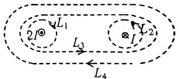

text_image

L₁
2I⊗
L₃
⊗I
Y₂
L₄

题1图  

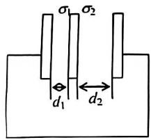

text_image

σ₁ σ₂
d₁ d₂

题2图

<!-- QUESTION END -->

<!-- QUESTION: qtype=single_choice tags=静电场,导体板,电荷分布 难度=3 chapter=第五章 静电学 qid=Q0341 -->

三块互相平行的导体板, 相互之间的距离 $d_{1}$ 和 $d_{2}$ 比板面积线度小得多, 外面二板用导线连接. 中间板上带电, 设左右两面上电荷面密度分别为 $\sigma_{1}$ 和 $\sigma_{2}$ , 如图所示. 则比值 $\sigma_{1} / \sigma_{2}$ 为

(A) $d_{1} / d_{2}$

(B) $d_{2} / d_{1}$

(C) 1.

(D) $d_2^2 / d_1^2$ .

<!-- ANSWER -->
B

<!-- QUESTION END -->

<!-- QUESTION: qtype=single_choice tags=热力学第二定律,不可逆过程 难度=2 chapter=第四章 热力学定律 qid=Q0342 -->

根据热力学第二定律可知:

(A) 功可以全部转换为热，但热不能全部转换为功.  
(B) 热可以从高温物体传到低温物体，但不能从低温物体传到高温物体  
(C) 不可逆过程就是不能向相反方向进行的过程.  
(D) 一切自发过程都是不可逆的.

<!-- QUESTION END -->

<!-- QUESTION: qtype=single_choice tags=转动惯量,刚体,圆盘 难度=2 chapter=第二章 刚体力学 qid=Q0343 -->

两个匀质圆盘 A 和 B 的密度分别为 $\rho_{A}$ 和 $\rho_{B}$ ，若 $\rho_{A} > \rho_{B}$ ，但两圆盘的质量与厚度相同，如两盘对通过盘心垂直于盘面轴的转动惯量各为 $J_{A}$ 和 $J_{B}$ ，则

(A) $J_{A}>J_{B}.$

(B) $J_{B} > J_{A}$ .

(C) $J_{A}=J_{B}$ .

(D) $J_{A} 、 J_{B}$ 哪个大, 不能确定.

<!-- ANSWER -->
B

<!-- QUESTION END -->

<!-- QUESTION: qtype=single_choice tags=角动量守恒,转动惯量,角速度 难度=2 chapter=第二章 刚体力学 qid=Q0344 -->

花样滑冰运动员绕通过自身的竖直轴转动, 开始时两臂伸开, 转动惯量为 $J_{0}$ , 角速度为 $\omega_{0}$ . 然后她将两臂收回, 使转动惯量减少为 $\frac{1}{3} J_{0}$ . 这时她转动的角速度变为

(A) $\frac{1}{3}\omega_0$ .

(B) $\left(1 / \sqrt{3}\right)\omega_0.$

(C) $\sqrt{3} \omega_0$ .

(D) 3 $\omega_0$ .

<!-- ANSWER -->
D

<!-- QUESTION END -->

<!-- QUESTION: qtype=single_choice tags=电位移矢量,高斯定理,自由电荷 难度=2 chapter=第五章 静电学 qid=Q0345 -->

在静电场中，作闭合曲面 S，若有 $\oint_{S}\bar{D}\cdot d\bar{S}=0$ （式中 $\bar{D}$ 为电位移矢量），则 S 面内必定

(A) 既无自由电荷，也无束缚电荷。  
(B) 没有自由电荷.  
(C) 自由电荷和束缚电荷的代数和为零.  
(D) 自由电荷的代数和为零.

<!-- ANSWER -->
D

<!-- QUESTION END -->

<!-- QUESTION: qtype=single_choice tags=圆周运动,加速度,速率 难度=2 chapter=第一章 质点运动学与牛顿定律 qid=Q0346 -->

质点作半径为 $R$ 的变速圆周运动时的加速度大小为 $(v$ 表示任一时刻质点的速率)

(A) $\frac{\mathrm{d}\upsilon}{\mathrm{d}t}$ .

(B) $\frac{\mathbf{v}^2}{R}$ .

(C) $\frac{d\nu}{dt}+\frac{\nu^{2}}{R}$ .

(D) $\left[\left(\frac{\mathrm{d}\nu}{\mathrm{d}t}\right)^2 +\left(\frac{\nu^4}{R^2}\right)\right]^{1 / 2}$

<!-- ANSWER -->
D

<!-- QUESTION END -->

<!-- QUESTION: qtype=single_choice tags=磁感应强度,毕奥-萨伐尔定律,圆电流 难度=3 chapter=第六章 稳恒磁场 qid=Q0347 -->

无限长直导线在 $P$ 处弯成半径为 $R$ 的圆, 当通以电流 $I$ 时,

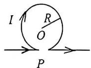

则在圆心 O 点的磁感强度大小等于

(A) $\frac{\mu_{0}I}{2\pi R}$ .

(B) $\frac{\mu_{0}I}{4R}$ .

(C) 0.

(D) $\frac{\mu_{0}I}{2R}(1-\frac{1}{\pi})$ .

(E) $\frac{\mu_0I}{4R} (1 + \frac{1}{\pi}).$

题8图

<!-- ANSWER -->
D

<!-- QUESTION END -->

<!-- QUESTION: qtype=single_choice tags=功,位移,力 难度=2 chapter=第一章 质点运动学与牛顿定律 qid=Q0348 -->

一个质点同时在几个力作用下的位移为: $\Delta \vec{r} = 4 \vec{i} - 5 \vec{j} + 6 \vec{k}$ (SI)其中一个力为恒力 $\vec{F} = -3 \vec{i} - 5 \vec{j} + 9 \vec{k}$ (SI), 则此力在该位移过程中所作的功为

(A) -67 J.

(B) 17 J.

(C) 67 J.

(D) 91 J.

<!-- ANSWER -->
C

<!-- QUESTION END -->

<!-- QUESTION: qtype=single_choice tags=相对论,动能,速度 难度=4 chapter=第一章 质点运动学与牛顿定律 qid=Q0349 -->

根据相对论力学, 动能为 $0.25 \mathrm{MeV}$ 的电子, 其运动速度约等于

(A) 0.1c

(B) 0.5 c

(C) 0.75 c

(D) 0.85 c

(c 表示真空中的光速，电子的静能 $m_{0}c^{2}=0.51\ MeV$ )

<!-- ANSWER -->
C

<!-- QUESTION END -->

学院\_\_\_\_专业\_\_\_\_

\_\_\_\_班 年级

学号\_\_\_\_姓名\_\_\_\_（B卷）共4页 第2页

## 二、填空题（共30分，每小题3分）

[得分 ]

<!-- QUESTION: qtype=fill_blank tags=理想气体,等温过程,绝热过程,p-V图 难度=3 chapter=第四章 热力学定律 qid=Q0350 -->

右图为一理想气体几种状态变化过程的 $p - V$ 图，其中 $MT$ 为等温线， $MQ$ 为绝热线，在 $AM$ 、 $BM$ 、 $CM$ 三种准静态过程中：

(1) 温度升高的是 BM, CM 过程;  
(2) 气体吸热的是 CM 过程.

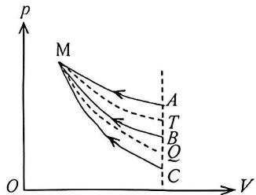

text_image

p
M
A
T
B
Q
C
O
V

题11图

<!-- ANSWER -->
(1) BM, CM; (2) CM

<!-- QUESTION END -->

<!-- QUESTION: qtype=fill_blank tags=静电场,电场力做功,点电荷 难度=3 chapter=第五章 静电学 qid=Q0351 -->

如图所示．试验电荷 q，在点电荷 +Q 产生的电场中，沿半径为 R 的整个圆弧的 3/4 圆弧轨道由 a 点移到 d 点的过程中电场力作功为 \_\_\_\_；从 d 点移到无穷远处的过程中，电场力作功为 \_\_\_\_。

text_image

p
M
A
T
B
Q
C
O
V

题11图

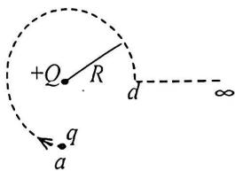

text_image

+Q
R
d
∞
q
a

题12图

<!-- ANSWER -->
0; qQ/(4πε₀R)

<!-- QUESTION END -->

<!-- QUESTION: qtype=fill_blank tags=麦克斯韦速率分布,最概然速率,气体分子 难度=3 chapter=第三章 气体动理论 qid=Q0352 -->

图示的两条 $f(v) \sim v$ 曲线分别表示氢气和氧气在同一温度下的麦克斯韦速率分布曲线。由此可得氢气分子的最概然速率为 2000 m/s；氧气分子的最概然速率为 500 m/s。

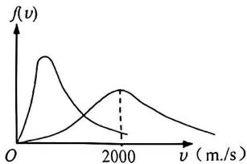

line chart

| v (m/s) | f(ν) |
| ------- | ---- |
| 0       | 0    |
| 2000    | Peak |

题13图

<!-- ANSWER -->
2000 m/s; 500 m/s

<!-- QUESTION END -->

<!-- QUESTION: qtype=fill_blank tags=理想气体,平均自由程,等体过程 难度=3 chapter=第三章 气体动理论 qid=Q0353 -->

一定质量的理想气体，先经过等体过程使其热力学温度升高一倍，再经过等温过程使其体积膨胀为原来的两倍，则分子的平均自由程变为原来的 $2$ 倍.  

<!-- ANSWER -->
2倍

<!-- QUESTION END -->

<!-- QUESTION: qtype=fill_blank tags=冲量,动量定理,矢量 难度=3 chapter=第一章 质点运动学与牛顿定律 qid=Q0354 -->

一质量为 m 的物体，原来以速率 v 向北运动，它突然受到外力打击，变为向西运动，速率仍为 v，则外力的冲量大小为 $\sqrt{2}mv$ ，方向为正西南（南偏西）  

<!-- ANSWER -->
√2·mv，方向正西南

<!-- QUESTION END -->

<!-- QUESTION: qtype=fill_blank tags=狭义相对论,长度收缩 难度=4 chapter=第一章 质点运动学与牛顿定律 qid=Q0355 -->

一观察者测得一沿米尺长度方向匀速运动着的米尺的长度为 $0.5 \mathrm{~m}$ 。则此米尺以速度 $v = 2.6 \times 10^{8} \mathrm{~m} \cdot \mathrm{s}^{-1}$ 接近观察者。

<!-- ANSWER -->
$v = 2.6 \times 10^{8} \mathrm{~m} \cdot \mathrm{s}^{-1}$

<!-- QUESTION END -->

<!-- QUESTION: qtype=fill_blank tags=圆锥摆,圆周运动,张力 难度=3 chapter=第一章 质点运动学与牛顿定律 qid=Q0356 -->

一圆锥摆摆长为 $l$ 、摆锤质量为 $m$ ，在水平面上作匀速圆周运动，摆线与铅直线夹角 $\theta$ ，则

(1) 摆线的张力 $T = \frac{mg / \cos\theta}{\sin\theta}$ ; 
(2) 摆锤的速率 $v = \frac{\sin\theta \sqrt{\frac{qd}{\cos\theta}}}{\sin\theta}$ .  

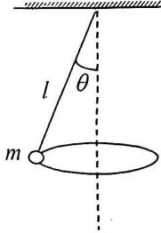

text_image

l
θ
m

题17图

<!-- ANSWER -->
(1) T = mg/cosθ; (2) v = sinθ√(gl/cosθ)

<!-- QUESTION END -->

<!-- QUESTION: qtype=fill_blank tags=麦克斯韦方程组,电磁场,积分形式 难度=4 chapter=第七章 电磁感应与麦克斯韦方程组 qid=Q0357 -->

反映电磁场基本性质和规律的积分形式的麦克斯韦方程组为

$$
\oint_ {S} \vec {D} \cdot \mathrm{d} \vec {S} = \int_ {V} \rho \mathrm{d} V, \tag {①}
$$

$$
\oint_ {L} \vec {E} \cdot \mathrm{d} \vec {l} = - \int_ {S} \frac {\partial \vec {B}}{\partial t} \cdot \mathrm{d} \vec {S}, \tag {②}
$$

$$
\oint_ {S} \bar {B} \cdot \mathrm{d} \bar {S} = 0, \tag {③}
$$

$$
\oint_ {L} \vec {H} \cdot \mathrm{d} \vec {l} = \int_ {S} (\vec {J} + \frac {\partial \vec {D}}{\partial t}) \cdot \mathrm{d} \vec {S}. \tag {4}
$$

试判断下列结论是包含于或等效于哪一个麦克斯韦方程式的。将你确定的方程式用代号填在相应结论后的空白处。

(1) 变化的磁场一定伴随有电场：②  
(2) 磁感线是无头无尾的: ③  
(3) 电荷总伴随有电场： ⏱️

<!-- ANSWER -->
(1) ②; (2) ③; (3) ①

<!-- QUESTION END -->

<!-- QUESTION: qtype=fill_blank tags=卡诺热机,热机效率,温度计算 难度=4 chapter=第四章 热力学定律 qid=Q0358 -->

一卡诺热机(可逆的),低温热源的温度为 $27^{\circ} \mathrm{C}$ , 热机效率为 $40 \%$ ，其高温热源温度为 $500 ^ {\circ} \mathrm{K}$ 。今欲将该热机效率提高到 $50 \%$ ，若低温热源保持不变, 则高温热源的温度应增加 $100 ^ {\circ} \mathrm{K}$ 。

<!-- ANSWER -->
100 K

<!-- QUESTION END -->

<!-- QUESTION: qtype=fill_blank tags=理想气体内能,分子动能,摩尔气体常量 难度=3 chapter=第三章 气体动理论 qid=Q0359 -->

1 mol 氧气(视为刚性双原子分子的理想气体)贮于一氧气瓶中,温度为 ${27}^{ \circ  }\mathrm{C}$ ,这瓶氧气的内能为 $6.23 \times  {10}^{3}\mathrm{J}$ ; 分子的平均平动动能为 $6.21 \times  {10}^{-21}\mathrm{J}$ ; 分子的平均总动能为 $1.035 \times  {10}^{-20}\mathrm{J}$ .

(摩尔气体常量 $R=8.31\ J\cdot mol^{-1}\cdot K^{-1}$ 玻尔兹曼常量 $k=1.38\times10^{-23}\ J\cdot K^{-1}$ )

<!-- ANSWER -->
内能 6.23×10³ J；平均平动动能 6.21×10⁻²¹ J；平均总动能 1.035×10⁻²⁰ J

<!-- QUESTION END -->

text_image

l
θ
m

题17图

## 三、计算题（共40分，每小题10分）

<!-- QUESTION: qtype=short_answer tags=高斯定理,电场强度,电势,圆柱体 难度=4 chapter=第五章 静电学 qid=Q0360 -->

21、[得分]

一半径为 R 的 “无限长” 圆柱形带电体，其电荷体密度为 $\rho$ 。试求：

(1) 圆柱体内、外各点场强大小分布;  
(2) 选与圆柱轴线的距离为 $l\left( {l > R}\right)$ 处为电势零点,计算圆柱体内各点的电势分布.

(1). 圆柱体内部. r < R.

$$
\oint_ {S _ {1}} \vec {E} \cdot d \vec {s} = \frac {\rho \pi r ^ {2} L}{\varepsilon_ {0}}
$$

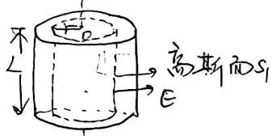

text_image

不
↓
高斯而S₁
E

$$
E \cdot 2 \pi r \cdot L = \frac {\rho \pi r ^ {2} \cdot L}{\varepsilon_ {0}}
$$

$$
\therefore E = \frac {\rho r}{2 \varepsilon_ {0}} (r <   R)
$$

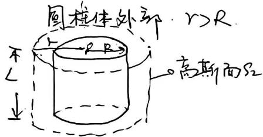

text_image

图框体外部 r>R
不
L
R B
高斯面S₂

$$
\oint_ {S _ {2}} \vec {E} \cdot d \vec {s} = \frac {\rho \pi R ^ {2} L}{\varepsilon_ {0}}
$$

$$
E \cdot 2 \pi r \cdot L = \frac {\rho \pi R ^ {2} l}{\varepsilon_ {0}}
$$

$$
\therefore E = \frac {P R ^ {2}}{2 g _ {0} r} (r > R)
$$

(2)

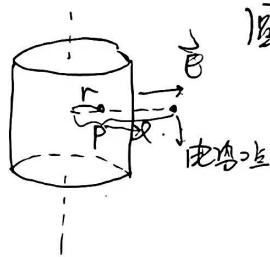

text_image

r
P
→
B
电答点

$\text {圆柱体内部距轴上处电势.}$

$$
V _ {p} = \int_ {r} ^ {l} \vec {E} \cdot d \vec {F}
$$

$$
= \int_ {r} ^ {R} \vec {E} _ {\mathrm{内}} d \vec {r} + \int_ {R} ^ {l} \vec {E} _ {3 k} d \vec {r}
$$

$$
= \int_ {r} ^ {R} \frac {\rho r}{2 \varepsilon_ {0}} d r + \int_ {R} ^ {d} \frac {\rho R ^ {2}}{2 \varepsilon_ {0}} \cdot \frac {d r}{r}
$$

$$
= \frac {\rho}{4 9 0} (R ^ {2} - r ^ {2}) + \frac {\rho R ^ {2}}{2 4 0} \ln \frac {l}{R}
$$

<!-- ANSWER -->
(1) r<R 时 E=ρr/(2ε₀), r>R 时 E=ρR²/(2ε₀r); (2) V=ρ(R²-r²)/(4ε₀)+ρR²/(2ε₀)ln(l/R)

<!-- QUESTION END -->

<!-- QUESTION: qtype=short_answer tags=转动惯量,牛顿定律,圆周运动 难度=4 chapter=第二章 刚体力学 qid=Q0361 -->

22、[得分]

一质量为 m 的物体悬于一条轻绳的一端，绳另一端绕在一轮轴的轴上，如图所示。轴水平且垂直于轮轴面，其半径为 r，整个装置架在光滑的固定轴承之上。当物体从静止释放后，在时间 t 内下降了一段距离 S。

试求整个轮轴的转动惯量(用 m、r、t 和 S 表示).

$\zeta m: ma = mg - T$ ⑤

轮轴： $T.r = I\beta$ ②

联子： $a=\beta\cdot r$ ②

又. $S = \frac{1}{2} a t^{2} \Rightarrow a = \frac{28}{t^{2}}$ ④

联立. ①. ②. ③. 得 $J =$

$$
J = m r ^ {2} (\frac {g t ^ {2}}{2 s} - 1)
$$

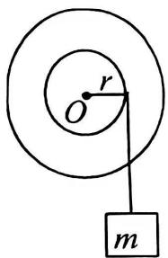

text_image

r
O
m

题 22 图

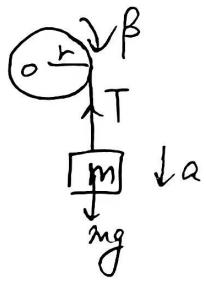

text_image

o r
β
T
[m]
↓a
mg

<!-- ANSWER -->
J = mr²(gt²/2S - 1)

<!-- QUESTION END -->

<!-- QUESTION: qtype=short_answer tags=电磁感应,动生电动势,感生电动势 难度=5 chapter=第七章 电磁感应与麦克斯韦方程组 qid=Q0362 -->

23、[得分]

载流长直导线与矩形回路 ABCD 共面，导线平行于 AB，如图所示．求下列情况下 ABCD 中的感应电动势：

(1) 长直导线中电流 $I = I_0$ 不变, $ABCD$ 以垂直于导线的速度 $\bar{v}$ 从图示初始位置远离导线匀速平移到某一位置时 (t 时刻).  
(2) 长直导线中电流 $I = I_{0} \sin \omega t$ , $ABCD$ 不动.  
(3) 长直导线中电流 $I = I_{0} \sin \omega t$ , ABCD 以垂直于导线的速度 $\bar{v}$ 远离导线匀速运动，初始位置也如图.

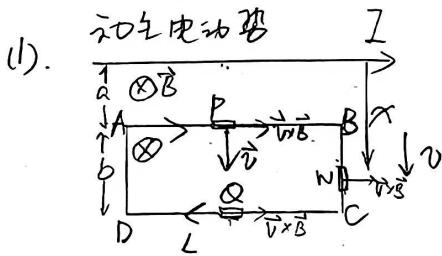

text_image

(1). 动态电动势
I
a ⊗B
A B x
b ⊗ → v→B
D L V×B C N D v→B

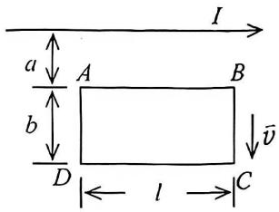

text_image

I
a
A
B
b
D
l
C
v̄

题23图

<!-- ANSWER -->
(1) ε=μ₀I₀Lv/(2π)·(1/(a+vt)-1/(a+b+vt)); (2) ε=-(μ₀LωI₀cosωt/(2π))ln((a+b)/a); (3) ε=ε₁+ε₂

<!-- QUESTION END -->

<!-- QUESTION: qtype=short_answer tags=理想气体,循环过程,热力学第一定律 难度=4 chapter=第四章 热力学定律 qid=Q0363 -->

24、[得分]

一定量的某种理想气体进行如图所示的循环过程. 已知气体在状态 A 的温度为 $T_{A}=300\ K$ ，求

(1) 气体在状态 B、C 的温度;  
(2) 各过程中气体对外所作的功;  
(3) 经过整个循环过程，气体从外界吸收的总热量 (各过程吸热的代数和).

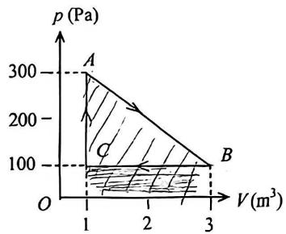

area chart

| Point | V (m³) | p (Pa) |
|-------|--------|--------|
| A     | 1      | 300    |
| B     | 3      | 100    |
| C     | 1      | 100    |

$$
(1) \cdot \frac {P _ {A} V _ {A}}{T _ {A}} = \frac {P _ {B} V _ {B}}{T _ {B}} \Rightarrow T _ {B} = \frac {P _ {B} V _ {B}}{P _ {A} V _ {A}} - T _ {A}
$$

题24图

$$
= \frac {3 \times 1 0 0}{3 5 0 \times 1} \times 3 0 0 = 3 0 0 k
$$

$$
\frac {P A V _ {A}}{T _ {A}} = \frac {P C V _ {A}}{T _ {C}} \Rightarrow T _ {C} = \frac {P e}{P _ {A}}. T _ {A}
$$

$$
= \frac {1 0 0}{3 0 0} \cdot 3 0 0 = 1 0 0 k.
$$

(2) $\omega =$ 三角形面积 ${\Delta ABC}$

$$
\begin{array}{l} = \frac {1}{2} (V _ {B} - V _ {C}) \cdot (P A - P C) = \frac {1}{2} \times 2 \times 2 0 0 = 2 0 0 (J) \\ W _ {A B} = \frac {1}{2} (V _ {B} - V _ {C}) (P _ {A} + P _ {C}) = 4 0 0 J W _ {B C} = P _ {B} (V _ {C} - V _ {B}) = - 2 0 0 J \\ (3). \quad Q _ {\mathrm{吸}} = \omega_ {\mathrm{总}} + \Delta E \quad \mathrm{第一定律} \\ = 2 0 0 J \\ \end{array}
$$

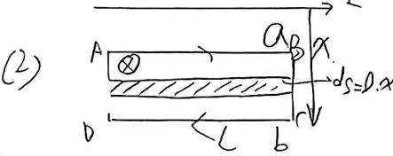

text_image

(2)
A ⊗
a B
x
dS=0.x
b
c
L b

感生电动势

导体闭合四路

:关回路方向.∠(顺)

$$
\begin{array}{r l} {\sum_ {2} = - \int_ {s} \frac {\partial \vec {B}}{2 t} \cdot d \vec {s} = \int_ {s} \frac {\partial B}{2 x} d s} & {B = \frac {\mu_ {0} I _ {0} \sin 4 t}{2 \pi x}} \\ {= - \int_ {a} ^ {a + b} \frac {\omega \mu_ {0} I _ {0} \cos 3 \omega t}{2 \pi x} \cdot e d x} & {\frac {\partial B}{2 t} = \frac {\omega \mu_ {0} I _ {0} \cos 3 \omega t}{2 \pi x}} \end{array}
$$

$$
\left| \Sigma_ {2} = - \frac {\omega \mu_ {0} L _ {0} \cos \omega t}{2 \pi} \ln \frac {a + b}{a} \right|
$$

负号表示与积分方向相反 即逆时针

(3) 磁物也变,线圈电动. 则电动势为两种电动势之和.

$$
\begin{array}{l} {\boxed {\varepsilon_ {2} = \varepsilon_ {1} + \varepsilon_ {2}.}} \\ {\mathrm{其中.} \varepsilon_ {1} = \frac {U _ {\mu \circ l} . I _ {0} \sin \omega t}{2 \pi} (\frac {1}{a + v t} - \frac {1}{a + b + v t})} \end{array}
$$

$$
\Sigma_ {2} = - \frac {\mu_ {0} l Z _ {0} w}{2 \pi} \ln \frac {a + b + v t}{a + v t} \cdot \cos w t
$$

<!-- ANSWER -->
(1) T_B=300K, T_C=100K; (2) W=200J; (3) Q_吸=200J

<!-- QUESTION END -->