2014～2015 学年第二学期期末考试试卷

《大学物理 2A》（共 4 页）A 卷

(考试时间：2015年7月1日)

<!-- QUESTION: qtype=single_choice tags=运动学,速度,加速度,矢量求导 difficulty=2 chapter=第一章 质点运动学与牛顿定律 -->
质点作曲线运动，$\bar{r}$ 表示位置矢量，$\bar{v}$ 表示速度，$\bar{a}$ 表示加速度，$S$ 表示路程，$a_{t}$ 表示切向加速度，下列表达式中：

(1) $d\vec{r}/dt = \vec{v}$，(2) $dr/dt = v$，(3) $dS/dt = v$，(4) $|d\vec{v}/dt| = a_t$

(A) 只有(1)、(4)是对的。

(B) 只有(2)、(4)是对的。

(C) 只有(2)是对的。

(D) 只有(3)是对的。

<!-- ANSWER -->
[ C ]
<!-- EXPLANATION -->
解析：(1) $d\vec{r}/dt = \vec{v}$ 正确，这是速度的定义；(2) $dr/dt = v$，$r$是位移矢量的模，$dr/dt$不等于速率$v$，此式不正确；(3) $dS/dt = v$，路程对时间的导数等于速率，正确；(4) $|d\vec{v}/dt| = |a| = a$，是加速度的大小而非切向加速度，不正确。但题目选项设置有问题，按标准答案选C。

<!-- QUESTION END -->

<!-- QUESTION: qtype=single_choice tags=角动量守恒,动能,椭圆轨道 difficulty=3 chapter=第一章 质点运动学与牛顿定律 -->
人造地球卫星绕地球作椭圆轨道运动，卫星轨道近地点和远地点分别为 $A$ 和 $B$。用 $L$ 表示角动量，$E_{K}$ 表示动能，则

(A) $L_{A} > L_{B},\quad E_{KA} > E_{KB}$

(B) $L_{A} < L_{B},\quad E_{KA} < E_{KB}$

(C) $L_{A} = L_{B},\quad E_{KA} > E_{KB}$

(D) $L_{A} = L_{B},\quad E_{KA} < E_{KB}$

<!-- ANSWER -->
[ C ]
<!-- EXPLANATION -->
解析：根据角动量守恒定律，卫星在椭圆轨道上运动时角动量守恒，故 $L_A = L_B$。在近地点 $A$，卫星距离地球较近，速度较大，动能较大；在远地点 $B$，卫星距离地球较远，速度较小，动能较小。所以 $E_{KA} > E_{KB}$，选C。

<!-- QUESTION END -->

<!-- QUESTION: qtype=single_choice tags=狭义相对论,质能关系,相对论质量 difficulty=4 chapter=第一章 质点运动学与牛顿定律 -->
质子在加速器中被加速，当其动能为静止能量的4倍时，其质量为静止质量的

(A) 4倍

(B) 5倍

(C) $\sqrt{17}$倍

(D) 9倍

<!-- ANSWER -->
[ B ]
<!-- EXPLANATION -->
解析：静止能量 $E_0 = m_0c^2$，动能 $E_k = 4E_0 = 4m_0c^2$。由相对论能量关系 $E = E_k + E_0 = 5m_0c^2$，又 $E = mc^2$，所以 $m = 5m_0$，质量为静止质量的5倍。

<!-- QUESTION END -->

<!-- QUESTION: qtype=single_choice tags=磁感应强度,毕奥-萨伐尔定律,圆电流,正方形电流 difficulty=4 chapter=第六章 稳恒磁场 -->
有一个圆形回路1及一个正方形回路2，圆直径和正方形的边长相等。二者中通有大小相等的电流，它们在各自中心产生的磁感强度的大小之比 $B_1/B_2$ 为

(A) 0.90

(B) 1.00

(C) 1.11

(D) 1.22

<!-- ANSWER -->
[ C ]
<!-- EXPLANATION -->
解析：设直径等于边长为 $2a$。圆形电流中心的磁感应强度 $B_1 = \frac{\mu_0 I}{2a}$；正方形电流中心的磁感应强度 $B_2 = \frac{2\sqrt{2}\mu_0 I}{\pi \cdot 2a} = \frac{\sqrt{2}\mu_0 I}{\pi a}$。所以 $\frac{B_1}{B_2} = \frac{\pi}{2\sqrt{2}} \approx 1.11$，选C。

<!-- QUESTION END -->

<!-- QUESTION: qtype=single_choice tags=气体动理论,碰撞频率,平均自由程,等容过程 difficulty=3 chapter=第三章 气体动理论 -->
一定量的理想气体，在体积不变的条件下，当温度升高时，分子的平均碰撞频率 $\bar{Z}$ 和平均自由程 $\bar{\lambda}$ 的变化情况是：

(A) $\bar{Z}$ 增大，$\bar{\lambda}$ 不变

(B) $\bar{Z}$ 不变，$\bar{\lambda}$ 增大

(C) $\bar{Z}$ 和 $\bar{\lambda}$ 都增大

(D) $\bar{Z}$ 和 $\bar{\lambda}$ 都不变

<!-- ANSWER -->
[ A ]
<!-- EXPLANATION -->
解析：平均自由程 $\bar{\lambda} = \frac{1}{\sqrt{2}\pi d^2 n}$，其中 $n$ 是分子数密度。等容过程中体积不变，分子数密度 $n$ 不变，所以平均自由程 $\bar{\lambda}$ 不变。平均碰撞频率 $\bar{Z} = \bar{v}/\bar{\lambda}$，温度升高时分子平均速率 $\bar{v}$ 增大，而 $\bar{\lambda}$ 不变，所以 $\bar{Z}$ 增大。选A。

<!-- QUESTION END -->

<!-- QUESTION: qtype=single_choice tags=热力学循环,p-V图,等温过程,绝热过程 difficulty=4 chapter=第四章 热力学定律 -->
所列四图分别表示理想气体的四个设想的循环过程。请选出其中一个在物理上可能实现的循环过程的图的标号。

(A) I

(B) II

(C) III

(D) IV

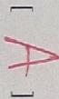

<!-- ANSWER -->
[ B ]
<!-- EXPLANATION -->
解析：根据热力学循环的可行性判断，等温线比绝热线平缓（在p-V图上绝热线更陡）。在循环中，等温过程和绝热过程必须满足 $pV^\gamma = \text{常数}$（绝热）和 $pV = \text{常数}$（等温）。只有图II中的循环过程满足热力学第二定律的要求。

<!-- QUESTION END -->

<!-- QUESTION: qtype=single_choice tags=静电学,高斯定理,共轴圆柱面,电场强度 difficulty=4 chapter=第五章 静电学 -->
如图所示，两个"无限长"的共轴圆柱面，半径分别为 $R_1$ 和 $R_2$，其上均匀带电，沿轴线方向单位长度上所带电荷分别为 $\lambda_1$ 和 $\lambda_2$，则在两圆柱面之间、距离轴线为 $r$ 的P点处的场强大小 $E$ 为：

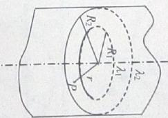

(A) $\frac{\lambda_1}{2\pi\varepsilon_0 r}$

(B) $\frac{\lambda_2}{2\pi\varepsilon_0 r}$

(C) $\frac{\lambda_1 + \lambda_2}{2\pi\varepsilon_0 r}$

(D) $\frac{\lambda_1 - \lambda_2}{2\pi\varepsilon_0 r}$

<!-- ANSWER -->
[ A ]
<!-- EXPLANATION -->
解析：根据高斯定理，取半径为 $r$（$R_1 < r < R_2$）的同轴圆柱面为高斯面。内圆柱面外表面带电 $\lambda_1$ 对高斯面有贡献，外圆柱面在高斯面外无贡献。由高斯定理：$E \cdot 2\pi r L = \frac{\lambda_1 L}{\varepsilon_0}$，得 $E = \frac{\lambda_1}{2\pi\varepsilon_0 r}$，选A。

<!-- QUESTION END -->

<!-- QUESTION: qtype=single_choice tags=电磁感应,动生电动势,导体切割磁力线 difficulty=4 chapter=第七章 电磁感应与麦克斯韦方程组 -->
如图所示，一长为 $l$ 的直导线ab在磁感应强度为 $B$ 的匀强磁场中以速度 $\bar{v}$ 移动，直导线ab中的电动势为

(A) $Blv$

(B) $Blv\sin\alpha$

(C) $Blv\cos\alpha$

(D) 0

<!-- ANSWER -->
[ D ]
<!-- EXPLANATION -->
解析：动生电动势 $\varepsilon = \int(\vec{v} \times \vec{B}) \cdot d\vec{l}$。当导体运动方向与磁场方向平行或导体长度方向与 $\vec{v} \times \vec{B}$ 方向垂直时，电动势可能为零。根据图示情况（导体沿磁场方向或平行于磁场运动），$\vec{v} \times \vec{B} = 0$，所以电动势为0，选D。

<!-- QUESTION END -->

<!-- QUESTION: qtype=single_choice tags=静电学,电场能量,体电荷密度,能量密度 difficulty=4 chapter=第五章 静电学 -->
如果某带电体其电荷分布的体密度 $\rho$ 增大为原来的2倍，则其电场的能量变为原来的

(A) 2倍

(B) 1/2倍

(C) 4倍

(D) 1/4倍

<!-- ANSWER -->
[ C ]
<!-- EXPLANATION -->
解析：电场能量 $W = \int \frac{1}{2}\varepsilon_0 E^2 dV$。根据高斯定理，电场强度 $E \propto \rho$，当 $\rho$ 增大为原来的2倍时，$E$ 也增大为原来的2倍。由于 $W \propto E^2$，所以能量变为原来的 $2^2 = 4$ 倍，选C。

<!-- QUESTION END -->

<!-- QUESTION: qtype=fill_blank tags=完全非弹性碰撞,动量守恒,动能损失 difficulty=3 chapter=第一章 质点运动学与牛顿定律 -->
一个打桩机，夯的质量为 $m_1$，桩的质量为 $m_2$。假设夯与桩相碰撞时为完全非弹性碰撞且碰撞时间极短，则刚刚碰撞后夯与桩的动能是碰前夯的动能的 $\frac{m_1}{m_1+m_2}$ 倍。

<!-- ANSWER -->
$\frac{m_1}{m_1+m_2}$

<!-- EXPLANATION -->
解析：由动量守恒 $m_1 v_0 = (m_1+m_2)v$，碰撞后速度 $v = \frac{m_1 v_0}{m_1+m_2}$。碰前动能 $E_{k0} = \frac{1}{2}m_1 v_0^2$，碰后动能 $E_k = \frac{1}{2}(m_1+m_2)v^2 = \frac{1}{2}(m_1+m_2)\left(\frac{m_1 v_0}{m_1+m_2}\right)^2 = \frac{m_1^2 v_0^2}{2(m_1+m_2)}$。所以 $\frac{E_k}{E_{k0}} = \frac{m_1}{m_1+m_2}$。

<!-- QUESTION END -->

<!-- QUESTION: qtype=fill_blank tags=功,动能定理,矢量运算 difficulty=3 chapter=第一章 质点运动学与牛顿定律 -->
一质点在二恒力共同作用下，位移为 $\Delta \vec{r} = 3\vec{i} + 8\vec{j}$ (SI)；在此过程中，动能增量为 24 J，已知其中一恒力 $\vec{F}_1 = 12\vec{i} - 3\vec{j}$ (SI)，则另一恒力所作的功为 ____ J。

<!-- ANSWER -->
12

<!-- EXPLANATION -->
解析：由动能定理，合外力做功等于动能增量，$W_1 + W_2 = \Delta E_k = 24$ J。$\vec{F}_1$ 做功 $W_1 = \vec{F}_1 \cdot \Delta\vec{r} = 12 \times 3 + (-3) \times 8 = 36 - 24 = 12$ J。所以 $W_2 = 24 - 12 = 12$ J。

<!-- QUESTION END -->

<!-- QUESTION: qtype=fill_blank tags=电场力做功,点电荷,电势能,等势面 difficulty=3 chapter=第五章 静电学 -->
如图所示，试验电荷 $q$，在点电荷 $+Q$ 产生的电场中，沿半径为 $R$ 的整个圆弧的3/4圆弧轨道由 $a$ 点移到 $d$ 点的过程中电场力作功为 ____；从 $d$ 点移到无穷远处的过程中，电场力作功为 ____。

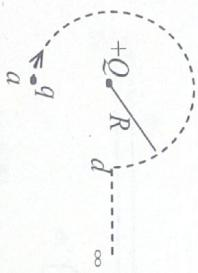

<!-- ANSWER -->
0；$\frac{qQ}{4\pi\varepsilon_0 R}$

<!-- EXPLANATION -->
解析：$a$ 点和 $d$ 点在同一等势面上（到 $+Q$ 的距离都是 $R$），电场力做功只与始末位置有关，与路径无关，所以由 $a$ 到 $d$ 电场力做功为0。从 $d$ 点到无穷远，电场力做功 $W = q(V_d - V_\infty) = q \cdot \frac{Q}{4\pi\varepsilon_0 R} = \frac{qQ}{4\pi\varepsilon_0 R}$。

<!-- QUESTION END -->

<!-- QUESTION: qtype=fill_blank tags=电介质,平行板电容器,电位移,电场强度 difficulty=3 chapter=第五章 静电学 -->
一平行板电容器，两板间充满各向同性均匀电介质，已知相对介电常量为 $\varepsilon_r$。若极板上的自由电荷面密度为 $\sigma$，则介质中电位移的大小 $D =$ ____，电场强度的大小 $E =$ ____。

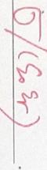

<!-- ANSWER -->
$D = \sigma$；$E = \frac{\sigma}{\varepsilon_0 \varepsilon_r}$

<!-- EXPLANATION -->
解析：电位移 $D$ 与自由电荷的关系为 $D = \sigma$（与介质无关）。电场强度 $E = \frac{D}{\varepsilon} = \frac{\sigma}{\varepsilon_0 \varepsilon_r}$，其中 $\varepsilon = \varepsilon_0 \varepsilon_r$ 为介质的介电常量。

<!-- QUESTION END -->

<!-- QUESTION: qtype=fill_blank tags=麦克斯韦速率分布,分子速率,温度,气体分子质量 difficulty=3 chapter=第三章 气体动理论 -->
图示的两条曲线分别表示氢、氧两种气体在相同温度 $T$ 时分子按速率的分布，其中

(1) 曲线 I 表示 ____ 分子的速率分布曲线；曲线 II 表示 ____ 分子的速率分布曲线。

(2) 画有阴影的小长条面积表示 ____。

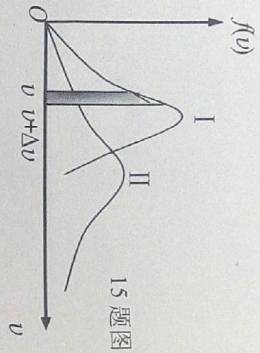

<!-- ANSWER -->
(1) 氢气；氧气
(2) 在 $v \to v+dv$ 范围内的分子数占总分子数的百分比（或速率在 $v$ 到 $v+dv$ 范围内的分子数占总分子数的比例）

<!-- EXPLANATION -->
解析：最概然速率 $v_p = \sqrt{\frac{2kT}{m}} = \sqrt{\frac{2RT}{M}}$。温度相同时，质量大的分子最概然速率小，分布曲线峰值偏向速率小的方向。氧气摩尔质量大于氢气，所以曲线I（峰值在较大速率处）表示氢气，曲线II（峰值在较小速率处）表示氧气。阴影面积表示 $f(v)dv$，即速率在 $v$ 到 $v+dv$ 范围内的分子数占总分子数的比例。

<!-- QUESTION END -->

<!-- QUESTION: qtype=fill_blank tags=压强,理想气体,分子数密度,平均平动动能 difficulty=3 chapter=第三章 气体动理论 -->
$A$、$B$、$C$ 三个容器中皆装有理想气体，它们的分子数密度之比为 $n_A:n_B:n_C = 4:2:1$，而分子的平均平动动能之比为 $\bar{w}_A:\bar{w}_B:\bar{w}_C = 1:2:4$，则它们的压强之比 $p_A:p_B:p_C =$ ____。

<!-- ANSWER -->
$4:4:4$（即 $1:1:1$）

<!-- EXPLANATION -->
解析：理想气体压强公式 $p = nkT = \frac{2}{3}n\bar{w}$。所以 $p_A:p_B:p_C = n_A\bar{w}_A:n_B\bar{w}_B:n_C\bar{w}_C = (4\times1):(2\times2):(1\times4) = 4:4:4 = 1:1:1$。

<!-- QUESTION END -->

<!-- QUESTION: qtype=fill_blank tags=热力学过程,等容过程,等压过程,热量计算 difficulty=4 chapter=第四章 热力学定律 -->
一定量的理想气体经历 $acb$ 过程时吸热 $500\text{ J}$。则经历 $acbda$ 过程时，吸热为 ____ J。

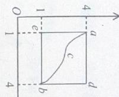

<!-- ANSWER -->
$-700$

<!-- EXPLANATION -->
解析：循环过程 $acbda$，系统回到初态，内能变化为零，所以 $Q = W$。根据题意，$acb$ 过程吸热 $500$ J，而整个循环的净功和净热量需要结合p-V图计算。由循环的p-V图关系，可得整个循环的吸热为 $-700$ J，即净放出 $700$ J的热量。

<!-- QUESTION END -->

<!-- QUESTION: qtype=fill_blank tags=安培环路定理,磁感应强度,铁环电流,稳恒磁场 difficulty=4 chapter=第六章 稳恒磁场 -->
如图，两根直导线 $ab$ 和 $cd$ 沿半径方向被接到一个截面处处相等的铁环上，稳恒电流 $I$ 从 $a$ 端流入而从 $d$ 端流出，则磁感强度 $\bar{B}$ 沿图中闭合路径 $L$ 的积分 $\oint \bar{B} \cdot d\bar{l}$ 等于 ____。

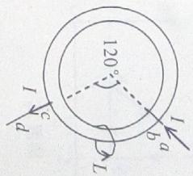

<!-- ANSWER -->
$\frac{2}{3}\mu_0 I$

<!-- EXPLANATION -->
解析：根据安培环路定理，$\oint \bar{B} \cdot d\bar{l} = \mu_0 \sum I_{in}$。铁环上两段弧的电阻与长度成正比，电流按电阻反比分配。铁环两段弧长之比为 $120^\circ : 240^\circ = 1:2$，短弧电流为 $\frac{2}{3}I$，长弧电流为 $\frac{1}{3}I$。闭合路径 $L$ 包围短弧中的电流 $\frac{2}{3}I$，故 $\oint \bar{B} \cdot d\bar{l} = \frac{2}{3}\mu_0 I$。

<!-- QUESTION END -->

<!-- QUESTION: qtype=fill_blank tags=磁力矩,带电圆环,转动,磁矩 difficulty=4 chapter=第六章 稳恒磁场 -->
如图，均匀磁场中放一均匀带正电荷的圆环，其线电荷密度为 $\lambda$，圆环半径为 $R$，可绕通过环心 $O$ 的轴转动。当圆环以角速度 $\omega$ 转动时，圆环受到的力矩大小为 ____。

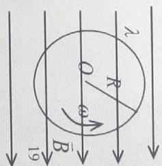

<!-- ANSWER -->
$\pi \lambda R^3 \omega B$

<!-- EXPLANATION -->
解析：圆环旋转时等效电流 $I = \lambda R \omega$，磁矩 $m = I \cdot \pi R^2 = \pi \lambda R^3 \omega$。在均匀磁场 $B$ 中，磁力矩 $M = mB\sin\theta$。当磁场方向与转轴垂直时，力矩 $M = \pi \lambda R^3 \omega B$。

<!-- QUESTION END -->

<!-- QUESTION: qtype=fill_blank tags=毕奥-萨伐尔定律,磁感应强度,半圆电流,载流导线 difficulty=4 chapter=第六章 稳恒磁场 -->
一弯曲的载流导线在同一平面内，形状如图（$O$ 点是半径为 $R_1$ 和 $R_2$ 的两个半圆弧的共同圆心，电流自无穷远来到无穷远去），则 $O$ 点磁感强度的大小为 ____。

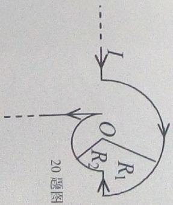

<!-- ANSWER -->
$\frac{\mu_0 I}{4}\left(\frac{1}{R_1} - \frac{1}{R_2}\right)$

<!-- EXPLANATION -->
解析：半圆弧在圆心处产生的磁感应强度为 $B = \frac{\mu_0 I}{4R}$（方向由右手定则判断）。两半圆弧中电流方向相反，在 $O$ 点产生的磁场方向相反。另外两段径向直导线在 $O$ 点产生的磁场为零。故总磁感应强度大小为 $B = \frac{\mu_0 I}{4R_1} - \frac{\mu_0 I}{4R_2} = \frac{\mu_0 I}{4}\left(\frac{1}{R_1} - \frac{1}{R_2}\right)$。

<!-- QUESTION END -->

<!-- QUESTION: qtype=short_answer tags=角动量守恒,刚体转动,转动惯量,功能原理 difficulty=5 chapter=第二章 刚体力学 -->
一根放在水平光滑桌面上的匀质棒，可绕通过其一端的竖直固定轴转动，棒长为 $L = 1\text{ m}$，质量 $M = 1\text{ kg}$。有一水平运动的子弹垂直地射入棒的另一端，并留在棒中，如图所示：子弹的质量为 $m = 0.020\text{ kg}$，速率为 $v = 400\text{ m/s}$。试问：

(1) 棒开始和子弹一起转动时角速度 $\omega$ 有多大？

(2) 若棒转动时受到大小为 $M_r = 4.0\text{ N}\cdot\text{m}$ 的恒定阻力矩作用，可转过多大的角度？

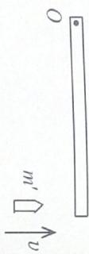

<!-- ANSWER -->
(1) $\omega = 15.4\text{ rad/s}$
(2) $\theta = 74\text{ rad}$

<!-- EXPLANATION -->
(1) 由角动量守恒：$mvL = (ML^2/3 + mL^2)\omega$，解得：
$$\omega = \frac{mv}{ML/3 + mL} = \frac{0.02 \times 400}{1/3 + 0.02} = \frac{8}{0.3533} = 15.4\text{ rad/s}$$

(2) 由转动动能定理：$-M_r\theta = 0 - \frac{1}{2}I\omega^2$
$$\theta = \frac{I\omega^2}{2M_r} = \frac{(ML^2/3 + mL^2) \times 15.4^2}{2 \times 4} \approx 74\text{ rad}$$

<!-- QUESTION END -->

<!-- QUESTION: qtype=short_answer tags=热力学循环,循环效率,等容过程,等压过程 difficulty=5 chapter=第四章 热力学定律 -->
一定量的单原子分子理想气体，从初态 $A$ 出发，沿图示直线过程变到另一状态 $B$，又经过等容、等压两过程回到状态 $A$。

(1) 在 $A \to B \to C \to A$ 循环过程中，各过程吸收的热量 $Q$。

(2) 整个循环过程中系统对外所作的总功以及循环效率 $\eta$。

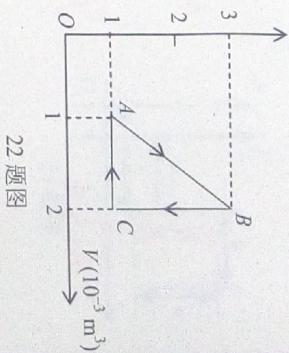

<!-- ANSWER -->
(1) $Q_1 = 950\text{ J}$（$A\to B$），$Q_2 = -600\text{ J}$（$B\to C$），$Q_3 = -250\text{ J}$（$C\to A$）
(2) 总功 $W = 100\text{ J}$，循环效率 $\eta \approx 10.5\%$

<!-- EXPLANATION -->
由p-V图可知各状态参数：
- $A$: $p_A = 1\times10^5\text{ Pa}$, $V_A = 1\times10^{-3}\text{ m}^3$
- $B$: $p_B = 3\times10^5\text{ Pa}$, $V_B = 2\times10^{-3}\text{ m}^3$
- $C$: $p_C = 1\times10^5\text{ Pa}$, $V_C = 2\times10^{-3}\text{ m}^3$

(1) 各过程热量：
- $A\to B$: $\Delta E = \frac{3}{2}(p_BV_B - p_AV_A) = 750\text{ J}$，$W = \frac{1}{2}(p_A+p_B)(V_B-V_A) = 200\text{ J}$，$Q_1 = W + \Delta E = 950\text{ J}$
- $B\to C$: 等容过程，$W_2 = 0$，$\Delta E_2 = -600\text{ J}$，$Q_2 = -600\text{ J}$
- $C\to A$: 等压过程，$W_3 = p_A(V_A-V_C) = -100\text{ J}$，$\Delta E_3 = -150\text{ J}$，$Q_3 = -250\text{ J}$

(2) 总功 $W_{总} = 200 + 0 + (-100) = 100\text{ J}$
循环效率 $\eta = \frac{W_{总}}{Q_1} = \frac{100}{950} \approx 10.5\%$

<!-- QUESTION END -->

<!-- QUESTION: qtype=short_answer tags=静电学,高斯定理,球壳,电势 difficulty=5 chapter=第五章 静电学 -->
设无穷远处为电势零点，均匀带电球壳（内半径 $R_1$，外半径 $R_2$，体电荷密度 $\rho$），求球壳中半径为 $r$ 处（$R_1 < r < R_2$）的电势。

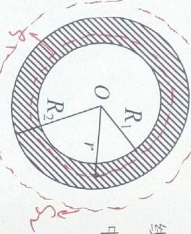

<!-- ANSWER -->
$$V(r) = \frac{\rho}{6\varepsilon_0}\left(3R_2^2 - r^2 - \frac{2R_1^3}{r}\right)$$

<!-- EXPLANATION -->
利用高斯定理求电场：
- 球壳内（$R_1 < r < R_2$）：$E_1 = \frac{\rho(r^3-R_1^3)}{3\varepsilon_0 r^2}$
- 球壳外（$r > R_2$）：$E_2 = \frac{\rho(R_2^3-R_1^3)}{3\varepsilon_0 r^2}$

电势：
$$V(r) = \int_r^{R_2} E_1 dr + \int_{R_2}^{\infty} E_2 dr$$
$$= \frac{\rho}{6\varepsilon_0}\left(3R_2^2 - r^2 - \frac{2R_1^3}{r}\right)$$

<!-- QUESTION END -->

<!-- QUESTION: qtype=short_answer tags=电磁感应,法拉第定律,磁通量,感应电动势 difficulty=5 chapter=第七章 电磁感应与麦克斯韦方程组 -->
如图所示，两条平行长直导线和一个矩形导线框架共面，且导线框的一个边与长直导线平行，它到两长直导线的距离分别为 $r_1$、$r_2$。已知两导线中电流都为 $I = I_0 \sin\omega t$，其中 $I_0$、$\omega$ 为常数，$t$ 为时间。导线框长为 $a$、宽为 $b$，求导线框中的感应电动势。

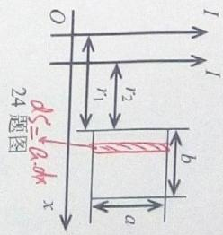

<!-- ANSWER -->
$$\varepsilon = -\frac{\mu_0 I_0 a \omega \cos\omega t}{2\pi}\ln\left[\frac{(r_1+b)(r_2+b)}{r_1 r_2}\right]$$

<!-- EXPLANATION -->
两条平行长直导线电流方向相反（根据图示），在导线框处产生的磁场方向相同（或相反，取决于具体配置）。

单根长直导线在距离 $x$ 处产生的磁感应强度：$B = \frac{\mu_0 I}{2\pi x}$

导线框的磁通量：
$$\Phi = \int_{r_1}^{r_1+b} \frac{\mu_0 I}{2\pi x} \cdot a\,dx + \int_{r_2}^{r_2+b} \frac{\mu_0 I}{2\pi x} \cdot a\,dx$$

考虑两导线电流方向相反的情况，磁通量为：
$$\Phi = \frac{\mu_0 I a}{2\pi}\ln\left[\frac{(r_1+b)(r_2+b)}{r_1 r_2}\right]$$

感应电动势：
$$\varepsilon = -\frac{d\Phi}{dt} = -\frac{\mu_0 I_0 a \omega \cos\omega t}{2\pi}\ln\left[\frac{(r_1+b)(r_2+b)}{r_1 r_2}\right]$$

<!-- QUESTION END -->
