# 2015～2016 学年第二学期期末考试试卷

# 《大学物理 1A2A》(共 4 页)

(考试时间：2016年6月22日)

<table><tr><td>题号</td><td>一</td><td>二</td><td>三</td><td>四</td><td>五</td><td>六</td><td>七</td><td>八</td><td>成绩</td><td>核分人签字</td></tr><tr><td>得分</td><td></td><td></td><td></td><td></td><td></td><td></td><td></td><td></td><td></td><td></td></tr></table>

<!-- QUESTION: qtype=single_choice tags=质点运动学,速度,加速度,切向加速度 difficulty=3 chapter=第一章 质点运动学与牛顿定律 qid=Q0387 -->

质点作曲线运动， $\vec{r}$ 表示位置矢量， $\vec{v}$ 表示速度， $\vec{a}$ 表示加速度， $S$ 表示路程， $a_{t}$ 表示切向加速度，下列表达式中，

(1) $\mathrm{d}\nu / \mathrm{d}t = a$  
(2) $\mathrm{d}r / \mathrm{d}t = v$  
(3) $\mathrm{d}S / \mathrm{d}\iota = v$  
(4) $|\mathrm{d}\bar{\nu} / \mathrm{d}t| = a_{t}$ .

(A) 只有(1)、(4)是对的.  
(B) 只有(2)、(4)是对的.  
(C) 只有(2)是对的.  
(D) 只有(3)是对的.
<!-- ANSWER -->
(D)
<!-- EXPLANATION -->
(1) $\nu$ 为速率，$\mathrm{d}\nu / \mathrm{d}t = a_t$（切向加速度），而非加速度 $a$，故(1)错；(2) $r$ 为位矢大小，$\mathrm{d}r / \mathrm{d}t = v_r$（径向速度），而非速率 $v$，故(2)错；(3) $S$ 为路程，$\mathrm{d}S / \mathrm{d}t = v$（速率），故(3)对；(4) $|\mathrm{d}\vec{v} / \mathrm{d}t| = |\vec{a}| = a$（加速度大小），而非切向加速度 $a_t$，故(4)错。
<!-- QUESTION END -->

<!-- QUESTION: qtype=single_choice tags=刚体转动,角动量守恒,子弹射入,角速度 difficulty=3 chapter=第二章 刚体力学 qid=Q0388 -->

一圆盘正绕垂直于盘面的水平光滑固定轴 O 转动，如图射来两个质量相同，速度大小相同，方向相反并在一条直线上的子弹，子弹射入圆盘并且留在盘内，则子弹射入后的瞬间，圆盘的角速度 $\omega$

(A) 增大.  
(B) 不变.  
(C) 减小.  
(D) 不能确定.
<!-- ANSWER -->
(C)
<!-- EXPLANATION -->
两子弹在同一直线上、速度大小相同方向相反，对O轴的角动量之和为零。子弹射入后系统角动量守恒，射入后系统总角动量等于射入前圆盘的角动量，但系统转动惯量增加了（两个子弹的质量贡献），因此角速度减小。
<!-- QUESTION END -->

<!-- QUESTION: qtype=single_choice tags=气体分子运动论,平均动能,平均平动动能,分子自由度 difficulty=2 chapter=第三章 气体动理论 qid=Q0389 -->

温度、压强相同的氦气和氧气, 它们分子的平均动能 $\bar{\varepsilon}$ 和平均平动动能 $\overline{w}$ 有如下关系:

(A) $\bar{\varepsilon}$ 和 $\overline{w}$ 都相等.  
(B) $\bar{\varepsilon}$ 相等，而 $\bar{w}$ 不相等.  
(C) $\overline{w}$ 相等，而 $\overline{\varepsilon}$ 不相等.  
(D) $\bar{\varepsilon}$ 和 $\overline{w}$ 都不相等.
<!-- ANSWER -->
(C)
<!-- EXPLANATION -->
平均平动动能 $\overline{w} = \frac{3}{2}kT$，只与温度有关，温度相同则 $\overline{w}$ 相等。平均动能 $\bar{\varepsilon} = \frac{i}{2}kT$，与分子自由度 $i$ 有关：He 为单原子分子 $i=3$，O₂ 为双原子分子 $i=5$（刚性），故 $\bar{\varepsilon}$ 不相等。
<!-- QUESTION END -->

<!-- QUESTION: qtype=single_choice tags=气体分子运动论,平均碰撞频率,平均自由程,理想气体性质 difficulty=3 chapter=第三章 气体动理论 qid=Q0390 -->

一定量的理想气体，在温度不变的条件下，当体积增大时，分子的平均碰撞频率 $\bar{z}$ 和

平均自由程 $\overline{\lambda}$ 的变化情况是:

(A) $\bar{Z}$ 减小而 $\bar{\lambda}$ 不变.

(B) $\bar{Z}$ 减小而 $\bar{\lambda}$ 增大.

(C) $\bar{Z}$ 增大而 $\bar{\lambda}$ 减小.

(D) $\bar{Z}$ 不变而 $\bar{\lambda}$ 增大.
<!-- ANSWER -->
(B)
<!-- EXPLANATION -->
温度不变时分子平均速率不变。体积增大，分子数密度 $n$ 减小。平均自由程 $\overline{\lambda} = \frac{1}{\sqrt{2}\pi d^2 n}$，$n$ 减小则 $\overline{\lambda}$ 增大。平均碰撞频率 $\bar{Z} = \sqrt{2}\pi d^2 n \bar{v}$，$n$ 减小则 $\bar{Z}$ 减小。
<!-- QUESTION END -->

<!-- QUESTION: qtype=single_choice tags=无限长载流空心圆柱导体,安培环路定理,磁场分布,对称性分析 difficulty=4 chapter=第六章 稳恒磁场 qid=Q0391 -->

无限长载流空心圆柱导体的内外半径分别为 a、b，电流在导体截面上均匀分布，则空间各处的 $\bar{B}$ 的大小与场点到圆柱中心轴线的距离 r 的关系定性地如图所示。正确的图是

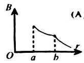

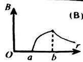

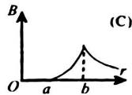

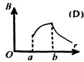

[ ]
<!-- ANSWER -->
(B)
<!-- EXPLANATION -->
$r<a$ 时无电流包围，$B=0$；$a<r<b$ 时用安培环路定理可得 $B$ 从0开始增大（电流均匀分布，包围电流随 $r$ 增加但非线性），在 $r$ 接近 $b$ 时 $B$ 随 $r$ 增大趋缓或略有下降；$r>b$ 时全部电流被包围，$B \propto 1/r$ 递减。图B正确反映了这一规律。
<!-- QUESTION END -->

<!-- QUESTION: qtype=single_choice tags=麦克斯韦速率分布,最概然速率,气体分子运动论,速率分布曲线 difficulty=3 chapter=第三章 气体动理论 qid=Q0392 -->

设图示的两条曲线分别表示在相同温度下氧气和氢气分子的速率分布曲线：令 $\left(v_{p}\right)_{O_{2}}$ 和 $\left(v_{p}\right)_{H_{2}}$ 分别表示氧气和氢气的最概然速率，则

(A) 图中 a 表示氧气分子的速率分布曲线； $\left(v_{p}\right)_{\mathrm{O}_{2}}/\left(v_{p}\right)_{\mathrm{H}_{2}}=4.$  
(B) 图中 a 表示氧气分子的速率分布曲线: $\left(v_{p}\right)_{\mathrm{O}_{2}}/\left(v_{p}\right)_{\mathrm{H}_{2}}=1/4.$  
(C) 图中 b 表示氧气分子的速率分布曲线； $\left(v_{p}\right)_{\mathrm{O}_{2}}/\left(v_{p}\right)_{\mathrm{H}_{2}}=1/4.$  
(D)图中 b 表示氧气分子的速率分布曲线: $\left(v_{p}\right)_{\mathrm{O}_{2}}/\left(v_{p}\right)_{\mathrm{H}_{2}}=4.$

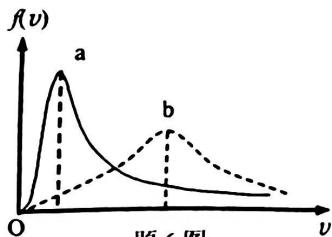

line chart

| v     | f(v) Curve a | f(v) Curve b |
|-------|--------------|--------------|
| 0     | 0            | 0            |
| Peak 1| Peak         | Low          |
| Peak 2| Low          | High         |

<!-- ANSWER -->
(B)
<!-- EXPLANATION -->
最概然速率 $v_p = \sqrt{2RT/M}$，O₂ 摩尔质量大，$v_p$ 小。在相同温度下，摩尔质量大的气体最概然速率小，但峰值更高（曲线下总面积相同，分布更集中）。图中曲线 a 峰值较高，对应 O₂；曲线 b 峰值较低，对应 H₂。$v_p$ 之比为 $\sqrt{M_{H_2}/M_{O_2}} = \sqrt{2/32} = 1/4$。故选项 B 正确。
<!-- QUESTION END -->

<!-- QUESTION: qtype=single_choice tags=静电场,高斯定理,均匀带电球面,电场强度叠加原理 difficulty=4 chapter=第五章 静电学 qid=Q0393 -->

一均匀带电球面，电荷面密度为σ，球面内电场强度处处为零，球面上面元dS带有dS的电荷，该电荷在球面内各点产生的电场强度

(A) 处处为零.  
(B) 不一定都为零.  
(C) 处处不为零.  
(D) 无法判定。
<!-- ANSWER -->
(C)
<!-- EXPLANATION -->
球面内电场强度处处为零是所有面元电荷产生电场的叠加结果。单个面元电荷在球面内各点产生的电场强度并不为零（因为该面元电荷与球内各点距离不为零），而是与其他面元产生的电场叠加后才抵消为零。因此单个面元电荷在球面内各点产生的电场强度处处不为零。
<!-- QUESTION END -->

<!-- QUESTION: qtype=single_choice tags=静电场,高斯定理,电场强度通量,点电荷电场 difficulty=4 chapter=第五章 静电学 qid=Q0394 -->

有两个电荷都是 $+q$ 的点电荷，相距为 $2a$ 。今以左边的点电荷所在处为球心，以 $a$ 为半径作一球形高斯面。在球面上取两块相等的小面积 $S_{1}$ 和 $S_{2}$ ，其位置如图所示。设通过 $S_{1}$ 和 $S_{2}$ 的电场强度通量分别为 $\Phi_{1}$ 和 $\Phi_{2}$ ，通过整个球面的电场强度通量为 $\Phi_{3}$ ，则

(A) $\phi_{1} > \phi_{2}, \quad \phi_{S} = q / \varepsilon_{0}$ .  
(B) $\phi_{1} < \phi_{2}, \phi_{3} = 2q / \varepsilon_{0}$ .  
(C) $\phi_{1} = \phi_{2},\quad \phi_{S} = q / \varepsilon_{0}$  
(D) $\phi_{1} < \phi_{2}, \phi_{3} = q / \varepsilon_{0}$ .

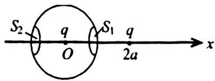

text_image

S₂
q
O
S₁
q
2a
x

<!-- ANSWER -->
(D)
<!-- EXPLANATION -->
高斯面内只包围一个电荷 $+q$，由高斯定理 $\Phi_3 = q/\varepsilon_0$。$S_1$ 面积较小且靠近另一个电荷方向，该处电场方向与法向夹角更大，通量较小；$S_2$ 在近处，电场与法向更接近平行，通量较大。故 $\phi_1 < \phi_2$。
<!-- QUESTION END -->

<!-- QUESTION: qtype=single_choice tags=静电场,导体球,电介质,电场强度,电荷面密度 difficulty=3 chapter=第五章 静电学 qid=Q0395 -->

一导体球外充满相对介电常量为 $\varepsilon$ 的均匀电介质，若测得导体表面附近场强为E，则导体球面上的自由电荷面密度 $\sigma$ 为

(A) $\varepsilon_{0}E.$

(B) $\varepsilon_{0}\varepsilon_{r}E.$

(C) $\varepsilon_{r}E.$

(D) $(\varepsilon_0\varepsilon_r - \varepsilon_0)E.$
<!-- ANSWER -->
(B)
<!-- EXPLANATION -->
导体表面附近电场强度与自由电荷面密度的关系为 $D = \sigma$，其中 $D$ 为电位移矢量的法向分量。在电介质中，$D = \varepsilon_0 \varepsilon_r E$，故 $\sigma = \varepsilon_0 \varepsilon_r E$。
<!-- QUESTION END -->

<!-- QUESTION: qtype=single_choice tags=稳恒磁场,安培环路定理,磁场强度,环路积分 difficulty=4 chapter=第七章 电磁感应与麦克斯韦方程组 qid=Q0396 -->

如图，流出纸面的电流为 2I，流进纸面的电流为 I，则下述各式中哪一个是正确的？

(A) $\oint_{l_{1}}\bar{H}\cdot d\bar{l}=2I.$

(C) $\oint_{l_{1}}\vec{H}\cdot d\vec{l}=-I.$

(B) $\oint_{L_{2}}\bar{H}\cdot d\bar{l}=I$

(D) $\oint_{L_{4}}\vec{H}\cdot d\vec{l}=-I$

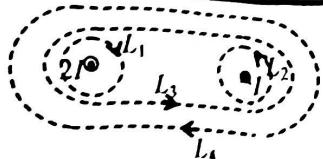

text_image

L₁
2P
L₃
L₂
L₄

<!-- ANSWER -->
(B)
<!-- EXPLANATION -->
由安培环路定理，磁场强度 $\vec{H}$ 沿闭合回路的环量等于穿过该回路所围面积的自由电流的代数和（右手法则确定正方向）。$L_2$ 只包围一个流出纸面的电流 2I 和一个流进纸面的电流 I，净电流为 $2I - I = I$，故 $\oint_{L_2}\vec{H}\cdot d\vec{l} = I$。
<!-- QUESTION END -->

<!-- QUESTION: qtype=fill_blank tags=麦克斯韦方程组,积分形式,电磁场,麦克斯韦方程难度=4 chapter=第七章 电磁感应与麦克斯韦方程组 qid=Q0397 -->

反映电磁场基本性质和规律的积分形式的麦克斯韦方程组为

$\oint_{S} \vec{D} \cdot \mathrm{d}\vec{S} = \int_{V} \rho \mathrm{d}V$ ，①

$\oint_{l}\vec{E}\cdot \mathrm{d}\vec{l} = -\int_{s}\frac{\partial\vec{B}}{\partial t}\cdot \mathrm{d}\vec{S},$ ②

$\oint_{S} \vec{B} \cdot \mathrm{d}\vec{S} = 0$ ，③

$\oint_{L} \vec{H} \cdot \mathrm{d}\vec{l} = \int_{S} (\vec{J} + \frac{\partial \vec{D}}{\partial t}) \cdot \mathrm{d}\vec{S}$ . ④

试判断下列结论是包含于或等效于哪一个麦克斯韦方程式的。将你确定的方程式用代号填在相应结论后的空白处。

(1) 变化的磁场一定伴随有电场: \_\_\_\_

(2) 磁感线是无头无尾的; \_\_\_\_

(3) 电荷总伴随有电场. \_\_\_\_

<!-- ANSWER -->
(1) ② (2) ③ (3) ①
<!-- EXPLANATION -->
(1) 方程②（法拉第电磁感应定律）表明变化的磁场产生电场；(2) 方程③（磁场高斯定理）$\oint \vec{B}\cdot d\vec{S}=0$ 表明磁场无源，磁感线闭合无头无尾；(3) 方程①（电场高斯定理）表明电荷产生电场。
<!-- QUESTION END -->

<!-- QUESTION: qtype=fill_blank tags=卡诺热机,热机效率,等温膨胀,热力学定律 difficulty=4 chapter=第四章 热力学定律 qid=Q0398 -->

有一卡诺热机，用 290 g 空气为工作物质，工作在 $27^{\circ}$ C 的高温热源与 $-73^{\circ}$ C 的低温热源之间，此热机的效率 $\eta=$ \_\_\_\_。若在等温膨胀的过程中气体体积增大到 2.718 倍，则此热机每一循环所作的功为 \_\_\_\_。（空气的摩尔质量为 $29 \times 10^{-3}$ kg/mol，普适气体常量 $R=8.31 J \cdot mol^{-1} \cdot K^{-1}$ ）
<!-- ANSWER -->
$\eta = 1/3 \approx 33.3\%$；$W \approx 8310 \, \text{J}$
<!-- EXPLANATION -->
$T_1 = 300\text{K}$，$T_2 = 200\text{K}$，$\eta = 1 - T_2/T_1 = 1/3$。$n = m/M = 0.29/0.029 = 10\text{mol}$。等温膨胀 $\Delta S = 2.718$ 倍，$\ln(2.718) \approx 1$，$Q_H = nRT_1\ln(e) = 10 \times 8.31 \times 300 = 24930\text{J}$，$W = \eta Q_H = 8310\text{J}$。
<!-- QUESTION END -->

<!-- QUESTION: qtype=fill_blank tags=热力学第二定律,开尔文表述,克劳修斯表述,不可逆过程 difficulty=2 chapter=第四章 热力学定律 qid=Q0399 -->

热力学第二定律的开尔文表述和克劳修斯表述是等价的，表明在自然界中与热现象有关的实际宏观过程都是不可逆的，开尔文表述指出了\_\_\_\_的过程是不可逆的，而克劳修斯表述指出了\_\_\_\_的过程是不可逆的。
<!-- ANSWER -->
开尔文表述指出了"功全部转化为热量"（或"第二类永动机"）的过程是不可逆的；克劳修斯表述指出了"热量自动地从低温物体传向高温物体"的过程是不可逆的。
<!-- EXPLANATION -->
开尔文表述：不可能从单一热源取热使之全部转化为功而不引起其他变化，即功变热是不可逆的。克劳修斯表述：不可能使热量从低温物体传到高温物体而不引起其他变化，即热传导是不可逆的。
<!-- QUESTION END -->

<!-- QUESTION: qtype=fill_blank tags=质点动力学,动量定理,水流冲击,冲力,弯管 difficulty=3 chapter=第一章 质点运动学与牛顿定律 qid=Q0400 -->

如图所示，流水以初速度 $\bar{v}_{1}$ 进入弯管，流出时的速度为 $\bar{v}_{2}$ ，且 $v_{1}=v_{2}=v$ 。设每秒流入的水质量为 q，则在管子转弯处，水对管壁的平均冲力大小是 \_\_\_\_，方向 \_\_\_\_。

(管内水受到的重力不考虑)

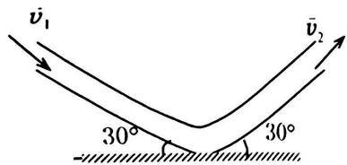

text_image

v̇₁
30°
30°
v̇₂

<!-- ANSWER -->
平均冲力大小 $F = qv$，方向竖直向下。
<!-- EXPLANATION -->
两速度矢量与竖直方向夹角均为 $30°$，夹角为 $60°$，速度变化量大小 $|\Delta \vec{v}| = 2v\sin(30°) = v$。由动量定理，每秒动量变化即为力，$F = q|\Delta \vec{v}| = qv$，方向沿角平分线（竖直向下）。
<!-- QUESTION END -->

<!-- QUESTION: qtype=fill_blank tags=弹簧振子,能量守恒,向心力,圆周运动难度=3 chapter=第一章 质点运动学与牛顿定律 qid=Q0401 -->

光滑水平面上有一轻弹簧，劲度系数为 $k$ ，弹簧一端固定在 $O$ 点，另一端拴一个质量为 $m$ 的物体，弹簧初始时处于自由伸长状态，若此时给物体 $m$ 一个垂直于弹簧的初速度 $\bar{v}_0$ 如图所示，则当物体速率为 $\frac{1}{2} v_0$ 时弹簧对物体的拉力 $f =$ \_\_\_\_.

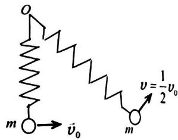

text_image

o
m → v̇₀
m
v = 1/2 v₀

<!-- ANSWER -->
$f = \sqrt{3km}v_0/2$
<!-- EXPLANATION -->
由角动量守恒：$mv_0 r_0 = mv_1 r_1$，初始时 $r_0 = l_0$（弹簧自然长度）。由能量守恒：$\frac{1}{2}mv_0^2 = \frac{1}{2}m(\frac{v_0}{2})^2 + \frac{1}{2}k(r_1-l_0)^2$。由于力始终指向O点，系统角动量守恒。弹簧力大小 $f = k(r_1 - l_0)$。联立能量守恒和角动量守恒即可求解 $f$。

由角动量守恒 $mv_0 l_0 = m\frac{v_0}{2} r_1$，得 $r_1 = 2l_0$。弹簧伸长量 $r_1 - l_0 = l_0$。

由能量守恒：$\frac{1}{2}mv_0^2 = \frac{1}{2}m\frac{v_0^2}{4} + \frac{1}{2}kl_0^2$，得 $l_0^2 = \frac{3mv_0^2}{4k}$，$l_0 = v_0\sqrt{3m/4k}$。

故 $f = kl_0 = v_0\sqrt{3km/4} = \frac{v_0}{2}\sqrt{3km}$。
<!-- QUESTION END -->

<!-- QUESTION: qtype=fill_blank tags=刚体转动,角动量守恒,子弹射入杆,角速度计算 difficulty=3 chapter=第二章 刚体力学 qid=Q0402 -->

长为 l 、质量为 M 的匀质杆可绕通过杆一端 O 的水平光滑固定轴转动，转动惯量为 $\frac{1}{3}Ml^{2}$ ，开始时杆竖直下垂，如图所示。有一质量为 m 的子弹以水平速度 $\vec{v}_{0}$ 射入杆上 A 点，并嵌在杆中，OA = 2l / 3，则子弹射入后瞬间杆的角速度 $\omega =$ \_\_\_\_.

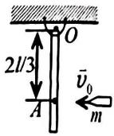 
<!-- ANSWER -->
$\omega = \frac{mv_0 \cdot \frac{2l}{3}}{\frac{1}{3}Ml^2 + m(\frac{2l}{3})^2} = \frac{2mv_0}{l(M + \frac{4}{3}m)} = \frac{6mv_0}{l(3M + 4m)}$
<!-- EXPLANATION -->
子弹射入瞬间，系统（杆+子弹）对O轴角动量守恒。射入前只有子弹有角动量：$L = mv_0 \cdot \frac{2l}{3}$。射入后系统总转动惯量为 $I_{总} = \frac{1}{3}Ml^2 + m(\frac{2l}{3})^2 = \frac{1}{3}Ml^2 + \frac{4}{9}ml^2$。由 $L = I_{总}\omega$，得 $\omega = \frac{2mv_0l/3}{\frac{1}{3}Ml^2 + \frac{4}{9}ml^2} = \frac{2mv_0}{\frac{1}{3}Ml + \frac{4}{9}ml} = \frac{6mv_0}{l(3M + 4m)}$。
<!-- QUESTION END -->

<!-- QUESTION: qtype=fill_blank tags=载流导线磁场,毕奥-萨伐尔定律,半圆弧,磁感应强度叠加 difficulty=3 chapter=第六章 稳恒磁场 qid=Q0403 -->

弯曲的载流导线在同一平面内，形状如图(O点是半径为 $R_{1}$ 和 $R_{2}$ 的两个半圆弧的共同圆心，电流自无穷远来到无穷远去)，则O点磁感强度的大小是\_\_\_\_。

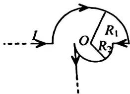

text_image

I
O
R₁
R₂

<!-- ANSWER -->
$B_0 = \frac{\mu_0 I}{4R_1} + \frac{\mu_0 I}{4R_2} - \frac{\mu_0 I}{4\pi R_2}$
<!-- EXPLANATION -->
两个半圆弧在O点产生的磁场方向相同（根据电流流向判断），大小分别为 $\frac{\mu_0 I}{4R_1}$ 和 $\frac{\mu_0 I}{4R_2}$；两段直导线中，有一段延长线过O点对O点磁场无贡献，另一段直导线与径向有一夹角，对O点磁场有贡献，大小为 $\frac{\mu_0 I}{4\pi R_2}$（方向与半圆弧磁场相反）。故总磁场 $B_0 = \frac{\mu_0 I}{4R_1} + \frac{\mu_0 I}{4R_2} - \frac{\mu_0 I}{4\pi R_2}$。
<!-- QUESTION END -->

<!-- QUESTION: qtype=fill_blank tags=磁偶极矩,磁力矩,圆形线圈,磁场中力矩计算 difficulty=3 chapter=第六章 稳恒磁场 qid=Q0404 -->

在磁场中某点磁感强度的大小为 $2.0 \, Wb/m^{2}$ ，在该点一圆形试验线圈所受的最大磁力矩为 $6.28 \times 10^{-6} \, N \cdot m$ ，如果通过的电流为 $10 \, mA$ ，则可知线圈的半径为 \_\_\_\_ m，这时线圈平面法线方向与该处磁感强度的方向的夹角为 \_\_\_\_.
<!-- ANSWER -->
$r = 1.0 \times 10^{-2} \, \text{m}$（即 1 cm）；$\theta = \frac{1}{2}\pi$（即 90°，线圈平面法线方向与 $\vec{B}$ 方向垂直）
<!-- EXPLANATION -->
最大磁力矩 $M_{max} = NISB$，其中 $N=1$，$S = \pi r^2$。$M_{max} = I \pi r^2 B$，故 $\pi r^2 = M_{max}/(IB) = 6.28 \times 10^{-6}/(0.01 \times 2.0) = 3.14 \times 10^{-4} \, \text{m}^2$，$r^2 = 10^{-4}$，$r = 1.0 \times 10^{-2} \, \text{m}$。磁力矩 $M = M_{max}\sin\theta$，最大磁力矩对应 $\sin\theta = 1$，即 $\theta = \pi/2$，线圈法线方向与磁场方向垂直（线圈平面平行于磁场）。
<!-- QUESTION END -->

<!-- QUESTION: qtype=fill_blank tags=电磁感应,动生电动势,直导线运动,磁场中电动势 difficulty=4 chapter=第七章 电磁感应与麦克斯韦方程组 qid=Q0405 -->

金属杆 $AB$ 以匀速 $\nu = 2\mathrm{m / s}$ 平行于长直载流导线运动，导线与 $AB$ 共面且相互垂直，如图所示. 已知导线载有电流 $I = 40$ A，则此金属杆中的感应电动势 $\varepsilon_{i} =$ \_\_\_\_，电势较高端为 \_\_\_\_. ( $\ln 2 = 0.69, \mu_0 = 4\pi \times 10^{-7}\mathrm{N} \cdot \mathrm{A}^{-2}$ )

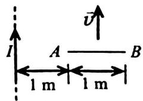

text_image

I
A —— B
1 m 1 m

<!-- ANSWER -->
$\varepsilon_i \approx 1.11 \times 10^{-5} \, \text{V}$（约 11.1 μV），电势较高端为 A 端
<!-- EXPLANATION -->
长直载流导线产生的磁场 $B(r) = \frac{\mu_0 I}{2\pi r}$。金属杆 AB 距导线的距离分别为 1 m 和 2 m。动生电动势 $\varepsilon_i = \int_1^2 vB(r)dr = \frac{\mu_0 I v}{2\pi}\ln 2 = \frac{4\pi \times 10^{-7} \times 40 \times 2}{2\pi} \times 0.69 = 1.6 \times 10^{-5} \times 0.69 \approx 1.11 \times 10^{-5} \, \text{V}$。根据右手定则，正电荷受力方向从 B 指向 A（靠近导线一侧），故 A 端电势较高。
<!-- QUESTION END -->

<!-- QUESTION: qtype=fill_blank tags=电容器,电介质,电容变化,电场能量 difficulty=3 chapter=第五章 静电学 qid=Q0406 -->

电容为 $C_{0}$ 的平板电容器，接在电路中，如图所示。若将相对介电常量为 $\varepsilon_{r}$ 的各向同性均匀电介质插入电容器中(填满空间)，则此时电容器的电容为原来的 \_\_\_\_ 倍，电场能量是原来的 \_\_\_\_ 倍。

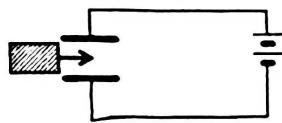  
<!-- ANSWER -->
电容为原来的 $\varepsilon_r$ 倍；电场能量为原来的 $\varepsilon_r$ 倍
<!-- EXPLANATION -->
插入电介质后 $C = \varepsilon_r C_0$（电容增大 $\varepsilon_r$ 倍）。电容器接在电路中（与电源相连），电压 $U$ 保持不变。电场能量 $W = \frac{1}{2}CU^2$，故插入电介质后 $W = \frac{1}{2}(\varepsilon_r C_0)U^2 = \varepsilon_r \cdot \frac{1}{2}C_0 U^2 = \varepsilon_r W_0$，即电场能量也变为原来的 $\varepsilon_r$ 倍。
<!-- QUESTION END -->

三、计算题（每题10分，共4题）

<!-- QUESTION: qtype=short_answer tags=刚体转动,定滑轮,角加速度,转动惯量测量 difficulty=4 chapter=第二章 刚体力学 qid=Q0407 -->

一定滑轮可绕一固定的水平光滑轴转动，质量为 M，半径为 R，一根不能伸长的轻绳，一端缠绕在定滑轮上，另一端系有一质量为 m 的物体，如图所示.

(1) 已知定滑轮的转动惯量为 $I=\frac{1}{2}MR^{2}$ ，求定滑轮角加速度的大小和方向；  
(2) 假如定滑轮的转动惯量是未知的, 此系统也可以用来测量定滑轮的转动惯量。假设一种情况: 系统开始时是静止的, 质点 $m$ 在 $t_0$ 时间内下降了 $h$ 的距离, 试将定滑轮的转动惯量用 $t_0$ , $h$ , $m$ 和 $R$ 表示出来。

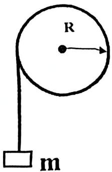

text_image

R
m

<!-- ANSWER -->
(1) 角加速度大小 $\beta = \frac{2mg}{(M+2m)R}$，方向为顺时针（与物体下落方向一致）。  
(2) 转动惯量 $I = \frac{mgR^2 t_0^2}{2h} - mR^2$。
<!-- EXPLANATION -->
(1) 对物体 $m$：$mg - T = ma$；对滑轮：$TR = I\beta$；运动学关系：$a = \beta R$。联立解得 $\beta = \frac{mgR}{I + mR^2} = \frac{mgR}{\frac{1}{2}MR^2 + mR^2} = \frac{2mg}{(M+2m)R}$。方向与物体下落方向一致（顺时针）。  
(2) 由运动学公式：$h = \frac{1}{2}at_0^2$，得 $a = \frac{2h}{t_0^2}$。由牛顿第二定律和转动定律：$mg - T = ma$，$TR = I\beta$，$a = \beta R$，消去 $T$ 和 $\beta$ 得 $I = \frac{mR^2(g - a)}{a} = \frac{mR^2(g - 2h/t_0^2)}{2h/t_0^2} = \frac{mgR^2 t_0^2}{2h} - mR^2$。
<!-- QUESTION END -->

<!-- QUESTION: qtype=short_answer tags=热力学循环,刚性双原子分子,等体过程,等温过程,等压过程,热机效率 difficulty=4 chapter=第四章 热力学定律 qid=Q0408 -->

1mol 的刚性双原子分子理想气体系统，经历如图所示的循环过程。其中 $a \rightarrow b$ 是等体过程， $b \rightarrow c$ 是等温过程， $c \rightarrow a$ 是等压过程。求：

(1)循环过程对外做的净功;  
(2)整个循环过程实际从外界吸收的热量;  
(3)循环效率。  
(普适气体常量 R=8.31 J·mol $^{-1}$ ·K $^{-1}$ )

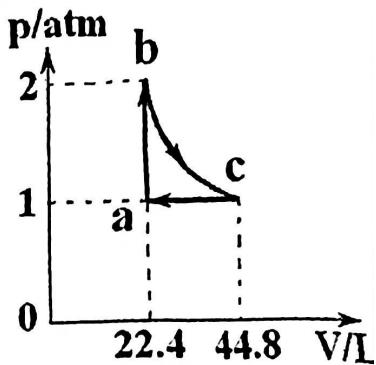

line chart

| Point | V/L  | p/atm |
|-------|------|-------|
| a     | 22.4 | 1     |
| b     | 22.4 | 2     |
| c     | 44.8 | 1     |

22 题图
<!-- ANSWER -->
(1) 净功 $W_{net} \approx 877 \, \text{J}$  
(2) 从外界吸收的热量 $Q_{吸} \approx 8.82 \times 10^3 \, \text{J}$  
(3) 循环效率 $\eta \approx 9.9\%$
<!-- EXPLANATION -->
由 $pV = nRT$ 得：$T_a = p_a V_a/(nR) = (1 \times 1.013 \times 10^5 \times 22.4 \times 10^{-3})/(1 \times 8.31) \approx 273 \, \text{K}$，同理 $T_b = 2T_a = 546 \, \text{K}$，$T_c = T_b = 546 \, \text{K}$（等温）。

$a \to b$ 等体：$W_{ab}=0$，$Q_{ab} = nC_{V,m}(T_b-T_a) = 1 \times \frac{5}{2}R \times 273 \approx 5674 \, \text{J}$。  
$b \to c$ 等温：$\Delta E_{bc}=0$，$W_{bc} = nRT_b \ln(V_c/V_b) = 1 \times 8.31 \times 546 \times \ln(44.8/22.4) \approx 3146 \, \text{J}$，$Q_{bc} = W_{bc} \approx 3146 \, \text{J}$（吸热）。  
$c \to a$ 等压：$W_{ca} = p_a(V_a-V_c) = 1.013 \times 10^5 \times (22.4-44.8) \times 10^{-3} \approx -2269 \, \text{J}$，$Q_{ca} = nC_{p,m}(T_a-T_c) = 1 \times \frac{7}{2}R \times (273-546) \approx -7943 \, \text{J}$（放热）。

净功 $W_{net} = W_{ab}+W_{bc}+W_{ca} = 0 + 3146 - 2269 = 877 \, \text{J}$。实际吸收热量为 $Q_{吸} = Q_{ab} + Q_{bc} \approx 5674 + 3146 = 8820 \, \text{J}$。效率 $\eta = W_{net}/Q_{吸} \approx 877/8820 \approx 9.9\%$。
<!-- QUESTION END -->

<!-- QUESTION: qtype=short_answer tags=静电场,带电球体,电场强度,电势,高斯定理 difficulty=4 chapter=第五章 静电学 qid=Q0409 -->

半径为 R 的球体内分布着电荷，电荷体密度为 $\rho(r)=5r^{2}$ ，取无限远处为电势零点，试求：

(1) 空间的电场强度分布；  
(2) 空间的电势分布.

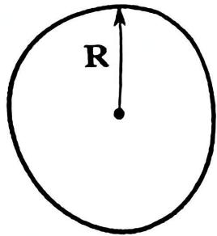

text_image

R

23 题图
<!-- ANSWER -->
(1) 电场强度分布：
   球内（$r \le R$）：$E_1 = \frac{r^3}{\varepsilon_0}$（沿径向向外）；
   球外（$r > R$）：$E_2 = \frac{Q}{4\pi\varepsilon_0 r^2}$，其中 $Q = 4\pi R^5$（球体总电荷）。
(2) 电势分布：
   球外（$r > R$）：$U_2 = \frac{Q}{4\pi\varepsilon_0 r}$；
   球内（$r \le R$）：$U_1 = \frac{1}{4\varepsilon_0}(R^4 - r^4) + \frac{Q}{4\pi\varepsilon_0 R}$。
<!-- EXPLANATION -->
(1) 由高斯定理 $\oint \vec{E} \cdot d\vec{S} = \frac{q_{in}}{\varepsilon_0}$。
   球内半径 $r$ 的高斯面内电荷 $q_{in} = \int_0^r \rho \cdot 4\pi r'^2 dr' = \int_0^r 5r'^2 \cdot 4\pi r'^2 dr' = 20\pi \int_0^r r'^4 dr' = 4\pi r^5$。
   由高斯定理 $E_1 \cdot 4\pi r^2 = 4\pi r^5 / \varepsilon_0$，得 $E_1 = \frac{r^3}{\varepsilon_0}$。
   球外高斯面包围总电荷 $Q = 4\pi R^5$，$E_2 \cdot 4\pi r^2 = Q/\varepsilon_0$，得 $E_2 = \frac{Q}{4\pi\varepsilon_0 r^2}$。
(2) 电势：$U(r) = \int_r^\infty \vec{E} \cdot d\vec{l}$。
   球外 $U_2 = \int_r^\infty E_2 dr = \frac{Q}{4\pi\varepsilon_0 r}$。
   球内 $U_1 = \int_r^R E_1 dr + \int_R^\infty E_2 dr = \int_r^R \frac{r^3}{\varepsilon_0} dr + \frac{Q}{4\pi\varepsilon_0 R} = \frac{1}{4\varepsilon_0}(R^4 - r^4) + \frac{Q}{4\pi\varepsilon_0 R}$。
<!-- QUESTION END -->

<!-- QUESTION: qtype=short_answer tags=电磁感应,动生电动势,磁通量,感应电动势,变化电流 difficulty=4 chapter=第七章 电磁感应与麦克斯韦方程组 qid=Q0410 -->

如图所示，两条通有电流的平行长直导线和一个矩形导线框共面，且导线框的一个边与长直导线平行，它到两长直导线的距离分别为 $r_1$ 、 $r_2$ 。导线框长为 $a$ 宽为 $b$ ，如果两导线中的电流强度都为 $I = I_0 e^{-5t}$ ，其中 $I_0$ 是常数， $t$ 是时间。导线框静止不动，求：

(1)每一直线电流的磁场穿过导线框的磁通量:  
(2)导线框中的感应电动势.

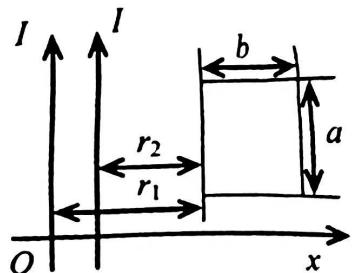

text_image

I
I
b
r₂
r₁
a
O
x

24 题图
<!-- ANSWER -->
(1) 导线框总磁通量 $\Phi = \frac{\mu_0 a I}{2\pi} \left( \ln\frac{r_1+b}{r_1} + \ln\frac{r_2+b}{r_2} \right) = \frac{\mu_0 a I}{2\pi} \ln\frac{(r_1+b)(r_2+b)}{r_1 r_2}$。
(2) 感应电动势 $\varepsilon_i = -\frac{d\Phi}{dt} = \frac{5\mu_0 a I_0}{2\pi} \ln\frac{(r_1+b)(r_2+b)}{r_1 r_2} e^{-5t}$，方向为逆时针方向（随电流减小而感应出阻碍磁通减小的方向）。
<!-- EXPLANATION -->
(1) 长直载流导线在距离 $x$ 处产生的磁场 $B(x) = \frac{\mu_0 I}{2\pi x}$。取坐标原点在左边导线处，右边导线在 $r_1 + r_2$ 处。框左边缘在 $r_1$，右边缘在 $r_1+b$。左边导线在框内产生的磁通量：
$\Phi_1 = \int_{r_1}^{r_1+b} \frac{\mu_0 I}{2\pi x} \cdot a \, dx = \frac{\mu_0 a I}{2\pi} \ln\frac{r_1+b}{r_1}$。
同理，右边导线在框内产生的磁通量（距离从 $r_2$ 到 $r_2+b$）：
$\Phi_2 = \frac{\mu_0 a I}{2\pi} \ln\frac{r_2+b}{r_2}$。
总磁通量 $\Phi = \Phi_1 + \Phi_2$。
(2) $I = I_0 e^{-5t}$，则 $\frac{dI}{dt} = -5I_0 e^{-5t}$。感应电动势 $\varepsilon_i = -\frac{d\Phi}{dt} = -\frac{\mu_0 a}{2\pi} \ln\frac{(r_1+b)(r_2+b)}{r_1 r_2} \cdot \frac{dI}{dt} = \frac{5\mu_0 a I_0}{2\pi} \ln\frac{(r_1+b)(r_2+b)}{r_1 r_2} e^{-5t}$。
由于电流随时间减小，磁通量减小，感应电动势的方向为阻碍磁通减小的方向（即右手定则判断为逆时针方向）。
<!-- QUESTION END -->