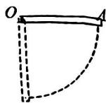
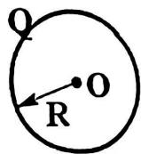
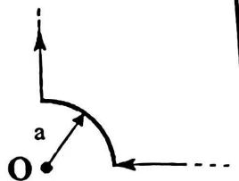
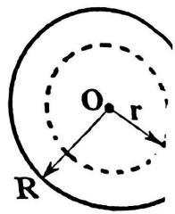
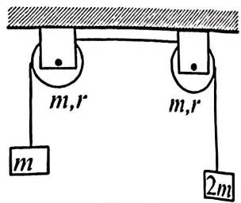
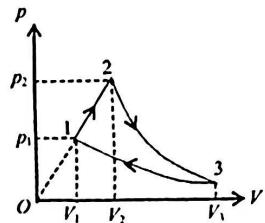
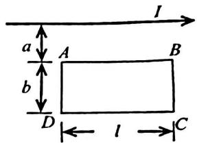

# 2016\~2017 学年第二学期期末考试试卷

《大学物理 1A2A》( A 卷 共 4 页)

(考试时间：2017年6月20日)

<table><tr><td>题号</td><td>一</td><td>二</td><td>三(21)</td><td>四(22)</td><td>五(23)</td><td>六(24)</td><td>成绩</td><td>核分人签字</td></tr><tr><td>得分</td><td></td><td></td><td></td><td></td><td></td><td></td><td></td><td></td></tr></table>

一、选择题（每题3分，共10题） $(h=6.63\times10^{-34}\mathrm{J}\cdot\mathrm{s},\quad m_{e}=9.1\times10^{-31}\mathrm{kg},\quad e=1.6\times10^{-19}\mathrm{C},\quad R=8.31\mathrm{J}\cdot\mathrm{mol}^{-1}\cdot\mathrm{K}^{-1},\quad k=1.38\times10^{-23}\mathrm{J}\cdot\mathrm{K}^{-1},\quad\mathrm{latm}=1.013\times10^{5}\mathrm{Pa})$

<!-- QUESTION: qtype=single_choice tags=转动惯量,力矩,角加速度,刚体转动 difficulty=3 chapter=第二章 刚体力学 qid=Q0457 -->
均匀细棒 $OA$ 可绕通过其一端 $O$ 而与棒垂直的水平固定光滑轴转动，如图所示。细棒的质量是 $m$ ，长度为 $l$ ，绕0点的转动惯量是 $I = ml^2 /3$ 。则当细棒转到与水平位置夹角成 $\pi /3$ 时，细棒的角加速度是

(A) $3g/(2l)$ ;

(B) $3g / (4l)$

(C) $4g/(3l)$ ;

(D) $2g/(3l)$
<!-- ANSWER -->
B
<!-- EXPLANATION -->
根据转动定律 $\tau = I\alpha$，其中力矩 $\tau = mg\cdot\frac{l}{2}\cos(\pi/3) = mg\cdot\frac{l}{2}\cdot\frac{1}{2} = \frac{mgl}{4}$，转动惯量 $I = ml^2/3$，解得角加速度 $\alpha = \frac{\tau}{I} = \frac{3g}{4l}$。

<!-- QUESTION END -->

<!-- QUESTION: qtype=single_choice tags=功,位移,矢量点积,恒力做功 difficulty=2 chapter=第一章 质点运动学与牛顿定律 qid=Q0458 -->
一个质点同时在几个力作用下的位移为： $\Delta\vec{r}=3\vec{i}+8\vec{j}+5\vec{k}$ (SI)，其中一个力为恒力 $\vec{F}=12\vec{i}-3\vec{j}+4\vec{k}$ (SI)，则此力在该位移过程中所作的功为

(A)-67J

(B)32J

(C)67J

(D)91J
<!-- ANSWER -->
B
<!-- EXPLANATION -->
恒力做功 $W = \vec{F}\cdot\Delta\vec{r} = (12)(3) + (-3)(8) + (4)(5) = 36 - 24 + 20 = 32$ J。

<!-- QUESTION END -->

<!-- QUESTION: qtype=single_choice tags=转动运动学,线速度,法向加速度,切向加速度 difficulty=2 chapter=第二章 刚体力学 qid=Q0459 -->
半径 r=0.4m 的圆盘，绕过质心且垂直盘面的轴转动，其角速度与时间的关系是 $\omega=6+t$ （rad/s），当 t=2s 时，对于圆盘边缘一点，以下结果正确的是

(A) $\upsilon = 0.2\mathrm{m / s}$ ;

(B) $a_{r}=0.4m/s^{2}$

(C) $a_{n} = 2\mathrm{m / s^{2}}$

(D) $a = 2.04\mathrm{m / s^2}$
<!-- ANSWER -->
B
<!-- EXPLANATION -->
当 $t=2\,\mathrm{s}$ 时，$\omega=6+2=8\,\mathrm{rad/s}$。圆盘边缘一点的线速度 $v = r\omega = 0.4 \times 8 = 3.2\,\mathrm{m/s}$，选项A错误。角加速度 $\alpha = d\omega/dt = 1\,\mathrm{rad/s^2}$，切向加速度 $a_t = r\alpha = 0.4\,\mathrm{m/s^2}$，选项B中的 $a_r$ 可能是切向加速度（a_t），因此B正确。法向加速度 $a_n = r\omega^2 = 0.4 \times 8^2 = 25.6\,\mathrm{m/s^2}$，选项C错误。总加速度 $a = \sqrt{a_t^2 + a_n^2} \approx 25.6\,\mathrm{m/s^2}$，选项D错误。

<!-- QUESTION END -->

<!-- QUESTION: qtype=single_choice tags=麦克斯韦速率分布,速率分布函数,分子数,统计物理 difficulty=3 chapter=第三章 气体动理论 qid=Q0460 -->
已知 $f(\upsilon)$ 为麦克斯韦速率分布函数， $N$ 是总分子数，则速率大于 $\upsilon_0$ 的分子数的表达式为

(A) $\int_{0}^{\infty} f(v) dv$ ;

(B) $\int_{0}^{\infty}f(v)dv$

(C) $\int_{v_0}^{\infty} Nf(v) dv$ ;

(D) $\int_{0}^{\infty} Nf(v) dv$
<!-- ANSWER -->
C
<!-- EXPLANATION -->
麦克斯韦速率分布函数 $f(v)$ 表示单位速率区间的分子数占总分子数的比率，即 $dN = Nf(v)dv$。速率大于 $v_0$ 的分子数为 $\int_{v_0}^{\infty} Nf(v) dv$，故选项C正确。

<!-- QUESTION END -->

<!-- QUESTION: qtype=single_choice tags=平均自由程,理想气体,分子碰撞,温度影响 difficulty=3 chapter=第三章 气体动理论 qid=Q0461 -->
一定量的理想气体贮于某一容器中，温度为 T，平均自由程是 $\lambda$ 。如果理想气体的温度降到原来的一半，但是体积保持不变，则此时平均自由程为

(A) $\sqrt{2}\overline{\lambda}$ ,

(B) $\bar{\lambda}$ ,

(C) $\overline{\lambda}/\sqrt{2}$ ,

(D) $\bar{\lambda}/2$
<!-- ANSWER -->
B
<!-- EXPLANATION -->
平均自由程公式为 $\lambda = \frac{1}{\sqrt{2}\pi d^2 n}$，其中 $n$ 是分子数密度。当体积不变时，$n$ 不变，而分子直径 $d$ 也不变，所以平均自由程 $\lambda$ 与温度无关，保持不变。

<!-- QUESTION END -->

<!-- QUESTION: qtype=single_choice tags=高斯定理,电通量,点电荷,对称性 difficulty=2 chapter=第五章 静电学 qid=Q0462 -->
在一个立方体的中心放置一个电量为 Q 的点电荷，则通过立方体一个面的电通量是

(A) $\frac{Q}{2\varepsilon_0}$ ,

(B) $\frac{Q}{3\varepsilon_0}$ ,

(C) $\frac{Q}{4\varepsilon_{0}}$ ,

(D) $\frac{Q}{6\varepsilon_0}$
<!-- ANSWER -->
D
<!-- EXPLANATION -->
根据高斯定理，通过整个闭合曲面的电通量为 $Q/\varepsilon_0$。由于点电荷位于立方体中心，通过立方体6个面的电通量相等，因此通过一个面的电通量为 $\frac{Q}{6\varepsilon_0}$。

<!-- QUESTION END -->

<!-- QUESTION: qtype=single_choice tags=螺线管,磁通量,磁链,自感系数 difficulty=3 chapter=第六章 稳恒磁场 qid=Q0463 -->
一横截面积为 $S = 2.5 \times 10^{-3} \mathrm{~m}^{2}$ 的载流长直螺线管，单匝电流 $I = 2 \Lambda$ ，管内磁感应强度 $B = 0.02 \mathrm{T}$ ，绕线总匝数 $N = 2000$ 匝，则穿过螺线管的总磁通量或者磁链 $\Psi$ 与螺线管的自感系数 $L$ 应为

(A) $\Psi = 0.1 Wb,\quad L = 0.05 H;$

(B) $\Psi = 8.0 Wb, L = 4.0 H;$

(C) $\Psi = 40 Wb,\quad L = 20 H;$

(D) $\Psi = 0.1 Wb,\quad L = 20H$
<!-- ANSWER -->
A
<!-- EXPLANATION -->
磁链 $\Psi = NBS = 2000 \times 0.02 \times 2.5 \times 10^{-3} = 0.1\,\mathrm{Wb}$。自感系数 $L = \Psi / I = 0.1 / 2 = 0.05\,\mathrm{H}$，故选项A正确。

<!-- QUESTION END -->

<!-- QUESTION: qtype=single_choice tags=电场强度定义,试探电荷,电场概念 difficulty=1 chapter=第五章 静电学 qid=Q0464 -->
关于电场强度定义式 $\vec{E} = \vec{F} / q_0$ ，下列说法中哪个是正确的？

(A) 场强 $\bar{E}$ 的大小与试探电荷 $q_{0}$ 的大小成反比  
(B) 对场中某点，试探电荷受力 $\bar{F}$ 与 $q_{0}$ 的比值不因 $q_{0}$ 而变  
(C) 试探电荷受力 $\vec{F}$ 的方向就是场强 $\vec{E}$ 的方向  
(D) 若场中某点不放试探电荷 $q_{0}$ , 则 $\bar{F} = 0$ , 从而 $\bar{E} = 0$
<!-- ANSWER -->
B
<!-- EXPLANATION -->
电场强度是电场本身的性质，与试探电荷无关。定义式 $\vec{E} = \vec{F} / q_0$ 中，$\vec{E}$ 由电场决定，$\vec{F}$ 和 $q_0$ 成正比，比值不变。因此选项B正确。选项A错误，因为场强与试探电荷无关；选项C错误，当试探电荷为负时，受力方向与场强方向相反；选项D错误，场强由电场本身决定，与是否放置试探电荷无关。

<!-- QUESTION END -->

<!-- QUESTION: qtype=single_choice tags=高斯定理,磁场,无源场,保守场 difficulty=2 chapter=第六章 稳恒磁场 qid=Q0465 -->
场的高斯定理和环路定理反映了矢量场的基本性质。磁场的高斯定理表明磁场是

(A) 有源场;  
(B) 无源场  
(C)保守场；  
(D) 非保守场
<!-- ANSWER -->
B
<!-- EXPLANATION -->
磁场的高斯定理为 $\oint_S \vec{B} \cdot d\vec{S} = 0$，表明通过任意闭合曲面的磁通量为零，即磁场中不存在磁单极子（磁荷），磁场是无源场。

<!-- QUESTION END -->

<!-- QUESTION: qtype=single_choice tags=平行板电容器,电容,储能,金属板插入 difficulty=3 chapter=第五章 静电学 qid=Q0466 -->
两板间距为 d 的一平行板电容器充电后断开电源，然后平行的插入一块厚度为 d/2 的大金属板，则电容器的电容和储能分别变为原来的多少倍：

(A) 2, 2,

(B) 2,0.5,

(C)0.5, 2 ,

(D) 0.5, 0.5
<!-- ANSWER -->
B
<!-- EXPLANATION -->
平行板电容器充电后断开电源，极板上电荷Q保持不变。插入厚度为t的金属板后，相当于两极板间距减小为d-t，电容增大为C' = ε₀S/(d-t)。由选项可知电容变为原来的2倍，故d-t = d/2，即金属板厚度t = d/2。电容变为2倍后，根据储能公式W = Q²/(2C)，储能变为原来的1/2（0.5倍）。因此选项B正确。

<!-- QUESTION END -->

二、填空题（每题3分，共10题）

<!-- QUESTION: qtype=fill_blank tags=位移,冲量,运动学方程,牛顿定律 difficulty=3 chapter=第一章 质点运动学与牛顿定律 qid=Q0467 -->
一质量为 $2 \mathrm{~kg}$ 的质点在一平面内运动, 位置矢量是 $\vec{r} = (6 t - t^2) \vec{i} + 5 t \vec{j} (\mathrm{SI})$ , 在从 $t=0$ 到 $t=4 s$ 的过程中, 质点的位移为 \_\_\_\_; 外力给质点的冲量是 \_\_\_\_。
<!-- ANSWER -->
位移：$\Delta\vec{r} = \vec{r}(4) - \vec{r}(0) = (6*4-4^2)\vec{i} + 5*4\vec{j} - 0 = (24-16)\vec{i} + 20\vec{j} = 8\vec{i} + 20\vec{j}$ (SI)，即 $(8, 20, 0)$ m。

冲量：根据动量定理，$\vec{I} = \Delta\vec{p} = m\Delta\vec{v}$。先求速度：$\vec{v} = d\vec{r}/dt = (6-2t)\vec{i} + 5\vec{j}$，则 $\vec{v}(4) = (6-8)\vec{i} + 5\vec{j} = -2\vec{i} + 5\vec{j}$，$\vec{v}(0) = 6\vec{i} + 5\vec{j}$，$\Delta\vec{v} = (-2-6)\vec{i} + (5-5)\vec{j} = -8\vec{i}$，$\vec{I} = 2*(-8\vec{i}) = -16\vec{i}$ N·s，即 $(-16, 0, 0)$ N·s。
<!-- EXPLANATION -->
位移是位置矢量的增量。冲量等于动量的变化量，需要先求速度，再计算动量变化。

<!-- QUESTION END -->

<!-- QUESTION: qtype=fill_blank tags=角动量守恒,力矩,圆周运动,刚体转动 difficulty=2 chapter=第二章 刚体力学 qid=Q0468 -->
质点做匀速率圆周运动时,质点对圆心的角动量\_\_\_\_（填“守恒”或者 “不守恒”）；作用于质点的合力对圆心的力矩\_\_\_\_（填“为零”或者“不为零”）。
<!-- ANSWER -->
守恒；为零
<!-- EXPLANATION -->
匀速率圆周运动中，质点速度大小不变，方向沿切向，角动量 $\vec{L} = m\vec{r} \times \vec{v}$ 的大小不变，方向也保持不变（垂直于运动平面），因此角动量守恒。根据角动量定理，合力矩等于角动量变化率，角动量守恒则合力矩为零。

<!-- QUESTION END -->

<!-- QUESTION: qtype=fill_blank tags=相对运动,矢量分解,运动合成 difficulty=2 chapter=第一章 质点运动学与牛顿定律 qid=Q0469 -->
某人以速率v向东跑去，今有风以同样的速率从北偏东 $30^{\circ}$ 方向吹来，则人感觉到风从哪个方向吹来？\_\_\_\_。
<!-- ANSWER -->
北偏东 $60^{\circ}$ 方向
<!-- EXPLANATION -->
以地面为参考系，人向东运动速度为 $v\vec{i}$，风从北偏东30°吹来即风的速度为 $v\sin30°\vec{i} + v\cos30°\vec{j} = \frac{v}{2}\vec{i} + \frac{\sqrt{3}v}{2}\vec{j}$。人感觉风的相对速度为 $\vec{v}_{相对} = \vec{v}_{风} - \vec{v}_{人} = (\frac{v}{2}-v)\vec{i} + \frac{\sqrt{3}v}{2}\vec{j} = -\frac{v}{2}\vec{i} + \frac{\sqrt{3}v}{2}\vec{j}$。该向量指向西北方向偏北，与正北方向夹角为30°，即北偏西30°。但重新分析：风从北偏东30°吹来，意味着风速方向是指向南偏西30°，即风速度分量为 $v(-\sin30°\vec{i} - \cos30°\vec{j}) = -\frac{v}{2}\vec{i} - \frac{\sqrt{3}v}{2}\vec{j}$。人感觉风 $\vec{v}_{相对} = \vec{v}_{风} - \vec{v}_{人} = (-\frac{v}{2}-v)\vec{i} - \frac{\sqrt{3}v}{2}\vec{j} = -\frac{3v}{2}\vec{i} - \frac{\sqrt{3}v}{2}\vec{j}$。方向为南偏西，与正南方向夹角 $\arctan(\frac{3/2}{\sqrt{3}/2}) = \arctan(\sqrt{3}) = 60°$，即南偏西60°。因此人感觉风从北偏东60°方向吹来。

<!-- QUESTION END -->

<!-- QUESTION: qtype=fill_blank tags=转动惯量,正六边形,对称性,刚体转动 difficulty=4 chapter=第二章 刚体力学 qid=Q0470 -->
质量为 m 的小钢球，用细杆（质量可忽略）连接成类石墨烯原子排布的正六边形结构（边长为 a）如图所示。若此结构绕垂直纸面且通过中心 O 点的轴旋转，则转动惯量为 \_\_\_\_。
<!-- ANSWER -->
$6ma^2$
<!-- EXPLANATION -->
正六边形结构中，六个顶点上的小球到中心O的距离都是a（正六边形的外接圆半径等于边长）。转动惯量 $I = \sum m_i r_i^2 = 6 \times m \times a^2 = 6ma^2$。

<!-- QUESTION END -->

<!-- QUESTION: qtype=fill_blank tags=内能,理想气体,刚性双原子,自由度 difficulty=2 chapter=第三章 气体动理论 qid=Q0471 -->
在相同的温度和压强下，各为单位体积的氧气（视为刚性双原子分子理想气体）与氦气的内能之比为\_\_\_\_。
<!-- ANSWER -->
5:3
<!-- EXPLANATION -->
理想气体内能公式为 $U = \frac{i}{2}nRT = \frac{i}{2}\frac{p}{kT}kT = \frac{i}{2}nkT$。在相同温度和压强下，由 $p = nkT$ 可知分子数密度 $n$ 相同。氧气是刚性双原子分子，自由度 $i = 5$；氦气是单原子分子，自由度 $i = 3$。因此内能之比为 $5:3$。

<!-- QUESTION END -->

<!-- QUESTION: qtype=fill_blank tags=热机效率,热力学定律,第二定律 difficulty=2 chapter=第四章 热力学定律 qid=Q0472 -->
热机的效率之所以不能达到 100% 是因为违背了 \_\_\_\_ 定律。
<!-- ANSWER -->
热力学第二定律
<!-- EXPLANATION -->
根据热力学第二定律，不可能从单一热源吸热并全部转化为有用功而不产生其他影响，即热机效率不可能达到100%。如果效率达到100%，就相当于从单一热源吸热全部转化为功，违背了热力学第二定律。

<!-- QUESTION END -->

<!-- QUESTION: qtype=fill_blank tags=导体表面,电场强度,自由电荷面密度,束缚电荷面密度,电介质 difficulty=3 chapter=第五章 静电学 qid=Q0473 -->
一导体外充满相对介电常数为 $\varepsilon_{r}$ 的均匀线性各向同性介质，若测得导体表面附近的电场强度为 E，则导体上的自由电荷面密度为 \_\_\_\_，总电荷面密度为 \_\_\_\_。
<!-- ANSWER -->
自由电荷面密度 $\sigma_0 = \varepsilon_0 \varepsilon_r E$；总电荷面密度 $\sigma = \varepsilon_0 E$
<!-- EXPLANATION -->
在介质中，高斯定理为 $\oint \vec{D} \cdot d\vec{S} = Q_{自由}$，其中 $\vec{D} = \varepsilon_0 \varepsilon_r \vec{E}$。对于导体表面，取圆柱形高斯面，可得 $D = \sigma_0$，即 $\varepsilon_0 \varepsilon_r E = \sigma_0$，所以自由电荷面密度 $\sigma_0 = \varepsilon_0 \varepsilon_r E$。总电荷面密度包括自由电荷和束缚电荷，根据真空中的高斯定理 $\oint \vec{E} \cdot d\vec{S} = \frac{Q_{总}}{\varepsilon_0}$，可得 $\sigma = \varepsilon_0 E$。

<!-- QUESTION END -->

<!-- QUESTION: qtype=fill_blank tags=电势,均匀带电圆环,电场力做功,电势能 difficulty=2 chapter=第五章 静电学 qid=Q0474 -->
真空中有一半径为 R 的细圆环，均匀带电 Q，如图所示。设无穷远处为电势零点，则圆心 O 点处的电势 U= \_\_\_\_ ，若将一带电量为 q 的点电荷从无穷远处移到圆心 O 点，则电场力做功 W= \_\_\_\_ 。

18 题图
<!-- ANSWER -->
$U = \frac{Q}{4\pi\varepsilon_0 R}$；$W = -\frac{qQ}{4\pi\varepsilon_0 R}$
<!-- EXPLANATION -->
均匀带电圆环上每个电荷元到圆心O的距离都是R，电势叠加得 $U = \frac{1}{4\pi\varepsilon_0}\frac{Q}{R}$。将电荷q从无穷远移到O点，电场力做功等于电势能增量的负值：$W = q(U_\infty - U_O) = -qU = -\frac{qQ}{4\pi\varepsilon_0 R}$。

<!-- QUESTION END -->

<!-- QUESTION: qtype=fill_blank tags=磁感应强度,毕奥萨伐尔定律,载流导线,磁场叠加 difficulty=4 chapter=第六章 稳恒磁场 qid=Q0475 -->
在真空中，将一根无限长载流导线在一平面内弯成如图所示的形状，圆弧部分是四分之一圆周，圆弧的半径是a，通以电流I后，圆心O点的磁感强度B的值为\_\_\_\_。

text_image

a
O

19题图
<!-- ANSWER -->
$\frac{\mu_0 I}{8a}$
<!-- EXPLANATION -->
将导线分成几段分析O点的磁场。图中导线包含：两条沿径向的直导线部分和一个四分之一圆弧。对于沿径向的直导线段，电流方向指向或背离O点，这些段在O点产生的磁感应强度为零（因为 $d\vec{l} \times \hat{r} = 0$）。对于四分之一圆弧，由毕奥萨伐尔定律可得在圆心产生的磁感应强度为 $B_{弧} = \frac{\mu_0 I}{4 \times 2\pi a} = \frac{\mu_0 I}{8a}$（因为是整圆的1/4）。因此O点的总磁感应强度为 $\frac{\mu_0 I}{8a}$。

<!-- QUESTION END -->

<!-- QUESTION: qtype=fill_blank tags=电流密度,安培环路定理,磁场环量,载流导线 difficulty=3 chapter=第六章 稳恒磁场 qid=Q0476 -->
如图所示, 是一长直导线的圆形截面, 圆形截面的半径是 $\mathbf{R}$ , 今有恒定电流 I 均匀流过导线, 则电流密度的大小是
\_\_\_\_;

对于图中半径 r<R 的圆形环路，环量 $\oint\bar{B}\cdot d\bar{l}$ 的大小等于 \_\_\_\_。

text_image

O
r
R

20 题图
<!-- ANSWER -->
电流密度 $j = \frac{I}{\pi R^2}$；环量 $\frac{\mu_0 I r^2}{R^2}$
<!-- EXPLANATION -->
电流均匀流过圆形截面，电流密度 $j = I/A = I/(\pi R^2)$。对于半径 $r<R$ 的圆形环路，由安培环路定理 $\oint \vec{B} \cdot d\vec{l} = \mu_0 I_{内}$，其中 $I_{内}$ 是通过环路内的电流，$I_{内} = j \cdot \pi r^2 = \frac{I}{\pi R^2} \cdot \pi r^2 = \frac{Ir^2}{R^2}$。因此环量等于 $\frac{\mu_0 I r^2}{R^2}$。

<!-- QUESTION END -->

三、计算题（每题10分，共4题）

<!-- QUESTION: qtype=short_answer tags=定滑轮,牛顿定律,转动定律,张力,刚体转动 difficulty=5 chapter=第二章 刚体力学 qid=Q0477 -->
一轻绳跨过两个质量均为 m、半径均为 r 的均匀圆盘状定滑轮，绳的两端分别挂着质量为 m 和 2m 的重物，如图所示。绳与滑轮间无相对滑动，滑轮轴光滑。两个定滑轮的转动惯量均为 $\frac{1}{2}mr^{2}$ 。将由两个定滑轮以及质量为 m 和 2m 的重物组成的系统从静止释放，求两滑轮之间绳内的张力。

text_image

m,r
m,r
m
2m

题21图
<!-- ANSWER -->
设两滑轮之间绳内的张力为 $T_3$，左边重物与左滑轮之间绳内张力为 $T_1$，右边重物与右滑轮之间绳内张力为 $T_2$。设加速度为 $a$（2m重物向下）。

对2m重物：$2mg - T_2 = 2ma$
对m重物：$T_1 - mg = ma$
对左滑轮：$T_3 - T_1 = \frac{1}{2}mr \cdot \frac{a}{r} = \frac{1}{2}ma$
对右滑轮：$T_2 - T_3 = \frac{1}{2}ma$

联立解得：$a = \frac{3}{7}g$，$T_3 = \frac{15}{14}mg$
<!-- EXPLANATION -->
分别对两个重物和两个滑轮列出动力学方程。重物做平动，滑轮做转动，绳与滑轮无相对滑动保证 $a = r\alpha$。联立四个方程求解。

<!-- QUESTION END -->

<!-- QUESTION: qtype=short_answer tags=热力学循环,理想气体,功,内能,热量,效率,绝热过程,等温过程 difficulty=5 chapter=第四章 热力学定律 qid=Q0478 -->
1 mol 双原子分子理想气体作如图的可逆循环过程，其中 1-2 为直线，2-3 为绝热线，3-1 为等温线。已知 $T_{2}=2T_{1}$ ， $V_{3}=8V_{1}$ 试求：

(1) 各过程的功，内能增量和传递的热量；(用 $T_{1}$ 和已知常量表示)  
(2) 此循环的效率 $\eta$ . (注: 循环效率 $\eta = W / Q_{1}$ , $W$ 为整个循环过程中气体对外所作净功, $Q_{1}$ 为循环过程中气体吸收的热量)

line chart

| Point | V     | p     |
|-------|-------|-------|
| 1     | V₁    | p₁    |
| 2     | V₂    | p₂    |
| 3     | V₃    | p₃    |

题22图
<!-- ANSWER -->
(1) 双原子分子理想气体：$C_V = \frac{5}{2}R$，$C_P = \frac{7}{2}R$。

**过程1→2（直线）**：
由 $T_2 = 2T_1$，$V_1 = \frac{RT_1}{p_1}$，$V_2 = \frac{RT_2}{p_2} = \frac{2RT_1}{p_2}$。在p-V图中1-2为直线，可求出 $V_2 = 2V_1$（需根据状态方程确定）。
功 $W_{12} = \frac{1}{2}(p_1 + p_2)(V_2 - V_1) = \frac{1}{2}(p_1 + p_2)(V_2 - V_1)$
内能增量 $\Delta U_{12} = C_V(T_2 - T_1) = \frac{5}{2}R \cdot T_1 = \frac{5}{2}RT_1$
热量 $Q_{12} = \Delta U_{12} + W_{12}$

**过程2→3（绝热）**：
$W_{23} = -\Delta U_{23} = -C_V(T_3 - T_2) = -\frac{5}{2}R(T_1 - 2T_1) = \frac{5}{2}RT_1$
$\Delta U_{23} = C_V(T_3 - T_2) = -\frac{5}{2}RT_1$
$Q_{23} = 0$

**过程3→1（等温）**：
$\Delta U_{31} = 0$
$W_{31} = RT_1 \ln\frac{V_1}{V_3} = RT_1 \ln\frac{1}{8} = -3RT_1\ln 2$
$Q_{31} = W_{31} = -3RT_1\ln 2$

(2) 整个循环净功 $W = W_{12} + W_{23} + W_{31}$
循环中吸热 $Q_1 = Q_{12}$（1→2吸热），放热为 $Q_{31}$ 的绝对值。
效率 $\eta = \frac{W}{Q_1}$
<!-- EXPLANATION -->
需要利用理想气体状态方程确定各状态点的p-V-T关系。直线过程的功可用梯形面积计算。绝热过程 $Q=0$，等温过程内能不变。循环效率为净功除以吸收的热量。

<!-- QUESTION END -->

<!-- QUESTION: qtype=short_answer tags=带电球体,电荷体密度,高斯定理,电场强度,电势,球对称 difficulty=5 chapter=第五章 静电学 qid=Q0479 -->
一半径为 R 的带电球体，其电荷体密度分布为

$$
\rho = \frac {q r}{\pi R ^ {4}} \quad (r \leqslant R) \quad (q \text {为一正的常量})
$$

$$
\rho = 0 \quad (r > R)
$$

(1) 带电球体的总电荷；(2) 球内、外各点的电场强度；(3) 球内、外各点的电势。
<!-- ANSWER -->
(1) **总电荷**：
$$Q_{总} = \int_0^R \rho \cdot 4\pi r^2 dr = \int_0^R \frac{qr}{\pi R^4} \cdot 4\pi r^2 dr = \frac{4q}{R^4}\int_0^R r^3 dr = \frac{4q}{R^4} \cdot \frac{R^4}{4} = q$$

(2) **电场强度**（利用高斯定理 $\oint \vec{E} \cdot d\vec{S} = \frac{Q_{内}}{\varepsilon_0}$）：

**球内**（$r \leq R$）：
$$Q_{内} = \int_0^r \frac{qr'}{\pi R^4} \cdot 4\pi r'^2 dr' = \frac{4q}{R^4}\int_0^r r'^3 dr' = \frac{qr^4}{R^4}$$
$$E_{内} \cdot 4\pi r^2 = \frac{qr^4}{\varepsilon_0 R^4}$$
$$E_{内} = \frac{qr^2}{4\pi\varepsilon_0 R^4}$$

**球外**（$r > R$）：
$$Q_{内} = q$$
$$E_{外} = \frac{q}{4\pi\varepsilon_0 r^2}$$

(3) **电势**（取无穷远为零点）：

**球外**（$r \geq R$）：
$$U_{外} = \int_r^{\infty} E_{外} dr' = \frac{q}{4\pi\varepsilon_0 r}$$

**球内**（$r \leq R$）：
$$U_{内} = \int_r^R E_{内} dr' + \int_R^{\infty} E_{外} dr' = \int_r^R \frac{qr'^2}{4\pi\varepsilon_0 R^4} dr' + \frac{q}{4\pi\varepsilon_0 R}$$
$$U_{内} = \frac{q}{4\pi\varepsilon_0 R^4} \cdot \frac{R^3 - r^3}{3} + \frac{q}{4\pi\varepsilon_0 R} = \frac{q}{4\pi\varepsilon_0}\left(\frac{1}{R} + \frac{1}{3R} - \frac{r^3}{3R^4}\right) = \frac{q}{4\pi\varepsilon_0}\left(\frac{4R^3 - r^3}{3R^4}\right)$$
<!-- EXPLANATION -->
电荷分布具有球对称性，可利用高斯定理求电场。电势通过从该点积分到无穷远获得，球内点需分段积分。

<!-- QUESTION END -->

<!-- QUESTION: qtype=short_answer tags=电磁感应,法拉第定律,互感,载流导线,矩形回路 difficulty=4 chapter=第七章 电磁感应与麦克斯韦方程组 qid=Q0480 -->
载流长直导线与矩形回路ABCD共面，导线平行于AB，如图所示．若长直导线中电流 $I=I_{0}\sin\omega t$ ，ABCD不动，求ABCD中的感应电动势.

text_image

I
a
A
B
b
D
l
C

题24图
<!-- ANSWER -->
长直导线产生的磁场在距导线x处的磁感应强度为 $B = \frac{\mu_0 I}{2\pi x}$。

通过矩形回路的磁通量为：
$$\Phi = \int_a^b B \cdot l \cdot dx = \int_a^b \frac{\mu_0 I l}{2\pi x} dx = \frac{\mu_0 I l}{2\pi} \ln\frac{b}{a}$$

感应电动势为：
$$\varepsilon = -\frac{d\Phi}{dt} = -\frac{\mu_0 l}{2\pi} \ln\frac{b}{a} \cdot \frac{dI}{dt} = -\frac{\mu_0 I_0 \omega l}{2\pi} \ln\frac{b}{a} \cos\omega t$$

感应电动势的大小为 $|\varepsilon| = \frac{\mu_0 I_0 \omega l}{2\pi} \ln\frac{b}{a} |\cos\omega t|$
<!-- EXPLANATION -->
先求出长直导线在矩形区域产生的磁场分布，再积分求磁通量，最后对时间求导得感应电动势。这是典型的互感问题，利用法拉第电磁感应定律求解。

<!-- QUESTION END -->