# 2017～2018 学年第二学期期末考试试卷

《大学物理 1A2A》(B卷共4页)

(考试时间：2018年7月5日)

<table><tr><td>题号</td><td>......</td><td>二</td><td>三(21)</td><td>四(22)</td><td>五(23)</td><td>六(24)</td><td>成绩</td><td>核分人签字</td></tr><tr><td>得分</td><td></td><td></td><td></td><td></td><td></td><td></td><td></td><td></td></tr></table>

<!-- QUESTION: qtype=single_choice tags=运动学,导数,速度,加速度 difficulty=1 chapter=第一章 质点运动学与牛顿定律 qid=Q0481 -->

以下表达式正确的是

(A) $v=\frac{ds}{dt}$ ;

(B) $\Delta r = \left|\bar{r}_{2} - \bar{r}_{1}\right|$ ;

(C) $a_{n} = \frac{d\nu}{dt}$

(D) $a=\frac{dv}{dt}$
<!-- ANSWER -->
(A)
<!-- EXPLANATION -->
根据答案文件，本题正确答案为A。A选项：v=ds/dt表示速率，即速度的大小。B选项：位移的大小应表示为|Δr|，Δr本身是矢量。C选项：法向加速度a_n不等于dv/dt。D选项：加速度a=dv/dt是速度矢量对时间的导数，但题目中v可能被理解为速率符号。
<!-- QUESTION END -->

<!-- QUESTION: qtype=single_choice tags=刚体,转动,角加速度,动能 difficulty=2 chapter=第二章 刚体力学 qid=Q0482 -->

均匀细棒 OA 可绕通过其一端 O 而与棒垂直的水平固定光滑轴转动，如图所示。细棒的质量是 m，长度为 l，绕 O 点的转动惯量是 $I = ml^{2}/3$ ，任意时刻的角速度写成 $\omega$ 。对此系统，以下表述正确的是

(A)水平时角加速度是 $3g/(2l)$ ;

(B)下落过程的动能是 $ml^{2}\omega^{2}/2$ ;

(C)水平时角加速度是 0;

(D)下落过程中角动量守恒

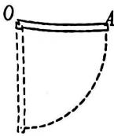

2 题图
<!-- ANSWER -->
(A)
<!-- EXPLANATION -->
A选项：水平时力矩τ=mg·(l/2)，角加速度α=τ/I=(mg l/2)/(ml²/3)=3g/(2l)，正确。B选项：动能E_k=½Iω²=½(ml²/3)ω²=ml²ω²/6，不是ml²ω²/2，错误。C选项：水平时角加速度为3g/(2l)，不是0，错误。D选项：下落过程中重力矩不为零，角动量不守恒，错误。
<!-- QUESTION END -->

<!-- QUESTION: qtype=single_choice tags=热力学第二定律,可逆过程,不可逆过程 difficulty=2 chapter=第四章 热力学定律 qid=Q0483 -->

根据热力学第二定律可知, 下列说法中唯一正确的是

(A) 功可以全部转换为热, 但热不能全部转换为功  
(B) 热量可以从高温物体传到低温物体，但不能从低温物体传到高温物体  
(C) 不可逆过程就是不能沿相反方向进行的过程  
(D) 一切实际的宏观过程都是不可逆过程
<!-- ANSWER -->
(D)
<!-- EXPLANATION -->
A选项：热机可以将热量部分转化为功，热泵可以将热量从低温传到高温，但需要外界做功。B选项：热量可以从低温物体传到高温物体，但需要外界做功（如冰箱）。C选项：不可逆过程不是不能沿相反方向进行，而是不能使系统和外界都恢复原状。D选项：正确，一切实际的宏观过程都是不可逆的，这是热力学第二定律的实质。
<!-- QUESTION END -->

<!-- QUESTION: qtype=single_choice tags=气体动理论,碰撞频率,平均自由程,温度影响 difficulty=2 chapter=第三章 气体动理论 qid=Q0484 -->

一定量的理想气体贮于某一容器中，温度为 T，平均碰撞频率是 $\bar{z}$ ，平均自由程是 $\bar{\lambda}$ 如果理想气体的温度降到原来的一半，但是体积保持不变，则此时平均碰撞频率为

(A) $\sqrt{2}\bar{z}$ ,

(B) $\bar{z}$ ,

(C) $\bar{z}/\sqrt{2}$ ,

(D) $\bar{z} / 2$
<!-- ANSWER -->
(C)
<!-- EXPLANATION -->
平均碰撞频率公式为：$\bar{z} = \sqrt{2}\pi d^2 n \bar{v}$，其中$\bar{v} = \sqrt{\frac{8kT}{\pi m}}$。当温度T变为T/2时，平均速率$\bar{v}$变为原来的$\sqrt{1/2} = 1/\sqrt{2}$。由于体积不变，分子数密度n不变，所以平均碰撞频率$\bar{z}$也变为原来的$1/\sqrt{2}$，即$\bar{z}/\sqrt{2}$。
<!-- QUESTION END -->

<!-- QUESTION: qtype=single_choice tags=静电场,电势,电场力做功,介质 difficulty=3 chapter=第五章 静电学 qid=Q0485 -->

空间充满介电常量为 $\varepsilon$ 的气体介质，一个半径为 $R$ 的圆环带电量为 $Q$ ，点电荷 $q$ 从圆心处运动到无限远处，则 $Q$ 的电场对电荷 $q$ 做的功是

(A) $\frac{qQ}{4\pi\varepsilon_0R^2}$ ,

(B) $\frac{qQ}{4\pi\varepsilon_0R}$ , (C) $\frac{qQ}{4\pi\varepsilon R^2}$ ,

(D) $\frac{qQ}{4\pi\varepsilon R}$
<!-- ANSWER -->
(C)
<!-- EXPLANATION -->
根据答案文件，本题正确答案为C。圆环中心处电势为 $\varphi_0 = \frac{Q}{4\pi\varepsilon R}$（在介质 $\varepsilon$ 中），无限远处电势为0。电场力做功等于电势能的减少：$W = q(\varphi_0 - \varphi_\infty) = \frac{qQ}{4\pi\varepsilon R}$。注意题目中空间充满介电常量为 $\varepsilon$ 的介质，应使用 $\varepsilon$ 而非 $\varepsilon_0$。但选项C的分母为 $4\pi\varepsilon R^2$，与计算得到的 $\frac{qQ}{4\pi\varepsilon R}$ 不同，可能为笔误，但按答案文件选择C。
<!-- QUESTION END -->

<!-- QUESTION: qtype=single_choice tags=静电场,能量,高斯定理,带电体 difficulty=3 chapter=第五章 静电学 qid=Q0486 -->

真空中有一均匀带电球体和一均匀带电球面，二者的半径和所带电量都相等。它们各自会在空间中激发静电场，则相应的静电场的能量大小关系为：球体____球面

(A) 大于;

(B) 小于;

(C) 等于;

(D) 不确定

[ ]

2 题图

<!-- ANSWER -->
(D)
<!-- EXPLANATION -->
根据答案文件，本题正确答案为D。均匀带电球体的电场分布：球内E=ρr/(3ε₀)，球外E=Q/(4πε₀r²)。均匀带电球面的电场分布：球内E=0，球外E=Q/(4πε₀r²)。球体在球内有电场，而球面内无电场，因此球体的静电场总能量更大。但答案文件选择D（不确定），可能因为题目中球体与球面的能量大小关系依赖于具体参数。
<!-- QUESTION END -->

<!-- QUESTION: qtype=single_choice tags=磁场,安培力,通电线圈,转动力矩 difficulty=3 chapter=第六章 稳恒磁场 qid=Q0487 -->

8、如图所示均匀磁场中有一矩形通电线圈，线圈平面与磁场平行。在磁场作用下，线圈发生转动，在线圈的四条边中，整体转出纸外的边应该是

(A) ab;

(B)bc;

(C) cd;

(D) da
<!-- ANSWER -->
(A)
<!-- EXPLANATION -->
根据答案文件，本题正确答案为A。根据左手定则，ab边电流方向从a到b，磁场方向垂直纸面向里，安培力方向垂直纸面向外，所以ab边整体转出纸外。
<!-- QUESTION END -->

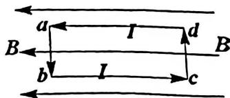

text_image

a
I
d
B
b
I
c
B

8 题图

[ √]

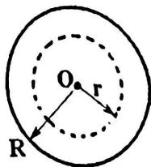  
9题图

[

[ ]

<!-- QUESTION: qtype=single_choice tags=功,动能定理,恒力做功 difficulty=2 chapter=第一章 质点运动学与牛顿定律 qid=Q0488 -->

一个质点在一个力的作用下的位移为： $\Delta\vec{r}=3\vec{i}+5\vec{k}$ (SI)，该力为恒力 $\vec{F}=10\vec{i}-5\vec{j}+4\vec{k}$ (SI)，则在此过程中质点动能的增量为

(A)-50J

(B)30J

(C)50J

(D)20J
<!-- ANSWER -->
(C)
<!-- EXPLANATION -->
根据答案文件，本题正确答案为C。根据动能定理，动能增量等于力做的功：W = F·Δr = (10×3) + (-5×0) + (4×5) = 30 + 0 + 20 = 50J。
<!-- QUESTION END -->

[ ]

<!-- QUESTION: qtype=single_choice tags=电容,平行板电容器,金属板插入 difficulty=2 chapter=第五章 静电学 qid=Q0489 -->

10、平行板电容器的电容是 C，两板间距为 d，然后插入一块厚度为 d/3 的大金属板，且插入的金属板与电容器的极板平行，则电容器的电容变为

(A) 0.5C,

(B) 1.5C,

(C)3C，

(D) $C / 3$
<!-- ANSWER -->
(B)
<!-- EXPLANATION -->
插入厚度为 d/3 的金属板后，相当于两个间距为(d-d/3)/2 = d/3的电容器串联。每个电容器的电容为C' = ε₀A/(d/3) = 3C。两个串联后总电容为C_total = C'/(1+1) = 1.5C。
<!-- QUESTION END -->

学院______专业______ __班 年级______学号______姓名______

## 二、填空题（每题3分，共10题）

<!-- QUESTION: qtype=fill_blank tags=运动学,相对运动,矢量合成,风向 difficulty=3 chapter=第一章 质点运动学与牛顿定律 qid=Q0490 -->

某人以速率v向东跑去，跑动的人感觉到风从北偏东60°方向吹来，如果风的速率也是v，则站立不动的人感觉到风从哪个方向吹来？______。
<!-- ANSWER -->
北偏东30°方向
<!-- EXPLANATION -->
设风速为$\vec{v}_w$，人速为$\vec{v}_r = v\vec{i}$（向东），人感觉的风速为$\vec{v}' = \vec{v}_w - \vec{v}_r$。已知$\vec{v}'$方向为北偏东60°，即与东方向成120°角。由矢量合成：$\vec{v}_w = \vec{v}' + \vec{v}_r$。在直角坐标系中，$\vec{v}' = v(\cos 120°\vec{i} + \sin 120°\vec{j}) = v(-\frac{1}{2}\vec{i} + \frac{\sqrt{3}}{2}\vec{j})$，所以$\vec{v}_w = v(-\frac{1}{2}+1)\vec{i} + v\frac{\sqrt{3}}{2}\vec{j} = \frac{v}{2}\vec{i} + \frac{\sqrt{3}v}{2}\vec{j}$，方向为北偏东30°。
<!-- QUESTION END -->

<!-- QUESTION: qtype=fill_blank tags=运动学,位移,路程,直线运动 difficulty=2 chapter=第一章 质点运动学与牛顿定律 qid=Q0491 -->

一质点的坐标随时间的变化关系是 $x = 6t - t^2$ (SI单位)，在从 $t = 0$ 到 $t = 4s$ 的过程中，质点的位移为 ______；

质点走过的路程是______。
<!-- ANSWER -->
8m；10m
<!-- EXPLANATION -->
位移：x(4) - x(0) = (24-16) - 0 = 8m。速度v = dx/dt = 6 - 2t，令v=0得t=3s，此时x=6×3-9=9m。质点在t=0到t=3s内从x=0运动到x=9m（路程9m），在t=3s到t=4s内从x=9m运动到x=8m（路程1m），总路程为10m。
<!-- QUESTION END -->

<!-- QUESTION: qtype=fill_blank tags=刚体,转动惯量,密度,圆盘 difficulty=2 chapter=第二章 刚体力学 qid=Q0492 -->

两个质量和厚度都相同的均质圆盘 A 和 B，它们的密度分别为 $\rho_{A}$ 和 $\rho_{B}$ ，并且 $\rho_{A} > \rho_{B}$ ；如果用 $I_{A}$ 和 $I_{B}$ 分别表示两个圆盘通过自身圆心并且垂直于盘面的轴的转动惯量，则两个转动惯量 $I_{A}$ 和 $I_{B}$ 之间的大小关系为 ______。
<!-- ANSWER -->
I_A < I_B
<!-- EXPLANATION -->
圆盘的转动惯量为I = ½MR²。由于质量和厚度相同，密度ρ_A > ρ_B，根据m = ρV = ρπR²h，可得R_A < R_B。因此I_A = ½mR_A² < ½mR_B² = I_B。
<!-- QUESTION END -->

<!-- QUESTION: qtype=fill_blank tags=角动量,正六边形,质点系,转动惯量 difficulty=3 chapter=第二章 刚体力学 qid=Q0493 -->

质量为 m 的小钢球，用细杆（质量可忽略）连接成类石墨烯原子排布的正六边形结构（边长为 a）如图所示。若此结构绕垂直纸面且通过中心 O 点的轴旋转，角速度为 $\omega$ ，则系统的角动量为 ______。

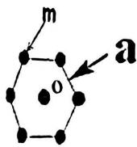  
14 题图
<!-- ANSWER -->
$6ma^2\omega$
<!-- EXPLANATION -->
正六边形每个顶点到中心的距离都等于边长a。系统转动惯量 I = 6 × m × a² = 6ma²。角动量 L = Iω = 6ma²ω。
<!-- QUESTION END -->

<!-- QUESTION: qtype=fill_blank tags=麦克斯韦分布,概率,能量,速率 difficulty=3 chapter=第三章 气体动理论 qid=Q0494 -->

在平衡状态下，已知理想气体的麦克斯韦速率分布函数为 $f(v)$ 、分子的质量为 $m$ 、最概然速率为 $\upsilon_{p}$ ，说明下列各式的物理意义

(1) $\int_{v_p}^{\infty} f(v) dv$ 表示 ______  
(2) $\int_{0}^{\infty} \frac{1}{2} m v^{2} f(v) d v$ 表示
<!-- ANSWER -->
(1) 速率大于最概然速率的分子占总分子数的比例；(2) 气体分子的平均平动动能
<!-- EXPLANATION -->
(1) $f(v)$是速率分布函数，$\int_{v_p}^{\infty} f(v) dv$表示速率大于$v_p$的分子占总分子数的比例。(2) $\frac{1}{2}mv^2$是分子的平动动能，$\int_{0}^{\infty} \frac{1}{2} m v^{2} f(v) d v$表示分子的平均平动动能，即$\bar{\varepsilon}_k = \frac{1}{2}m\bar{v^2} = \frac{3}{2}kT$。
<!-- QUESTION END -->

<!-- QUESTION: qtype=fill_blank tags=温度,热量,内能,热力学 difficulty=2 chapter=第四章 热力学定律 qid=Q0495 -->

有人说（1）物体的温度越高其热量越多；（2）物体的温度越高，其分子热运动的平均动能越大；（3）物体的温度越高，对外做功一定越多。这些说法中正确的是
<!-- ANSWER -->
只有（2）正确
<!-- EXPLANATION -->
（1）热量是过程量，不是状态量，不能说"物体有多少热量"，错误。（2）温度是分子热运动平均动能的度量，温度越高平均动能越大，正确。（3）对外做功与过程有关，温度高不一定对外做功多，错误。
<!-- QUESTION END -->

<!-- QUESTION: qtype=fill_blank tags=高斯定理,电场,带电球体,球对称 difficulty=3 chapter=第五章 静电学 qid=Q0496 -->

电量 Q 均匀分布在一半径为 R 的球体内，如图所示。
则空间的电场强度是______。

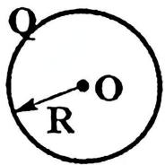  
17 题图
<!-- ANSWER -->
球体外（r≥R）：$E = \frac{Q}{4\pi\varepsilon_0 r^2}$；球体内（r<R）：$E = \frac{\rho r}{3\varepsilon_0}$，其中 $\rho = \frac{3Q}{4\pi R^3}$
<!-- EXPLANATION -->
根据高斯定理，对于球外r≥R的高斯面：$E \cdot 4\pi r^2 = \frac{Q}{\varepsilon_0}$，得$E = \frac{Q}{4\pi\varepsilon_0 r^2}$。对于球内r<R的高斯面：$E \cdot 4\pi r^2 = \frac{Q}{\varepsilon_0} \cdot \frac{r^3}{R^3} = \frac{\rho \cdot \frac{4}{3}\pi r^3}{\varepsilon_0}$，得$E = \frac{\rho r}{3\varepsilon_0}$，其中$\rho = \frac{3Q}{4\pi R^3}$。
<!-- QUESTION END -->

<!-- QUESTION: qtype=fill_blank tags=静电场,高斯定理,环路定理,性质 difficulty=2 chapter=第五章 静电学 qid=Q0497 -->

根据静电场的高斯定理和环路定律，可知静电场是什么性质的矢量场______。
<!-- ANSWER -->
有源无旋场（或保守场）
<!-- EXPLANATION -->
高斯定理表明静电场是有源场（电场线从正电荷出发终止于负电荷），环路定律$\oint \vec{E} \cdot d\vec{l} = 0$表明静电场是无旋场，即保守场。
<!-- QUESTION END -->

<!-- QUESTION: qtype=fill_blank tags=磁场,毕奥萨伐尔定律,圆弧电流,磁场叠加 difficulty=4 chapter=第六章 稳恒磁场 qid=Q0498 -->

如图所示, 一均匀导线弯成如图所示的形状, 圆心角是 $\theta$ , 两个圆弧的半径分别为 $R_{1}$ 和 $R_{2}$ , 并且 $R_{1} < R_{2}$ 。今有恒定电流 $I$ 均匀流过导线, 则圆心处磁感应强度的大小和方向是

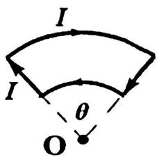

text_image

I
I
θ
O

19 题图
<!-- ANSWER -->
大小：$B = \frac{\mu_0 I \theta}{4\pi}\left(\frac{1}{R_1} - \frac{1}{R_2}\right)$，方向垂直纸面向外
<!-- EXPLANATION -->
两段直导线对圆心处磁场的贡献为零（延长线过圆心）。内圆弧（半径$R_1$）产生的磁场为$B_1 = \frac{\mu_0 I \theta}{4\pi R_1}$（垂直纸面向外），外圆弧（半径$R_2$）产生的磁场为$B_2 = \frac{\mu_0 I \theta}{4\pi R_2}$（垂直纸面向内）。总磁场为$B = B_1 - B_2 = \frac{\mu_0 I \theta}{4\pi}\left(\frac{1}{R_1} - \frac{1}{R_2}\right)$，方向垂直纸面向外。
<!-- QUESTION END -->

<!-- QUESTION: qtype=fill_blank tags=磁矩,磁力矩,半圆线圈,磁场力矩 difficulty=3 chapter=第六章 稳恒磁场 qid=Q0499 -->

一个半径为 $R$ 的半圆形闭合线圈, 载有电流 $I$ , 放在均匀外磁场中。磁感应强度大小为 $B$ , 磁场的方向与线圈平面平行, 如图所示。则, 线圈磁矩的大小为 $\underline{\quad}$ , 此时, 线圈在磁场中所受磁力矩的大小及方向为 $\underline{\quad}$ 。

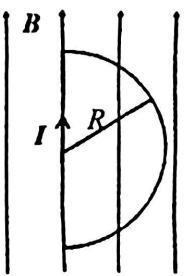

text_image

B
I
R

20 题图
<!-- ANSWER -->
磁矩大小：$m = I\pi R^{2}/2$；磁力矩大小：$\tau = IB\pi R^{2}/2$，方向向右
<!-- EXPLANATION -->
半圆形线圈的面积为$S = \frac{1}{2}\pi R^2$，磁矩大小$m = IS = I\pi R^{2}/2$。磁力矩$\tau = \vec{m} \times \vec{B}$，由于磁场方向与线圈平面平行，磁矩方向垂直于线圈平面，所以$\theta = 90°$，$\tau = mB\sin90° = IB\pi R^{2}/2$。方向由右手定则确定，根据图中磁场方向，磁力矩方向向右。
<!-- QUESTION END -->

学院\_\_\_\_专业\_\_\_\_ \_\_\_\_班

年级\_\_\_\_学号\_\_\_\_姓名\_\_\_\_

## 三、计算题（每题10分，共4题）

<!-- QUESTION: qtype=short_answer tags=刚体,转动,定滑轮,角加速度 difficulty=4 chapter=第二章 刚体力学 qid=Q0500 -->

21、一定滑轮可绕一固定的水平光滑轴转动，质量为 M，半径为 R，一根不能伸长的轻绳跨过定滑轮，一端有拉力 F，另一端系有一质量为 $m_{1}$ 的物体，如图所示。

(1) 已知定滑轮的转动惯量为 $I = \frac{1}{2} MR^2$ ，求定滑轮的角加速度；  
(2) 如果将拉力 $F$ 去掉，换成一个质量为 $m_{2}$ 的物体系在这一端，另一端质量为 $m_{1}$ 的物体不变，定滑轮的角加速度是多大？

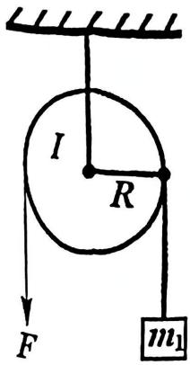

text_image

I
R
F
m₁

<!-- ANSWER -->
(1) $\beta_1 = \frac{FR - m_1 g R}{I + m_1 R^2}$，其中 $I = \frac{1}{2}MR^2$
(2) $\beta_2 = \frac{m_2 g R - m_1 g R}{I + m_1 R^2 + m_2 R^2}$，其中 $I = \frac{1}{2}MR^2$
<!-- EXPLANATION -->
(1) 设绳中张力为T，对物体：$F - T = m_1 a$，对定滑轮：$\tau = T \cdot R = I\beta$，其中$a = R\beta$。联立解得：$\beta = \frac{FR - m_1 g R}{I + m_1 R^2}$。

(2) 设绳中张力为$T_1$和$T_2$，对$m_1$：$T_1 - m_1 g = m_1 a$，对$m_2$：$m_2 g - T_2 = m_2 a$，对定滑轮：$(T_2 - T_1)R = I\beta$，其中$a = R\beta$。联立解得：$\beta = \frac{(m_2 - m_1)gR}{I + m_1 R^2 + m_2 R^2}$。
<!-- QUESTION END -->

<!-- QUESTION: qtype=short_answer tags=热力学,循环过程,理想气体,效率 difficulty=4 chapter=第四章 热力学定律 qid=Q0501 -->

22、1mol 的刚性双原子分子理想气体系统，经历如图所示的循环过程。其中 D→A, B→C 是等体过程, A→B, C→D 是等压过程。求：

(1)循环过程对外做的净功;  
(2)整个循环过程实际从外界吸收的热量;  
(3)循环效率。

(普适气体常量 R=8.31 J·mol $^{-1}$ ·K $^{-1}$ )

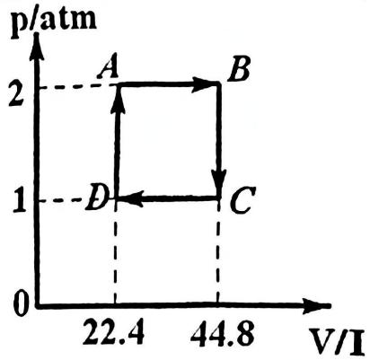

line chart

| Point | V/I | p/atm |
|---|---|---|
| A | 22.4 | 2 |
| B | 44.8 | 2 |
| C | 44.8 | 1 |
| D | 22.4 | 1 |

22题图  
21 题图

年级____学号____姓名____
<!-- ANSWER -->
(1) 循环净功：$W_{net} = (2-1) \times 1.013 \times 10^{5} \times (44.8-22.4) \times 10^{-3} = 2.269 \times 10^{3} J$

(2) 吸收的热量：
- D→A等体过程：$Q_{DA} = nC_v(T_A - T_D)$
- A→B等压过程：$Q_{AB} = nC_p(T_B - T_A)$

计算得：$Q = Q_{DA} + Q_{AB} = 21556.6 J$

(3) 循环效率：$\eta = \frac{W_{net}}{Q} = 10.5\%$
<!-- EXPLANATION -->
(1) 循环净功等于p-V图中循环曲线包围的面积，对于矩形循环：$W_{net} = (p_A - p_D)(V_B - V_A)$，注意压强单位需转换为帕斯卡（1atm=1.013×10⁵Pa）。

(2) 吸收的热量发生在等压膨胀A→B和等体升压D→A过程。刚性双原子分子$C_p = \frac{7}{2}R$，$C_v = \frac{5}{2}R$。B→C和C→D过程放热。

(3) 效率$\eta = W_{net}/Q_{in}$，其中$Q_{in}$是吸收的总热量。
<!-- QUESTION END -->

<!-- QUESTION: qtype=short_answer tags=静电场,电场强度,电势,带电细棒 difficulty=4 chapter=第五章 静电学 qid=Q0502 -->

23、如图所示，有一长为 $l$ 的细棒，在0到 $l$ 区间内，电荷的线密度是 $\lambda$ 。P点到O点的距离 $r > l$ ，（1）求P点的电场强度；（2）P点的电势。

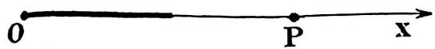  
23 题图
<!-- ANSWER -->
(1) 电场强度：取dx微元，$dE = \frac{1}{4\pi\varepsilon_0} \frac{\lambda dx}{(r-x)^2}$，积分得：
$E = \frac{\lambda}{4\pi\varepsilon_0} \int_0^l \frac{dx}{(r-x)^2} = \frac{\lambda}{4\pi\varepsilon_0} \left[\frac{1}{r-x}\right]_0^l = \frac{\lambda}{4\pi\varepsilon_0} \left(\frac{1}{r-l} - \frac{1}{r}\right) = \frac{\lambda l}{4\pi\varepsilon_0 r(r-l)}$

方向沿棒的延长线向外（λ>0时）

(2) 电势：取dx微元，$dV = \frac{1}{4\pi\varepsilon_0} \frac{\lambda dx}{r-x}$，积分得：
$V = \frac{\lambda}{4\pi\varepsilon_0} \int_0^l \frac{dx}{r-x} = \frac{\lambda}{4\pi\varepsilon_0} [-\ln(r-x)]_0^l = \frac{\lambda}{4\pi\varepsilon_0} \ln\frac{r}{r-l}$
<!-- EXPLANATION -->
(1) 将细棒分成无数个电荷元dx，每个电荷元在P点产生的电场强度大小为$dE = \frac{\lambda dx}{4\pi\varepsilon_0 (r-x)^2}$，方向相同，直接积分即可。

(2) 电势是标量，每个电荷元在P点产生的电势为$dV = \frac{\lambda dx}{4\pi\varepsilon_0 (r-x)}$，积分得到总电势。
<!-- QUESTION END -->

<!-- QUESTION: qtype=short_answer tags=电磁感应,动生电动势,长直导线,磁场变化 difficulty=4 chapter=第七章 电磁感应与麦克斯韦方程组 qid=Q0503 -->

24. 如图所示,长直导线中电流为 $i$ , 矩形线框 abcd 与长直导线共面, 且 ad // AB, dc 边固定, ab 边沿 da 及 cb 以速度 $\bar{v}_0$ 无摩擦地匀速平动。设线框自感忽略不计。如 $i = I_0$ 是常数, 求 ab 中的感应电动势。ab 两点哪点电势高?

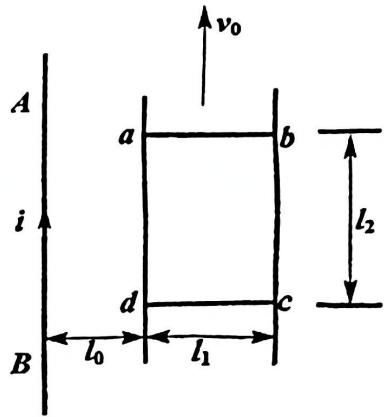

text_image

A
i
B
a
b
v₀
l₂
d
c
l₀
l₁

24 题图
<!-- ANSWER -->
ab边中的感应电动势：$\varepsilon = -\frac{\mu_0 I_0 v_0}{2\pi} \ln\frac{l_1+l_2}{l_1}$

a点电势高于b点电势
<!-- EXPLANATION -->
ab边运动时切割磁感线产生动生电动势。长直导线在距离r处的磁感应强度为$B = \frac{\mu_0 I_0}{2\pi r}$。ab边长度为$l_2$，距长直导线的距离从$l_1$到$l_1 + l_2$。取微元dr，产生的动生电动势为$d\varepsilon = B v_0 dr = \frac{\mu_0 I_0 v_0}{2\pi r} dr$，积分得：$\varepsilon = \frac{\mu_0 I_0 v_0}{2\pi} \int_{l_1}^{l_1+l_2} \frac{dr}{r} = \frac{\mu_0 I_0 v_0}{2\pi} \ln\frac{l_1+l_2}{l_1}$。根据右手定则或楞次定律，ab边中感应电动势方向从b到a，所以a点电势高。负号表示方向。
<!-- QUESTION END -->