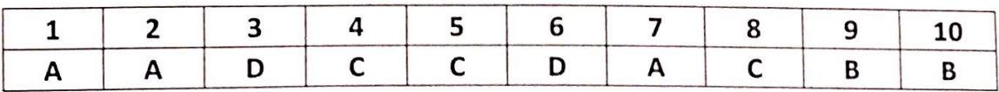
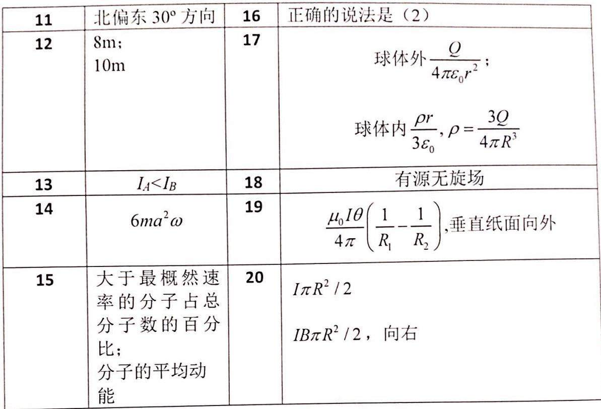

<!-- QUESTION: qtype=single_choice tags=大学物理,期末考试,选择题,答案汇总 difficulty=2 chapter=第一章 质点运动学与牛顿定律 qid=Q0504 -->

选择题（题目内容见原试卷，答案见下表）

<!-- ANSWER -->
1. A
2. A
3. D
4. C
5. C
6. D
7. A
8. C
9. B
10. B
<!-- EXPLANATION -->
选择题答案汇总
<!-- QUESTION END -->

<!-- QUESTION: qtype=fill_blank tags=大学物理,期末考试 difficulty=1 chapter=第一章 质点运动学与牛顿定律 qid=Q0505 -->

填空题（题目内容见原试卷，答案见下表）

<!-- ANSWER -->
11. 北偏东30°方向
12. 8m;10m
13. $I_A$
14. $6ma^{2}\omega$
15. 大于最概然速率的分子占总分子数的百分比;分子的平均动能
16. 正确的说法是(2)
17. 球体外 $\frac{Q}{4\pi\varepsilon_{0}r^{2}}$ ;球体内 $\frac{\rho r}{3\varepsilon_{0}},\rho=\frac{3Q}{4\pi R^{3}}$
18. 有源无旋场
19. $\frac{\mu_{0}I\theta}{4\pi}\left(\frac{1}{R_{1}}-\frac{1}{R_{2}}\right)$ ,垂直纸面向外
20. $I\pi R^{2}/2$  $IB\pi R^{2}/2$ ,向右
<!-- EXPLANATION -->
填空题答案汇总
<!-- QUESTION END -->

<!-- QUESTION: qtype=short_answer tags=刚体转动,角加速度,转动定律 difficulty=3 chapter=第二章 刚体力学 qid=Q0506 -->

一刚体系统，由定滑轮和悬挂物体组成，已知滑轮转动惯量 $I$、半径 $R$，悬挂物质量 $m_1$，作用力 $F$，求角加速度 $\beta_1$；若将力 $F$ 改为悬挂质量 $m_2$，求角加速度 $\beta_2$。
<!-- ANSWER -->
(1) $\beta_{1} = \frac{FR - m_{1}gR}{I + m_{1}R^{2}}$
(2) $\beta_{2} = \frac{m_{2}gR - m_{1}gR}{I + m_{1}R^{2} + m_{1}R^{2}}$
<!-- EXPLANATION -->
这是关于刚体转动角加速度的计算，应用转动定律 $M = I\beta$ 求解。
<!-- QUESTION END -->

<!-- QUESTION: qtype=short_answer tags=热力学,循环过程,功,热量,效率 difficulty=4 chapter=第四章 热力学定律 qid=Q0507 -->

1mol 理想气体经历如图所示的循环过程，求：(1) 循环过程对外做的净功；(2) 循环过程中吸收的热量；(3) 循环效率。
<!-- ANSWER -->
(1) $W_{net} = (2 - 1) \times 1.013 \times 10^{5} \times (44.8 - 22.4) \times 10^{-3} = 2.269 \times 10^{3} \mathrm{J}$
(2) $Q = Q_{DA} + Q_{AB} = 21556.6 \mathrm{J}$
(3) $\eta = \frac{W_{net}}{Q} = 10.5\%$
<!-- EXPLANATION -->
这是热力学循环过程的计算，需要计算净功、吸收的热量和热机效率。净功通过 p-V 图面积计算，热量通过各过程的热量之和计算，效率为净功与吸热之比。
<!-- QUESTION END -->

<!-- QUESTION: qtype=short_answer tags=静电学,电场强度,电势,积分计算 difficulty=4 chapter=第五章 静电学 qid=Q0508 -->

一带电直线段，长度为 $l$，线电荷密度为 $\lambda$，位于 $x$ 轴上从 $x=0$ 到 $x=l$ 处。求距离直线段为 $r$ 处（$r>l$）的电场强度和电势。
<!-- ANSWER -->
(1) $\displaystyle E=\int_{0}^{l}\frac{\lambda dx}{4\pi\varepsilon_{0}(r-x)^{2}}=\frac{\lambda}{4\pi\varepsilon_{0}}\left(\frac{1}{r-l}-\frac{1}{r}\right)$
(2) $\displaystyle \varphi = \int_{0}^{l}\frac{\lambda dx}{4\pi\varepsilon_{0}(r - x)} = \frac{\lambda}{4\pi\varepsilon_{0}}\ln \frac{r}{r - l}$
<!-- EXPLANATION -->
这是静电学中计算带电直线产生的电场和电势的问题。电场强度通过积分带电元产生的电场计算，电势通过积分带电元产生的电势计算。
<!-- QUESTION END -->

<!-- QUESTION: qtype=short_answer tags=电磁感应,感应电动势,动生电动势 difficulty=4 chapter=第七章 电磁感应与麦克斯韦方程组 qid=Q0509 -->

一导体棒在磁场中运动，已知相关参数，求感应电动势，并判断 a、b 两点电势高低。
<!-- ANSWER -->
$\varepsilon = -\frac{\mu_{0} z_{0}}{2\pi}\ln\frac{l_{0}+l_{1}}{l_{0}}$
a 点电势高
<!-- EXPLANATION -->
这是电磁感应问题，需要计算导体棒在磁场中运动时产生的感应电动势。根据法拉第电磁感应定律，感应电动势等于磁通量的变化率。通过积分计算磁通量的变化，可以得到上述结果。电势高低的判断依据右手定则或楞次定律。
<!-- QUESTION END -->