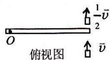
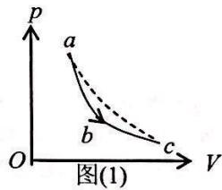
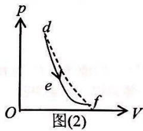
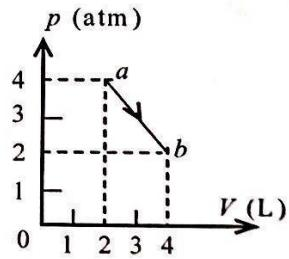
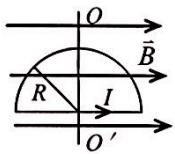
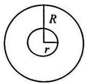
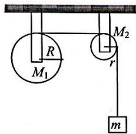
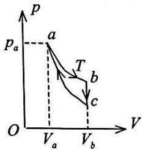
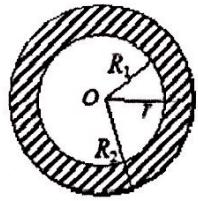
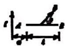

一、选择题 (共 30 分，每小题 3 分)

<!-- QUESTION: qtype=single_choice tags=运动学方程,加速度,直线运动 difficulty=2 chapter=第一章 质点运动学与牛顿定律 qid=Q0534 -->
某质点作直线运动的运动学方程为 $x = 3t - 5t^{3} + 6$ (SI), 则该质点作: [ ]

(A) 匀加速直线运动，加速度沿 x 轴正方向.  
(B) 匀加速直线运动，加速度沿 x 轴负方向.  
(C) 变加速直线运动，加速度沿 x 轴正方向.  
(D)变加速直线运动，加速度沿x轴负方向.

<!-- ANSWER -->
(D)变加速直线运动，加速度沿x轴负方向.
<!-- EXPLANATION -->
由运动学方程 $x = 3t - 5t^{3} + 6$ 可求得速度 $v = \frac{dx}{dt} = 3 - 15t^{2}$，加速度 $a = \frac{dv}{dt} = -30t$。加速度随时间变化，故为变加速直线运动，且加速度方向沿x轴负方向。
<!-- QUESTION END -->

<!-- QUESTION: qtype=single_choice tags=牛顿定律,动量定理,变力冲量 difficulty=3 chapter=第一章 质点运动学与牛顿定律 qid=Q0535 -->
一质点在力 $F = 5m(5 - 2t)$ (SI) 的作用下， $t = 0$ 时从静止开始作直线运动，式中 $m$ 为质点的质量， $t$ 为时间，则当 $t = 5 \, \text{s}$ 时，质点的速率为：[ ]

(A) $50 \, m \cdot s^{-1}$ .

(B) $25 \, m \cdot s^{-1}$ .

(C) 0.

(D) $-50\ m\cdot s^{-1}$

<!-- ANSWER -->
(C) 0.
<!-- EXPLANATION -->
根据动量定理，$\int_{0}^{t} F \, dt = m v - m v_0$。代入 $F = 5m(5 - 2t)$，$v_0=0$，得 $m v = \int_{0}^{5} 5m(5 - 2t) \, dt = 5m [5t - t^2]_0^5 = 5m(25 - 25) = 0$，因此 $v=0$。
<!-- QUESTION END -->

<!-- QUESTION: qtype=single_choice tags=转动惯量,质量分布,刚体转动 difficulty=2 chapter=第二章 刚体力学 qid=Q0536 -->
有两个半径相同, 质量相等的细圆环 $A$ 和 $B$ . $A$ 环的质量分布均匀, $B$ 环的质量分布不均匀. 它们对通过环心并与环面垂直的轴的转动惯量分别为 $J_{A}$ 和 $J_{B}$ , 则 [ ]

(A) $J_{A}>J_{B}.$

(B) $J_{A}<J_{B}.$

(C) $J_{A}=J_{B}.$

(D) 不能确定 $J_{A}$ 、 $J_{B}$ 哪个大.

<!-- ANSWER -->
(C) $J_{A}=J_{B}.$
<!-- EXPLANATION -->
对于细圆环，所有质点到轴的距离都等于半径 $R$，因此转动惯量 $J = \sum m_i R^2 = M R^2$，与质量分布无关。故两环转动惯量相等。
<!-- QUESTION END -->

<!-- QUESTION: qtype=single_choice tags=角动量守恒,刚体转动,碰撞问题 difficulty=3 chapter=第二章 刚体力学 qid=Q0537 -->
如图所示，一静止的均匀细棒，长为 $L$ 、质量为 $M$ ，可绕通过棒的端点且垂直于棒长的光滑固定轴 $O$ 在水平面内转动，转动惯量为 $\frac{1}{3} ML^2$ 。一质量为 $m$ 、速率为 $\nu$ 的子弹在水平面内沿与棒垂直的方向射出并穿出棒的自由端，设穿过棒后子弹的速率为 $\frac{1}{2}\nu$ ，则此时棒的角速度应为 [ ]

(A) $\frac{mv}{ML}$ .

(B) $\frac{3mv}{2ML}$ .

(C) $\frac{5mv}{3ML}$ .

(D) $\frac{7mv}{4ML}$ .

<!-- ANSWER -->
(B) $\frac{3mv}{2ML}$ .
<!-- EXPLANATION -->
系统对O轴角动量守恒：初始角动量 $L_0 = m v L$；末角动量 $L_f = m (\frac{v}{2}) L + \frac{1}{3} M L^2 \omega$。由 $L_0 = L_f$ 得 $m v L = \frac{1}{2} m v L + \frac{1}{3} M L^2 \omega$，解得 $\omega = \frac{3mv}{2ML}$。
<!-- QUESTION END -->

<!-- QUESTION: qtype=single_choice tags=转动动能定理,角动能,转动惯量 difficulty=2 chapter=第二章 刚体力学 qid=Q0538 -->
一个圆盘在水平面内绕一竖直固定轴转动的转动惯量为 J，初始角速度为 $\omega_{0}$ ，后来变为 $\frac{1}{2}\omega_{0}$ 。在上述过程中，阻力矩所作的功为：[ ]

(A) $\frac{1}{4}J\omega_{0}^{2}$ .

(B) $-\frac{1}{8} J\omega_0^2$

(C) $-\frac{1}{4} J\omega_0^2$

(D) $-\frac{3}{8} J \omega_{0}^{2}$ .

<!-- ANSWER -->
(D) $-\frac{3}{8} J \omega_{0}^{2}$ .
<!-- EXPLANATION -->
根据转动动能定理，阻力矩做的功等于动能的变化量：$W = \Delta E_k = \frac{1}{2} J (\frac{\omega_0}{2})^2 - \frac{1}{2} J \omega_0^2 = \frac{1}{8} J \omega_0^2 - \frac{1}{2} J \omega_0^2 = -\frac{3}{8} J \omega_0^2$。
<!-- QUESTION END -->

<!-- QUESTION: qtype=single_choice tags=理想气体压强,方均根速率,分子数密度 difficulty=2 chapter=第三章 气体动理论 qid=Q0539 -->
三个容器 $A$ 、 $B$ 、 $C$ 中装有同种理想气体，其分子数密度 $n$ 相同，而方均根速率之比为 $\left(\overline{v_A^2}\right)^{1/2} : \left(\overline{v_B^2}\right)^{1/2} : \left(\overline{v_C^2}\right)^{1/2} = 1:2:4$ ，则其压强之比 $p_A : p_B : p_C$ 为：[ ]

(A) 1:2:4.

(B) 1:4:8.

(C) 1:4:16.

(D) 4:2:1.

<!-- ANSWER -->
(C) 1:4:16.
<!-- EXPLANATION -->
根据理想气体压强公式 $p = \frac{1}{3} n m \overline{v^2}$，其中 $n$ 相同，$m$ 相同，因此 $p \propto \overline{v^2}$。方均根速率之比为 $1:2:4$，则平方之比为 $1:4:16$，故压强之比也为 $1:4:16$。
<!-- QUESTION END -->

<!-- QUESTION: qtype=single_choice tags=速率分布函数,平均速率,统计物理 difficulty=2 chapter=第三章 气体动理论 qid=Q0540 -->
已知分子总数为 $N$ , 它们的速率分布函数为 $f(v)$ , 则速率分布在 $v_{1} \sim v_{2}$ 区间内的分子的平均速率为

(A) $\int_{v_{1}}^{v_{2}}vf(v)\mathrm{d}v$ .

(B) $\int_{v_1}^{v_2} v f(v) \, \mathrm{d}v / \int_{v_1}^{v_2} f(v) \, \mathrm{d}v$ .

[ ]

(C) $\int_{v_{1}}^{v_{2}} N v f(v) \, d v$ .

(D) $\int_{v_{1}}^{v_{2}}\mathrm{v}f(\mathrm{v})\mathrm{d}\mathrm{v}/N.$

<!-- ANSWER -->
(B) $\int_{v_1}^{v_2} v f(v) \, \mathrm{d}v / \int_{v_1}^{v_2} f(v) \, \mathrm{d}v$ .
<!-- EXPLANATION -->
速率分布函数 $f(v)$ 满足归一化条件 $\int_0^\infty f(v) \, dv = 1$。在 $v_1 \sim v_2$ 区间内，平均速率 $\bar{v} = \frac{\int_{v_1}^{v_2} v f(v) \, dv}{\int_{v_1}^{v_2} f(v) \, dv}$，即选项(B)。
<!-- QUESTION END -->

<!-- QUESTION: qtype=single_choice tags=热力学第一定律,等温过程,绝热过程,吸放热判断 difficulty=3 chapter=第四章 热力学定律 qid=Q0541 -->
一定量的理想气体，分别经历如图(1)所示的 $abc$ 过程(图中虚线 $ac$ 为等温线)，和图(2)所示的 $def$ 过程(图中虚线 $df$ 为绝热线). 判断这两种过程是吸热还是放热. [ ]

(A) abc 过程吸热，def 过程放热.  
(B) abc 过程放热，def 过程吸热.  
(C) abc 过程和 def 过程都吸热.

(D) abc 过程和 def 过程都放热.

text_image

p
a
b
c
O
V
图(1)

text_image

p
d
e
f
O
V
图(2)

<!-- ANSWER -->
(C) abc 过程和 def 过程都吸热.
<!-- EXPLANATION -->
对于abc过程，ac为等温线，a和c温度相同，内能变化为零。从a到c体积增大，气体对外做功为正。b点在ac线上方，温度更高，内能增加。综合分析abc过程，气体体积增大做正功，温度升高内能增加，由热力学第一定律Q=ΔU+W，故吸热。对于def过程，df为绝热线，d和f温度相同。e点在df线上方，温度更高，内能增加，体积增大做正功，故也吸热。
<!-- QUESTION END -->

<!-- QUESTION: qtype=single_choice tags=热力学第一定律,直线过程,内能变化,功的计算 difficulty=3 chapter=第四章 热力学定律 qid=Q0542 -->
如图所示, 一定量的理想气体, 沿着图中直线从状态 $a$ (压强 $p_{1} = 4 \mathrm{atm}$ , 体积 $V_{1} = 2 \mathrm{~L}$ ) 变到状态 $b$ (压强 $p_{2} = 2 \mathrm{atm}$ , 体积 $V_{2} = 4 \mathrm{~L}$ ). 则在此过程中: [ ]

(A) 气体对外作正功，向外界放出热量.  
(B) 气体对外作正功，从外界吸热.  
(C) 气体对外作负功，向外界放出热量.  
(D) 气体对外作正功，内能减少.

line chart

| Point | V (L) | p (atm) |
|---|---|---|
| a | 2 | 4 |
| b | 4 | 2 |

<!-- ANSWER -->
(B) 气体对外作正功，从外界吸热.
<!-- EXPLANATION -->
从状态a到b，体积增大，气体对外做正功。由理想气体状态方程pV=nRT，pV乘积从8 atm·L变为8 atm·L，温度不变，内能变化ΔU=0。根据热力学第一定律Q=ΔU+W，由于W>0，所以Q>0，气体从外界吸热。
<!-- QUESTION END -->

<!-- QUESTION: qtype=single_choice tags=静电学,导体球壳,电势计算,静电平衡 difficulty=4 chapter=第五章 静电学 qid=Q0543 -->
一空心导体球壳，其内、外半径分别为 $R_{1}$ 和 $R_{2}$ ，带电荷 $q$ ，如图所示。当球壳中心处再放一电荷为 $q$ 的点电荷时，则导体球壳的电势(设无穷远处为电势零点)为 [ ]

(A) $\frac{q}{4\pi\varepsilon_{0}R_{1}}$

(B) $\frac{q}{4\pi\varepsilon_0R_2}$

(C) $\frac{q}{2\pi\varepsilon_{0}R_{1}}$

(D) $\frac{q}{2\pi\varepsilon_0R_2}$ .

<!-- ANSWER -->
(D) $\frac{q}{2\pi\varepsilon_0R_2}$ .
<!-- EXPLANATION -->
导体球壳在静电平衡时是等势体。球壳中心放置点电荷+q后，球壳内表面会感应出-q电荷，外表面会感应出+q电荷。球壳原来带电q，所以外表面总电荷为q+q=2q。球壳的电势等于外表面电荷在球壳处产生的电势，即$V = \frac{2q}{4\pi\varepsilon_0 R_2} = \frac{q}{2\pi\varepsilon_0 R_2}$。
<!-- QUESTION END -->

二、填空题 (共 30 分, 每小题 3 分)

<!-- QUESTION: qtype=fill_blank tags=圆周运动,速度,加速度,运动学方程 difficulty=2 chapter=第一章 质点运动学与牛顿定律 qid=Q0544 -->
在一个转动的齿轮上, 一个齿尖 $P$ 沿半径为 $R$ 的圆周运动, 其路程 $S$ 随时间的变化规律为 $S = v_{0}t + \frac{1}{2} bt^{2}$ , 其中 $v_{0}$ 和 $b$ 都是正的常量. 则 $t$ 时刻齿尖 $P$ 的速度大小为 \_\_\_\_, 加速度大小为 \_\_\_\_.

<!-- ANSWER -->
$v_0 + bt$, $\sqrt{b^2 + (v_0 + bt)^4/R^2}$
<!-- EXPLANATION -->
速度大小$v = \frac{dS}{dt} = v_0 + bt$。切向加速度$a_t = \frac{dv}{dt} = b$，法向加速度$a_n = \frac{v^2}{R} = \frac{(v_0 + bt)^2}{R}$，总加速度$a = \sqrt{a_t^2 + a_n^2} = \sqrt{b^2 + \frac{(v_0 + bt)^4}{R^2}}$。
<!-- QUESTION END -->

<!-- QUESTION: qtype=fill_blank tags=牛顿第二定律,变力,动量定理 difficulty=2 chapter=第一章 质点运动学与牛顿定律 qid=Q0545 -->
一物体质量 $M = 2 \mathrm{~kg}$ , 在合外力 $F = (3 + 2 t) \vec{i}$ (SI) 的作用下, 从静止开始运动, 式中 $\vec{i}$ 为方向一定的单位矢量, 则当 $t = 1 \mathrm{~s}$ 时物体的速度 $\vec{v}_{1} =$ \_\_\_\_.

<!-- ANSWER -->
$2\vec{i} \, \mathrm{m/s}$
<!-- EXPLANATION -->
根据动量定理：$\int_{0}^{t} F \, dt = M v - 0$，即 $2v = \int_{0}^{1} (3 + 2t) \, dt = [3t + t^2]_0^1 = 4$，故 $v = 2 \, \mathrm{m/s}$。$\vec{v}_1 = 2\vec{i} \, \mathrm{m/s}$。
<!-- QUESTION END -->

<!-- QUESTION: qtype=fill_blank tags=角加速度,角速度,匀变速转动,角位移 difficulty=2 chapter=第二章 刚体力学 qid=Q0546 -->
绕定轴转动的飞轮均匀地减速，t=0 时角速度为 $\omega_{0}=5\ rad/s$ ，t=20 s 时角速度为 $\omega=0.8\omega_{0}$ ，则飞轮的角加速度 $\beta=$ \_\_\_\_，t=0 到 t=100 s 时间内飞轮所转过的角度 $\theta=$ \_\_\_\_.

<!-- ANSWER -->
$-0.05 \, \mathrm{rad/s^2}$，$250 \, \mathrm{rad}$
<!-- EXPLANATION -->
角加速度 $\beta = \frac{\omega - \omega_0}{t} = \frac{0.8 \times 5 - 5}{20} = \frac{4 - 5}{20} = -0.05 \, \mathrm{rad/s^2}$。停止时间 $t_{stop} = \frac{\omega_0}{|\beta|} = \frac{5}{0.05} = 100 \, \mathrm{s}$，正好在100秒时停止。角位移 $\theta = \omega_0 t + \frac{1}{2} \beta t^2 = 5 \times 100 + \frac{1}{2} \times (-0.05) \times 100^2 = 500 - 250 = 250 \, \mathrm{rad}$，或 $\theta = \frac{\omega_0^2}{2|\beta|} = \frac{25}{0.1} = 250 \, \mathrm{rad}$。
<!-- QUESTION END -->

<!-- QUESTION: qtype=fill_blank tags=等压过程,热量,理想气体,比热容 difficulty=3 chapter=第四章 热力学定律 qid=Q0547 -->
刚性双原子分子的理想气体在等压下膨胀所作的功为 $W$ , 则传递给气体的热量为 \_\_\_\_.

<!-- ANSWER -->
$\frac{7}{2}W$
<!-- EXPLANATION -->
刚性双原子分子的定压摩尔热容 $C_p = \frac{7}{2}R$。等压过程中，功 $W = p\Delta V = nR\Delta T$，热量 $Q_p = nC_p\Delta T = n \cdot \frac{7}{2}R \cdot \Delta T = \frac{7}{2}W$。
<!-- QUESTION END -->

<!-- QUESTION: qtype=fill_blank tags=卡诺热机,热机效率,高温热源,低温热源 difficulty=3 chapter=第四章 热力学定律 qid=Q0548 -->
一热机从温度为 $727^{\circ} \mathrm{C}$ 的高温热源吸热, 向温度为 $527^{\circ} \mathrm{C}$ 的低温热源放热. 若热机在最大效率下工作, 且每一循环吸热 $2000 \mathrm{~J}$ , 则此热机每一循环作功\_\_\_\_ J.

<!-- ANSWER -->
$400 \, \mathrm{J}$
<!-- EXPLANATION -->
最大效率对应卡诺热机效率：$\eta = 1 - \frac{T_2}{T_1} = 1 - \frac{527+273}{727+273} = 1 - \frac{800}{1000} = 0.2$。作功 $W = \eta Q_1 = 0.2 \times 2000 = 400 \, \mathrm{J}$。
<!-- QUESTION END -->

<!-- QUESTION: qtype=fill_blank tags=绝热过程,温度变化,压强变化,绝热指数 difficulty=3 chapter=第四章 热力学定律 qid=Q0549 -->
给定的理想气体(比热容比 $\gamma$ 为已知)，从标准状态 $(p_{0} 、 V_{0} 、 T_{0})$ 开始，作绝热膨胀，体积增大到三倍，膨胀后的温度 T= \_\_\_\_ ，压强 p= \_\_\_\_.

<!-- ANSWER -->
$T_0 / 3^{\gamma - 1}$，$p_0 / 3^{\gamma}$
<!-- EXPLANATION -->
绝热过程满足 $TV^{\gamma-1} = \text{常量}$ 和 $pV^{\gamma} = \text{常量}$。体积增大到三倍：$V = 3V_0$，则 $T = T_0 (V_0/V)^{\gamma-1} = T_0 / 3^{\gamma-1}$，$p = p_0 (V_0/V)^{\gamma} = p_0 / 3^{\gamma}$。
<!-- QUESTION END -->

<!-- QUESTION: qtype=fill_blank tags=磁场高斯定理,磁通量,无源场 difficulty=2 chapter=第六章 稳恒磁场 qid=Q0550 -->
电场是有源场，而磁场是无源场（或涡旋场），磁场中高斯定理的数学表达式是

\_\_\_\_，该式的物理意义是\_\_\_\_。

<!-- ANSWER -->
$\oint_S \vec{B} \cdot d\vec{A} = 0$，穿过任意闭合曲面的磁通量为零，表明磁场是无源场，不存在磁单极子。
<!-- EXPLANATION -->
磁场高斯定理 $\oint_S \vec{B} \cdot d\vec{A} = 0$ 表明通过任意闭合曲面的磁通量为零，说明磁场线是闭合的，没有起点和终点，即磁场是无源场，不存在磁单极子。
<!-- QUESTION END -->

<!-- QUESTION: qtype=fill_blank tags=导体球壳,静电感应,接地,电荷分布 difficulty=4 chapter=第五章 静电学 qid=Q0551 -->
在一个不带电的导体球壳内，先放进一电荷为+q 的点电荷，点电荷不与球壳内壁接触。然后使该球壳与地接触一下，再将点电荷+q 取走。此时，球壳的电荷为\_\_\_\_，电场分布的范围是\_\_\_\_。

<!-- ANSWER -->
$-q$，球壳外部
<!-- EXPLANATION -->
放入+q后，球壳内壁感应出-q，外壁感应出+q。球壳接地后，外壁的+q被导入大地，球壳仅剩内壁的-q。取走+q后，球壳带电-q。由于球壳带电，电荷分布在外表面，电场分布于球壳外部（$r > R_2$）。
<!-- QUESTION END -->

<!-- QUESTION: qtype=fill_blank tags=磁力矩,磁矩,均匀磁场,线圈转动 difficulty=3 chapter=第六章 稳恒磁场 qid=Q0552 -->
如图, 半圆形线圈(半径为 $R$ )通有电流 $I$ . 线圈处在与线圈平面平行向右的均匀磁场 $\bar{B}$ 中. 线圈所受磁力矩的大小为

\_\_\_\_，方向为\_\_\_\_．把线圈绕 $OO'$ 轴转过角度\_\_\_\_时，磁力矩恰为零。

<!-- ANSWER -->
$\frac{\pi R^2 I B}{2}$，垂直纸面向外（或向里），$90°$
<!-- EXPLANATION -->
半圆形线圈的磁矩大小 $m = I \cdot S = I \cdot \frac{1}{2}\pi R^2$，方向垂直于线圈平面。初始时线圈平面与磁场平行，磁矩方向与磁场方向垂直，磁力矩大小 $M = mB = \frac{\pi R^2 I B}{2}$，方向垂直纸面向外。当线圈转过90°时，磁矩方向与磁场方向平行，磁力矩为零。
<!-- QUESTION END -->

<!-- QUESTION: qtype=fill_blank tags=电磁感应,法拉第定律,磁通量,互感 difficulty=4 chapter=第七章 电磁感应与麦克斯韦方程组 qid=Q0553 -->
半径为 r 的小绝缘圆环，置于半径为 R 的大导线圆环中心，二者在同一平面内，且 $r \ll R$ 。在大导线环中通有正弦电流（取逆时针方向为正） $I = I_{0} \sin \omega t$ ，其中 $\omega$ 、 $I_{0}$ 为常数，t 为时间，则任一时刻小线环中感应电动势（取逆时针方向为正）为

<!-- ANSWER -->
$-\frac{\mu_0 \pi r^2 I_0 \omega \cos \omega t}{2R}$
<!-- EXPLANATION -->
大圆环中心处的磁场为 $B = \frac{\mu_0 I}{2R}$，由于 $r \ll R$，可认为小圆环内磁场均匀。小圆环的磁通量 $\Phi = B \cdot \pi r^2 = \frac{\mu_0 I \pi r^2}{2R}$。根据法拉第定律，感应电动势 $\varepsilon = -\frac{d\Phi}{dt} = -\frac{\mu_0 \pi r^2}{2R} \frac{dI}{dt} = -\frac{\mu_0 \pi r^2}{2R} I_0 \omega \cos \omega t$。
<!-- QUESTION END -->

天津大学试卷专用纸

系别\_\_\_\_\_\_专业\_\_\_\_\_\_ 班 年级 学号 姓名

三、计算题 (共 40 分, 每题 10 分)

<!-- QUESTION: qtype=short_answer tags=转动定律,刚体转动,能量守恒,张力计算 difficulty=4 chapter=第二章 刚体力学 qid=Q0554 -->
质量为 $M_{1}=24 \, kg$ 的圆轮，可绕水平光滑固定轴转动，一轻绳缠绕于轮上，另一端通过质量为 $M_{2}=5 \, kg$ 的圆盘形定滑轮悬有 $m=10 \, kg$ 的物体。求当重物由静止开始下降了 $h=0.5 \, m$ 时，

(1) 物体的速度;
(2) 绳中张力.

(设绳与定滑轮间无相对滑动，圆轮、定滑轮绕通过轮心且垂直于横截面的水平光滑轴的转动惯量分别为 $J_{1}=\frac{1}{2}M_{1}R^{2},\quad J_{2}=\frac{1}{2}M_{2}r^{2})$

text_image

R
M₁
M₂
r
m

<!-- ANSWER -->
(1) $v \approx 2.02 \, \mathrm{m/s}$；(2) $T \approx 59.2 \, \mathrm{N}$
<!-- EXPLANATION -->
(1) 由能量守恒定律，物体减少的重力势能转化为物体的动能、圆轮和定滑轮的转动动能。设圆轮半径为R，定滑轮半径为r，则有 $mgh = \frac{1}{2}mv^2 + \frac{1}{2}J_1\omega_1^2 + \frac{1}{2}J_2\omega_2^2$。由无滑动条件，$v = R\omega_1 = r\omega_2$，代入得 $mgh = \frac{1}{2}mv^2 + \frac{1}{2} \cdot \frac{1}{2}M_1v^2 + \frac{1}{2} \cdot \frac{1}{2}M_2v^2 = \frac{1}{2}v^2(m + \frac{1}{2}M_1 + \frac{1}{2}M_2)$。解得 $v = \sqrt{\frac{2mgh}{m + \frac{1}{2}M_1 + \frac{1}{2}M_2}} = \sqrt{\frac{2 \times 10 \times 10 \times 0.5}{10 + 12 + 2.5}} = \sqrt{\frac{100}{24.5}} \approx 2.02 \, \mathrm{m/s}$。

(2) 对物体应用牛顿第二定律：$mg - T = ma$。由 $v^2 = 2ah$，得 $a = \frac{v^2}{2h} = \frac{4.08}{1} = 4.08 \, \mathrm{m/s^2}$。故 $T = m(g - a) = 10(10 - 4.08) = 59.2 \, \mathrm{N}$。
<!-- QUESTION END -->

<!-- QUESTION: qtype=short_answer tags=热力学循环,等温过程,等体过程,绝热过程 difficulty=4 chapter=第四章 热力学定律 qid=Q0555 -->
气缸内有一定量的氧气（看成刚性分子理想气体），作如图所示的循环过程，其中 $ab$ 为等温过程， $bc$ 为等体过程， $ca$ 为绝热过程。已知 $a$ 点的状态参量为 $p_a$ 、 $V_a$ 、 $T_a$ ， $b$ 点的体积 $V_b = 3V_a$ 。求该循环的效率。

text_image

p
a
pa
T
b
c
O
Va
Vb
V

<!-- ANSWER -->
$\eta = 1 - \frac{3^{\gamma-1} - 1}{3^{\gamma-1}(\gamma-1) \ln 3}$
<!-- EXPLANATION -->
对于氧气（刚性双原子分子），$\gamma = 1.4$。循环效率 $\eta = \frac{W}{Q_{吸}}$。$ab$ 过程等温吸热 $Q_{ab} = nRT_a \ln\frac{V_b}{V_a} = nRT_a \ln 3$。$bc$ 过程等体放热 $Q_{bc} = nC_V(T_c - T_b)$。$ca$ 过程绝热。由绝热过程关系 $TV^{\gamma-1} = \text{常量}$，$T_a V_a^{\gamma-1} = T_c V_c^{\gamma-1} = T_c V_b^{\gamma-1}$，故 $T_c = T_a(\frac{V_a}{V_b})^{\gamma-1} = T_a/3^{\gamma-1}$。净功 $W = Q_{ab} - |Q_{bc}|$。效率 $\eta = 1 - \frac{|Q_{bc}|}{Q_{ab}} = 1 - \frac{nC_V(T_a - T_c)}{nRT_a \ln 3} = 1 - \frac{C_V(1 - 1/3^{\gamma-1})}{R \ln 3}$。对于刚性双原子分子，$C_V = \frac{5}{2}R$，$R = C_p - C_V = C_V(\gamma - 1)$，代入得 $\eta = 1 - \frac{1 - 3^{1-\gamma}}{(\gamma-1)\ln 3}$。当 $\gamma = 1.4$ 时，$\eta \approx 1 - \frac{1 - 3^{-0.4}}{0.4 \ln 3} \approx 1 - \frac{1 - 0.644}{0.4 \times 1.099} \approx 1 - \frac{0.356}{0.4396} \approx 1 - 0.81 = 0.19$，即约19%。
<!-- QUESTION END -->

<!-- QUESTION: qtype=short_answer tags=静电学,电势计算,带电球层,高斯定理 difficulty=4 chapter=第五章 静电学 qid=Q0556 -->
图示一个均匀带电的球层, 其电荷体密度为 $\rho$ , 球层内表面半径为 $R_{1}$ , 外表面半径为 $R_{2}$ . 设无穷远处为电势零点, 求球层中半径为 $r$ 处的电势.

text_image

R₁
O
r
R₂

<!-- ANSWER -->
当 $R_1 \leq r \leq R_2$ 时，$V = \frac{\rho}{6\varepsilon_0}\left[3R_2^2 - r^2 - \frac{R_1^3}{r}\right]$
<!-- EXPLANATION -->
首先用高斯定理求电场分布。对于 $r < R_1$：$E = 0$；对于 $R_1 \leq r \leq R_2$：$E = \frac{\rho(r^3 - R_1^3)}{3\varepsilon_0 r^2}$；对于 $r > R_2$：$E = \frac{\rho(R_2^3 - R_1^3)}{3\varepsilon_0 r^2}$。电势 $V(r) = \int_r^{\infty} E \, dr$。当 $R_1 \leq r \leq R_2$ 时，$V = \int_r^{R_2} \frac{\rho(r'^3 - R_1^3)}{3\varepsilon_0 r'^2} \, dr' + \int_{R_2}^{\infty} \frac{\rho(R_2^3 - R_1^3)}{3\varepsilon_0 r'^2} \, dr' = \frac{\rho}{3\varepsilon_0}\left[\frac{r'^2}{2} + \frac{R_1^3}{r'}\right]_r^{R_2} + \frac{\rho(R_2^3 - R_1^3)}{3\varepsilon_0 R_2} = \frac{\rho}{6\varepsilon_0}\left[3R_2^2 - r^2 - \frac{R_1^3}{r}\right]$。
<!-- QUESTION END -->

<!-- QUESTION: qtype=short_answer tags=电磁感应,动生电动势,法拉第定律,磁场计算 difficulty=4 chapter=第七章 电磁感应与麦克斯韦方程组 qid=Q0557 -->
如图所示, 一长直导线中通有电流 $I$ , 有一垂直于导线、长度为 $l$ 的金属棒 $AB$ 在包含导线的平面内, 以恒定的速度 $\vec{v}$ 沿与棒成 $\theta$ 角的方向移动. 开始时, 棒的 $A$ 端到导线的距离为 $a$ , 求任意时刻金属棒中的动生电动势, 并指出棒哪端的电势高

<!-- ANSWER -->
动生电动势 $\varepsilon = \frac{\mu_0 I v \sin\theta}{2\pi} \ln\frac{a + vt\cos\theta + l}{a + vt\cos\theta}$，B端电势高。
<!-- EXPLANATION -->
设t时刻棒A端到导线的距离为 $r_A = a + vt\cos\theta$，则B端距离为 $r_B = a + vt\cos\theta + l$。在距离导线r处，磁场 $B = \frac{\mu_0 I}{2\pi r}$，方向垂直于导线与棒组成的平面。金属棒以速度v移动，与棒成θ角，速度垂直于棒的分量为 $v_{\perp} = v\sin\theta$。动生电动势 $\varepsilon = \int_{r_A}^{r_B} v_{\perp} B \, dr = v\sin\theta \int_{r_A}^{r_B} \frac{\mu_0 I}{2\pi r} \, dr = \frac{\mu_0 I v \sin\theta}{2\pi} \ln\frac{r_B}{r_A} = \frac{\mu_0 I v \sin\theta}{2\pi} \ln\frac{a + vt\cos\theta + l}{a + vt\cos\theta}$。由于磁场方向和速度方向，根据右手定则，B端电势高于A端。
<!-- QUESTION END -->