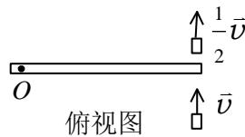
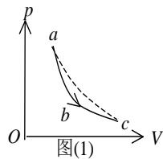
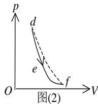
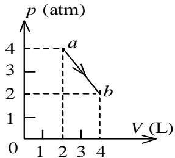
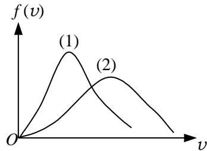
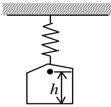
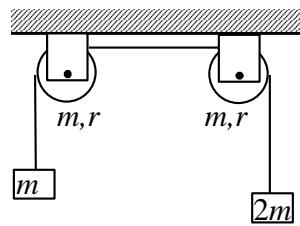
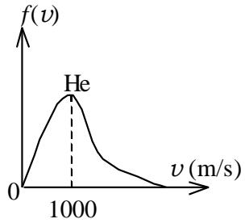
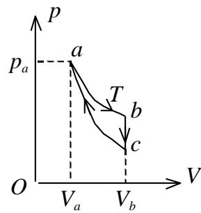

# 2019－2020学年第 2学期期中测试试卷

# 《大学物理 2A》（共 4页）

（考试时间：2020年 4月）

<table><tr><td>题号</td><td>一(1-10)</td><td>二(11-20)</td><td>三(21)</td><td>三(22)</td><td>三(23)</td><td>三(24)</td><td>成绩</td><td>核分人签名</td></tr><tr><td>得分</td><td></td><td></td><td></td><td></td><td></td><td></td><td></td><td></td></tr></table>

## 一、选择题 (共 30分，每小题3分)

<!-- QUESTION: qtype=single_choice tags=运动学方程,加速度,运动性质 difficulty=2 chapter=第一章 质点运动学与牛顿定律 qid=Q0558 -->
某质点作直线运动的运动学方程为 $x { = } 3 t { - } 5 t ^ { 3 } + 6$ (SI)，则该质点作

(A) 匀加速直线运动，加速度沿x轴正方向  
(B) 匀加速直线运动，加速度沿x轴负方向  
(C) 变加速直线运动，加速度沿x轴正方向  
(D) 变加速直线运动，加速度沿x轴负方向 ［ ］

<!-- ANSWER -->
D

<!-- EXPLANATION -->
速度 $v = \frac{dx}{dt} = 3 - 15t^2$，加速度 $a = \frac{dv}{dt} = -30t$，与时间有关，为变加速直线运动，加速度为负（沿x轴负方向）。
<!-- QUESTION END -->

<!-- QUESTION: qtype=single_choice tags=牛顿第二定律,变力,积分,速度计算 difficulty=3 chapter=第一章 质点运动学与牛顿定律 qid=Q0559 -->
一质点在力F= 5m(5−2t) (SI)的作用下，t =0时从静止开始作直线运动，式中m 为质点的质量，t为时间，则当t= 5 s时，质点的速率为

(A) 50 $\mathrm { m } \cdot \mathrm { s } ^ { - 1 }$

(B) $2 5 \mathrm { m \cdot s ^ { - 1 } } .$

(C) 0．

(D) $- 5 0 \mathrm { m } \cdot \mathrm { s } ^ { \mathrm { - 1 } } .$

<!-- ANSWER -->
C

<!-- EXPLANATION -->
由 $F=ma$ 得 $a = F/m = 5(5-2t) = 25 - 10t$。速度 $v = \int a dt = \int (25-10t)dt = 25t - 5t^2 + C$，由 $t=0$ 时 $v=0$ 得 $C=0$。$t=5$ s 时 $v = 25\times5 - 5\times25 = 125 - 125 = 0$。
<!-- QUESTION END -->

<!-- QUESTION: qtype=single_choice tags=转动惯量,质量分布,圆周运动 difficulty=2 chapter=第二章 刚体力学 qid=Q0560 -->
有两个半径相同，质量相等的细圆环A 和B．A环的质量分布均匀，B 环的质量分布不均匀．它们对通过环心并与环面垂直的轴的转动惯量分别为 $J _ { A }$ 和 ${ \cal J } _ { B } ,$ ，则

(A) $J _ { A } > J _ { B } .$

(B) $J _ { A } { < } J _ { B } .$

(C) $J _ { A } = J _ { B } .$

(D) 不能确定 $J _ { A \setminus J _ { B } }$ 哪个大

<!-- ANSWER -->
C

<!-- EXPLANATION -->
细圆环对通过环心且垂直于环面的轴的转动惯量为 $J = mR^2$，只取决于总质量和半径，与质量分布无关，故 $J_A = J_B$。
<!-- QUESTION END -->

<!-- QUESTION: qtype=single_choice tags=角动量守恒,碰撞,转动惯量,角速度 difficulty=4 chapter=第二章 刚体力学 qid=Q0561 -->
如图所示，一静止的均匀细棒，长为 L、质量为M，可绕通过棒的端点且垂直于棒长的光滑固定轴 O在水平面内转动，转动惯量为 ${ \frac { 1 } { 3 } } M L ^ { 2 }$ ．一质量为m、速率为v的子弹在水平面内沿与棒垂直的方向射出并穿出棒的自由端，设穿过棒后子弹的速率为 $\frac { 1 } { 2 } \nu$ ，则此时棒的角速度应为

(A) $\frac { m \nu } { M L }$  
(C) $\frac { 5 m \nu } { 3 M L }$

(B) $\frac { 3 m \nu } { 2 M L }$  
(D) $\frac { 7 m \nu } { 4 M L }$

text_image

俯视图
O
↑ 1/2 v̄
↑ v̄

［ ］

<!-- ANSWER -->
B

<!-- EXPLANATION -->
以 O 点为参考点，系统角动量守恒。子弹初角动量 $L_i = m v L$，末角动量 $L_f = m \cdot \frac{v}{2} \cdot L + \frac{1}{3} M L^2 \cdot \omega$。由 $L_i = L_f$ 得 $m v L = \frac{1}{2} m v L + \frac{1}{3} M L^2 \omega$，解得 $\omega = \frac{3 m v}{2 M L}$。
<!-- QUESTION END -->

<!-- QUESTION: qtype=single_choice tags=转动动能定理,阻力矩,角速度变化 difficulty=3 chapter=第二章 刚体力学 qid=Q0562 -->
一个圆盘在水平面内绕一竖直固定轴转动的转动惯量为J，初始角速度为 $\omega _0$ ，后来变为 $\frac { 1 } { 2 } \omega _ { 0 }$ ．在上述过程中，阻力矩所作的功为：

(A) $\frac { 1 } { 4 } J \omega _ { 0 } ^ { 2 }$  
(C) $- \frac { 1 } { 4 } J \omega _ { 0 } ^ { 2 }$

(B) $- \frac { 1 } { 8 } J \omega _ { 0 } ^ { 2 }$  
(D) $- \frac { 3 } { 8 } J \omega _ { 0 } ^ { 2 }$

［ ］

<!-- ANSWER -->
D

<!-- EXPLANATION -->
由动能定理，阻力矩做功等于转动动能的变化量：$W = \frac{1}{2} J (\frac{\omega_0}{2})^2 - \frac{1}{2} J \omega_0^2 = \frac{1}{2} J (\frac{1}{4}\omega_0^2 - \omega_0^2) = -\frac{3}{8} J \omega_0^2$。
<!-- QUESTION END -->

<!-- QUESTION: qtype=single_choice tags=理想气体压强,方均根速率,分子数密度 difficulty=2 chapter=第三章 气体动理论 qid=Q0563 -->
三个容器 A、B、C 中装有同种理想气体，其分子数密度 n 相同，而方均根速率之比为 $\displaystyle \left( \overline { { { \nu _ { A } ^ { 2 } } } } \right) ^ { 1 / 2 } : \left( \overline { { { \nu _ { B } ^ { 2 } } } } \right) ^ { 1 / 2 } : \left( \overline { { { \nu _ { C } ^ { 2 } } } } \right) ^ { 1 / 2 } = 1 : 2 : 4$ ，则其压强之比 $p _ { \scriptscriptstyle A } : p _ { \scriptscriptstyle B } : p _ { \scriptscriptstyle C }$ 为：

(A) $1 : 2 : 4 .$  
(B) $1 : 4 : 8 .$  
(C) $1 : 4 : 1 6 .$  
(D) 4∶2∶1

［ ］

<!-- ANSWER -->
C

<!-- EXPLANATION -->
方均根速率 $\sqrt{\overline{v^2}} = \sqrt{\frac{3kT}{m}}$，故 $\overline{v^2} \propto T$。由理想气体压强公式 $p = nkT$，得 $p \propto T \propto \overline{v^2}$。因此 $p_A:p_B:p_C = 1^2:2^2:4^2 = 1:4:16$。
<!-- QUESTION END -->

<!-- QUESTION: qtype=single_choice tags=理想气体,平均动能,平均平动动能,内能,质量温度相等 difficulty=3 chapter=第三章 气体动理论 qid=Q0564 -->
两容器内分别盛有氢气和氦气，若它们的温度和质量分别相等，则：

(A) 两种气体分子的平均平动动能相等  
(B) 两种气体分子的平均动能相等  
(C) 两种气体分子的平均速率相等  
(D) 两种气体的内能相等

［ ］

<!-- ANSWER -->
A

<!-- EXPLANATION -->
平均平动动能只与温度有关，$T$ 相等则平均平动动能相等。平均动能 = 平均平动动能 + 平均转动动能，氢气为双原子分子（自由度5），氦气为单原子分子（自由度3），故平均动能不同。平均速率为 $\sqrt{\frac{8RT}{\pi M}}$，与分子质量有关，故不同。内能 $U = \frac{i}{2}\nu RT$，质量相等时摩尔数不同，自由度也不同，故内能不同。
<!-- QUESTION END -->

<!-- QUESTION: qtype=single_choice tags=速率分布函数,平均速率,麦克斯韦分布 difficulty=3 chapter=第三章 气体动理论 qid=Q0565 -->
已知分子总数为 N，它们的速率分布函数为 $f ( \nu )$ ，则速率分布在 $\nu _ { 1 } { \sim } \nu _ { 2 }$ 区间内的分子的平均速率为

(A) $\int _ { \nu _ { 1 } } ^ { \nu _ { 2 } } \nu f ( \nu ) \mathrm { d } \nu$  
(B) $\int _ { \nu _ { 1 } } ^ { \nu _ { 2 } } \nu f ( \nu ) \mathrm { d } \nu / \int _ { \nu _ { 1 } } ^ { \nu _ { 2 } } f ( \nu ) \mathrm { d } \nu$  
(C) $\int _ { \nu _ { 1 } } ^ { \nu _ { 2 } } N \nu f ( \nu ) \mathrm { d } \nu$  
(D) $\int _ { \nu _ { 1 } } ^ { \nu _ { 2 } } \nu f ( \nu ) \mathrm { d } \nu / N$

［ ］

<!-- ANSWER -->
B

<!-- EXPLANATION -->
速率分布在 $\nu_1 \sim \nu_2$ 区间内的分子数为 $\Delta N = \int_{\nu_1}^{\nu_2} N f(v) dv$，这些分子的速率之和为 $\int_{\nu_1}^{\nu_2} v N f(v) dv$，故平均速率为 $\frac{\int_{\nu_1}^{\nu_2} v N f(v) dv}{\int_{\nu_1}^{\nu_2} N f(v) dv} = \frac{\int_{\nu_1}^{\nu_2} v f(v) dv}{\int_{\nu_1}^{\nu_2} f(v) dv}$。
<!-- QUESTION END -->

<!-- QUESTION: qtype=single_choice tags=热力学第一定律,等温过程,绝热过程,pV图,吸放热判断 difficulty=4 chapter=第四章 热力学定律 qid=Q0566 -->
一定量的理想气体，分别经历如图(1) 所示的 abc 过程，(图中虚线 ac 为等温线)，和图(2) 所示的def过程(图中虚线df为绝热线)．判断这两种过程是吸热还是放热

(A) abc 过程吸热，def 过程放热  
(B) abc 过程放热，def 过程吸热  
(C) abc 过程和 def 过程都吸热  
(D) abc 过程和 def 过程都放热

text_image

p
a
b
c
O
V
图(1)

text_image

p
d
e
f
O
V
图(2)

［ ］

<!-- ANSWER -->
C

<!-- EXPLANATION -->
图(1)：abc 过程在等温线 ac 之上，初末态温度相同，内能不变；体积增大，对外做功，由热力学第一定律 $Q = \Delta U + W = W > 0$，吸热。  
图(2)：def 过程在绝热线 df 之上，相同体积下压强更大，温度更高，内能增加；体积增大对外做功，由 $Q = \Delta U + W > 0$，吸热。故两过程均吸热。
<!-- QUESTION END -->

<!-- QUESTION: qtype=single_choice tags=热力学第一定律,pV图,功,热量,内能变化 difficulty=4 chapter=第四章 热力学定律 qid=Q0567 -->
如图所示，一定量的理想气体，沿着图中直线从状态a( 压强p1= 4 atm，体积 $V _ { 1 } = 2 \mathrm { L }$ )变到状态b( 压强 $p _ { 2 } = 2 { \mathrm { a t m } } ,$ ， p (atm)体积V2=4 L )．则在此过程中：

(A) 气体对外作正功，向外界放出热量  
(B) 气体对外作正功，从外界吸热  
(C) 气体对外作负功，向外界放出热量  
(D) 气体对外作正功，内能减少

line chart

| Point | V (L) | p (atm) |
|---|---|---|
| a | 2 | 4 |
| b | 3.5 | 2 |

［ ］

<!-- ANSWER -->
B

<!-- EXPLANATION -->
体积增大，气体对外做正功。初态 $p_1V_1 = 4 \times 2 = 8$，末态 $p_2V_2 = 2 \times 4 = 8$，$pV$ 相等，故温度相同，内能不变。由热力学第一定律 $Q = \Delta U + W = W > 0$，气体从外界吸热。
<!-- QUESTION END -->

## 二、填空题 (共 30分，每小题3分)

<!-- QUESTION: qtype=fill_blank tags=圆周运动,线速度,切向加速度,法向加速度 difficulty=3 chapter=第一章 质点运动学与牛顿定律 qid=Q0568 -->
在一个转动的齿轮上，一个齿尖P沿半径为R的圆周运动，其路程S 随时间的变化规律为 $S = \nu _ { 0 } t + { \frac { 1 } { 2 } } b t ^ { 2 }$ ，其中 $\upsilon _ { 0 }$ 和b都是正的常量．则 t时刻齿尖P的速度大小为\_\_\_，加速度大小为\_\_\_

<!-- ANSWER -->
$\nu_0 + b t$，$\sqrt{b^2 + \frac{(\nu_0 + b t)^4}{R^2}}$
<!-- QUESTION END -->

<!-- QUESTION: qtype=fill_blank tags=圆周运动,角位移,法向加速度,切向加速度 difficulty=3 chapter=第一章 质点运动学与牛顿定律 qid=Q0569 -->
一质点沿半径为 0.1 m 的圆周运动，其角位移 随时间 t 的变化规律是$\theta = 2 + 4 t ^ { 2 } \quad \mathrm { ( S I ) }$ ．在 t =2 s 时，它的法向加速度 an= \_\_\_；切向加速度 at =\_\_\_

<!-- ANSWER -->
$25.6\ \mathrm{m/s^2}$，$0.8\ \mathrm{m/s^2}$
<!-- QUESTION END -->

<!-- QUESTION: qtype=fill_blank tags=牛顿第二定律,变力,积分,动量定理 difficulty=3 chapter=第一章 质点运动学与牛顿定律 qid=Q0570 -->
一物体质量 M＝2 kg，在合外力 $F = \left( 3 + 2 t \right) \vec { i }$ (SI)的作用下，从静止开始运动，式中i为方向一定的单位矢量, 则当 t＝1 s 时物体的速度 $\vec { \nu } _ { 1 }$ ＝\_\_\_

<!-- ANSWER -->
$2\vec{i}\ \mathrm{m/s}$
<!-- EXPLANATION -->
由动量定理 $\int_0^1 F dt = M \vec{v}_1$，$\int_0^1 (3+2t)dt = [3t + t^2]_0^1 = 4$，故 $\vec{v}_1 = \frac{4}{2}\vec{i} = 2\vec{i}\ \mathrm{m/s}$。
<!-- QUESTION END -->

<!-- QUESTION: qtype=fill_blank tags=功,动能定理,变力做功,速度计算 difficulty=4 chapter=第一章 质点运动学与牛顿定律 qid=Q0571 -->
质量m＝1 kg 的物体，在坐标原点处从静止出发在水平面内沿x轴运动，其所受合力方向与运动方向相同，合力大小为 F＝3＋2x (SI)，那么，物体在开始运动的 3m内，合力所作的功W＝\_\_\_；且 x＝3m时，其速率v＝\_\_\_

<!-- ANSWER -->
$18\ \mathrm{J}$，$6\ \mathrm{m/s}$
<!-- EXPLANATION -->
功 $W = \int_0^3 (3+2x) dx = [3x + x^2]_0^3 = 9+9 = 18\ \mathrm{J}$。由动能定理 $W = \frac{1}{2}mv^2$，得 $v = \sqrt{\frac{2W}{m}} = \sqrt{36} = 6\ \mathrm{m/s}$。
<!-- QUESTION END -->

<!-- QUESTION: qtype=fill_blank tags=角加速度,匀变速转动,角位移计算 difficulty=3 chapter=第二章 刚体力学 qid=Q0572 -->
绕定轴转动的飞轮均匀地减速，t＝0时角速度为 $\omega _ { 0 } { = } 5 ~ \mathrm { r a d } ~ / \mathrm { ~ s } , ~ t { = } 2 0 ~ \mathrm { s }$ 时角速度为 $\omega = 0 . 8 \omega _ { 0 }$ ，则飞轮的角加速度＝\_\_\_，t＝0 到 t＝100 s 时间内飞轮所转过的角度＝\_\_\_

<!-- ANSWER -->
$-0.05\ \mathrm{rad/s^2}$，$250\ \mathrm{rad}$
<!-- EXPLANATION -->
角加速度 $\alpha = \frac{\omega - \omega_0}{t} = \frac{0.8\times5 - 5}{20} = \frac{4-5}{20} = -0.05\ \mathrm{rad/s^2}$。飞轮在 $t=100\ \mathrm{s}$ 时停止（$\omega = \omega_0 + \alpha t = 5 - 0.05\times100 = 0$），转过的角度 $\theta = \omega_0 t + \frac{1}{2}\alpha t^2 = 5\times100 + \frac{1}{2}\times(-0.05)\times100^2 = 500 - 250 = 250\ \mathrm{rad}$。
<!-- QUESTION END -->

<!-- QUESTION: qtype=fill_blank tags=理想气体,平均平动动能,平均动能,内能,刚性双原子分子 difficulty=2 chapter=第三章 气体动理论 qid=Q0573 -->
有一瓶质量为 M 的氢气(视作刚性双原子分子的理想气体)，温度为 T，则氢气分子的平均平动动能为\_\_\_，氢气分子的平均动能为\_\_\_，该瓶氢气的内能为\_\_\_

<!-- ANSWER -->
$\frac{3}{2}kT$，$\frac{5}{2}kT$，$\frac{5}{2}\frac{M}{M_{\mathrm{mol}}}RT$
<!-- EXPLANATION -->
刚性双原子分子有 3 个平动自由度和 2 个转动自由度。平均平动动能 $\frac{3}{2}kT$，平均动能 $\frac{5}{2}kT$。内能 $U = \frac{5}{2}\nu RT = \frac{5}{2}\frac{M}{M_{\mathrm{mol}}}RT$，其中 $M_{\mathrm{mol}}$ 为氢气的摩尔质量。
<!-- QUESTION END -->

<!-- QUESTION: qtype=fill_blank tags=速率分布曲线,温度,最可几速率,麦克斯韦分布,分子质量 difficulty=3 chapter=第三章 气体动理论 qid=Q0574 -->
现有两条气体分子速率分布曲线(1)和(2)，如图所示．若两条曲线分别表示同一种气体处于不同的温度下的速率分布，则曲线\_\_\_\_\_表示气体的温度较高。若两条曲线分别表示同一温度下的氢气和氧气的速率分布，则曲线\_\_\_表示的是氧气的速率分布

line chart

| v    | f(v) Curve (1) | f(v) Curve (2) |
| ---- | -------------- | -------------- |
| 0    | 0              | 0              |
| Peak | ~1.0           | ~0.8           |
| Peak (2)| ~0.6           | ~0.5           |

<!-- ANSWER -->
(2)，(1)
<!-- EXPLANATION -->
同种气体温度越高，最概然速率越大，峰值越低，曲线越平坦。曲线(2)峰值较低且靠右，故温度较高。同一温度下，分子质量越大，最概然速率越小，峰值越高。氧气分子质量大于氢气，故最概然速率较小，对应曲线(1)。
<!-- QUESTION END -->

<!-- QUESTION: qtype=fill_blank tags=理想气体,等压过程,热量,功,刚性双原子分子 difficulty=3 chapter=第四章 热力学定律 qid=Q0575 -->
刚性双原子分子的理想气体在等压下膨胀所作的功为W，则传递给气体的热量为\_\_\_

<!-- ANSWER -->
$\frac{7}{2}W$
<!-- EXPLANATION -->
等压过程 $Q = \nu C_p \Delta T$，$W = p\Delta V = \nu R \Delta T$。刚性双原子分子 $C_p = \frac{7}{2}R$，故 $Q = \nu \cdot \frac{7}{2}R \cdot \Delta T = \frac{7}{2} W$。
<!-- QUESTION END -->

<!-- QUESTION: qtype=fill_blank tags=卡诺热机,最大效率,热机效率,循环功 difficulty=3 chapter=第四章 热力学定律 qid=Q0576 -->
一热机从温度为727℃的高温热源吸热，向温度为 527℃的低温热源放热．若热机在最大效率下工作，且每一循环吸热 2000 J ，则此热机每一循环作功为\_\_\_ J

<!-- ANSWER -->
$400$
<!-- EXPLANATION -->
卡诺效率 $\eta = 1 - \frac{T_2}{T_1}$，其中 $T_1 = 727 + 273 = 1000\ \mathrm{K}$，$T_2 = 527 + 273 = 800\ \mathrm{K}$，$\eta = 1 - \frac{800}{1000} = 0.2$。做功 $W = \eta Q_1 = 0.2 \times 2000 = 400\ \mathrm{J}$。
<!-- QUESTION END -->

<!-- QUESTION: qtype=fill_blank tags=理想气体,绝热过程,绝热方程,温度,压强计算 difficulty=4 chapter=第四章 热力学定律 qid=Q0577 -->
给定的理想气体(比热容比 $\gamma$ 为已知)，从标准状态(p0、V0、T0)开始，作绝热膨胀，体积增大到三倍，膨胀后的温度T＝\_\_\_，压强 p＝\_\_\_

<!-- ANSWER -->
$T_0\left(\frac{1}{3}\right)^{\gamma-1}$，$p_0\left(\frac{1}{3}\right)^{\gamma}$
<!-- EXPLANATION -->
绝热过程满足 $TV^{\gamma-1}=$ 常量，$pV^\gamma=$ 常量。由 $T_0 V_0^{\gamma-1} = T (3V_0)^{\gamma-1}$ 得 $T = T_0 \left(\frac{V_0}{3V_0}\right)^{\gamma-1} = T_0 \left(\frac{1}{3}\right)^{\gamma-1}$。由 $p_0 V_0^\gamma = p (3V_0)^\gamma$ 得 $p = p_0 \left(\frac{1}{3}\right)^\gamma$。
<!-- QUESTION END -->

## 三、计算题 (共 40分，每题 10分)

<!-- QUESTION: qtype=short_answer tags=弹簧,碰撞,能量守恒,动量守恒,完全非弹性碰撞 difficulty=4 chapter=第一章 质点运动学与牛顿定律 qid=Q0578 -->
如图所示，质量 M = 2.0 kg 的笼子，用轻弹簧悬挂起来，静止在平衡位置，弹簧伸长 $x _ { 0 } = 0 . 1 0 ~ \mathrm { m } ,$ ，今有 m = 2.0 kg 的油灰由距离笼底高 h = 0.30 m 处自由落到笼底上，求笼子向下移动的最大距离

text_image

h

<!-- ANSWER -->
笼子向下移动的最大距离为 $0.3\ \mathrm{m}$。

<!-- EXPLANATION -->
平衡时 $Mg = k x_0$，得 $k = Mg/x_0 = 2\times9.8/0.1 = 196\ \mathrm{N/m}$。  
油灰碰前速度 $v = \sqrt{2gh} = \sqrt{2\times9.8\times0.3} \approx 2.425\ \mathrm{m/s}$。  
碰撞过程动量守恒（完全非弹性）：$m v = (M+m)V$，得 $V = \frac{m}{M+m}v = \frac{2}{4}\times2.425 = 1.2125\ \mathrm{m/s}$。  
碰撞后系统机械能守恒，取弹簧原长为弹性势能零点，平衡位置为重力势能零点，设笼子从平衡位置向下移动的最大距离为 $A$，则  
$\frac{1}{2}(M+m)V^2 + \frac{1}{2}k x_0^2 = \frac{1}{2}k (x_0+A)^2 - (M+m)gA$。  
代入数据解得 $A = 0.2\ \mathrm{m}$，故弹簧总伸长（即笼子从原长位置向下移动的最大距离）为 $x_0 + A = 0.1 + 0.2 = 0.3\ \mathrm{m}$。
<!-- QUESTION END -->

<!-- QUESTION: qtype=short_answer tags=定滑轮,转动惯量,牛顿第二定律,角量线量关系,绳张力计算 difficulty=5 chapter=第二章 刚体力学 qid=Q0579 -->
一轻绳跨过两个质量均为 m、半径均为 r 的均匀圆盘状定滑轮，绳的两端分别挂着质量为m和2m 的重物，如图所示．绳与滑轮间无相对滑动，滑轮轴光滑．两个定滑轮的转动惯量均为 ${ \frac { 1 } { 2 } } m r ^ { 2 }$ ．将由两个定滑轮以及质量为 m 和 2m 的重物组成的系统从静止释放，求两滑轮之间绳内的张力

text_image

m,r
m,r
m
2m

<!-- ANSWER -->
两滑轮之间绳内的张力 $T = \frac{11}{8}mg$。

<!-- EXPLANATION -->
设左侧 $2m$ 重物加速度 $a$ 向下，右侧 $m$ 重物加速度 $a$ 向上，两滑轮角加速度 $\beta$ 大小相等（$a = r\beta$）。  
对 $2m$：$2mg - T_1 = 2ma$  
对 $m$：$T_2 - mg = ma$  
对左侧滑轮：$T_1 r - T r = \frac{1}{2} m r^2 \beta$  
对右侧滑轮：$T r - T_2 r = \frac{1}{2} m r^2 \beta$  
由 $a = r\beta$，联立解得 $a = \frac{g}{4}$，$T = \frac{11}{8}mg$。
<!-- QUESTION END -->

<!-- QUESTION: qtype=short_answer tags=速率分布曲线,最可几速率,方均根速率,麦克斯韦分布,分子质量比较 difficulty=4 chapter=第三章 气体动理论 qid=Q0580 -->
氦气分子的速率分布曲线如图所示，试在图上画出同温度下氢气分子的速率分布曲线的大致情况，并求氢气分子在该温度时的最可几速率和方均根速率

line chart

| ν (m/s) | f(ν) |
| ------- | ---- |
| 0       | 0    |
| 1000    | He   |

<!-- ANSWER -->
氢气的最可几速率为 $1.41 \times 10^3\ \mathrm{m/s}$，方均根速率为 $1.73 \times 10^3\ \mathrm{m/s}$。在图中，氢气分子的速率分布曲线峰值应位于氦气峰值的 $\sqrt{2}$ 倍处，且峰值高度较低。

<!-- EXPLANATION -->
最可几速率 $v_p = \sqrt{\frac{2RT}{M}}$。同温度下 $\frac{v_{p,\mathrm{H}_2}}{v_{p,\mathrm{He}}} = \sqrt{\frac{M_{\mathrm{He}}}{M_{\mathrm{H}_2}}} = \sqrt{\frac{4}{2}} = \sqrt{2}$。由题图知氦气 $v_{p,\mathrm{He}} = 1.00 \times 10^3\ \mathrm{m/s}$，故 $v_{p,\mathrm{H}_2} = \sqrt{2} \times 1.00 \times 10^3 = 1.41 \times 10^3\ \mathrm{m/s}$。方均根速率 $v_{\mathrm{rms}} = \sqrt{\frac{3RT}{M}} = v_p \sqrt{\frac{3}{2}} = 1.41 \times 10^3 \times 1.225 = 1.73 \times 10^3\ \mathrm{m/s}$。
<!-- QUESTION END -->

<!-- QUESTION: qtype=short_answer tags=卡诺循环,等温过程,等体过程,绝热过程,循环效率计算 difficulty=5 chapter=第四章 热力学定律 qid=Q0581 -->
气缸内有一定量的氧气（看成刚性分子理想气体），作如图所示的循环过程，其中 ab为等温过程，bc为等体过程，ca为绝热过程．已知a 点的状态参量为 $p _ { a } , \ V _ { a } , \ T _ { a } , \ b$ 点的体积 $V _ { b } = 3 V _ { a }$ ．求该循环的效率

text_image

p
pa
a
T
b
c
O
Va
Vb
V

<!-- ANSWER -->
循环效率为 $19.0\%$。

<!-- EXPLANATION -->
氧气为刚性双原子分子，$C_V = \frac{5}{2}R$，$C_p = \frac{7}{2}R$，$\gamma = \frac{7}{5}=1.4$。  
ab 等温膨胀：$Q_{ab} = \nu R T_a \ln\frac{V_b}{V_a} = \nu R T_a \ln 3$（吸热）。  
bc 等体降压：$Q_{bc} = \nu C_V (T_c - T_a)$（放热）。由绝热过程 $ca$：$T_c V_b^{\gamma-1} = T_a V_a^{\gamma-1}$，得 $T_c = T_a \left(\frac{V_a}{V_b}\right)^{\gamma-1} = T_a \left(\frac{1}{3}\right)^{0.4} \approx 0.6444\,T_a$。  
故 $|Q_{bc}| = \nu \cdot \frac{5}{2}R \cdot (T_a - T_c) = \frac{5}{2}\nu R T_a (1-0.6444) = 0.889\,\nu R T_a$。  
循环效率 $\eta = 1 - \frac{|Q_{bc}|}{Q_{ab}} = 1 - \frac{0.889}{\ln 3} = 1 - \frac{0.889}{1.0986} \approx 0.190 = 19.0\%$。
<!-- QUESTION END -->
