# 2019～2020 学年第二学期期末考试试卷

## 《大学物理 1A/2A》（A卷）（共4页）

(考试时间：2020年9月13日)

<table><tr><td>题号</td><td></td><td>二</td><td>三(21)</td><td>三(22)</td><td>三(23)</td><td>三(24)</td><td>成绩</td><td>核分人签字</td></tr><tr><td>得分</td><td></td><td></td><td></td><td></td><td></td><td></td><td></td><td></td></tr></table>

一、选择题（每小题3分，共30分）

<!-- QUESTION: qtype=single_choice tags=圆周运动,加速度,切向加速度,法向加速度 difficulty=2 chapter=第一章 质点运动学与牛顿定律 qid=Q0606 -->

质点作半径为 $R$ 的变速圆周运动时的加速度大小为（ $\nu$ 表示任一时刻质点的速率）：

(A) $\frac{\mathrm{d}v}{\mathrm{d}t}$

(B) $\frac{v^2}{R}$

(C) $\frac{dv}{dt}+\frac{v^{2}}{R}$

(D) $\left[\left(\frac{\mathrm{d}v}{\mathrm{d}t}\right)^2 + \frac{v^4}{R^2}\right]^{1/2}$

[ ]

<!-- QUESTION END -->

<!-- QUESTION: qtype=single_choice tags=刚体转动,角动量守恒,子弹穿棒,角速度 difficulty=3 chapter=第二章 刚体力学 qid=Q0607 -->

如图所示, 一静止的均匀细棒, 长为 $L$ 、质量为 $M$ , 可绕通过棒的端点且垂直于棒的光滑固定轴 $O$ 在水平面内转动, 转动惯量为 $ML^2 / 3$ 。一质量为 $m$ 、速率为 $v$ 的子弹在水平面内沿与棒垂直的方

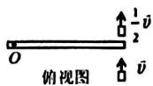

向射入并穿出棒的自由端，设穿过棒后子弹的速率为 $v / 2$ ，则此时棒的角速度应为：

(A) $\frac{mv}{ML}$

(B) $\frac{3mv}{2ML}$

(C) $\frac{5mv}{3ML}$

(D) $\frac{7mv}{4ML}$

[ ]

<!-- QUESTION END -->

<!-- QUESTION: qtype=single_choice tags=功的计算,变力做功,圆周运动,积分功 difficulty=3 chapter=第一章 质点运动学与牛顿定律 qid=Q0608 -->

一质点在如图所示的坐标平面内作圆周运动，有一力 $\vec{F} = F_{0}(x\vec{i} + y\vec{j})$ 作用在质点上。在该质点从坐标原点运动到 (0, 2R) 位置过程中，力 $\vec{F}$ 对它所做的功为：

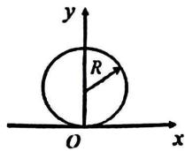

(A) $F_{0}R^{2}$

(B) $2F_{0}R^{2}$

(C) $3F_{0}R^{2}$

(D) $4F_{0}R^{2}$

[ ]

<!-- QUESTION END -->

<!-- QUESTION: qtype=single_choice tags=电势,点电荷,电势零点,电势差 difficulty=3 chapter=第五章 静电学 qid=Q0609 -->

在点电荷+q 的电场中，若取图中 P 点为电势零点，则 M 点的电势为：

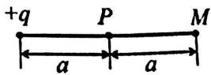

(A) $\frac{q}{4\pi\varepsilon_0a}$

(B) $\frac{q}{8\pi\varepsilon_0a}$
(C) $\frac{-q}{4\pi\varepsilon_{0}a}$

(D) $\frac{-q}{8\pi\varepsilon_{0}a}$ [ ]

<!-- QUESTION END -->

<!-- QUESTION: qtype=single_choice tags=平均碰撞频率,平均自由程,理想气体,温度变化 difficulty=2 chapter=第三章 气体动理论 qid=Q0610 -->

一定量的理想气体，在体积不变的条件下，当温度降低时，分子的平均碰撞频率 $\overline{z}$ 和平均自由程 $\overline{\lambda}$ 的变化情况是：

(A) $\overline{Z}$ 减小，但 $\overline{\lambda}$ 不变

(B) $\overline{Z}$ 不变，但 $\overline{\lambda}$ 减小

(C) $\overline{Z}$ 和 $\overline{\lambda}$ 都减小

(D) $\overline{Z}$ 和 $\overline{\lambda}$ 都不变

[ ]

<!-- QUESTION END -->

<!-- QUESTION: qtype=single_choice tags=热力学第二定律,可逆过程,自发过程,热机效率 difficulty=2 chapter=第四章 热力学定律 qid=Q0611 -->

根据热力学第二定律可知:

(A) 功可以完全转换为热，但热不能全部转换为功  
(B) 热可以从高温物体传到低温物体，但不能从低温物体传到高温物体  
(C) 不可逆过程就是不能向相反方向进行的过程

(D) 一切自发过程都是不可逆的

[ ]

<!-- QUESTION END -->

<!-- QUESTION: qtype=single_choice tags=高斯定理,球对称电场,电场分布,带电球体 difficulty=3 chapter=第五章 静电学 qid=Q0612 -->

图示为一具有球对称性分布的静电场的 $E \sim r$ 关系曲线。请指出该静电场是由下列哪种带电体产生的：

(A) 半径为 R 的均匀带电球面  
(B) 半径为 R 的均匀带电球体  
(C) 半径为 R、电荷体密度为 $\rho = A / r^{2}$ （A 为常数）的非均匀带电球体  
(D) 半径为 R、电荷体密度为 $\rho = A / r$ （A 为常数）的非均匀带电球体 [ ]

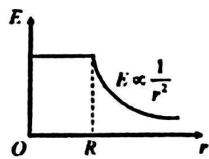

<!-- QUESTION END -->

<!-- QUESTION: qtype=single_choice tags=安培环路定理,磁场叠加,环路积分,磁感应强度 difficulty=3 chapter=第六章 稳恒磁场 qid=Q0613 -->

在图 (a) 和 (b) 中各有一半径相同的圆形回路 $L_{1}$ 、 $L_{2}$ ，圆周内有电流 $I_{1}$ 、 $I_{2}$ ，其分布相同，且均在真空中，但在 (b) 图中 $L_{2}$ 回路外有电流 $I_{3}$ ， $P_{1}$ 、 $P_{2}$ 为两圆形回路上的对应点，则：

(A) $\oint_{L_1}\vec{B}\cdot \mathrm{d}\vec{l} = \oint_{L_2}\vec{B}\cdot \mathrm{d}\vec{l}, B_{r_1} = B_{r_2}$  
(B) $\oint_{L_1}\vec{B}\cdot \mathrm{d}\vec{l}\neq \oint_{L_2}\vec{B}\cdot \mathrm{d}\vec{l}, B_{P_1} = B_{P_2}$  
(C) $\oint_{L_1}\vec{B}\cdot \mathrm{d}\vec{I} = \oint_{L_2}\vec{B}\cdot \mathrm{d}\vec{I}, B_{P_1}\neq B_{P_2}$  
(D) $\oint_{L_1}\vec{B}\cdot \mathrm{d}\vec{l}\neq \oint_{L_2}\vec{B}\cdot \mathrm{d}\vec{l}, B_{P_1}\neq B_{P_2}$

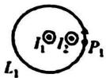  
(a)

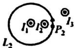  
(b)

[ ]

<!-- QUESTION END -->

<!-- QUESTION: qtype=single_choice tags=感应电场,电磁感应,涡旋电场,电势概念 difficulty=3 chapter=第七章 电磁感应与麦克斯韦方程组 qid=Q0614 -->

在感应电场中电磁感应定律可以写为 $\oint_{L} \vec{E}_{K} \cdot d\vec{l} = -\frac{d\Phi}{dt}$ ，式中 $\vec{E}_{K}$ 为感应电场的电场强度。此式表明：

(A) 闭合曲线 L 上 $E_{K}$ 处处相等

(B) 感应电场是保守力场

(C) 感应电场的电场强度线不是闭合曲线

(D) 在感应电场中不能像对静电场那样引入电势的概念

<!-- QUESTION END -->

<!-- QUESTION: qtype=single_choice tags=磁通量,半球面,均匀磁场,磁通量计算 difficulty=3 chapter=第六章 稳恒磁场 qid=Q0615 -->

在磁感强度为 $\vec{B}$ 的均匀磁场中作一半径为 $r$ 的半球面 $S$ , $S$ 边线所在平面的法线方向单位矢量 $\vec{n}$ 与 $\vec{B}$ 的夹角为 $\alpha$ , 则通过半球面 $S$ 的磁通量为(取弯面向外为正):

(A) $\pi r^{2}B$

(B) $2\pi r^{2}B$

(C) $-\pi r^{2}B\sin\alpha$

(D) $-\pi r^{2}B\cos\alpha$

[ ]

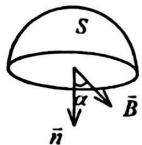

<!-- QUESTION END -->

二、填空题（每题3分，共30分）

<!-- QUESTION: qtype=fill_blank tags=牛顿第二定律,积分求运动方程,变力,简谐运动 difficulty=4 chapter=第一章 质点运动学与牛顿定律 qid=Q0616 -->

一个质量为 $m$ 的质点, 沿 $x$ 轴作直线运动, 受到的作用力为 $\bar{F} = F_{0} \cos \omega t \bar{i}$ (SI)。 $t = 0$ 时刻, 质点的位置坐标为 $x_{0}$ , 初速度为 $\bar{v}_{0} = 0$ 。则质点的位置坐标和时间的关系式为 $x =$ \_\_\_\_。

<!-- QUESTION END -->

<!-- QUESTION: qtype=fill_blank tags=刚体,转动惯量,质量分布,转轴位置 difficulty=2 chapter=第二章 刚体力学 qid=Q0617 -->

决定刚体转动惯量的因素有\_\_\_\_。

<!-- QUESTION END -->

<!-- QUESTION: qtype=fill_blank tags=麦克斯韦速率分布,最概然速率,统计物理 difficulty=3 chapter=第三章 气体动理论 qid=Q0618 -->

已知 $f(v)$ 为麦克斯韦速率分布函数， $v_{p}$ 为分子的最概然速率。则， $\int_{0}^{v_{p}}f(v)\mathrm{d}v$ 表示 \_\_\_\_；

速率 $v > {v}_{\mathrm{p}}$ 的分子的平均速率表达式为\_\_\_\_。

<!-- QUESTION END -->

<!-- QUESTION: qtype=fill_blank tags=卡诺循环,热机效率,最大效率,做功 difficulty=3 chapter=第四章 热力学定律 qid=Q0619 -->

一热机从温度为 $727^{\circ} \mathrm{C}$ 的高温热源吸热, 向温度为 $527^{\circ} \mathrm{C}$ 的低温热源放热。若热机在最大效率下工作, 且每一循环吸热 2000J, 则此热机每一循环做功 \_\_\_\_ J。

<!-- QUESTION END -->

<!-- QUESTION: qtype=fill_blank tags=理想气体,等压膨胀,温度变化,热量计算 difficulty=3 chapter=第四章 热力学定律 qid=Q0620 -->

有 $1 \mathrm{~mol}$ 刚性双原子分子理想气体, 在等压膨胀过程中对外做功 $W$ , 则其温度变化 $\Delta T =$ \_\_\_\_；从外界吸取的热量 $Q_{P} =$ \_\_\_\_。

<!-- QUESTION END -->

<!-- QUESTION: qtype=fill_blank tags=磁力矩,磁矩,旋转带电圆环,磁场中力矩 difficulty=4 chapter=第六章 稳恒磁场 qid=Q0621 -->

如图，均匀磁场场中放一均匀带正电荷的圆环，
其电荷线密度为 $\lambda$ ，圆环可绕通过环心 O 与环面垂直的转轴旋转。
当圆环以角速度 $\omega$ 转动时，圆环受到的磁力矩为 \_\_\_\_，

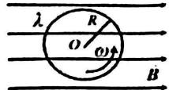

其方向\_\_\_\_。

<!-- QUESTION END -->

<!-- QUESTION: qtype=fill_blank tags=平行板电容器,电介质,电场强度,电场能量 difficulty=3 chapter=第五章 静电学 qid=Q0622 -->

一平行板电容器充电后切断电源，然后在两极板间充满相对介电常量为 $\varepsilon_{\mathrm{r}}$ 的各向同性均匀电介质。此时，两极板间的电场强度是原来的\_\_\_\_倍，电场能量是原来的\_\_\_\_倍。

<!-- QUESTION END -->

<!-- QUESTION: qtype=fill_blank tags=静电力做功,保守力,功的性质 difficulty=2 chapter=第五章 静电学 qid=Q0623 -->

静电力做功的特点是\_\_\_\_\_\_\_\_，因而静电力属于\_\_\_\_\_\_\_\_力。

<!-- QUESTION END -->

<!-- QUESTION: qtype=fill_blank tags=麦克斯韦方程组,积分形式,电磁场基本规律,方程意义 difficulty=4 chapter=第七章 电磁感应与麦克斯韦方程组 qid=Q0624 -->

反映电磁场基本性质和规律的积分形式的麦克斯韦方程组为:

$$
\oiint_ {S} \vec {D} \cdot \mathrm{d} \vec {S} = \iiint_ {V} \rho \mathrm{d} V, \tag {①}
$$

$$
\oint_ {L} \vec {E} \cdot \mathrm{d} \vec {l} = - \iint_ {S} \frac {\partial \vec {B}}{\partial t} \cdot \mathrm{d} \vec {S}, \tag {②}
$$

$$
\oiint_ {S} \vec {B} \cdot \mathrm{d} \vec {S} = 0, \tag {③}
$$

$$
\oint_ {L} \vec {H} \cdot \mathrm{d} \vec {l} = \iint_ {S} (\vec {J} + \frac {\partial \vec {D}}{\partial t}) \cdot \mathrm{d} \vec {S}, \tag {④}
$$

试判断下列结论是包含于或等效于哪一个麦克斯韦方程式的，并在空白处填入相应代号。

(1) 变化的磁场一定伴随有电场: \_\_\_\_；  
(2) 磁感线是无头无尾的: \_\_\_\_；  
(3) 电荷总伴随有电场: \_\_\_\_。

<!-- QUESTION END -->

<!-- QUESTION: qtype=fill_blank tags=动生电动势,载流导线磁场,金属杆运动,感应电动势 difficulty=4 chapter=第七章 电磁感应与麦克斯韦方程组 qid=Q0625 -->

金属杆 $AB$ 以匀速 $v = 2 \mathrm{~m} / \mathrm{s}$ 平行于长直载流导线运动, 导线与 $AB$ 共面且互相垂直, 如图所示。已知导线载有电流 $I = 40 \mathrm{~A}$ , 则, 此金属杆中的感应电动势 $\xi_{1} =$ \_\_\_\_,

电势较高端为\_\_\_\_。(ln2=0.693, $\mu_{0}=4\pi\times10^{-7}N\cdot A^{-2}$ )

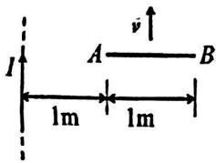

text_image

I
A → B
1m 1m

<!-- QUESTION END -->

三、计算题（每题10分，共40分）

<!-- QUESTION: qtype=short_answer tags=角动量守恒,刚体转动,摩擦力矩,转动惯量 difficulty=4 chapter=第二章 刚体力学 qid=Q0626 -->

一质量均匀分布的圆盘，质量为 M，半径为 R，放在一粗糙水平面上（圆盘与水平面之间的摩擦系数为 $\mu$ ），圆盘可绕通过其中心 O 的竖直固定光滑轴转动。开始时，圆盘静止，一质量为 m 的子弹以水平速度 $v_{0}$ 垂直于圆盘半径打入圆盘边缘并嵌在盘边上。

求：

(1) 子弹击中圆盘后，盘所获得的角速度；  
(2) 经过多少时间后，圆盘停止转动。

（圆盘绕通过 O 的竖直轴的转动惯量为 $\frac{1}{2}MR^{2}$ ，忽略子弹重力造成的摩擦阻力矩）

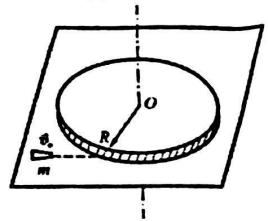

text_image

O
R
θ₀
m

<!-- QUESTION END -->

<!-- QUESTION: qtype=short_answer tags=理想气体循环,等压过程,等体过程,循环效率 difficulty=4 chapter=第四章 热力学定律 qid=Q0627 -->

1mol 的刚性双原子分子理想气体系统，经历如图所示的循环过程。其中 $D \rightarrow A$ ， $B \rightarrow C$ 是等体过程， $A \rightarrow B$ ， $C \rightarrow D$ 是等压过程。求：p/atm

(1) 循环过程对外做的净功:  
(2) 整个循环过程实际从外界吸收的热量;  
(3) 循环效率。

(普适气体常量 $R = 8.31 J \cdot mol^{-1} \cdot K^{-1}$ )

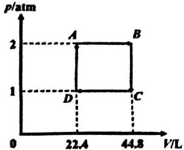

line chart

| Point | V/L | p/atm |
|---|---|---|
| A | 22.4 | 2 |
| B | 44.8 | 2 |
| C | 44.8 | 1 |
| D | 22.4 | 1 |

<!-- QUESTION END -->

<!-- QUESTION: qtype=short_answer tags=电场强度,带电线,半圆线,电场叠加 difficulty=4 chapter=第五章 静电学 qid=Q0628 -->

如图所示，有半径为 R 的半圆形线，分别求在下列情况下，圆心处的电场强度 $\vec{E}$ :

(1) 半圆线均匀带电荷量 Q:

（2）电荷线密度 $\lambda=\lambda_{0}\cos\theta$ ， $\lambda_{0}$ 为常量。坐标原点在圆心处，x 轴沿半圆直径方向， $\theta$ 是 Ox 轴与表示圆弧微元 dl 位置的位矢之间的夹角。

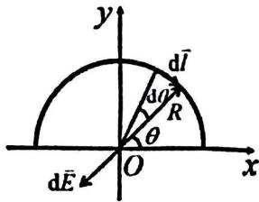

text_image

y
d\u03c9l
R
d\u03c9θ
O
x
d\u03c9E

<!-- QUESTION END -->

<!-- QUESTION: qtype=short_answer tags=无限长直导线磁场,磁通量,电磁感应,感应电动势 difficulty=5 chapter=第七章 电磁感应与麦克斯韦方程组 qid=Q0629 -->

两根平行无限长直导线相距为 $d$ ，载有大小相等方向相反的电流 $I$ ，电流变化率 $\mathrm{d}I / \mathrm{d}t = \alpha$ ， $\alpha$ 为大于零的常量。一个边长为 $d$ 的正方形线圈位于导线平面内与一根导线

相距为 $d$ 。如图所示。求：

(1) 两根载流导线在正方形线圈产生的磁通量:  
(2) 线圈中的感应电动势 $\xi$ 大小:  
(3) 说明线圈中的感应电流是顺时针还是逆时针方向。

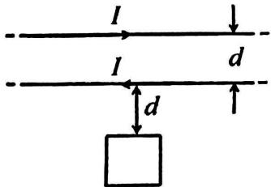

text_image

I
I
d
d
↑

<!-- QUESTION END -->