# 2020～2021学年第二学期期末考试试卷

# 《大学物理 1A/2A》(A 卷, 共 4 页)

(考试时间：2021年6月22日)

<table><tr><td>题号</td><td>一</td><td>二</td><td>三(21)</td><td>三(22)</td><td>三(23)</td><td>三(24)</td><td>成绩</td><td>核分人签字</td></tr><tr><td>得分</td><td></td><td></td><td></td><td></td><td></td><td></td><td></td><td></td></tr></table>

## 一、选择题（每小题3分，共30分）

<!-- QUESTION: qtype=single_choice tags=质点运动学,运动学方程,积分,加速度 difficulty=2 chapter=第一章 质点运动学与牛顿定律 qid=Q0630 -->
在平面直角坐标系 $Oxy$ 中, 质点的加速度为 $\bar{a} = 4ti$ (SI)。当 $t = 0$ 时, 该质点以 $\bar{v} = 2\bar{j}$ (SI) 的速度通过坐标原点 $O$ 。则该质点在任意时刻的位置矢量是

(A) $2t^{2}\vec{i} + 2\vec{j}$

(B) $\frac{2}{3} t^3\bar{i} + 2t\bar{j}$

(C) $\frac{3}{4}t^{4}\bar{i}+\frac{2}{3}t^{3}\bar{j}$

(D) 不能确定
<!-- ANSWER -->
B
<!-- QUESTION END -->

<!-- QUESTION: qtype=single_choice tags=功和能,动能定理,恒力做功 difficulty=3 chapter=第一章 质点运动学与牛顿定律 qid=Q0631 -->
初速为 $v_{0}$ 的子弹射向一固定着的厚木板, 穿出后速度为 $\frac{1}{3} v_{0}$ 。设木板对子弹的阻力是恒定的, 那么, 当子弹射入木板的深度等于其厚度的一半时, 子弹的速度是

(A) $\frac{1}{3}v_{0}$

(B) $\frac{2}{3}v_{0}$

(C) $\frac{1}{2}v_{0}$

(D) $\frac{\sqrt{5}}{3}v_{0}$
<!-- ANSWER -->
D
<!-- QUESTION END -->

<!-- QUESTION: qtype=single_choice tags=热力学第二定律,克劳修斯表述,开尔文表述,可逆过程 difficulty=2 chapter=第四章 热力学定律 qid=Q0632 -->
由热力学第二定律可知

(A) 不可能从单一热源吸收热量使之全部变为有用的功

(B) 在一个可逆过程中，工作物质净吸热等于对外做的功

(C) 摩擦生热的过程是不可逆的

(D) 热量不可能从温度低的物体传给温度高的物体
<!-- ANSWER -->
C
<!-- QUESTION END -->

<!-- QUESTION: qtype=single_choice tags=静电场,高斯定理,电场强度,介质球 difficulty=3 chapter=第五章 静电学 qid=Q0633 -->
如图, 在半径为 $R$ 、介电常数为 $\varepsilon$ 的各向同性均匀介质球的中心放有点电荷 $+q$ , 在介质球外是真空。在介质球内部距离中心为 $r$ 的 $P$ 点的场强大小为

(A) 0

(B) $\frac{q}{4\pi\varepsilon r^{2}}$

(C) $\frac{q}{4\pi\varepsilon R^{2}}$

(D) $\frac{q}{4\pi\varepsilon_{0}r^{2}}$

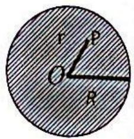
<!-- ANSWER -->
B
<!-- QUESTION END -->

<!-- QUESTION: qtype=single_choice tags=位移电流,麦克斯韦方程组,安培环路定律 difficulty=3 chapter=第六章 稳恒磁场 qid=Q0634 -->
对于位移电流，下列说法哪种是正确的？

(A) 位移电流是由变化的电场产生的  
(B) 位移电流的热效应遵从焦耳定律  
(C) 位移电流的磁效应不服从安培环路定律  
(D) 位移电流产生的磁场与电流（或运动的电荷）产生的磁场有本质的区别
<!-- ANSWER -->
A
<!-- QUESTION END -->

<!-- QUESTION: qtype=single_choice tags=动量守恒,碰撞,摆球,水平方向动量守恒 difficulty=3 chapter=第一章 质点运动学与牛顿定律 qid=Q0635 -->
如图, 子弹以某速率沿图示方向射入一原来静止的摆球中, 摆线长度不可伸缩。子弹射入后开始与摆球一起运动, 则在子弹射入小球的前后瞬间, 下列说法正确的是:

(A) 子弹与小球构成的系统动量守恒  
(B) 子弹与小球构成的系统只有在水平方向动量守恒  
(C) 子弹与小球构成的系统机械能守恒  
(D) 子弹和小球是完全弹性碰撞

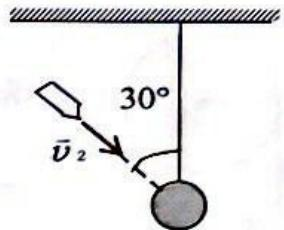
<!-- ANSWER -->
B
<!-- QUESTION END -->

<!-- QUESTION: qtype=single_choice tags=卡诺循环,效率,热力学循环,p-V图 difficulty=3 chapter=第四章 热力学定律 qid=Q0636 -->
某理想气体分别进行了如图所示的两个卡诺循环: I (abcda) 和 II (a'b'c'd'a'), 且两条循环曲线所围面积相等。设循环 I 的效率为 $\eta$ , 每次循环在高温热源处吸的热量为 $Q$ ，循环 II 的效率为 $\eta'$ ，每次循环在高温热源处吸的热量为 $Q'$ ，则

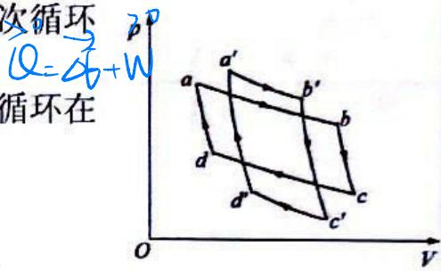

(A) $\eta < \eta'$ , $Q < Q'$

(B) $\eta < \eta'$ , $Q > Q'$

(C) $\eta > \eta'$ , $Q < Q'$

(D) $\eta > \eta'$ , $Q > Q'$
<!-- ANSWER -->
B
<!-- QUESTION END -->

<!-- QUESTION: qtype=single_choice tags=转动惯量,薄球壳,质量分布,刚体转动 difficulty=3 chapter=第二章 刚体力学 qid=Q0637 -->
两个半径相同、质量相等的薄球壳 $A$ 和 $B$ 。 $A$ 的质量均匀分布在球壳上， $B$ 则不均匀地分布着质量。设它们对过球壳圆心的任一直径的转动惯量分别为 ${I}_{\mathrm{A}}$ 和 ${I}_{\mathrm{B}}$ ，则

(A) $I_{\mathrm{A}} > I_{B}$

(B) $I_{A} < I_{B}$

(C) $I_{A}=I_{B}$

(D) 不能确定 $I_{A}$ 、 $I_{B}$ 哪个大
<!-- ANSWER -->
C
<!-- QUESTION END -->

<!-- QUESTION: qtype=single_choice tags=静电学,接地,金属球,感应电荷,电势 difficulty=4 chapter=第五章 静电学 qid=Q0638 -->
如图, 一金属球半径为 $R$ 、带电 $- Q$ , 距离球心为 ${3R}$ 处有一点电荷- $q$ 。现将金属球接地,则金属球面上所带电量为

(A) 0 (B) $-Q + q$ (C) $+q$ (D) 不能确定

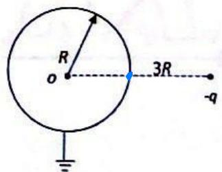
<!-- ANSWER -->
C
<!-- QUESTION END -->

<!-- QUESTION: qtype=single_choice tags=麦克斯韦速率分布,最概然速率,温度影响,速率分布函数 difficulty=3 chapter=第三章 气体动理论 qid=Q0639 -->
一定量的某种理想气体的速率分布遵循麦克斯韦速率分布律，在温度为 $T_{1}$ 与 $T_{2}$ 时的分子最概然速率分别为 $v_{p1}$ 和 $v_{p2}$ ，分子速率分布函数的最大值分别为 $f(v_{p1})$ 和 $f(v_{p2})$ 。若 $T_{1}<T_{2}$ ，则

(A) $v_{p1} > v_{p2}$ , $f(v_{p1}) > f(v_{p2})$

(B) $v_{p1} > v_{p2}$ , $f(v_{p1}) < f(v_{p2})$

(C) $v_{p1} < v_{p2}$ , $f(v_{p1}) > f(v_{p2})$

(D) $v_{p1} < v_{p2}$ , $f(v_{p1}) < f(v_{p2})$
<!-- ANSWER -->
C
<!-- QUESTION END -->

## 二、填空题（每小题3分，共30分）

<!-- QUESTION: qtype=fill_blank tags=圆周运动,角位置,法向加速度,角速度 difficulty=2 chapter=第一章 质点运动学与牛顿定律 qid=Q0640 -->
一质点作半径为 $0.5 \mathrm{~m}$ 的圆周运动, 其角位置的运动方程为: $\theta = \frac{\pi}{3} + \pi t^{2}$ (SI), 则其法向加速度为 $a_{n} = \_\_\_\_\_$ (SI)。
<!-- ANSWER -->
$2\pi^2t^2$
<!-- EXPLANATION -->
由运动方程可得角速度$\omega = \frac{d\theta}{dt} = 2\pi t$，法向加速度$a_n = \omega^2 r = (2\pi t)^2 \times 0.5 = 2\pi^2t^2$。
<!-- QUESTION END -->

<!-- QUESTION: qtype=fill_blank tags=刚体转动,转动惯量,角动量守恒,啮合 difficulty=3 chapter=第二章 刚体力学 qid=Q0641 -->
如图所示, 一均匀飞轮以角速度 $\omega_0$ 绕光滑水平轴旋转, 相对于该轴的转动惯量为 $I_1$ 。该飞轮与另一静止均匀飞轮快速啮合, 并绕同一转轴转动, 另一飞轮相对于该转轴的转动惯量 $I_2 = I_1 / 3$ , 则啮合后两个飞轮共同的角速度 $\omega = \_\_\_\_\_$ 。

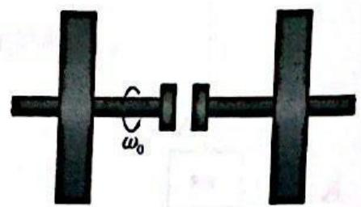
<!-- ANSWER -->
$\frac{3}{4}\omega_0$
<!-- EXPLANATION -->
由角动量守恒：$I_1\omega_0 = (I_1+I_2)\omega = \frac{4}{3}I_1\omega$，解得$\omega = \frac{3}{4}\omega_0$。
<!-- QUESTION END -->

<!-- QUESTION: qtype=fill_blank tags=热力学,等压过程,热量,定压摩尔热容 difficulty=3 chapter=第四章 热力学定律 qid=Q0642 -->
一定量的某种理想气体在等压过程中对外作功为 $200 \mathrm{~J}$ 。若此种气体为单原子分子气体, 则该过程中需吸热 \_\_\_\_ J; 若为刚性双原子分子气体, 则需吸热 \_\_\_\_ J。
<!-- ANSWER -->
333; 280
<!-- EXPLANATION -->
等压过程：$Q = \Delta U + W$。对于单原子分子气体，$C_{V,m} = \frac{3}{2}R$，$C_{p,m} = \frac{5}{2}R$，故$Q = \frac{5}{3}W = \frac{5}{3} \times 200 \approx 333$ J。对于刚性双原子分子气体，$C_{V,m} = \frac{5}{2}R$，$C_{p,m} = \frac{7}{2}R$，故$Q = \frac{7}{5}W = \frac{7}{5} \times 200 = 280$ J。
<!-- QUESTION END -->

<!-- QUESTION: qtype=fill_blank tags=安培环路定律,磁感应强度,无限长直导线 difficulty=3 chapter=第六章 稳恒磁场 qid=Q0643 -->
如图所示, 两根无限长载流直导线相互平行且垂直于纸面, 通过的电流大小分别为 $I_{1}$ 和 $I_{2}$ , 则

$$
\oint_ {L _ {1}} \vec {B} \cdot d \vec {l} = \_\_\_\_\_  ,
$$

$$
\oint_ {L _ {2}} \vec {B} \cdot d \vec {l} = \_\_\_\_\_ .
$$

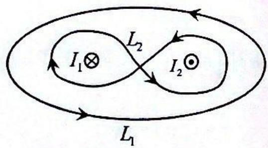
<!-- ANSWER -->
$\mu_0(I_2 - I_1)$；$\mu_0(I_1 + I_2)$
<!-- EXPLANATION -->
根据安培环路定律$\oint \vec{B} \cdot d\vec{l} = \mu_0 \sum I_{内}$，对$L_1$环路，电流$I_2$穿出（正），$I_1$穿入（负），故结果为$\mu_0(I_2 - I_1)$；对$L_2$环路，$I_1$和$I_2$均穿出，故结果为$\mu_0(I_1 + I_2)$。
<!-- QUESTION END -->

<!-- QUESTION: qtype=fill_blank tags=气体动理论,麦克斯韦速率分布,平均碰撞频率,平均自由程 difficulty=3 chapter=第三章 气体动理论 qid=Q0644 -->
气缸内有一定量的氢气（可视为理想气体），当温度不变而压强增大为原来的2倍时，氢气分子的平均碰撞频率变为原来的\_\_\_\_倍，氢气的平均自由程变为原来的\_\_\_\_倍。
<!-- ANSWER -->
2；$\frac{1}{2}$
<!-- EXPLANATION -->
平均碰撞频率$\bar{z} = \sqrt{2}\pi d^2 n \bar{v}$，温度不变时$\bar{v}$不变，$p$增大2倍则$n$增大2倍，故$\bar{z}$增大2倍。平均自由程$\bar{\lambda} = \frac{1}{\sqrt{2}\pi d^2 n}$，$n$增大2倍，$\bar{\lambda}$减小为原来的$\frac{1}{2}$。
<!-- QUESTION END -->

<!-- QUESTION: qtype=fill_blank tags=磁感应强度,电流元,毕奥-萨伐尔定律,圆环磁场 difficulty=4 chapter=第六章 稳恒磁场 qid=Q0645 -->
在真空中, 电流由长直导线 1 从无限远沿半径方向经 $a$ 点流入一由电阻均匀的导线构成的圆环, 再由 $b$ 点沿切向流出, 经长直导线 2 向无限远返回电源(如图)。已知直导线上的电流强度为 $I$ , 圆环半径为 $R$ , $\angle {aOb} = {90}^{ \circ  }$ 。则圆心 $O$ 点处的磁感强度的大小 $B = \_\_\_\_\_$ 。

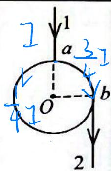
<!-- ANSWER -->
$\frac{\mu_0 I}{4\pi R}$
<!-- EXPLANATION -->
根据毕奥-萨伐尔定律，圆心处的磁感应强度由圆弧部分电流和直导线部分电流共同贡献。由于圆环是均匀电阻的，电流在a点分流，设圆弧ab部分电阻为$R_1$，圆弧badc部分电阻为$R_2$。由于$\angle aOb = 90^\circ$，圆弧ab是1/4圆周，badc是3/4圆周。电阻与弧长成正比，故$R_1:R_2 = 1:3$。根据分流原理，$I_{ab}:I_{badc} = R_2:R_1 = 3:1$。但题目中只给出了总电流$I$，没有具体分流比例。从答案$\frac{\mu_0 I}{4\pi R}$来看，可能假设圆环是超导的或电流全部走某一条路径。
<!-- QUESTION END -->

<!-- QUESTION: qtype=fill_blank tags=电场力做功,电势能,点电荷,半圆轨道 difficulty=4 chapter=第五章 静电学 qid=Q0646 -->
图示 BCD 是以 O 点为圆心，以 R 为半径的半圆弧，在 A 点有一电荷为 +q 的点电荷，O 点有一电荷为 -q 的点电荷。线段 $\overline{BA} = R$ 。现将一单位正电荷从 B 点沿半圆弧轨道 BCD 移到 D 点，则电场力所作的功为 \_\_\_\_\_ 。

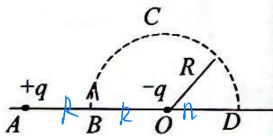

text_image

+q
A
B
C
R
-q
O
n
D

<!-- ANSWER -->
$\frac{q}{6\pi\varepsilon_{0}R}$
<!-- EXPLANATION -->
电场力做功与路径无关，只与初末位置电势差有关。计算B点和D点的电势，考虑+q和-q两个点电荷的贡献，然后利用$W = q_0(V_B - V_D)$计算。
<!-- QUESTION END -->

<!-- QUESTION: qtype=fill_blank tags=平行板电容器,电介质,电荷面密度,电势差 difficulty=3 chapter=第五章 静电学 qid=Q0647 -->
一平行板电容器充电后切断电源，若在两极板间充上各向同性均匀电介质（如煤油），则极板上电荷面密度\_\_\_\_\_\_，极板间的电势差\_\_\_\_\_\_（填“增大”、“减小”或“不变”）。
<!-- ANSWER -->
不变；减小
<!-- EXPLANATION -->
电容器充电后切断电源，电荷Q保持不变，故电荷面密度$\sigma = Q/S$不变。插入电介质后，电容$C = \varepsilon_r C_0$增大，由$V = Q/C$可知电势差减小。
<!-- QUESTION END -->

<!-- QUESTION: qtype=fill_blank tags=磁矩,磁力矩,平面线圈,均匀磁场 difficulty=3 chapter=第六章 稳恒磁场 qid=Q0648 -->
半径分别为 $R_{1}$ 和 $R_{2}$ 的两个半圆弧与直径的两小段构成的平面线圈 abcda (如图所示), 通有电流 I , 放在磁感强度为 $\vec{B}$ 的均匀磁场中, $\vec{B}$ 平行线圈所在平面。则线圈的磁矩大小为 \_\_\_\_, 线圈受到的磁力矩大小为 \_\_\_\_。

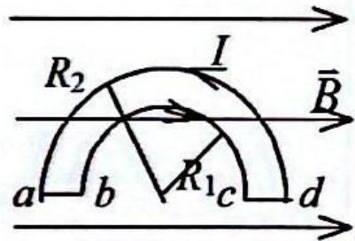

text_image

R₂
I
B̅
a b R₁ c d

<!-- ANSWER -->
$\frac{\pi I}{2}(R_{2}^{2}-R_{1}^{2})$；$\frac{\pi I B(R_{2}^{2}-R_{1}^{2})}{2}$
<!-- EXPLANATION -->
线圈的磁矩$M = I \cdot S$，其中$S$为线圈面积，由两个半圆和两个直径段围成的面积。磁力矩$\tau = M \times B$，由于$\vec{B}$平行线圈平面，磁矩垂直于线圈平面，故$\tau = MB$。
<!-- QUESTION END -->

<!-- QUESTION: qtype=fill_blank tags=动生电动势,导体棒转动,磁场,电势差 difficulty=3 chapter=第七章 电磁感应与麦克斯韦方程组 qid=Q0649 -->
如图, 在均匀磁场 $\bar{B}$ 中, 长为 $L$ 的金属棒 $O A$ 绕 $O$ 点在纸面内以角速度 $\omega$ 匀速转动, 则, 棒上的动生电动势大小为 \_\_\_\_, 棒两端电势高的点为 \_\_\_\_ 点 (填 $A$ 或 $O$ )。

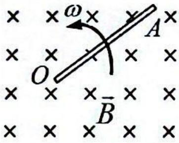

text_image

ω
O
A
B̅

<!-- ANSWER -->
$\frac{1}{2}BL^2\omega$；$O$
<!-- EXPLANATION -->
导体棒转动产生的动生电动势$\varepsilon = \int_0^L vB \, dr = \int_0^L \omega r B \, dr = \frac{1}{2}BL^2\omega$。根据右手定则，O点电势高。
<!-- QUESTION END -->

## 三、计算题（每小题10分，共40分）

<!-- QUESTION: qtype=short_answer tags=刚体力学,转动定律,角加速度,角速度,组合滑轮 difficulty=4 chapter=第二章 刚体力学 qid=Q0650 -->
一大一小的两个匀质圆盘同轴地连结在一起组成了一个组合滑轮。其中, 大小圆盘的半径分别为 $r$ 和 $2 r$ , $r = 0.1 \mathrm{~m}$ , 质量分别为 $m$ 和 $2 m$ 。组合滑轮可绕通过其中心且垂直于盘面的光滑水平固定轴转动, 且对该轴的转动惯量 $I = \frac{9}{2} m r^{2}$ 。两圆盘边缘上分别绕有不可伸长的轻绳, 轻绳下端各悬挂质量均为 $m$ 的物体 $A$ 和 $B$ , 如图所示。该组合滑轮从静止开始运动, 绳与盘之间无相对滑动。求:

(1) 组合滑轮的角加速度 $\beta$ ;  
(2) 当物体 A 上升 $h_{A}=0.4m$ 时，组合滑轮的角速度 $\omega$ 。

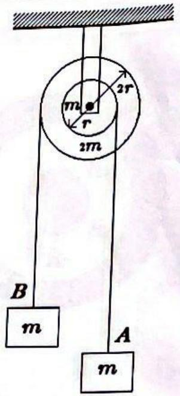

text_image

m
2r
r
2m
B
m
A
m

<!-- ANSWER -->
(1) 对物体B：$mg - T_B = ma_B = m \cdot 2r\beta$；对物体A：$T_A - mg = ma_A = mr\beta$；对滑轮：$T_B \cdot 2r - T_A \cdot r = \frac{9}{2}mr^2\beta$。联立解得$\beta = \frac{g}{10r} = \frac{9.8}{1} = 9.8 \mathrm{rad/s^2}$。

(2) 转过的角度$\theta = \frac{h_A}{r} = \frac{0.4}{0.1} = 4 \mathrm{rad}$，由$\omega^2 = 2\beta\theta$得$\omega = \sqrt{2 \times 9.8 \times 4} = 8.85 \mathrm{rad/s}$。
<!-- QUESTION END -->

<!-- QUESTION: qtype=short_answer tags=热力学循环,绝热过程,等体过程,循环效率,理想气体 difficulty=4 chapter=第四章 热力学定律 qid=Q0651 -->
1 mol 氦气作如图所示的可逆循环过程, 其中 $ab$ 和 $cd$ 是绝热过程, $bc$ 和 $da$ 为等体过程, 已知 $V_{1} = 16.4 \mathrm{~L}, V_{2} = 32.8 \mathrm{~L}, p_{a} = 1 \mathrm{atm}, p_{b} = 3.18 \mathrm{atm}, p_{c} = 4 \mathrm{atm}, p_{d} = 1.26 \mathrm{atm}$ ,

求：

(1) 在 a、b、c、d 各状态氦气的温度；  
(2) 在一循环过程中氦气所作的净功;  
(3) 循环的效率。  
$(1atm=1.013\times10^{5}Pa$ ，普适气体常量 $R=8.31J\cdot mol^{-1}\cdot K^{-1})$

对氦气, i=3, $C_{V}=\frac{3}{2}R$

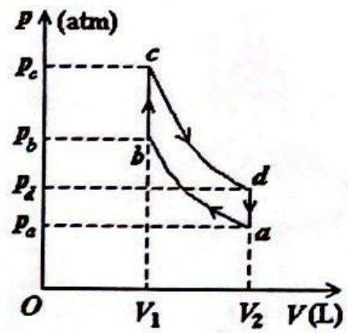

line chart

| Point | V (L) | P (atm) |
|-------|-------|---------|
| a     | V₂    | pₐ      |
| b     | V₁    | p_b     |
| c     | V₁    | p_c     |

<!-- ANSWER -->
(1) 由理想气体状态方程$PV=nRT$：$T_a = \frac{p_a V_2}{R} = 400K$，$T_b = 636K$，$T_c = 800K$，$T_d = 504K$。

(2) 净功 $W = C_V(T_a + T_c - T_b - T_d) = \frac{3}{2} \times 8.31 \times 60 = 747.9 \mathrm{J}$。

(3) 吸热过程只有$bc$等体升温：$Q_{吸} = C_V(T_c - T_b) = \frac{3}{2} \times 8.31 \times 164 = 2044.3 \mathrm{J}$。效率$\eta = \frac{W}{Q_{吸}} = \frac{747.9}{2044.3} = 36.6\%$。
<!-- QUESTION END -->

<!-- QUESTION: qtype=short_answer tags=高斯定理,电场强度分布,球体电荷,球壳电荷,电势 difficulty=4 chapter=第五章 静电学 qid=Q0652 -->
半径为 $R_{0}$ 的球体上均匀分布着体密度为 $\rho_{0}$ 的电荷, 其外同心地嵌套着半径分别

为 $R_{1}$ 和 $R_{2}$ 的球壳，其间均匀分布着体密度为 $\rho_{1}$ 的电荷。

(1) 求整个空间的电场强度分布;  
(2) 取无穷远处作为电势零点，求外球壳 $r = R_{2}$ 处的电势（r 为场点到球心的距离）。

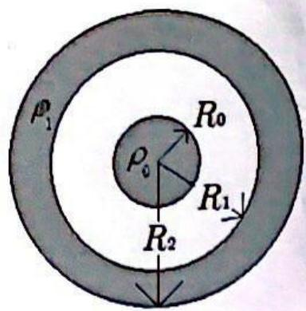

text_image

ρ₁
R₀
ρ₀
R₁
R₂

<!-- ANSWER -->
(1) 由高斯定理，分四个区域：
- $r \leq R_0$：$\vec{E}_1 = \frac{\rho_0 r}{3\varepsilon_0}\vec{e}_r$
- $R_0 < r < R_1$：$\vec{E}_2 = \frac{\rho_0 R_0^3}{3\varepsilon_0 r^2}\vec{e}_r$
- $R_1 \leq r \leq R_2$：$\vec{E}_3 = \frac{\rho_0 R_0^3 + (r^3 - R_1^3)\rho_1}{3\varepsilon_0 r^2}\vec{e}_r$
- $r > R_2$：$\vec{E}_4 = \frac{\rho_0 R_0^3 + (R_2^3 - R_1^3)\rho_1}{3\varepsilon_0 r^2}\vec{e}_r$

(2) $V_{R_2} = \int_{R_2}^{\infty} \vec{E}_4 \cdot d\vec{r} = \frac{\rho_0 R_0^3 + \rho_1(R_2^3 - R_1^3)}{3\varepsilon_0 R_2}$
<!-- QUESTION END -->

<!-- QUESTION: qtype=short_answer tags=电流,磁感应强度,感生电动势,旋转带电圆柱 difficulty=4 chapter=第六章 稳恒磁场 qid=Q0653 -->
如图 a 所示, 将一宽度为 $L$ 、面电荷密度为 $\sigma$ 的薄铜片 ( $\sigma$ 为大于零的常数), 卷成半径为 $R$ 的细圆筒。细圆筒以角速度 $\omega$ 围绕中心轴 $OO'$ 作定轴转动 (设 $L \gg R$ , 因而可以忽略边缘效应)。求:

(1) 轴向单位长度的等效电流;  
(2) 管内磁感应强度的大小及方向;  
(3) 现将一个闭合导体环形回路绕在圆筒外侧附近，导体与圆筒不接触，如图 b 所示。当 $\omega(t)=10t$ (SI) 时，求回路中的感生电动势 $\varepsilon$ 的大小及方向。

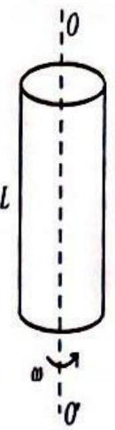  
图a

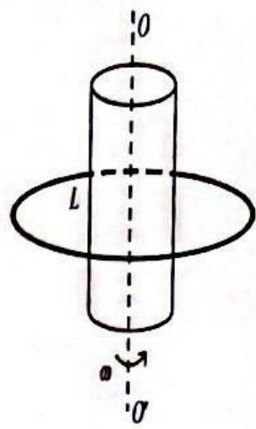

text_image

O
L
a
O'

图b
<!-- ANSWER -->
(1) 单位长度上的电荷：$q = \sigma \cdot 1 \cdot 2\pi R = 2\pi R\sigma$，转动周期 $T = \frac{2\pi}{\omega}$，等效电流 $I_{eq} = \frac{q}{T} = \frac{2\pi R\sigma}{2\pi/\omega} = R\sigma\omega$。

(2) 由安培环路定律，细圆筒相当于无限长螺线管，管内磁感应强度 $B = \mu_0 I_{eq} = \mu_0 R\sigma\omega$，方向沿轴线向上。

(3) 通过导体回路的磁通量 $\Phi = B \cdot \pi R^2 = \mu_0 R\sigma\omega \cdot \pi R^2 = \mu_0 \pi R^3 \sigma \omega = \mu_0 \pi R^3 \sigma \cdot 10t$。感生电动势 $\varepsilon = -\frac{d\Phi}{dt} = -10\mu_0 \pi R^3 \sigma$，大小为 $10\mu_0 \pi R^3 \sigma$，方向由楞次定律判断：从上往下看为顺时针方向。
<!-- QUESTION END -->