2022～2023学年第二学期期末考试试卷

《大学物理 1A/2A》(A 卷, 共 4 页)

$\overline{\lambda_{0}}$ ,

由程

(考试时间：2023年6月12日)

<table><tr><td>题号</td><td>一</td><td>二</td><td>三(21)</td><td>三(22)</td><td>三(23)</td><td>三(24)</td><td>成绩</td><td>核分人签字</td></tr><tr><td>得分</td><td></td><td></td><td></td><td></td><td></td><td></td><td></td><td></td></tr></table>

一、选择题（每小题3分，共30分）

<!-- QUESTION: qtype=single_choice tags=质点运动学,位矢,运动方程 difficulty=2 chapter=第一章 质点运动学与牛顿定律 qid=Q0660 -->

一质点在 $Oxy$ 平面内运动，已知质点位矢的表达式为 $\vec{r} = 3t\vec{i} + t^2\vec{j}$ (SI)，则质点作

(A) 变速直线运动

(B) 匀速直线运动

(C) 抛物线运动

(D) 一般曲线运动

[ ]

<!-- ANSWER -->
C

<!-- EXPLANATION -->
由位矢表达式可得轨迹方程 $y = \frac{x^2}{9}$，为抛物线。速度 $\vec{v} = 3\vec{i} + 2t\vec{j}$，加速度 $\vec{a} = 2\vec{j}$。加速度恒定，但初速度方向与加速度方向不平行，故质点做匀变速抛物线运动。

<!-- QUESTION END -->

<!-- QUESTION: qtype=single_choice tags=功,力,位移,矢量运算 difficulty=2 chapter=第一章 质点运动学与牛顿定律 qid=Q0661 -->

在 $\vec{F} = -2\vec{i} - 5\vec{j} + 6\vec{k}$ (SI)等几个力同时作用下，质点发生了 $\Delta \vec{r} = 8\vec{i} - 4\vec{j} + 7\vec{k}$ (SI)的位移，则此力在该位移过程中所做的功为

(A) 46J

(B) 27J

(C) 61J

(D) 31J

[ ]

<!-- ANSWER -->
A

<!-- EXPLANATION -->
功的计算公式为 $W = \vec{F} \cdot \Delta \vec{r} = (-2) \times 8 + (-5) \times (-4) + 6 \times 7 = -16 + 20 + 42 = 46$ J。

<!-- QUESTION END -->

<!-- QUESTION: qtype=single_choice tags=分子速率分布函数,平均速率,统计物理 difficulty=3 chapter=第三章 气体动理论 qid=Q0662 -->

设某种气体的分子速率分布函数为 $f(v)$ ，则速率在 $v_{1} \sim v_{2}$ 区间内的分子的平均速率为

(A) $\int_{v_1}^{v_2} v f(v) \, \mathrm{d}v$

(B) $\int_{v_1}^{v_2}f(v)\mathrm{d}v$

(C) $\int_{v_1}^{v_2}f(v)\mathrm{d}v / \int_{0}^{\infty}f(v)\mathrm{d}v$

(D) $\int_{v_1}^{v_2} v f(v) \, \mathrm{d}v / \int_{v_1}^{v_2} f(v) \, \mathrm{d}v$

[ ]

<!-- ANSWER -->
D

<!-- EXPLANATION -->
平均速率的定义为 $\bar{v} = \frac{\int v f(v) dv}{\int f(v) dv}$，对于给定速率区间 $v_1 \sim v_2$，平均速率为 $\bar{v} = \frac{\int_{v_1}^{v_2} v f(v) dv}{\int_{v_1}^{v_2} f(v) dv}$。

<!-- QUESTION END -->

<!-- QUESTION: qtype=single_choice tags=热力学循环,卡诺循环,热力学第一定律,热力学第二定律 difficulty=3 chapter=第四章 热力学定律 qid=Q0663 -->

题中所列四图分别表示理想气体的四个设想的循环过程，其中符合热力学理论、可能实现的循环过程是

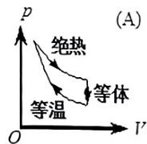

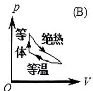

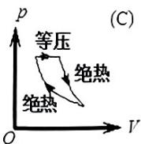

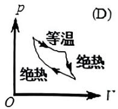

[ ]

<!-- ANSWER -->
B

<!-- EXPLANATION -->
热力学循环必须满足热力学第一定律和第二定律。循环过程在p-V图上必须是闭合曲线，且循环方向必须是顺时针方向（热机循环）。分析四个图：图A是逆时针循环（制冷机），图B是顺时针循环，图C和图D不符合热力学过程的基本规律。因此B是可能实现的循环。

<!-- QUESTION END -->

<!-- QUESTION: qtype=single_choice tags=分子平均自由程,碰撞频率,理想气体 difficulty=3 chapter=第三章 气体动理论 qid=Q0664 -->

容积恒定的容器内盛有一定量某种理想气体, 其分子热运动的平均自由程为 $\overline{\lambda_0}$ , 平均碰撞频率为 $\overline{Z_0}$ , 若气体的热力学温度降低为原来的 $1 / 4$ 倍, 则此时分子平均自由程 $\bar{\lambda}$ 和平均碰撞频率 $\overline{Z}$ 分别为:

(A) $\bar{\lambda} = \overline{\lambda_0}$ , $\overline{Z} = \overline{Z_0}$

(B) $\bar{\lambda} = \overline{\lambda_0}$ , $\overline{Z} = \frac{1}{2}\overline{Z_0}$

(C) $\bar{\lambda} = 2\overline{\lambda_0}$ , $\overline{Z} = 2\overline{Z_0}$

(D) $\bar{\lambda} = \sqrt{2\lambda_0}, \overline{Z} = \frac{1}{2}\overline{Z_0}$

[ ]

<!-- ANSWER -->
B

<!-- EXPLANATION -->
平均自由程公式为 $\bar{\lambda} = \frac{1}{\sqrt{2}\pi d^2 n}$，其中 $n$ 是分子数密度。对于定容容器，$n$ 不变，所以平均自由程 $\bar{\lambda}$ 不变。平均碰撞频率 $\bar{Z} = \sqrt{2}\pi d^2 n \bar{v}$，其中 $\bar{v} = \sqrt{\frac{8kT}{\pi m}}$ 是平均速率。温度降低为原来的1/4，则平均速率降低为原来的1/2，所以碰撞频率也降低为原来的1/2。

<!-- QUESTION END -->

<!-- QUESTION: qtype=single_choice tags=热力学第二定律,熵,可逆过程 difficulty=3 chapter=第四章 热力学定律 qid=Q0665 -->

根据热力学第二定律判断下列哪种说法是正确的

(A) 热量能从高温物体传到低温物体，但不能从低温物体传到高温物体；  
(B) 功可以全部变为热，但热不能全部变为功；  
(C) 气体能够自由膨胀，但不能自动收缩；  
(D) 有规则运动的能量能够变为无规则运动的能量, 但无规则运动的能量不能变为有规则运动的能量。 [ ]

<!-- ANSWER -->
C

<!-- EXPLANATION -->
热力学第二定律的克劳修斯表述：热量不能自发地从低温物体传到高温物体（但可以通过外功实现）。开尔文表述：不可能从单一热源吸热使之完全变为功而不产生其他影响。选项A错误，因为热量可以从低温传到高温但需要外功。选项B错误，热可以全部变为功但会引起其他变化。选项C正确，自由膨胀是不可逆过程，不能自动收缩。选项D错误，无规则运动能量也可以转化为有规则运动能量。

<!-- QUESTION END -->

<!-- QUESTION: qtype=single_choice tags=平行板电容器,静电感应,电荷分布 difficulty=4 chapter=第五章 静电学 qid=Q0666 -->

三块平行金属板 $A$ 、 $B$ 、 $C$ 的面积都是 $200 \mathrm{~cm}^{2}$ ， $A$ 、 $B$ 相距 $4.0 \mathrm{~mm}$ ， $A$ 、 $C$ 相距 $2.0 \mathrm{~mm}$ ， $B$ 、 $C$ 两板都接地，如图。如果 $A$ 板带正电 $3.0 \times 10^{-7} \mathrm{C}$ ， $B$ 、 $C$ 两极的感应电荷 $q_{B}$ 、 $q_{c}$ 的关系为

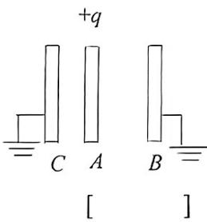

text_image

+q
C A
[ ]
B

(A) $q_{B} = 2q_{c}$

(B) $q_{B} = q_{c}$

(C) $q_{B} = 1 / 2q_{c}$

(D) $q_{B} = -q_{c}$

<!-- ANSWER -->
C

<!-- EXPLANATION -->
由于B、C两板接地，A板上的电荷分布使得A与B之间和A与C之间的电压相等。设A板左侧（靠近B）电荷面密度为$\sigma_1$，右侧（靠近C）电荷面密度为$\sigma_2$，则$\sigma_1 + \sigma_2 = Q/S$。电压关系：$U_{AB} = \frac{\sigma_1}{\varepsilon_0} d_{AB} = U_{AC} = \frac{\sigma_2}{\varepsilon_0} d_{AC}$，所以$\sigma_1 d_{AB} = \sigma_2 d_{AC}$，即$\sigma_1/\sigma_2 = d_{AC}/d_{AB} = 2.0/4.0 = 1/2$。因此B板感应电荷$q_B = -\sigma_1 S = -\frac{1}{2}\sigma_2 S = \frac{1}{2} q_C$（大小上），即$q_B = \frac{1}{2} q_C$。

<!-- QUESTION END -->

<!-- QUESTION: qtype=single_choice tags=无限长带电线,电场强度,库仑定律,单位长度力 difficulty=3 chapter=第五章 静电学 qid=Q0667 -->

两条平行的无限长直均匀带电线，相距为 $d$ ，线电荷密度分别为 $\pm \eta$ ，则两线单位长度间的相互作用力大小为

(A) $\frac{\eta^2}{4\pi\varepsilon_0d^2}$

(B) $\frac{\eta^2}{4\pi\varepsilon_0d}$

(C) $\frac{\eta^2}{2\pi\varepsilon_0d^2}$ (D) $\frac{\eta^2}{2\pi\varepsilon_0d}$

[ ]

<!-- ANSWER -->
D

<!-- EXPLANATION -->
一条无限长带电线在距离d处产生的电场强度为 $E = \frac{\eta}{2\pi\varepsilon_0 d}$，另一条带电线单位长度受到的力为 $f = \lambda E = \eta \cdot \frac{\eta}{2\pi\varepsilon_0 d} = \frac{\eta^2}{2\pi\varepsilon_0 d}$。

<!-- QUESTION END -->

<!-- QUESTION: qtype=single_choice tags=圆电流,磁感强度,叠加原理 difficulty=3 chapter=第六章 稳恒磁场 qid=Q0668 -->

两个载有相等电流 $I$ 的半径为 $R$ 的圆线圈，一个位于水平面内，一个位于垂直平面内，两线圈的圆心重合，则圆心 $O$ 的磁感强度大小为

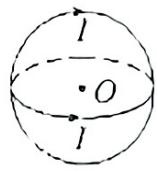

(A) 0

(B) $\frac{\mu_0I}{2R}$

(C) $\frac{\sqrt{2}\mu_0I}{2R}$

(D) $\frac{\mu_0I}{R}$

[ ]

<!-- ANSWER -->
C

<!-- EXPLANATION -->
每个圆电流在圆心处产生的磁感强度大小为 $B = \frac{\mu_0 I}{2R}$。两个圆线圈一个在水平面内，一个在垂直平面内，它们产生的磁场方向相互垂直。根据叠加原理，圆心处的总磁感强度为 $B_{总} = \sqrt{B^2 + B^2} = \sqrt{2} \cdot \frac{\mu_0 I}{2R} = \frac{\sqrt{2}\mu_0 I}{2R}$。

<!-- QUESTION END -->

<!-- QUESTION: qtype=single_choice tags=同轴电缆,安培环路定理,磁感强度分布 difficulty=4 chapter=第六章 稳恒磁场 qid=Q0669 -->

一根很长的电缆线由两个同轴的半径分别为 $R_{1}$ 和 $R_{2}$ 圆柱面导体组成 $(R_{1} < R_{2})$ 。若这两个圆柱面沿轴向通有等值反向电流，那么下列图中能正确反映电流产生的磁感强度随径向距离的变化关系的是 [ ]

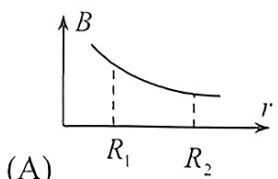

line chart

| Point | r | B |
|---|---|---|
| R₁ | 0.5 | 1 |
| R₂ | 1.0 | 0.5 |

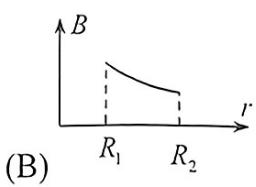

line chart

| r    | B     |
| ---- | ----- |
| R₁   | Peak  |
| R₂   | Decline |

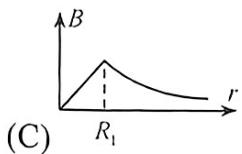

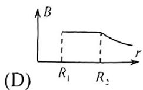

<!-- ANSWER -->
C

<!-- EXPLANATION -->
根据安培环路定理：在r < R1区域，由于对称性，B=0；在R1 < r < R2区域，B与r成反比，B = (μ₀I)/(2πr)；在r > R2区域，由于内外电流等值反向，总电流为0，所以B=0。正确的图形应该是在R1处从0开始，随r增加而减小，在R2处降为0，这与图C相符。

<!-- QUESTION END -->

二、填空题（每小题3分，共30分）

<!-- QUESTION: qtype=fill_blank tags=路程,切向加速度,法向加速度,圆周运动 difficulty=3 chapter=第一章 质点运动学与牛顿定律 qid=Q0670 -->

在半径为 $R$ 的圆周上运动的质点, 其速率与时间关系为 $v = c t^{2}$ (式中 $c$ 为常量), 则从 0 到 $t$ 时刻质点走过的路程 $S(t) =$ \_\_\_\_; $t$ 时刻质点的切向加速度 $a_{t} =$ \_\_\_\_; $t$ 时刻质点的法向加速度 $a_{n} =$ \_\_\_\_。

<!-- ANSWER -->
$\frac{1}{3}ct^3$; $2ct$; $\frac{c^2t^4}{R}$

<!-- EXPLANATION -->
路程是速率对时间的积分：$S(t) = \int_0^t v dt = \int_0^t ct^2 dt = \frac{1}{3}ct^3$。切向加速度是速率对时间的导数：$a_t = \frac{dv}{dt} = 2ct$。法向加速度为 $a_n = \frac{v^2}{R} = \frac{(ct^2)^2}{R} = \frac{c^2t^4}{R}$。

<!-- QUESTION END -->

<!-- QUESTION: qtype=fill_blank tags=变力作用,直线运动,速率计算 difficulty=3 chapter=第一章 质点运动学与牛顿定律 qid=Q0671 -->

一质点在力 $F = 5m(5 - 2t)$ (SI) 的作用下， $t = 0$ 时从静止开始作直线运动，式中 $m$ 为质点的质量， $t$ 为时间，则当 $t = 3s$ 时，质点的速率为 \_\_\_\_。

<!-- ANSWER -->
30 m/s

<!-- EXPLANATION -->
根据牛顿第二定律，加速度 $a = F/m = 5(5-2t) = 25 - 10t$。速率是加速度对时间的积分：$v(t) = \int_0^t a(t) dt = \int_0^t (25 - 10t) dt = 25t - 5t^2$。当 $t = 3s$ 时，$v(3) = 25 \times 3 - 5 \times 9 = 75 - 45 = 30$ m/s。

<!-- QUESTION END -->

<!-- QUESTION: qtype=fill_blank tags=角动量守恒,转动惯量,转台,人-转台系统 difficulty=3 chapter=第二章 刚体力学 qid=Q0672 -->

有一半径为 R 的匀质圆形水平转台，可绕通过盘心 O 且垂直于盘面的竖直固定轴 $OO'$ 转动，转动惯量为 J。台上有一人，质量为 m。当他站在离转轴 r 处时 $(r < R)$ ，转台和人一起以角速度 $\omega_{1}$

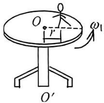

text_image

O
r
ω₁
O′

转动, 如图。若转轴处摩擦可以忽略, 问当人走到转台边缘时, 转台和人一起转动的角速度 $\omega_{2} =$ \_\_\_\_。

<!-- ANSWER -->
$\omega_2 = \frac{(J + mr^2)\omega_1}{J + mR^2}$

<!-- EXPLANATION -->
系统对转轴的角动量守恒。初始角动量为 $L_1 = (J + mr^2)\omega_1$，人走到边缘后，转动惯量变为 $J + mR^2$，角速度变为 $\omega_2$，角动量为 $L_2 = (J + mR^2)\omega_2$。由角动量守恒 $L_1 = L_2$，解得 $\omega_2 = \frac{(J + mr^2)\omega_1}{J + mR^2}$。

<!-- QUESTION END -->

<!-- QUESTION: qtype=fill_blank tags=理想气体,质量比,内能,等压过程,热容量 difficulty=3 chapter=第三章 气体动理论 qid=Q0673 -->

压强、体积和温度都相同的氢气和氦气(均视为刚性分子的理想气体), 它们的质量之比为 $m_{1}: m_{2}=$ , 它们的内能之比为 $E_{1}: E_{2}=$ , 如果它们分别在等压过程中吸收了相同的热量, 则它们对外作功之比为 $W_{1}: W_{2}=$ 。(各量下角标 1 表示氢气, 2 表示氦气; 氢气的摩尔质量为 $2 \mathrm{~g} / \mathrm{mol}$ , 氦气的摩尔质量为 $4 \mathrm{~g} / \mathrm{mol}$ 。)

<!-- ANSWER -->
$m_1:m_2 = 1:2$; $E_1:E_2 = 5:3$; $W_1:W_2 = 5:7$

<!-- EXPLANATION -->
根据理想气体状态方程 $pV = nRT$，压强、体积、温度相同，则摩尔数 $n$ 相同。质量 $m = nM$，所以 $m_1:m_2 = M_1:M_2 = 2:4 = 1:2$。内能 $E = \frac{i}{2}nRT$，氢气是双原子分子 $i=5$，氦气是单原子分子 $i=3$，所以 $E_1:E_2 = 5:3$。等压过程吸收热量 $Q = nC_p\Delta T$，对外做功 $W = nR\Delta T$。由 $Q = nC_p\Delta T$ 相同，得 $\Delta T_1:\Delta T_2 = C_{p2}:C_{p1} = \frac{5}{2}R:\frac{7}{2}R = 5:7$，所以 $W_1:W_2 = \Delta T_1:\Delta T_2 = 5:7$。

<!-- QUESTION END -->

<!-- QUESTION: qtype=fill_blank tags=卡诺热机,热效率,热量传递 difficulty=3 chapter=第四章 热力学定律 qid=Q0674 -->

有一卡诺热机, 其高温热源和低温热源的温度分别为 $T_{1}$ 和 $T_{2}$ , 若热机每 循环从高温热源吸收的热量为 $Q$ , 则每一循环向低温热源放出的热量为

<!-- ANSWER -->
$Q_2 = \frac{T_2}{T_1}Q$

<!-- EXPLANATION -->
卡诺热机的热效率为 $\eta = 1 - \frac{T_2}{T_1}$，对外做功 $W = Q\eta = Q(1 - \frac{T_2}{T_1})$。根据热力学第一定律，放出的热量为 $Q_2 = Q - W = Q - Q(1 - \frac{T_2}{T_1}) = \frac{T_2}{T_1}Q$。

<!-- QUESTION END -->

<!-- QUESTION: qtype=fill_blank tags=高斯定理,电场强度,电势,同心球面 difficulty=3 chapter=第五章 静电学 qid=Q0675 -->

两个同心球面半径分别为 $R_{1}$ 和 $R_{2}(R_{2} > R_{1})$ , 其上分别均匀带有 $+Q$ 和 $-Q$ 的电荷,选无穷远处为电势零点。则 $R_{2}$ 球面外任一点的电场强度大小为 , 球心处电势为 。

<!-- ANSWER -->
$E = 0$; $\varphi = \frac{Q}{4\pi\varepsilon_0 R_1} - \frac{Q}{4\pi\varepsilon_0 R_2}$

<!-- EXPLANATION -->
在 $R_2$ 球面外，由高斯定理，$\oint \vec{E} \cdot d\vec{A} = \frac{Q_{内}}{\varepsilon_0}$，内球面带 $+Q$，外球面带 $-Q$，总电荷为 0，所以 $E = 0$。球心处电势为两个球面电荷产生的电势之和：$\varphi = \frac{Q}{4\pi\varepsilon_0 R_1} + \frac{-Q}{4\pi\varepsilon_0 R_2} = \frac{Q}{4\pi\varepsilon_0 R_1} - \frac{Q}{4\pi\varepsilon_0 R_2}$。

<!-- QUESTION END -->

<!-- QUESTION: qtype=fill_blank tags=平行板电容器,电介质,电场强度,电场能量 difficulty=3 chapter=第五章 静电学 qid=Q0676 -->

一平行板电容器, 充电后切断电源, 然后使两极板间充满相对介电常量为 $\varepsilon_{r}$ 的各向同性均匀电介质。此时两极板间的电场强度是原来的\_\_\_\_倍, 电场能量是原来的\_\_\_\_倍。

<!-- ANSWER -->
$\frac{1}{\varepsilon_r}$; $\frac{1}{\varepsilon_r}$

<!-- EXPLANATION -->
平行板电容器充电后切断电源，电荷量Q不变。插入电介质后，电容变为 $C = \varepsilon_r C_0$，电压 $U = Q/C = Q/(\varepsilon_r C_0) = U_0/\varepsilon_r$。电场强度 $E = U/d = E_0/\varepsilon_r$，所以是原来的 $1/\varepsilon_r$ 倍。电场能量 $W = \frac{1}{2}QU = \frac{1}{2}Q U_0/\varepsilon_r = W_0/\varepsilon_r$，也是原来的 $1/\varepsilon_r$ 倍。

<!-- QUESTION END -->

<!-- QUESTION: qtype=fill_blank tags=磁矩,磁力矩,载流线圈 difficulty=3 chapter=第六章 稳恒磁场 qid=Q0677 -->

已知面积相等的载流圆线圈与载流正方形线圈的磁矩之比为 2:1，圆线圈在其中心处产生的磁感强度为 $B_{0}$ ，那么正方形线圈(边长为 $a$ ) 在磁感强度为 $\bar{B}$ 的均匀外磁场中所受最大磁力矩为 \_\_\_\_。

<!-- ANSWER -->
$M = \frac{a^3 B_0 B}{\mu_0 \sqrt{\pi}}$

<!-- EXPLANATION -->
设圆线圈半径为 $R$，电流为 $I_1$，正方形线圈电流为 $I_2$，面积均为 $S$。两线圈面积相等：$\pi R^2 = a^2$，所以 $R = a/\sqrt{\pi}$。
磁矩 $m = IS$，由磁矩比 $m_1:m_2 = I_1:I_2 = 2:1$，得 $I_2 = I_1/2$。
圆线圈中心磁感强度 $B_0 = \frac{\mu_0 I_1}{2R}$，故 $I_1 = \frac{2R B_0}{\mu_0}$。
正方形线圈磁矩 $m_2 = I_2 S = \frac{I_1}{2} \cdot a^2 = \frac{1}{2} \cdot \frac{2R B_0}{\mu_0} \cdot a^2 = \frac{R B_0 a^2}{\mu_0}$。
代入 $R = a/\sqrt{\pi}$，得 $m_2 = \frac{a^3 B_0}{\mu_0 \sqrt{\pi}}$。
在均匀外磁场 $\bar{B}$ 中，最大磁力矩为 $M = m_2 B = \frac{a^3 B_0 B}{\mu_0 \sqrt{\pi}}$。

<!-- QUESTION END -->

<!-- QUESTION: qtype=fill_blank tags=安培力,载流导线,圆弧形导线 difficulty=3 chapter=第六章 稳恒磁场 qid=Q0678 -->

如图所示, 有一半径为 $R$ 、流过稳恒电流 $I$ 的 $1 / 4$ 圆弧形载流导线 $ab$ , 按图示方式置于匀强磁场 $B$ 中, 则导线 $ab$ 所受安培力大小为 , 方向 。

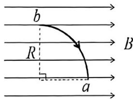

text_image

b
R
a
B

<!-- ANSWER -->
$F = \sqrt{2}BIR$; 方向垂直纸面向外

<!-- EXPLANATION -->
对于弯曲导线在匀强磁场中的安培力，等效长度为从起点到终点的直线距离。1/4圆弧的起点a到终点b的直线距离为 $\sqrt{R^2+R^2} = \sqrt{2}R$。因此安培力大小为 $F = BI \cdot \sqrt{2}R = \sqrt{2}BIR$。根据左手定则，电流从a流向b，磁场方向向右，安培力方向垂直纸面向外。

<!-- QUESTION END -->

<!-- QUESTION: qtype=fill_blank tags=麦克斯韦方程组,位移电流,电场环流 difficulty=4 chapter=第七章 电磁感应与麦克斯韦方程组 qid=Q0679 -->

在没有自由电荷与传导电流的变化电磁场中, 若任意 $t$ 时刻的电位移矢量及磁感应强度矢量分别为 $\bar{D}$ 和 $\bar{B}$ , $\bar{D}$ 和 $\bar{B}$ 均为时间和坐标的函数。由麦克斯韦方程组可知, 沿闭合环路 $l$ , $\oint_{l} \bar{H} \cdot \mathrm{d}\bar{l} =$ \_\_\_\_, $\oint_{l} \bar{E} \cdot \mathrm{d}\bar{l} =$ \_\_\_\_。(设环路包围的面积为 $S$ )

<!-- ANSWER -->
$\frac{d}{dt}\int_S \bar{D} \cdot d\bar{S}$; $-\frac{d}{dt}\int_S \bar{B} \cdot d\bar{S}$

<!-- EXPLANATION -->
根据麦克斯韦方程组：第一，安培-麦克斯韦定律：$\oint \bar{H} \cdot d\bar{l} = \int_S \bar{J}_f \cdot d\bar{S} + \frac{d}{dt}\int_S \bar{D} \cdot d\bar{S}$，在没有传导电流时，$\oint \bar{H} \cdot d\bar{l} = \frac{d}{dt}\int_S \bar{D} \cdot d\bar{S}$，即位移电流。第二，法拉第电磁感应定律：$\oint \bar{E} \cdot d\bar{l} = -\frac{d}{dt}\int_S \bar{B} \cdot d\bar{S}$，表示变化的磁场产生电场。

<!-- QUESTION END -->

三、计算题（每小题10分，共40分）

<!-- QUESTION: qtype=short_answer tags=刚体力学,转动定律,角加速度,角动量 difficulty=4 chapter=第二章 刚体力学 qid=Q0680 -->

质量为 $M = 2.0 \mathrm{~kg}$ 、半径为 $R = 0.2 \mathrm{~m}$ 的定滑轮绕通过其中心的水平固定光滑轴, 以初角速度 $\omega_0 = 30 \mathrm{rad} / \mathrm{s}$ 作顺时针方向的转动, 定滑轮对该轴的转动惯量为 $J = M R^2 / 2$ 。一根不可伸长的轻绳一端固定在定滑轮上, 另一端系有一质量为 $m = 5.0 \mathrm{~kg}$ 的物体, 如图所示。求：

(1) 定滑轮的角加速度大小和方向;

(2) 角速度变化到 $\omega = 0$ 时, 定滑轮转过的角度;

(3) 定滑轮从原来以 $-\omega_{0}$ （顺时针）作转动，到以 $+\omega_{0}$ （逆时针）作转动这一过程所用的时间 $\Delta t$ 。

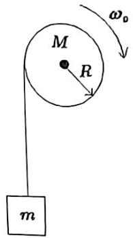

text_image

M
R
ω₀
m

<!-- ANSWER -->
(1) 角加速度大小 $\beta = 40.8 \text{ rad/s}^2$，方向为逆时针方向（与转动方向相反）；(2) 转过的角度 $\theta = 11.0 \text{ rad}$；(3) 所用时间 $\Delta t = 1.47 \text{ s}$

<!-- EXPLANATION -->
(1) 对滑轮和物体系统分析。设绳子拉力为 $T$，物体加速度 $a = R\beta$，滑轮转动惯量 $J = \frac{1}{2}MR^2$。
   对滑轮：$T \cdot R = J \beta$，
   对物体：$mg - T = ma = mR\beta$。
   消去 $T$ 得：$mgR = (J + mR^2)\beta$，
   $\beta = \frac{mgR}{J + mR^2} = \frac{5.0 \times 9.8 \times 0.2}{\frac{1}{2} \times 2.0 \times 0.2^2 + 5.0 \times 0.2^2} = \frac{9.8}{0.04 + 0.2} = \frac{9.8}{0.24} \approx 40.8 \text{ rad/s}^2$。
   方向为逆时针（与初角速度方向相反）。

(2) 根据匀变速转动公式 $\omega^2 = \omega_0^2 + 2\beta\theta$，取 $\beta$ 的大小，$\omega = 0$ 时，
   $\theta = \frac{\omega_0^2}{2\beta} = \frac{30^2}{2 \times 40.8} = \frac{900}{81.6} \approx 11.0 \text{ rad}$。

(3) 角速度从 $-\omega_0$ 到 $+\omega_0$，角速度变化 $\Delta\omega = 2\omega_0 = 60 \text{ rad/s}$，
   $\Delta t = \frac{\Delta\omega}{\beta} = \frac{60}{40.8} \approx 1.47 \text{ s}$。

<!-- QUESTION END -->

<!-- QUESTION: qtype=short_answer tags=热力学循环,等温过程,等体过程,绝热过程,循环效率 difficulty=4 chapter=第四章 热力学定律 qid=Q0681 -->

气缸内有一定量的氧气(看成刚性分子理想气体), 作如图所示的循环过程, 其中 $ab$ 为等温过程, $bc$ 为等体过程, $ca$ 为绝热过程。已知 $a$ 点的状态参量为 $p_a$ 、 $V_a$ 、 $T_a$ , $b$ 点的体积 $V_b = 3V_a$ 。求:

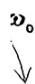

(1) ab、bc、ca 三个热力学过程中，系统分别从外界吸收或放出的热量；  
(2) 该循环的效率。

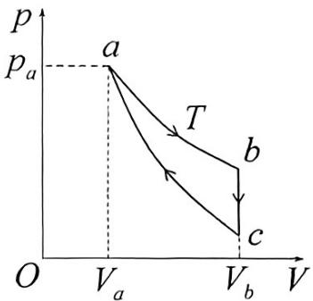

text_image

p
pₐ
a
T
b
c
O
Vₐ
Vₑ
V

<!-- ANSWER -->
(1) ab过程（等温）：$Q_{ab} = p_a V_a \ln 3$；bc过程（等体）：$Q_{bc} = \frac{5}{2} p_a V_a (3^{-0.4} - 1)$；ca过程（绝热）：$Q_{ca} = 0$；(2) 循环效率：$\eta = 1 - \frac{\frac{5}{2}p_aV_a(3^{-0.4}-1)}{p_aV_a\ln 3}$

<!-- EXPLANATION -->
(1) ab等温过程：$Q_{ab} = W_{ab} = \int_{V_a}^{V_b} p dV = \int_{V_a}^{3V_a} \frac{p_a V_a}{V} dV = p_a V_a \ln 3$。bc等体过程：$Q_{bc} = \Delta U = nCv \Delta T = \frac{5}{2} nR (T_c - T_b)$。对于理想气体，$T_b = T_a$（等温），$V_b = 3V_a$，所以 $p_b = p_a/3$。对于绝热过程ca，$p_a V_a^\gamma = p_c V_c^\gamma$，且 $V_c = V_b = 3V_a$，所以 $p_c = p_a \cdot (V_a/V_c)^\gamma = p_a \cdot 3^{-1.4}$。因此 $T_c = p_c V_c/(nR) = p_a \cdot 3^{-1.4} \cdot 3V_a/(nR) = T_a \cdot 3^{1-1.4} = T_a \cdot 3^{-0.4}$。所以 $Q_{bc} = \frac{5}{2} nR (T_a \cdot 3^{-0.4} - T_a) = \frac{5}{2} p_a V_a (3^{-0.4} - 1)$。ca绝热过程：$Q_{ca} = 0$。

(2) 循环效率 $\eta = \frac{W}{Q_{ab}}$，其中 $W = Q_{ab} + Q_{bc}$（$Q_{ca}=0$），所以 $\eta = 1 + \frac{Q_{bc}}{Q_{ab}} = 1 - \frac{\frac{5}{2}p_aV_a(3^{-0.4}-1)}{p_aV_a\ln 3}$。

<!-- QUESTION END -->

<!-- QUESTION: qtype=short_answer tags=高斯定理,电场强度分布,电势分布,厚带电平板 difficulty=4 chapter=第五章 静电学 qid=Q0682 -->

体电荷密度为 $\rho$ 、厚度为 $2d$ 的无穷大均匀厚带电平板如图所示。

(2) 若取图示的坐标原点处为电势零点，求 $x > 0$ 空间的电势分布。

(1) 利用高斯定理, 求平板内、外空间的电场强度分布;

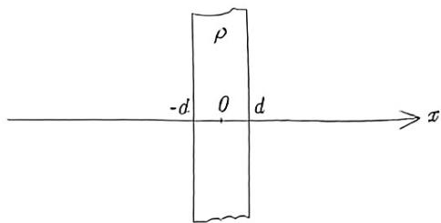

text_image

ρ
-d 0 d
x

<!-- ANSWER -->
(1) 电场强度分布：当 $|x| \leq d$ 时，$E = \frac{\rho x}{\varepsilon_0}$；当 $|x| > d$ 时，$E = \frac{\rho d}{\varepsilon_0}$；(2) 电势分布：当 $0 \leq x \leq d$ 时，$\varphi = -\frac{\rho x^2}{2\varepsilon_0}$；当 $x > d$ 时，$\varphi = -\frac{\rho d^2}{2\varepsilon_0} - \frac{\rho d}{\varepsilon_0}(x - d)$

<!-- EXPLANATION -->
(1) 根据对称性，电场方向垂直于平板。取高斯面为圆柱面，侧面垂直于x轴，底面积为A。对于 $|x| \leq d$：$\oint \vec{E} \cdot d\vec{A} = 2EA = \frac{\rho \cdot 2|x| \cdot A}{\varepsilon_0}$，所以 $E = \frac{\rho |x|}{\varepsilon_0}$，方向沿x轴正向。对于 $|x| > d$：$\oint \vec{E} \cdot d\vec{A} = 2EA = \frac{\rho \cdot 2d \cdot A}{\varepsilon_0}$，所以 $E = \frac{\rho d}{\varepsilon_0}$，方向沿x轴正向。

(2) 以原点为电势零点。电场方向沿x轴正向，故电势随x增大而降低。当 $0 \leq x \leq d$：$\varphi(x) = \varphi(0) - \int_0^x E dx = 0 - \int_0^x \frac{\rho x}{\varepsilon_0} dx = -\frac{\rho x^2}{2\varepsilon_0}$。当 $x > d$：$\varphi(x) = \varphi(d) - \int_d^x E dx = -\frac{\rho d^2}{2\varepsilon_0} - \int_d^x \frac{\rho d}{\varepsilon_0} dx = -\frac{\rho d^2}{2\varepsilon_0} - \frac{\rho d}{\varepsilon_0}(x - d)$。

<!-- QUESTION END -->

<!-- QUESTION: qtype=short_answer tags=运动电荷,等效电流,磁通量,电磁感应,法拉第定律 difficulty=4 chapter=第七章 电磁感应与麦克斯韦方程组 qid=Q0683 -->

一电荷线密度为 $\lambda$ ( $\lambda$ 为大于零的常量) 的长直带电线以变速率 $v = v(t)$ 沿着其长度方向运动。在其右侧放置一与之共面、总电阻为 $R$ 的正方形线圈, 线圈的一组对边与长直带电线平行, 二者的相对位置关系如图所示。不计线圈自身的自感, 求:

(1) 运动带电线产生的等效电流 $I(t)$ ;  
(2) $t$ 时刻穿过正方形线圈围成面积的磁通量 $\Phi_{m}(t)$ ;  
(3) $t$ 时刻正方形线圈中感应电流 $i(t)$ 的大小。

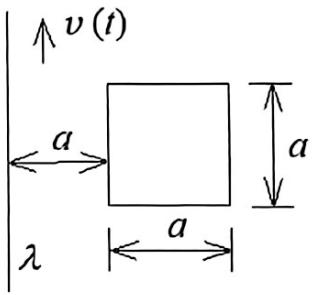

text_image

v(t)
a
a
a
λ

<!-- ANSWER -->
(1) $I(t) = \lambda v(t)$；(2) $\Phi_m(t) = \frac{\mu_0 \lambda v(t)}{2\pi} a \ln \frac{a+d}{d}$；(3) $i(t) = \frac{\mu_0 a \ln \frac{a+d}{d}}{2\pi R} \frac{d\lambda v(t)}{dt}$

<!-- EXPLANATION -->
(1) 运动带电线的等效电流等于电荷线密度乘以速度：$I(t) = \lambda v(t)$。

(2) 根据毕奥-萨伐尔定律，长直带电线在距离r处产生的磁感强度为 $B = \frac{\mu_0 I}{2\pi r}$。穿过正方形线圈的磁通量为 $\Phi_m = \int_S \vec{B} \cdot d\vec{A} = \int_d^{d+a} \frac{\mu_0 I}{2\pi r} \cdot a \, dr = \frac{\mu_0 I a}{2\pi} \ln \frac{d+a}{d}$。代入 $I = \lambda v(t)$ 得：$\Phi_m(t) = \frac{\mu_0 \lambda v(t) a}{2\pi} \ln \frac{a+d}{d}$。

(3) 根据法拉第电磁感应定律，感应电动势 $\varepsilon = -\frac{d\Phi_m}{dt}$。感应电流大小为 $i(t) = \frac{|\varepsilon|}{R} = \frac{1}{R} \left| \frac{d\Phi_m}{dt} \right| = \frac{\mu_0 a \ln \frac{a+d}{d}}{2\pi R} \frac{d\lambda v(t)}{dt}$。

<!-- QUESTION END -->