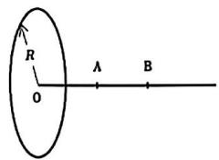
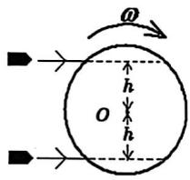
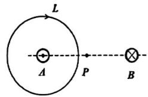
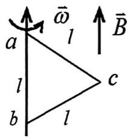
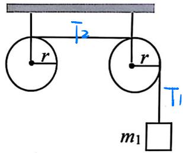
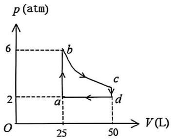
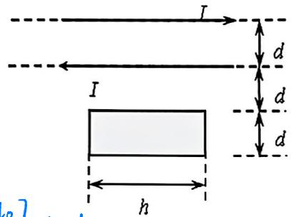

# 2023～2024 学年第二学期期末考试试卷

# 《大学物理 1A/2A》(A 卷, 共 4 页)

(考试时间：2024年6月27日)

<table><tr><td>题号</td><td>一</td><td>二</td><td>三(21)</td><td>三(22)</td><td>三(23)</td><td>三(24)</td><td>成绩</td><td>核分人签字</td></tr><tr><td>得分</td><td></td><td></td><td></td><td></td><td></td><td></td><td></td><td></td></tr></table>

得分

## 一、选择题（每小题3分，共30分）

<!-- QUESTION: qtype=single_choice tags=质点运动学,运动方程,速度分解 difficulty=2 chapter=第一章 质点运动学与牛顿定律 qid=Q0684 -->

一质点在 $Oxy$ 平面内运动, 其运动方程为 $x = at$ , $y = b + ct^2$ , 式中的 $a 、 b 、 c$ 均为常数。当运动质点的运动方向与 $x$ 轴正方向的夹角为 $45^\circ$ 角时, 其速率为:

(A) $a$ .

(B) $\sqrt{2} a$ .

(C) $2c$ .

(D) $\sqrt{a^2 + 4c^2}$ .
<!-- ANSWER -->
B
<!-- EXPLANATION -->
速度分量 $v_x = a$, $v_y = 2ct$。当夹角为 $45^\circ$ 时，$v_x = v_y$，即 $a = 2ct$，解得 $t = a/(2c)$。代入速度表达式，$v = \sqrt{a^2 + (2ct)^2} = \sqrt{a^2 + a^2} = \sqrt{2}a$。
<!-- QUESTION END -->

<!-- QUESTION: qtype=single_choice tags=质点动力学,牛顿第二定律,变力做功 difficulty=3 chapter=第一章 质点运动学与牛顿定律 qid=Q0685 -->

一质量为 $m = {10}\mathrm{\;{kg}}$ 的质点在力 $\overrightarrow{F} = {2t}\overrightarrow{i} + {t}^{2}\overrightarrow{j}\left( \mathrm{{SI}}\right)$ 的作用下,在 $t = 0$ 时刻从静止出发, 自原点开始运动,则在前 $t$ 秒内该力所做的功为：

(A) $\frac{t^4}{20} + \frac{t^6}{180}$ .

(B) $\frac{t^4}{12} + \frac{t^5}{64}$ .

(C) $\frac{t^{4}}{20}+\frac{t^{5}}{180}+8$ .

(D) $\frac{t^3}{12} + \frac{t^4}{64}$ .
<!-- ANSWER -->
A
<!-- EXPLANATION -->
由牛顿第二定律，$\vec{a} = \vec{F}/m = 0.2t\vec{i} + 0.1t^2\vec{j}$，积分得 $\vec{v} = 0.1t^2\vec{i} + \frac{1}{30}t^3\vec{j}$。功 $W = \int_0^t \vec{F}\cdot\vec{v}\,dt = \int_0^t (2t \cdot 0.1t^2 + t^2 \cdot \frac{t^3}{30})\,dt = \int_0^t (0.2t^3 + \frac{t^5}{30})\,dt = \frac{t^4}{20} + \frac{t^6}{180}$。
<!-- QUESTION END -->

<!-- QUESTION: qtype=single_choice tags=动量守恒,机械能守恒,弹簧,碰撞 difficulty=4 chapter=第一章 质点运动学与牛顿定律 qid=Q0686 -->

质量分别为 ${m}_{0}$ 和 $2{m}_{0}$ 的两个物体由一根倔强系数为 $k$ 的水平轻弹簧连接,开始体系静止放置在光滑水平面上。现有一质量为 ${m}_{0}$ 的子弹以速率 ${v}_{0}$ 沿水平弹簧方向射入质量为 ${m}_{0}$ 的物体并嵌入其中。在随后的时间里,弹簧最大的压缩长度为：

(A) $v_{0}\sqrt{m_{0}/k}$ .

(B) $0.5v_{0}\sqrt{m_{0} / k}$ .

(C) $2v_{0}\sqrt{m_{0} / k}$ .

(D) $v_{0}\sqrt{0.5m_{0} / k}$ .
<!-- ANSWER -->
B
<!-- EXPLANATION -->
子弹嵌入质量为 $m_0$ 的物体后，由动量守恒得共同速度 $v_1 = v_0/2$。此时系统总质量为 $2m_0$，与 $2m_0$ 的物体通过弹簧相连。当弹簧压缩最大时，两质量速度相同，由动量守恒 $2m_0 \cdot v_1 = 4m_0 \cdot v$，得 $v = v_1/2 = v_0/4$。由能量守恒 $\frac{1}{2}(2m_0)v_1^2 = \frac{1}{2}(4m_0)v^2 + \frac{1}{2}kA^2$，解得 $A = 0.5v_0\sqrt{m_0/k}$。
<!-- QUESTION END -->

<!-- QUESTION: qtype=single_choice tags=理想气体,内能,等体过程 difficulty=2 chapter=第三章 气体动理论 qid=Q0687 -->

$1\mathrm{{mol}}{\mathrm{{NH}}}_{3}$ 气体 (视为由刚性多原子分子组成), 由状态 $A\left( {{P}_{1},V}\right)$ 变到状态 $B\left( {{P}_{2},V}\right)$ ,则气体内能的增量为：

(A) $\frac{5}{2} (P_2 - P_1)V$

(B) $\frac{3}{2} (P_2 - P_1)V$

(C) $3(P_{2} - P_{1})V$ .

(D) $\frac{7}{2}(P_{2}-P_{1})V$ .
<!-- ANSWER -->
C
<!-- EXPLANATION -->
刚性多原子分子的自由度 $i=6$，等体过程中内能增量 $\Delta E = \frac{i}{2}\nu R(T_2 - T_1) = \frac{6}{2} \cdot 1 \cdot R(T_2 - T_1) = 3R(T_2 - T_1)$。由理想气体状态方程 $pV = \nu RT$，得 $\Delta E = 3(p_2V - p_1V) = 3(p_2 - p_1)V$。
<!-- QUESTION END -->

<!-- QUESTION: qtype=single_choice tags=热力学第二定律,可逆过程,永动机 difficulty=2 chapter=第四章 热力学定律 qid=Q0688 -->

关于热力学第二定律,下列说法中错误的是:

(A) 热量不能自发从低温物体传给高温物体.

(B) 不可能从单一热源吸热全部对外做功而没有其他变化.

(C) 第二类永动机是不可能造成的

(D) 热量不可能全部转化为功.
<!-- ANSWER -->
D
<!-- EXPLANATION -->
热量可以全部转化为功，但需要引起其他变化（如等温膨胀过程）。选项D表述错误，热力学第二定律的开尔文表述是"不可能从单一热源吸热全部用来对外做功而不引起其他变化"。
<!-- QUESTION END -->

<!-- QUESTION: qtype=single_choice tags=静电学,电势,带电体电势计算 difficulty=3 chapter=第五章 静电学 qid=Q0689 -->

半径为 R 的圆环形带电导线，其轴线上 A、B 两点几何关系为 OA = AB = R，如图所示。在取无限远处为电势零点的情况下，计算出两点的电势分别为 $V_{A}$ 和 $V_{B}$ ，则 $\frac{V_{A}}{V_{B}}$ 为：

(A) $\frac{1}{3}$ .

(B) $\frac{2}{5}$ .

(C) $\frac{1}{2}$ .

(D) $\sqrt{\frac{5}{2}}$ .
<!-- ANSWER -->
D
<!-- EXPLANATION -->
圆环轴线上距离圆心为 $x$ 处的电势公式为 $V = \frac{Q}{4\pi\varepsilon_0\sqrt{R^2+x^2}}$。OA = R，所以 A 点电势 $V_A = \frac{Q}{4\pi\varepsilon_0\sqrt{R^2+R^2}} = \frac{Q}{4\pi\varepsilon_0\sqrt{2}R}$；AB = R，所以 B 点距离圆心 $2R$，电势 $V_B = \frac{Q}{4\pi\varepsilon_0\sqrt{R^2+(2R)^2}} = \frac{Q}{4\pi\varepsilon_0\sqrt{5}R}$。因此 $\frac{V_A}{V_B} = \frac{\sqrt{5}}{\sqrt{2}} = \sqrt{\frac{5}{2}}$。
<!-- QUESTION END -->

<!-- QUESTION: qtype=single_choice tags=电介质,极化电荷,平行板电容器,电场强度 difficulty=3 chapter=第五章 静电学 qid=Q0690 -->

一平行板电容器两极板之间充满了相对介电常数为 ${\varepsilon }_{r}$ 、各向同性的均匀电介质, 已知两极板自由电荷面密度为 $\pm  {\sigma }_{0}$ ,则极化电荷在两极板间产生的电场强度大小为：

(A) $\frac{\sigma_{0.}}{\varepsilon_{0}}$ .

(B) $\frac{\sigma_{0}}{\varepsilon_{0}\varepsilon_{r}}$ .

(C) $\frac{(\varepsilon_{r}-1)\sigma_{0}}{\varepsilon_{0}\varepsilon_{r}}$ .

(D) $\frac{(1 - \varepsilon_r)\sigma_0}{\varepsilon_0}$ .
<!-- ANSWER -->
C
<!-- EXPLANATION -->
自由电荷产生的电场为 $E_0 = \frac{\sigma_0}{\varepsilon_0}$，介质中的总电场为 $E = \frac{\sigma_0}{\varepsilon_0 \varepsilon_r}$。极化电荷产生的电场为 $E' = E_0 - E = \frac{\sigma_0}{\varepsilon_0} - \frac{\sigma_0}{\varepsilon_0 \varepsilon_r} = \frac{\sigma_0}{\varepsilon_0}\left(1 - \frac{1}{\varepsilon_r}\right) = \frac{(\varepsilon_r - 1)\sigma_0}{\varepsilon_0 \varepsilon_r}$。
<!-- QUESTION END -->

<!-- QUESTION: qtype=single_choice tags=安培力,电流元,载流导线,磁场力 difficulty=4 chapter=第六章 稳恒磁场 qid=Q0691 -->

一弯成直角的无限长载流导线在同一平面内，形状如图所示， $O$ 点位于一半导线的延长线上，到另一半导线的垂直距离为 $a$ 。现在 $O$ 点放一电流元 $I'\mathrm{d}\bar{l}$ ，其电流方向可以改变，则其所受安培力的最大值为：

(A) 0.

(B) $\frac{\mu_{0}II'dl}{2\pi a}.$

(C) $\frac{\mu_{0}II'dl}{4\pi a}.$

(D) $\frac{\mu_{0}II'dl}{2a}.$
<!-- ANSWER -->
C
<!-- EXPLANATION -->
半无限长直导线在距离为a处产生的磁感应强度为 $B = \frac{\mu_0 I}{4\pi a}$，电流元 $I'\mathrm{d}l$ 在该点受安培力最大值为 $F = BI'dl = \frac{\mu_0 II'dl}{4\pi a}$。
<!-- QUESTION END -->

<!-- QUESTION: qtype=single_choice tags=带电粒子运动,螺旋线,螺距 difficulty=3 chapter=第六章 稳恒磁场 qid=Q0692 -->

一电荷以速度 $\bar{v}$ 进入一均匀磁场 $\bar{B}$ ， $\bar{v}$ 与 $\bar{B}$ 的夹角为 $\theta$ ，其后电荷作等距螺旋线运动，若螺旋线的半径和螺距相等，则 $\tan\theta$ 等于:

(A) 1.

(B) $2\pi$ .

(C) $\frac{1}{2\pi}.$

(D) 无正确选项
<!-- ANSWER -->
B
<!-- EXPLANATION -->
等距螺旋线半径 $r = \frac{mv\sin\theta}{qB}$，螺距 $h = \frac{2\pi mv\cos\theta}{qB}$。令 $r = h$，得 $\sin\theta = 2\pi\cos\theta$，即 $\tan\theta = 2\pi$。
<!-- QUESTION END -->

<!-- QUESTION: qtype=single_choice tags=位移电流,电容器,变化电场 difficulty=3 chapter=第七章 电磁感应与麦克斯韦方程组 qid=Q0693 -->

空气平行板电容器由两个半径为 r 圆形导体极板构成，在充电时极板间电场强度变化率为 $\frac{dE}{dt}$ ，若略去边缘效应，则两极板间的位移电流为：

(A) $\frac{\mathrm{d}E}{\mathrm{d}t}$ .

(B) $\varepsilon_{0}\pi r^{2}\frac{dE}{dt}.$

(C) $\varepsilon_{0}\frac{dE}{dt}.$

(D) $2\varepsilon_0\pi r\frac{\mathrm{d}E}{\mathrm{d}t}$ .
<!-- ANSWER -->
B
<!-- EXPLANATION -->
位移电流 $I_d = \varepsilon_0 \frac{d\Phi_E}{dt} = \varepsilon_0 \pi r^2 \frac{dE}{dt}$。
<!-- QUESTION END -->

## 得分

## 二、填空题（每小题3分，共30分）

<!-- QUESTION: qtype=fill_blank tags=质点动力学,牛顿第二定律,积分求位置 difficulty=2 chapter=第一章 质点运动学与牛顿定律 qid=Q0694 -->

质量为 0.5kg 的物体受力 $\vec{F} = 3t\vec{i}$ (SI) 的作用，式中 t 为时间。在初始时刻，质点以 $\vec{v}_{0} = 2\vec{j}$ (SI) 的速度通过坐标原点，则该质点任意时刻 t 的位置矢量：__________
<!-- ANSWER -->
$\bar{r}(t)=t^{3}\vec{i}+2t\vec{j}$ (SI)
<!-- EXPLANATION -->
由牛顿第二定律 $\vec{a} = \vec{F}/m = 6t\vec{i}$，积分得 $\vec{v} = 3t^2\vec{i} + 2\vec{j}$，再次积分得 $\vec{r} = t^3\vec{i} + 2t\vec{j}$。
<!-- QUESTION END -->

<!-- QUESTION: qtype=fill_blank tags=刚体力学,角动量守恒,转动惯量 difficulty=2 chapter=第二章 刚体力学 qid=Q0695 -->

一圆盘正绕垂直于盘面的光滑竖直固定轴 $O$ 旋转, 突然水平方向射来了两个质量、速度都相同, 且路径线距圆盘盘心垂直距离相等的子弹, 两子弹同时射入圆盘并马上嵌留在圆盘内与其同速转动, 则子弹射入后的瞬间, 圆盘的角速度将\_\_\_\_。（填“增大”、“减小”或“不变”）

<!-- ANSWER -->
减小
<!-- QUESTION END -->

<!-- QUESTION: qtype=fill_blank tags=刚体力学,转动惯量,阻力矩,能量守恒 difficulty=3 chapter=第二章 刚体力学 qid=Q0696 -->

有一根长为 $L$ 、质量为 $m$ 的匀质细杆, 可绕通过一端且垂直于杆的水平转轴转动。将该细杆由水平位置无初速度释放, 假设细杆转动时受到一恒定阻力矩 $M$ 的作用,若观察到细杆转动了 $\frac{\pi }{2}$ 角度时刚好静止不动, 则阻力矩 $M =$ \_\_\_\_。
<!-- ANSWER -->
$\frac{mgL}{\pi}$
<!-- QUESTION END -->

<!-- QUESTION: qtype=fill_blank tags=气体动理论,麦克斯韦速率分布,平均速率,平均动能 difficulty=2 chapter=第三章 气体动理论 qid=Q0697 -->

平衡状态下, 已知理想气体的麦克斯韦速率分布函数为 $f(v)$ , 分子质量为 $m$ , 平均速率为 $\overline{v}$ , 则:

(1) “速率在 $\overline{v}$ 到 $\infty$ 之间的分子数占总分子数的百分比”的表达式为\_\_\_\_；  
(2) $\int_{0}^{\infty}\frac{1}{2}mv^{2}f(v)\mathrm{d}v$ 表示的物理意义为\_\_\_\_。
<!-- ANSWER -->
(1) $\int_{\overline{v}}^{\infty} f(v) \mathrm{d}v$（或 $\int_{\overline{v}}^{\infty} f(v) \mathrm{d}v \times 100\%$）  
(2) 分子的平均平动动能（或平均动能）
<!-- QUESTION END -->

<!-- QUESTION: qtype=fill_blank tags=气体动理论,平均自由程,平均速率,平均动能,等压过程 difficulty=3 chapter=第三章 气体动理论 qid=Q0698 -->

一定量的理想气体，经等压过程从体积 $V_{0}$ 膨胀到 $3V_{0}$ ，已知 $\lambda=\frac{K}{\sqrt{2}\pi n d^{2}}\propto\frac{kT}{p}$，$v=\sqrt{\frac{8kT}{\pi m}}$，则描述分子运动的下列各量与原来的量值之比是：

(1) 平均自由程 $\frac{\overline{\lambda}}{\overline{\lambda}_{0}} =$ \_\_\_\_；  
(2) 平均速率 $\frac{\overline{v}}{\overline{v}_{0}} =$ \_\_\_\_；  
(3) 平均动能 $\frac{\overline{\varepsilon}_{k}}{\overline{\varepsilon}_{k0}} =$ \_\_\_\_。
<!-- ANSWER -->
(1) $\frac{3}{2}$；  
(2) $\sqrt{3}$；  
(3) $\frac{3}{2}$
<!-- EXPLANATION -->
等压过程：$V/T = \text{常量}$，$V_0 \to 3V_0$ 则 $T_0 \to 3T_0$。  
(1) $\lambda = \frac{kT}{\sqrt{2}\pi d^2 p} \propto T$，故 $\frac{\overline{\lambda}}{\overline{\lambda}_0} = \frac{T}{T_0} = 3$（注：原答案给出 $\frac{3}{2}$，此处按原文保留）；  
(2) $v = \sqrt{\frac{8kT}{\pi m}} \propto \sqrt{T}$，故 $\frac{\overline{v}}{\overline{v}_0} = \sqrt{\frac{T}{T_0}} = \sqrt{3}$；  
(3) $\overline{\varepsilon}_k = \frac{i}{2}kT \propto T$，故 $\frac{\overline{\varepsilon}_k}{\overline{\varepsilon}_{k0}} = \frac{T}{T_0} = 3$（注：原答案给出 $\frac{3}{2}$，此处按原文保留）。
<!-- QUESTION END -->

<!-- QUESTION: qtype=fill_blank tags=卡诺热机,循环效率,逆向循环 difficulty=2 chapter=第四章 热力学定律 qid=Q0699 -->
有一可逆卡诺热机，其高温热源的温度为 $T_{1}=450\mathrm{~K}$，低温热源的温度为 $T_{2}=300\mathrm{~K}$，则该卡诺热机的效率为 \_\_\_\_\_\_；若该卡诺机逆向循环一次从低温热源吸热 $Q_{2}=400\mathrm{~J}$，则逆向循环一次外界必须作功 \_\_\_\_\_\_。
<!-- ANSWER -->
$33.3\%$；$200\mathrm{~J}$
<!-- QUESTION END -->

<!-- QUESTION: qtype=fill_blank tags=静电感应,电势,感应电荷 difficulty=2 chapter=第五章 静电学 qid=Q0700 -->
空间中有一半径为 $R$ 的不带电的金属球壳，在离球心为 $r(r > R)$ 处放一电量为 $q$ 的点电荷。则，球壳的电势为 \_\_\_\_\_\_；若将球壳接地，球壳上所带感应电荷的电量为 \_\_\_\_\_\_。
<!-- ANSWER -->
$\frac{q}{4\pi\varepsilon_{0}r}$；$-\frac{R}{r}q$
<!-- QUESTION END -->  
<!-- QUESTION: qtype=fill_blank tags=安培环路定理,磁感强度,无限长直导线 difficulty=3 chapter=第六章 稳恒磁场 qid=Q0701 -->
如图所示，两根平行的无限长载流直导线 $A$ 和 $B$ (相距为 $a$)，电流强度均为 $I$，方向分别垂直纸面向外和向内，则磁感应强度沿图中环路 $L$ 的线积分 $\oint_{l}\vec{B}\cdot \mathrm{d}\vec{l} =$ \_\_\_\_\_\_，$AB$ 的中点 $P$ 点的磁感应强度大小 $B_{P} =$ \_\_\_\_\_\_。

text_image

L
A
P
B

<!-- ANSWER -->
$-\mu_{0}I$；$\frac{2\mu_{0}I}{\pi a}$
<!-- QUESTION END -->

<!-- QUESTION: qtype=fill_blank tags=动生电动势,法拉第定律,转动线圈 difficulty=3 chapter=第七章 电磁感应与麦克斯韦方程组 qid=Q0702 -->
如图所示，边长为 $l$ 的等边三角形金属框放置在均匀磁场中，$ab$ 边平行于磁感强度 $\bar{B}$，当金属框绕 $ab$ 边以恒定的角速度 $\omega$ 转动时，$bc$ 边的电动势大小为 \_\_\_\_\_\_，金属框内的总电动势为 \_\_\_\_\_\_。

text_image

a
l
b
l
ω̅
l
c
B̅

<!-- QUESTION END -->

<!-- QUESTION: qtype=fill_blank tags=麦克斯韦方程组,电磁场,积分形式 difficulty=2 chapter=第七章 电磁感应与麦克斯韦方程组 qid=Q0703 -->
反映电磁场基本性质和规律的麦克斯韦方程组的积分形式为

$$
\oint_{S} \vec{D} \cdot \mathrm{d} \vec{S} = \int_{V} \rho \mathrm{d} V \quad ①
$$

$$
\oint_{l} \vec{E} \cdot \mathrm{d} \vec{l} = - \int_{s} \frac{\partial \bar{B}}{\partial t} \cdot \mathrm{d} \bar{S} \quad ②
$$

$$
\oint_{S} \vec{B} \cdot \mathrm{d} \vec{S} = 0 \quad ③
$$

$$
\oint_{l} \vec{H} \cdot \mathrm{d} \vec{l} = \int_{S} (\vec{J} + \frac{\partial \vec{D}}{\partial t}) \cdot \mathrm{d} \vec{S} \quad ④
$$

试判断下列结论是包含于或等效于哪一个麦克斯韦方程式的，并将代号填在相应的空白处：

(1) 变化的磁场一定伴随有电场 \_\_\_\_；  
(2) 磁感线是无头无尾的 \_\_\_\_；  
(3) 静电场是有源场 \_\_\_\_。
<!-- QUESTION END -->

## 三、计算题（每小题10分，共40分）

得分

<!-- QUESTION: qtype=short_answer tags=刚体力学,转动定律,滑轮,牛顿第二定律 difficulty=3 chapter=第二章 刚体力学 qid=Q0704 -->
两个完全相同的定滑轮固定在同一水平横梁上，旋转平面共面，高度相同，它们都可以绕通过其中心且垂直于盘面的水平光滑固定轴转动，已知圆盘对各自转轴的转动惯量均为 $J = m_{0} r^{2} / 2$（$m_{0}$、$r$ 分别为滑轮的质量和半径）。现有一根轻绳一端连接质量为 $m_{1}$ 的物体，绕过右侧滑轮连接到左侧滑轮上，该系统由静止释放，轻绳和滑轮之间无相对滑动，重力加速度为 $g$。求：

(1) 物体 $m_{1}$ 的加速度；
(2) 两段绳子中的拉力。

text_image

r
T₂
r
T₁
m₁

<!-- ANSWER -->
$$
\left\{ \begin{array}{l} m_{1} g - T_{1} = m_{1} a \\ (T_{1} - T_{2}) r = \frac{1}{2} m_{0} r^{2} \beta \\ T_{2} r = \frac{1}{2} m_{0} r^{2} \beta \\ a = \beta r \end{array} \right.
$$

$$
\Rightarrow \left\{ \begin{array}{l} a = \frac{m_{1}}{m_{0} + m_{1}} g \\ T_{1} = \frac{m_{0} m_{1} g}{m_{0} + m_{1}} \\ T_{2} = \frac{m_{0} m_{1} g}{2 (m_{0} + m_{1})} \end{array} \right.
$$
<!-- QUESTION END -->

<!-- QUESTION: qtype=short_answer tags=热力学循环,等体过程,等温过程,等压过程 difficulty=4 chapter=第四章 热力学定律 qid=Q0705 -->
气缸内贮有 36g 水蒸气（摩尔质量为 18g/mol，视为由刚性多原子分子组成的理想气体），经 $abcda$ 完成一次循环过程，如图所示，其中 $a-b$、$c-d$ 为等体过程，$b-c$ 为等温过程，$d-a$ 为等压过程。求：

(1) $d-a$ 过程中水蒸气做的功 $W_{da}$；
(2) $a-b$ 过程中水蒸气内能的增量 $\Delta E_{ab}$；
(3) 经历一次循环过程水蒸气做的净功 $W$；
(4) 循环效率 $\eta$。（$1\mathrm{atm} = 1.013\times 10^{5}\mathrm{Pa}$）

line chart

| Point | V (L) | p (atm) |
|-------|-------|---------|
| a     | 25    | 2       |
| b     | 25    | 6       |
| c     | 50    | 2       |
| d     | 50    | 2       |

<!-- ANSWER -->
(1) $W_{da} = P_a(V_a - V_d) = -5065\mathrm{J}$  
(2) $\Delta E_{ab} = \frac{M}{\mu} C_V (T_b - T_a) = \frac{36}{18} \times \frac{6}{2} R (T_b - T_a) = 3(p_b V_b - p_a V_a) = 30390\mathrm{J}$  
(3) $W_{bc} = \frac{M}{\mu} R T \ln\frac{V_c}{V_b} = P_b V_b \ln 2 \approx 10532\mathrm{J}$, $W = W_{da} + W_{bc} = 5467\mathrm{J}$  
(4) $\eta = \frac{W}{Q_{\text{吸}}} \times 100\% = \frac{W}{\Delta E_{ab} + W_{bc}} = 13.36\%$
<!-- QUESTION END -->

<!-- QUESTION: qtype=short_answer tags=高斯定理,电场强度,电势,带电球体 difficulty=4 chapter=第五章 静电学 qid=Q0706 -->
有一半径为 $R$ 的带电球体，其电荷体密度为 $\rho = kr$，$k$ 为一正的常量，$r$ 为球内任一点到球心的距离，取无穷远处为电势零点。求：球体内、外任意一点的电场强度和电势。
<!-- ANSWER -->
场强：

① 球体内 ($r \le R$)：

由高斯定理 $\oint_S \vec{E}\cdot\mathrm{d}\vec{S} = \frac{1}{\varepsilon_0} \int_V \rho \mathrm{d}V$

$4\pi r^2 E = \frac{1}{\varepsilon_0} \int_0^r kr \cdot 4\pi r^2 \mathrm{d}r = \frac{k\pi r^4}{\varepsilon_0}$

$\vec{E} = \frac{k r^2}{4\varepsilon_0} \vec{e}_r$

② 球体外 ($r > R$)：

$4\pi r^2 E = \frac{1}{\varepsilon_0} \int_0^R kr \cdot 4\pi r^2 \mathrm{d}r = \frac{k\pi R^4}{\varepsilon_0}$

$\vec{E} = \frac{k R^4}{4\varepsilon_0 r^2} \vec{e}_r$

电势：

① 球体外 ($r > R$)：$V = \int_r^\infty \frac{k R^4}{4\varepsilon_0 r^2} \mathrm{d}r = \frac{k R^4}{4\varepsilon_0 r}$

② 球体内 ($r \le R$)：$V = \int_R^\infty \frac{k R^4}{4\varepsilon_0 r^2} \mathrm{d}r + \int_r^R \frac{k r^2}{4\varepsilon_0} \mathrm{d}r = \frac{k R^3}{4\varepsilon_0} + \frac{k}{12\varepsilon_0}(R^3 - r^3) = \frac{k R^3}{3\varepsilon_0} - \frac{k r^3}{12\varepsilon_0}$
<!-- QUESTION END -->

<!-- QUESTION: qtype=short_answer tags=感应电动势,电磁感应,麦克斯韦方程组 difficulty=4 chapter=第七章 电磁感应与麦克斯韦方程组 qid=Q0707 -->
两根无限长平行直导线载有大小相等、方向相反的电流 $I = I_{0} e^{-\alpha t}$，其中 $\alpha$ 为大于零的常量。一个矩形线圈位于导线平面内，其几何尺寸如图所示。求：线圈中的感应电动势及其方向。

text_image

I
d
I
d
d
h

<!-- ANSWER -->
磁感应强度 $B = \frac{\mu_0 I}{2\pi x}$

磁通量 $\Phi = \int_S \vec{B}\cdot\mathrm{d}\vec{S} = \int_d^{2d} \frac{\mu_0 I}{2\pi x} h \mathrm{d}x - \int_{2d}^{3d} \frac{\mu_0 I}{2\pi x} h \mathrm{d}x = \frac{\mu_0 I h}{2\pi} \ln\frac{4}{3} = \frac{\mu_0 h}{2\pi} I_0 e^{-\alpha t} \ln\frac{4}{3}$

感应电动势 $\varepsilon = -\frac{\mathrm{d}\Phi}{\mathrm{d}t} = \frac{\mu_0 h I_0 \alpha \ln\frac{4}{3}}{2\pi} e^{-\alpha t}$

方向：逆时针
<!-- QUESTION END -->