## 一、选择题（共10题，每小题3分）[得分：]

<!-- QUESTION: qtype=single_choice tags=刚体转动,角动量守恒,完全非弹性碰撞 difficulty=4 chapter=第二章 刚体力学 -->

1、光滑的水平桌面上，有一长为 $2L$ 、质量为 $m$ 的匀质细杆，可绕过其中点且垂直于杆的竖直光滑固定轴 $O$ 自由转动，其转动惯量为 $\frac{1}{3} mL^2$ ，起初杆静止．桌面上有两个质量均为 $m$ 的小球，各自在垂直于杆的方向上，正对着杆的一端，以相同速率 $\nu$ 相向运动，如图所示．当两小球同时与杆的两个端点发生完全非弹性碰撞后，就与杆粘在一起转动，则这一系统碰撞

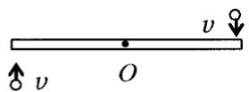  
俯视图

(A) $\frac{2\nu}{3L}$ .

(B) $\frac{4\nu}{5L}$ .

(C) $\frac{6v}{7L}$ .

(D) $\frac{8\nu}{9L}$ .

(E) $\frac{12\nu}{7L}$ .

[ ]

<!-- ANSWER -->
C

<!-- EXPLANATION -->
根据角动量守恒定律，碰撞前后系统对O轴的角动量守恒。碰撞前系统角动量为 $L_0 = 2 \times m \nu L$。碰撞后系统总转动惯量为 $I = \frac{1}{3}mL^2 + 2 \times mL^2 = \frac{7}{3}mL^2$。由角动量守恒 $L_0 = I\omega$，解得 $\omega = \frac{6\nu}{7L}$。

<!-- QUESTION END -->

<!-- QUESTION: qtype=single_choice tags=理想气体,分子速率分布,能量均分定理 difficulty=2 chapter=第三章 气体动理论 -->

2、一定量的理想气体贮于某一容器中，温度为 $T$ ，气体分子的质量为 $m$ 。根据理想气体的分子模型和统计假设，分子速度在 $x$ 方向的分量平方的平均值

(A) $\overline{v_{x}^{2}}=\sqrt{\frac{3kT}{m}}$ .

(B) $\overline{\nu_x^2} = \frac{1}{3}\sqrt{\frac{3kT}{m}}.$

(C) $\overline{\upsilon_x^2} = 3kT / m$

(D) $\overline{\nu_x^2} = kT / m$

[ ]

<!-- ANSWER -->
D

<!-- EXPLANATION -->
根据能量均分定理，每个自由度的平均动能为 $\frac{1}{2}kT$。对于理想气体分子，$x$ 方向的平均动能为 $\frac{1}{2}m\overline{v_{x}^{2}} = \frac{1}{2}kT$，因此 $\overline{v_{x}^{2}} = \frac{kT}{m}$。

<!-- QUESTION END -->

<!-- QUESTION: qtype=single_choice tags=热力学第一定律,理想气体,p-V图,热量计算 difficulty=3 chapter=第四章 热力学定律 -->

3、一定量的理想气体，从 a 态出发经过①或②过程到达 b 态，acb 为等温线(如图)，则①、②两过程中外界对系统传递的热量 $Q_{1}$ 、 $Q_{2}$ 是

(A) $Q_{1}>0,\quad Q_{2}>0.$

(B) $Q_{1} < 0, Q_{2} < 0$ .

(C) $Q_{1}>0,\quad Q_{2}<0.$

(D) $Q_{1} < 0, Q_{2} > 0$ .

[ ]

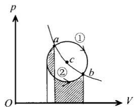

text_image

p
a ①
c
②
b
O
V

<!-- ANSWER -->
D

<!-- EXPLANATION -->
acb为等温线，a、b温度相同。过程①：从a到b经过等温线acb上方，体积增大，温度先升高后降低。但关键是从a到b的内能变化为零（因为T_a=T_b）。从p-V图看，过程①体积增大，系统对外做功W₁<0（外界对系统做负功），由热力学第一定律ΔU=Q+W，ΔU=0，所以Q₁=-W₁>0，即系统吸热。过程②：体积减小，外界对系统做功W₂>0，同理Q₂=-W₂<0，即系统放热。

<!-- QUESTION END -->

<!-- QUESTION: qtype=single_choice tags=热力学循环,p-V图,卡诺循环 difficulty=4 chapter=第四章 热力学定律 -->

4、所列四图分别表示理想气体的四个设想的循环过程。请选出其中一个在物理上可能实现的循环过程的图的标号。

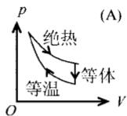
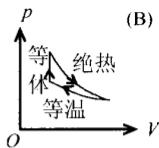
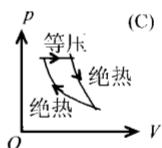
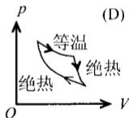

[ . ]

<!-- ANSWER -->
B

<!-- EXPLANATION -->
需要根据热力学过程的合理性判断：等温线pV=常数为双曲线，绝热线比等温线更陡。循环过程中各段过程必须符合热力学定律。

<!-- QUESTION END -->

<!-- QUESTION: qtype=single_choice tags=高斯定理,电场强度通量,静电学 difficulty=3 chapter=第五章 静电学 -->

5、有两个电荷都是 $+q$ 的点电荷，相距为 $2a$ 。今以左边的点电荷所在处为球心，以 $a$ 为半径作一球形高斯面。在球面上取两块相等的小面积 $S_{1}$ 和 $S_{2}$ ，其位置如图所示。设通过 $S_{1}$ 和 $S_{2}$ 的电场强度通量分别为 $\Phi_{1}$ 和 $\Phi_{2}$ ，通过整个球面的电场强度通量为 $\Phi_{S}$ ，则

(A) $\Phi_{1} > \Phi_{2}, \quad \Phi_{S} = q / \varepsilon_{0}.$
(B) $\Phi_1 < \Phi_2, \Phi_S = 2q / \varepsilon_0$ .
(C) $\Phi_{1} = \Phi_{2},\Phi_{S} = q / \varepsilon_{0}$
(D) $\Phi_1 < \Phi_2$ , $\Phi_S = q / \varepsilon_0$ . [ ]

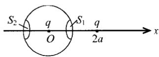

<!-- ANSWER -->
D

<!-- EXPLANATION -->
根据高斯定理，通过闭合球面的电场强度通量等于球面内电荷的代数和除以ε₀。球面内只有左边电荷q，所以Φ_S = q/ε₀。由于右边电荷在球外，其电场线穿过球面时会进出，但通过S₁和S₂的通量不相等，因为S₁更靠近右边电荷，电场线更密集，所以Φ₁ < Φ₂。

<!-- QUESTION END -->

<!-- QUESTION: qtype=single_choice tags=电场强度,等势面,电势,电场线难度=3 chapter=第五章 静电学 -->

6、图中实线为某电场中的电场线，虚线表示等势（位）面，由图可以看出 A、B、C 三处场强 E 与电势 U 的数值关系为：

(A) $E_{A} > E_{B} > E_{C}, U_{A} > U_{B} > U_{C}$ .
(B) $E_{A} < E_{B} < E_{C}, U_{A} < U_{B} < U_{C}$ .
(C) $E_{A} > E_{B} > E_{C}, U_{A} <   U_{B} <   U_{C}.$
(D) $E_{A} < E_{B} < E_{C}, U_{A} > U_{B} > U_{C}$ . [ ]

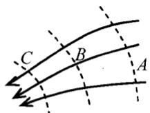

<!-- ANSWER -->
A

<!-- EXPLANATION -->
电场线的疏密反映场强大小：A处最密，C处最疏，所以 $E_A > E_B > E_C$。沿电场线方向电势降低，从图中看A在高电势处，C在低电势处，所以 $U_A > U_B > U_C$。

<!-- QUESTION END -->

<!-- QUESTION: qtype=single_choice tags=磁通量,高斯定理,均匀磁场 difficulty=3 chapter=第六章 稳恒磁场 -->

7、在磁感强度为 $\vec{B}$ 的均匀磁场中作一半径为 r 的半球面 S，S 边线所在

平面的法线方向单位矢量 $\vec{n}$ 与 $\vec{B}$ 的夹角为 $\alpha$ ，则通过半球面 S 的磁通量(取弯面向外为正)为

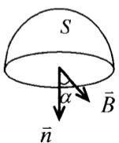

(A) $\pi r^2 B$ .

(B) $2 \pi r^{2} B.$

(C) $-\pi r^{2}B\sin\alpha.$

(D) $-\pi r^{2}B\cos \alpha$ [ ]

<!-- ANSWER -->
D

<!-- EXPLANATION -->
通过闭合曲面的磁通量为零（磁场高斯定理）。半球面 S 加上底面圆构成闭合曲面，因此通过半球面 S 的磁通量等于底面圆磁通量的负值。底面圆的磁通量为 $\Phi_{底} = \vec{B} \cdot \vec{n} S = B \cdot \cos\alpha \cdot \pi r^2$，所以通过半球面 S 的磁通量为 $-\pi r^2 B \cos\alpha$。

<!-- QUESTION END -->

<!-- QUESTION: qtype=single_choice tags=安培环路定理,磁场环流,电流难度=3 chapter=第六章 稳恒磁场 -->

8、如图，流出纸面的电流为 $2I$ ，流进纸面的电流为 $I$ ，则下述各式中哪一个是正确的？

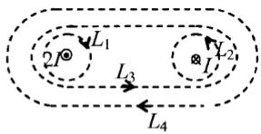

text_image

L₁
2I⊗
L₃
⊗
L₂
L₄

(A) $\oint_{L_1} \vec{H} \cdot \mathrm{d}\vec{l} = 2I$ .

(B) $\oint_{L_2} \vec{H} \cdot \mathrm{d}\vec{l} = I$

· (C) $\oint_{L_{3}}\vec{H}\cdot d\vec{l}=-I$

(D) $\oint_{L_4} \vec{H} \cdot \mathrm{d}\vec{l} = -I$ .

[ ]

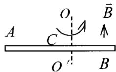

<!-- ANSWER -->
C

<!-- EXPLANATION -->
根据安培环路定理：$\oint \vec{H} \cdot d\vec{l} = \sum I_{内}$。规定电流方向与环路绕行方向满足右手螺旋关系为正。L₃环路包围的电流为-I（进纸面为负），所以环流为-I。

<!-- QUESTION END -->

<!-- QUESTION: qtype=single_choice tags=导体转动,电磁感应,电势差难度=3 chapter=第七章 电磁感应与麦克斯韦方程组 -->

9、如图所示，导体棒 AB 在均匀磁场 B 中绕通过 C 点的垂直于棒长且沿磁场方向的轴 $OO'$ 转动（角速度 $\vec{\omega}$ 与 $\vec{B}$ 同方向），BC 的长度为棒长的 $\frac{1}{3}$ ，则

(A) A 点比 B 点电势高.

(B) A 点与 B 点电势相等.

(B) A 点比 B 点电势低.

(D) 有稳恒电流从 A 点流向 B 点.

[ ]

<!-- ANSWER -->
A

<!-- EXPLANATION -->
导体棒在磁场中转动产生动生电动势。由于角速度与磁场同方向，根据右手定则，电动势方向从B指向C。A点在C点的另一侧，且AC > BC，所以A点电势高于B点。

<!-- QUESTION END -->

<!-- QUESTION: qtype=single_choice tags=平板电容器,位移电流,安培环路定理难度=4 chapter=第七章 电磁感应与麦克斯韦方程组 -->

10、如图，平板电容器(忽略边缘效应)充电时，沿环路 $L_{1}$ 的磁场强度 $\vec{H}$ 的环流与沿环路 $L_{2}$ 的磁场强度 $\vec{H}$ 的环流两者，必有：

(A) $\oint_{L_1} \vec{H} \cdot \mathrm{d}\vec{l}' > \oint_{L_2} \vec{H} \cdot \mathrm{d}\vec{l}'$ .

(B) $\oint_{L_1} \vec{H} \cdot \mathrm{d}\vec{l}' = \oint_{L_2} \vec{H} \cdot \mathrm{d}\vec{l}'$ .

(C) $\oint_{L_1} \vec{H} \cdot \mathrm{d}\vec{l}' < \oint_{L_2} \vec{H} \cdot \mathrm{d}\vec{l}'$ .

(D) $\oint_{L_{1}}\vec{H}\cdot d\vec{l}^{\prime}=0.$

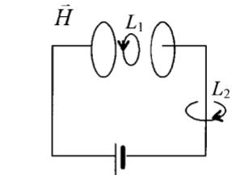

text_image

H̅
L₁
L₂

[ ]

<!-- ANSWER -->
B

<!-- EXPLANATION -->
根据麦克斯韦方程组，$\oint \vec{H} \cdot d\vec{l} = I_{自由} + I_{位移}$。充电时极板间无自由电流，只有位移电流。位移电流等于极板上的自由电流，且与环路无关。因此$L_1$和$L_2$环流相等。

<!-- QUESTION END -->

## 二、填空题（每题3分，共10题）[得分：]

<!-- QUESTION: qtype=fill_blank tags=角动量守恒,刚体转动,转动惯量难度=3 chapter=第二章 刚体力学 -->

11、如图所示，钢球 A 和 B 质量相等，正被绳牵着以 $\omega_{0}=4\ rad/s$ 的角速度绕竖直轴转动，二球与轴的距离都为 $r_{1}=15\ cm$ 。现在把轴上环 C 下移，使得两球离轴的距离缩减为 $r_{2}=5\ cm$ 。则

钢球的角速度 $\omega=$ \_\_\_\_.

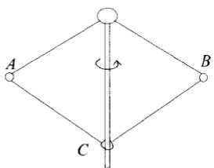

flowchart

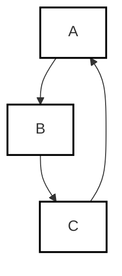

<!-- ANSWER -->
36 rad/s

<!-- EXPLANATION -->
根据角动量守恒定律，系统对竖直轴的角动量守恒。初始角动量 $L_0 = 2 \times m \omega_0 r_1^2$，最终角动量 $L = 2 \times m \omega r_2^2$。由 $L_0 = L$，得 $\omega = \omega_0 \left(\frac{r_1}{r_2}\right)^2 = 4 \times \left(\frac{15}{5}\right)^2 = 36$ rad/s。

<!-- QUESTION END -->

<!-- QUESTION: qtype=fill_blank tags=理想气体状态方程,分子数密度,密度,平动动能难度=2 chapter=第三章 气体动理论 -->

12、容器中储有 $1 \, mol$ 的氮气，压强为 $1.33 \, Pa$ ，温度为 $7 \, ^{\circ}C$ ，则

(1) $1\ m^{3}$ 中氮气的分子数为 \_\_\_\_；

(2) 容器中的氮气的密度为

\_\_\_\_; (3) $1 \mathrm{~m}^{3}$ 中氮分子的总平动动能为 \_\_\_\_。

(玻尔兹曼常量 $k=1.38\times10^{-23}$ J·K $^{-1}$ , N $_{2}$ 气的摩尔质量 $M_{mol}=28\times10^{-3}$ kg·mol $^{-1}$ ，普适气体常量 $R=8.31\ J\cdot mol^{-1}\cdot K^{-1}$ )

<!-- ANSWER -->
(1) $2.87\times10^{20}\ \text{m}^{-3}$；(2) $1.47\times10^{-2}\ \text{kg/m}^3$；(3) $5.90\times10^{-3}\ \text{J}$

<!-- EXPLANATION -->
(1) 由理想气体状态方程 $p = nkT$，得 $n = \frac{p}{kT} = \frac{1.33}{1.38\times10^{-23} \times (273+7)} = 2.87\times10^{20}\ \text{m}^{-3}$。
(2) 密度 $\rho = \frac{pM_{mol}}{RT} = \frac{1.33 \times 28\times10^{-3}}{8.31 \times 280} = 1.47\times10^{-2}\ \text{kg/m}^3$。
(3) 总平动动能 $E_t = n \times \frac{3}{2}kT = 2.87\times10^{20} \times \frac{3}{2} \times 1.38\times10^{-23} \times 280 = 5.90\times10^{-3}\ \text{J}$。

<!-- QUESTION END -->

<!-- QUESTION: qtype=fill_blank tags=麦克斯韦速率分布,分布函数,积分计算难度=3 chapter=第三章 气体动理论 -->

13、已知 $f(\nu)$ 为麦克斯韦速率分布函数， $N$ 为总分子数，则

(1) 速率 $v > 100 \, m \cdot s^{-1}$ 的分子数占总分子数的百分比的表达式为 \_\_\_\_；

(2) 速率 $v > 100 \, m \cdot s^{-1}$ 的分子数的表达式为 \_\_\_\_.

<!-- ANSWER -->
(1) $\int_{100}^{\infty} f(v) dv$；(2) $N \int_{100}^{\infty} f(v) dv$

<!-- EXPLANATION -->
麦克斯韦速率分布函数 $f(v)$ 的物理意义是速率在 $v$ 附近单位速率间隔内的分子数占总分子数的百分比。因此速率 $v > 100\ \text{m/s}$ 的分子数占总分子数的百分比为 $\int_{100}^{\infty} f(v) dv$，分子数为 $N \int_{100}^{\infty} f(v) dv$。

<!-- QUESTION END -->

<!-- QUESTION: qtype=fill_blank tags=理想气体,p-V图,等温过程,绝热过程,热量判断难度=4 chapter=第四章 热力学定律 -->

14、右图为一理想气体几种状态变化过程的 p-V 图，其中 MT 为等温线，MQ 为绝热线，在 AM、BM、CM 三种准静态过程中：

(1) 温度降低的是\_\_\_\_过程;

(2) 气体放热的是\_\_\_\_过程.

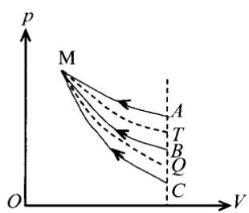

text_image

p
M
A
T
B
Q
C
O
V

<!-- ANSWER -->
(1) BM；(2) CM

<!-- EXPLANATION -->
(1) 等温线MT上温度相同，绝热线MQ比等温线陡。从M到T温度不变，从M到Q温度降低（绝热膨胀）。从图中看，BM过程的终态B在绝热线MQ下方，所以BM过程温度降低。
(2) 根据热力学第一定律和过程特点，CM过程中气体既对外做功又内能减少，必然放热。

<!-- QUESTION END -->

<!-- QUESTION: qtype=fill_blank tags=热力学循环,功,热量,p-V图面积难度=3 chapter=第四章 热力学定律 -->

15、如图所示，绝热过程 AB、CD，等温过程 DEA，和任意过程 BEC，组成一循环过程。若图中 ECD 所包围的面积为 70 J，EAB 所包围的面积为 30 J，DEA 过程中系统放热 100 J，则

(1) 整个循环过程(ABCDEA)系统对外作功为

(2) BEC 过程中系统从外界吸热为 \_\_\_\_.

<!-- ANSWER -->
(1) 40 J；(2) -160 J

<!-- EXPLANATION -->
p-V图中面积代表功。顺时针循环系统对外做功为正。ECD面积70 J（顺时针），EAB面积30 J（逆时针），净功为70-30=40 J。循环过程ΔU=0，由热力学第一定律Q=W=40 J。DEA放热100 J，则其他过程总吸热为40-(-100)=140 J。BEC过程吸热为140 J。

<!-- QUESTION END -->

<!-- QUESTION: qtype=fill_blank tags=高斯定理,电场强度通量,立方体难度=3 chapter=第五章 静电学 -->

16、如图所示，一点电荷 q 位于正立方体的 A 角上，则通过侧面 abcd 的电场强度通量 $\Phi_{e}=$ \_\_\_\_.

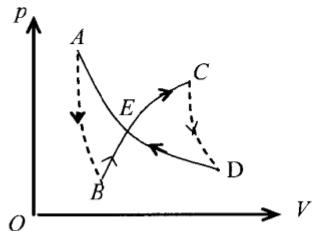

text_image

p
A
E
C
B
D
O
V

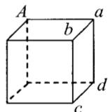

<!-- ANSWER -->
$\frac{q}{24\varepsilon_0}$

<!-- EXPLANATION -->
点电荷位于立方体顶点，通过8个立方体的总通量为 $q/\varepsilon_0$。每个立方体的通量为 $q/(8\varepsilon_0)$。侧面abcd与点电荷A在同一顶点上，该面恰好有一半的电场线穿过（因为电场线从顶点出发，只有一半穿向该面），所以通过abcd面的通量为 $q/(8\varepsilon_0) \times \frac{1}{3} = q/(24\varepsilon_0)$。

<!-- QUESTION END -->

<!-- QUESTION: qtype=fill_blank tags=刚体转动,角动量守恒,子弹射入难度=3 chapter=第二章 刚体力学 -->

17、长为 l、质量为 M 的匀质杆可绕通过杆一端 O 的水平光滑固定轴转动，转动惯量为 $\frac{1}{3}Ml^{2}$ ，开始时杆竖直下垂，如图所示。有一质量为 m 的子弹以水平速度 $\vec{v}_{0}$ 射入杆上 A 点，并嵌在杆中，OA=2l/3，则子弹射入后瞬间杆的角速度 $\omega=$ \_\_\_\_.

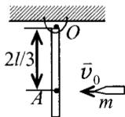

<!-- ANSWER -->
$\frac{6mv_0}{(M+4m)l}$

<!-- EXPLANATION -->
子弹射入过程角动量守恒。初始角动量 $L_0 = m v_0 \times \frac{2l}{3}$。最终转动惯量 $I = \frac{1}{3}Ml^2 + m(\frac{2l}{3})^2 = \frac{1}{3}Ml^2 + \frac{4}{9}ml^2$。由角动量守恒 $\omega = \frac{L_0}{I} = \frac{6mv_0}{(3M+4m)l}$。

<!-- QUESTION END -->

<!-- QUESTION: qtype=fill_blank tags=冲量,牛顿第二定律,动量定理难度=2 chapter=第一章 质点运动学与牛顿定律 -->

18、一物体质量为 10 kg，受到方向不变的力 $F=30+40t$ (SI)作用，在开始的两秒内，此力冲量的大小等于 \_\_\_\_；若物体的初速度大小为 10 m/s，方向与力 $\vec{F}$ 的方向相同，则在 2s 末物体速度的大小等于 \_\_\_\_.

<!-- ANSWER -->
140 N·s；24 m/s

<!-- EXPLANATION -->
冲量 $I = \int_0^2 (30+40t) dt = [30t+20t^2]_0^2 = 60+80 = 140$ N·s。由动量定理 $I = m\Delta v$，$\Delta v = 140/10 = 14$ m/s，所以末速度 $v = 10+14 = 24$ m/s。

<!-- QUESTION END -->

<!-- QUESTION: qtype=fill_blank tags=电磁感应,法拉第定律,感生电动势难度=4 chapter=第七章 电磁感应与麦克斯韦方程组 -->

19、一面积为 S 的平面导线闭合回路，置于载流长螺线管中，回路的法向与螺线管轴线平行．设长螺线管单位长度上的匝数为 n，每匝通过的电流为 $I = I_{m} \sin \omega t$ （电流的正向与回路的正法向成右手关系），其中 $I_{m}$ 和 $\omega$ 为常数，t 为时间，则该导线

回路中的感生电动势为\_\_\_\_。

<!-- ANSWER -->
$-n\mu_0 I_m S \omega \cos\omega t$

<!-- EXPLANATION -->
螺线管内的磁感应强度 $B = \mu_0 n I = \mu_0 n I_m \sin\omega t$。通过回路的磁通量 $\Phi = BS = \mu_0 n I_m S \sin\omega t$。由法拉第定律，感生电动势 $\varepsilon = -\frac{d\Phi}{dt} = -\mu_0 n I_m S \omega \cos\omega t$。

<!-- QUESTION END -->

<!-- QUESTION: qtype=fill_blank tags=安培力,载流导线,等效长度难度=3 chapter=第六章 稳恒磁场 -->

20、有一半径为 a，流过稳恒电流为 I 的 1/4 圆弧形载流导线 bc，按图示方式置于均匀外磁场 $\vec{B}$ 中，其中虚线 Oc 与磁场 $\vec{B}$ 垂直，则该载流导线所受的

安培力大小为\_\_\_\_。

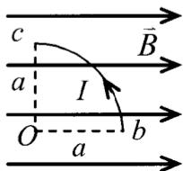

text_image

c
B
a
I
O
a
b

<!-- ANSWER -->
$\sqrt{2}BIa$

<!-- EXPLANATION -->
1/4圆弧载流导线在均匀磁场中的安培力等效于直导线bc所受的力。bc的等效长度为 $\sqrt{2}a$（1/4圆弧的弦长）。由于磁场与电流方向不平行，安培力大小为 $F = BI \times \sqrt{2}a = \sqrt{2}BIa$。

<!-- QUESTION END -->

<!-- QUESTION: qtype=short_answer tags=刚体转动,定轴转动,角加速度,能量守恒难度=4 chapter=第二章 刚体力学 -->

21、一轴承光滑的定滑轮，质量为 $M=2.00\ kg$ ，半径为 $R=0.10\ m$ ，一根不能伸长的轻绳，一端缠绕在定滑轮上，另一端系有一质量为 $m=5.00\ kg$ 的物体，如图所示。已知定滑轮的转动惯量为 $J=\frac{1}{2}MR^{2}$ ，其初角速度 $\omega_{0}=10.0\ rad/s$ ，方向垂直纸面向里。求：

(1) 定滑轮的角加速度的大小和方向;  
(2) 定滑轮的角速度变化到 $\omega=0$ 时，物体上升的高度；  
(3) 当物体回到原来位置时，定滑轮的角速度的大小和方向.

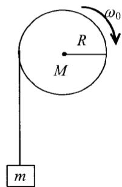

text_image

R
M
ω₀
m

<!-- ANSWER -->
(1) 角加速度大小为100 rad/s²，方向垂直纸面向外（与初角速度方向相反）
(2) 物体上升高度为0.5 m
(3) 角速度大小为10.0 rad/s，方向垂直纸面向外

<!-- EXPLANATION -->
(1) 由转动定律 $J\alpha = mgR$，$\alpha = \frac{mgR}{J} = \frac{mgR}{\frac{1}{2}MR^2} = \frac{2mg}{MR} = \frac{2 \times 5 \times 9.8}{2 \times 0.1} = 100$ rad/s²，方向与初角速度相反。
(2) 由运动学公式 $\omega^2 - \omega_0^2 = 2\alpha\theta$，$\theta = \frac{\omega_0^2}{2\alpha} = \frac{100}{200} = 0.5$ rad，$h = R\theta = 0.1 \times 0.5 = 0.05$ m。
(3) 由机械能守恒，物体回到原位置时动能不变，角速度大小仍为10.0 rad/s。

<!-- QUESTION END -->

22、比热容比 $\gamma = 1.40$ 的理想气体进行如图所示的循环．已知状态 $A$ 的温度为 $300\mathrm{K}$ ，求：

(1) 状态 B、C 的温度；  
(2) 每一过程中气体所吸收的净热量.

(普适气体常量 $R=8.31\ J\cdot mol^{-1}\cdot K^{-1}$ )

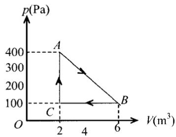

line chart

| Point | V(m³) | p(Pa) |
|-------|-------|-------|
| A     | 2     | 400   |
| B     | 6     | 100   |
| C     | 2     | 100   |

23、一半径为 R 的带电球体，其电荷体密度分布为

$$
\rho = \frac {q r}{\pi R ^ {4}} \quad (r \leqslant R) \quad (q \text {为一正的常量})
$$

$$
\rho = 0 \quad (r > R)
$$

试求：(1) 带电球体的总电荷；(2) 球内、外各点的电场强度；(3) 球内、外各点的电势.

24、如图所示，两条平行长直导线和一个矩形导线框共面。且导线框的一个边与长直导线平行，它到两长直导线的距离分别为 $r_1$ 、 $r_2$ 。已知两导线中电流都为 $I = I_0 \sin \omega t$ ，其中 $I_0$ 和 $\omega$ 为常数， $t$ 为时间。导线框长为 $a$ 宽为 $b$ ，求导线框中的感应电动势。

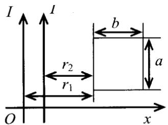

text_image

I
I
b
a
r₂
r₁
O
x

## 一、选择题（共30分，每小题3分，把答案写在题后答题框内）

1、两个半径相同的金属球，一为空心，一为实心，把两者各自孤立时的电容值加以比较，则：

(A) 空心球电容值大.

(B) 实心球电容值大.

(C) 两球电容值相等.

(D) 大小关系无法确定.

答:【】

2. 如图所示, 两个同心导体薄球壳. 内球壳半径为 $\mathbf{R}_1$ , 均匀带有电荷 $\mathbf{Q}$ ; 外球壳半径为 $\mathbf{R}_2$ , 壳的厚度忽略, 原先不带电, 但与地相连接. 设地为电势零点, 则在内球壳里面, 距离球心为 $\mathbf{r}$ 处的 $\mathbf{P}$ 点的场强大小及电势分别为:

(A) E = 0, V = $\frac{Q}{4\pi\varepsilon_{0}R_{1}}$ .

(B) $E = 0, V = \frac{Q}{4\pi\varepsilon_0} \left( \frac{1}{R_1} - \frac{1}{R_2} \right)$

(C) $E = \frac{Q}{4\pi\varepsilon_{0}r^{2}}$ , $V = \frac{Q}{4\pi\varepsilon_{0}r}$ .

(D) $E = \frac{Q}{4\pi\varepsilon_{0}r^{2}}$ , $V = \frac{Q}{4\pi\varepsilon_{0}R_{1}}$ .

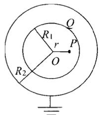

text_image

R₁
r
O
P
Q
R₂

答:【】

3、如图所示，在真空中有一半径为 R 的 3/4 圆弧形的导线，其中通以稳恒电流 I，导线置于均匀外磁场中，且磁场方向与导线所在平面平行，半径 Oa 与磁场垂直，则该载流导线所受的安培力的大小为：

(A) 2BIR

(B) BIR/2

(C) BIR

(D) 3BIR/2

答：【】

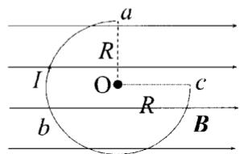

text_image

a
R
I
O
c
b
R
B

4、气缸内盛有一定量的氢气(可视作理想气体)，当温度不变而压强增大一倍时，氢气分子的平均碰撞频率 $\bar{Z}$ 和平均自由程 $\bar{\lambda}$ 的变化情况是：

(A) $\bar{Z}$ 和 $\bar{\lambda}$ 都增大一倍.

(B) $\bar{Z}$ 和 $\bar{\lambda}$ 都减为原来的一半.

(C) $\bar{Z}$ 增大一倍而 $\bar{\lambda}$ 减为原来的一半.

(D) $\bar{Z}$ 减为原来的一半而 $\bar{\lambda}$ 增大一倍.

答:【】

5、一质点在平面上运动，已知质点位置矢量的表示式为 $\vec{r}=at^{2}\vec{i}+bt^{2}\vec{j}$ （其中 a、b 为常量），则该质点作：

(A) 匀速直线运动.

(B) 变速直线运动.

(C) 抛物线运动.

(D) 一般曲线运动.

答:【】

6、质量为 20 g 的子弹沿 X 轴正向以 500 m/s 的速率射入一木块后，与木块一起仍沿 X 轴正向以 50 m/s 的速率前进，在此过程中木块所受冲量的大小为：

(A) 9 N·s.

(B) -9 N·s .

(C)10 N·s .

(D) -10 N·s .

答:【】

7、一圆盘正绕垂直于盘面的水平光滑固定轴 O 转动，如图射来两个质量相同、速度大小相同、方向相反并在一条直线上的子弹，子弹射入圆盘并且留在盘内，则子弹射入后的瞬间，圆盘的角速度 $\omega$

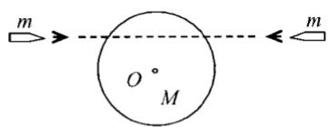

text_image

m
O°
M

(A) 增大.

(B) 不变.

(C) 减小.

(D) 不能确定.

答：【】

8、麦克斯韦分子速率分布函数 $f(v) = \frac{dN}{N \cdot dv}$ ，其中 $N$ 为气体分子总数，则式子 $\int_{0}^{\infty}vf(v)dv$ 的物理意义是：

(A) 具有速率为 $\nu$ 的分子数;  
(B)气体分子速率的算术平均值即平均速率;  
(C) 具有速率为 v 的分子数占总分子数的百分比；  
(D)速率分布在v附近的单位速率间隔内的分子数占分子总数的百分比。

答:【】

9、如右下图所示，图（a）、（b）中各有一半径相同的圆形回路 $L_{1}$ 和 $L_{2}$ ，回路内有电流 $I_{1}$ 和 $I_{2}$ ，其分布相同且均在真空中，但（b）图中 $L_{2}$ 回路外还有电流 $I_{3}$ ， $P_{1}$ 、 $P_{2}$ 为两圆形回路上的对应点，则有：

(A) $\oint_{L_1} \vec{B} \cdot d\vec{l} = \oint_{L_2} \vec{B} \cdot d\vec{l}, B_{P1} = B_{P2};$  
(B) $\oint_{L_1} \vec{B} \cdot d\vec{l} \neq \oint_{L_2} \vec{B} \cdot d\vec{l}, B_{P1} = B_{P2};$  
(C) $\oint_{L_1} \vec{B} \cdot d\vec{l} \neq \oint_{L_2} \vec{B} \cdot d\vec{l}, B_{P1} \neq B_{P2};$  
(D) $\oint_{L_1} \vec{B} \cdot d\vec{l} = \oint_{L_2} \vec{B} \cdot d\vec{l}, B_{P1} \neq B_{P2};$

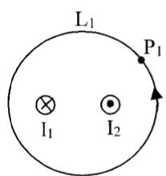

text_image

L₁
P₁
I₁ I₂

(a)

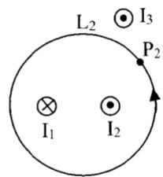

text_image

L₂ ⊙ I₃
P₂
I₁ ⊙ I₂

(b)

答：【 】

10、半径分别为 $\mathbf{R}_1$ 和 $\mathbf{R}_2$ 的两个半圆弧与直径的两小段构成的通电线圈 $abcda$ (如图所示)，放在磁感应强度为 $\vec{B}$ 的均匀磁场中， $\vec{B}$ 平行线圈所在平面。则线圈的磁矩大小和线圈受到的磁力矩的大小分别为：

(A) $\frac{1}{2}\pi IB(R_2^2 - R_1^2)$ , $\frac{1}{2}\pi I(R_2^2 - R_1^2)$  
(B) $\frac{1}{2}\pi I(R_2^2 -R_1^2),\frac{1}{2}\pi IB(R_2^2 -R_1^2)$  
(C) $\pi I(R_2^2 - R_1^2)$ , $\pi IB(R_2^2 - R_1^2)$  
(D) $\frac{1}{2}\pi I(R_2^2 - R_1^2), \pi IB(R_2^2 - R_1^2)$

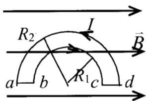

text_image

R₂
I
B̄
a b c d

答：【】

## 二、填空题（共30分，每小题3分）

11、如图所示，一无限长直电流 $I_{0}$ ，一侧有一与其共面的矩形线圈，则通过此线圈的磁通量为 \_\_\_\_.

12、有 1 mol 刚性双原子分子理想气体（已知玻尔兹曼常量 K 和普适常量 R），处于温度为 T 的平衡态下，则该气体分子的平均平动动能为 \_\_\_\_，平均动能

text_image

I₀
a
b
L

为\_\_\_\_，该气体的内能为\_\_\_\_。

13、反映电磁场基本性质和规律的积分形式的麦克斯韦方程组为

$$
\oint_ {S} \vec {D} \cdot \mathrm{d} \vec {S} = \int_ {V} \rho \mathrm{d} V \quad ① \quad \oint_ {L} \vec {E} \cdot \mathrm{d} \vec {l} = - \int_ {S} \frac {\partial \vec {B}}{\partial t} \cdot \mathrm{d} \vec {S} \tag {②}
$$

$$
\oint_ {S} \vec {B} \cdot \mathrm{d} \vec {S} = 0 \quad ③ \quad \oint_ {L} \vec {H} \cdot \mathrm{d} \vec {l} = \int_ {S} \left(\vec {J} _ {c} + \frac {\partial \vec {D}}{\partial t}\right) \cdot \mathrm{d} \vec {S} \tag {4}
$$

试判断下列结论是包含于或等效于哪一个麦克斯韦方程式的。将你确定的方程式用代号填在相应结论后的空白处。(1)变化的磁场一定伴随着电场；

(2) 磁感线是无头无尾的；  
(3) 电荷总伴随有电场。

14、一载有电流 I 的长导线弯成如图所示形状，则圆心 O 点处磁感应强度 $\bar{B}$ 的大小为 \_\_\_\_；方向为 \_\_\_\_。

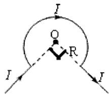

text_image

I
O
R
I
I

15、一长为 L、质量可以忽略的直杆，两端分别固定有质量为 2m 和 m 的小球，杆可绕通过其中心 O 且与杆垂直的水平光滑固定轴在铅直平面内转动。开始杆与水平方向成

某一角度 $\theta$ ，处于静止状态，如图所示．释放后，杆绕O轴转动.则当杆转到水平位置时，该系统所受到的合外力矩的大小 $\mathbf{M} =$ ，此时该系统角加速度的大小 $\beta =$

16、如图所示，两块很大的导体平板平行放置，面积都是 S，有一定厚度，带电荷分别为 $Q_{1}$ 和 $Q_{2}$ 。如不计边缘效应，则 A、B、C、D 四个表面

上的电荷面密度分别为 \_\_\_\_、\_\_\_\_、\_\_\_\_、\_\_\_\_。

17、两个点电荷在真空中相距为 $r_{1}$ 时的相互作用力等于它们在某一“无限大”各向同性均匀电介质中相距为 $r_{2}$ 时的相互作用力，则该电介质的相对介电常量 $\varepsilon_{r}=$ \_\_\_\_.

18、一人造地球卫星绕地球作椭圆运动，近地点为 A，远地点为 B.

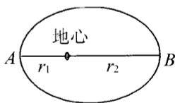

A、B 两点距地心分别为 $r_{1}$ 、 $r_{2}$ 。设卫星质量为 m，地球质量为 M，万有引力常量为 G。则卫星在 A、B 两点处的万有引力

势能之差 $E_{PB}-E_{PA}=$ \_\_\_\_；卫星在 A、B 两点的动能之差 $E_{kB}-E_{kA}=$ \_\_\_\_.

19、图中，沿着半径为 R 的圆周运动的质点，所受的几个力中有一个是恒力 $\vec{F}_{0}$ ，方向始终沿 x 轴正向，即 $\vec{F} = F_{0}\vec{i}$ ，x 轴与圆相切，A 为切点。当质点从 A 点沿逆时针方向走过 3/4 圆周到达 B 点时，力 $\vec{F}_{0}$ 所作的功为 W= \_\_\_\_.

20、理想气体做卡诺循环，高温热源温度为 400K，低温热源温度为 300K，每次循环中，气体从高温热源吸收热量 2500J。则每一次循环中气体对外作的功为 \_\_\_\_；每一次循环中向低温热源放出的热量为 \_\_\_\_。

## 三、计算题（共40分，每小题10分）

21、电流为 I （电流方向向上）的长直载流导线近旁有一与之共面的导体 ab，长为 l。
设导体的 a 端与长直导线相距为 d，ab 延长线与长直导线的夹角为 $\theta$ ，如图所示。
导体 ab 以匀速度 $\vec{v}$ 沿电流方向平移。求 ab 上的感应电动势。

text_image

I
d a
θ
b
v
l

22. 图示为一厚度为 $d$ 的“无限大”均匀带电平板，电荷体密度为 $\rho$ 。试求板内外的场强分布，并画出场强随坐标 $x$ 变化的图线，即 $E - x$ 图线（设原点在带电平板的中央平面上， $Ox$ 轴垂直于平板）。

text_image

O
x
d

23、一定量的某种理想气体进行如图所示的循环过程。已知气体在状态 A 的温度为 $T_{A}=300K$ ，求：

(1) 气体在状态 B、C 的温度;  
(2) 各过程中气体对外所做的功;  
（3）经过整个循环过程，气体从外界吸收的总热量（各过程吸热的代数和）。

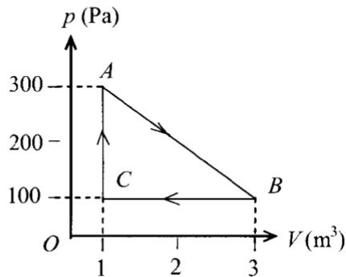

line chart

| Point | V (m³) | p (Pa) |
|---|---|---|
| A | 1 | 300 |
| B | 3 | 100 |
| C | 1 | 100 |

24、质量为 $M_{1}=24\ kg$ 的圆轮，可绕水平光滑固定轴转动，一轻绳缠绕于轮上，另一端通过质量为 $M_{2}=5\ kg$ 的圆盘形定滑轮悬有 m=10kg 的物体．当物体由静止开始下降了 h=0.5m 时，求：

(1) 物体的速度;  
(2) 水平段以及竖直段绳中的张力.

(设绳与定滑轮间无相对滑动，圆轮、定滑轮绕通过轮心且垂直于横截面的水平光滑轴的转动惯量分别为 $J_{1}=\frac{1}{2}M_{1}R^{2}$ ， $J_{2}=\frac{1}{2}M_{2}r^{2}$ )

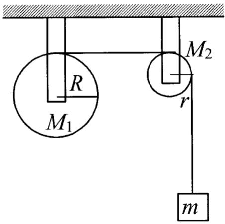

text_image

R
M₁
M₂
r
m

