## 2014\~2015《大学物理 1A》

## 一、选择题（共30分，每小题3分，把答案写在题后答题框内）

<!-- QUESTION: qtype=single_choice tags=电容,导体球,静电学 difficulty=3 chapter=第五章 静电学 qid=Q0731 -->
两个半径相同的金属球，一为空心，一为实心，把两者各自孤立时的电容值加以比较，则：

(A) 空心球电容值大.

(B) 实心球电容值大.

(C) 两球电容值相等.

(D) 大小关系无法确定.

<!-- ANSWER -->
C
<!-- QUESTION END -->

<!-- QUESTION: qtype=single_choice tags=电势,电场强度,导体球壳,静电学 difficulty=4 chapter=第五章 静电学 qid=Q0732 -->
如图所示, 两个同心导体薄球壳. 内球壳半径为 $\mathbf{R}_1$ , 均匀带有电荷 $\mathbf{Q}$ ; 外球壳半径为 $\mathbf{R}_2$ , 壳的厚度忽略, 原先不带电, 但与地相连接. 设地为电势零点, 则在内球壳里面, 距离球心为 $\mathbf{r}$ 处的 $\mathbf{P}$ 点的场强大小及电势分别为:

(A) E = 0, V = $\frac{Q}{4\pi\varepsilon_0R_1}$ .

(B) $E = 0, V = \frac{Q}{4\pi\varepsilon_0} \left( \frac{1}{R_1} - \frac{1}{R_2} \right)$

(C) $E = \frac{Q}{4\pi\varepsilon_{0}r^{2}}$ , $V = \frac{Q}{4\pi\varepsilon_{0}r}$ .

(D) $E = \frac{Q}{4\pi\varepsilon_{0}r^{2}}$ , $V = \frac{Q}{4\pi\varepsilon_{0}R_{1}}$ .

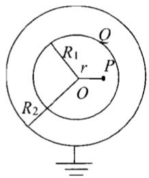
<!-- ANSWER -->
A
<!-- QUESTION END -->

<!-- QUESTION: qtype=single_choice tags=安培力,载流导线,磁场,稳恒磁场 difficulty=3 chapter=第六章 稳恒磁场 qid=Q0733 -->
如图所示，在真空中有一半径为 R 的 3/4 圆弧形的导线，其中通以稳恒电流 I，导线置于均匀外磁场中，且磁场方向与导线所在平面平行，半径 Oa 与磁场垂直，则该载流导线所受的安培力的大小为：

(A) 2BIR

(B) BIR/2

(C) BIR

(D) 3BIR/2

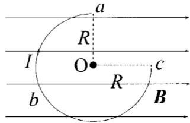
<!-- ANSWER -->
A
<!-- QUESTION END -->

<!-- QUESTION: qtype=single_choice tags=平均碰撞频率,平均自由程,气体动理论,理想气体 difficulty=3 chapter=第三章 气体动理论 qid=Q0734 -->
气缸内盛有一定量的氢气(可视作理想气体)，当温度不变而压强增大一倍时，氢气分子的平均碰撞频率 $\bar{Z}$ 和平均自由程 $\bar{\lambda}$ 的变化情况是：

(A) $\bar{Z}$ 和 $\bar{\lambda}$ 都增大一倍.

(B) $\bar{Z}$ 和 $\bar{\lambda}$ 都减为原来的一半.

(C) $\bar{Z}$ 增大一倍而 $\bar{\lambda}$ 减为原来的一半.

(D) $\bar{Z}$ 减为原来的一半而 $\bar{\lambda}$ 增大一倍.

<!-- ANSWER -->
C
<!-- QUESTION END -->

<!-- QUESTION: qtype=single_choice tags=质点运动学,位置矢量,运动轨迹,质点运动学与牛顿定律 difficulty=3 chapter=第一章 质点运动学与牛顿定律 qid=Q0735 -->
一质点在平面上运动，已知质点位置矢量的表示式为 $\vec{r}=at^{2}\vec{i}+bt^{2}\vec{j}$ （其中 a、b 为常量），则该质点作：

(A) 匀速直线运动.

(B) 变速直线运动.

(C) 抛物线运动.

(D) 一般曲线运动.

<!-- ANSWER -->
B
<!-- QUESTION END -->

<!-- QUESTION: qtype=single_choice tags=动量,冲量,碰撞,质点运动学与牛顿定律 difficulty=2 chapter=第一章 质点运动学与牛顿定律 qid=Q0736 -->
质量为 20 g 的子弹沿 X 轴正向以 500 m/s 的速率射入一木块后，与木块一起仍沿 X 轴正向以 50 m/s 的速率前进，在此过程中木块所受冲量的大小为：

(A) 9 N·s.

(B) -9 N·s .

(C)10 N·s .

(D) -10 N·s .

<!-- ANSWER -->
A
<!-- QUESTION END -->

<!-- QUESTION: qtype=single_choice tags=角动量守恒,转动惯量,刚体转动,刚体力学 difficulty=4 chapter=第二章 刚体力学 qid=Q0737 -->
一圆盘正绕垂直于盘面的水平光滑固定轴 O 转动，如图射来两个质量相同、速度大小相同、方向相反并在一条直线上的子弹，子弹射入圆盘并且留在盘内，则子弹射入后的瞬间，圆盘的角速度 $\omega$

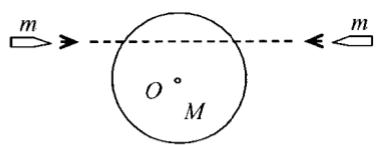

(A) 增大.

(B) 不变.

(C) 减小.

(D) 不能确定.

<!-- ANSWER -->
B
<!-- QUESTION END -->

<!-- QUESTION: qtype=single_choice tags=速率分布函数,平均速率,气体动理论 difficulty=3 chapter=第三章 气体动理论 qid=Q0738 -->
麦克斯韦分子速率分布函数 $f(v) = \frac{dN}{N \cdot dv}$ ，其中 $N$ 为气体分子总数，则式子 $\int_{0}^{\infty}vf(v)dv$ 的物理意义是：

(A) 具有速率为 v 的分子数;
(B)气体分子速率的算术平均值即平均速率;
(C) 具有速率为 v 的分子数占总分子数的百分比;
(D)速率分布在v附近的单位速率间隔内的分子数占分子总数的百分比。

<!-- ANSWER -->
B
<!-- QUESTION END -->

<!-- QUESTION: qtype=single_choice tags=安培环路定理,磁感应强度,磁场,稳恒磁场 difficulty=4 chapter=第六章 稳恒磁场 qid=Q0739 -->
如右下图所示，图（a）、（b）中各有一半径相同的圆形回路 $L_{1}$ 和 $L_{2}$ ，回路内有电流 $I_{1}$ 和 $I_{2}$ ，其分布相同且均在真空中，但（b）图中 $L_{2}$ 回路外还有电流 $I_{3}$ ， $P_{1}$ 、 $P_{2}$ 为两圆形回路上的对应点，则有：

(A) $\oint_{L_1} \vec{B} \cdot d\vec{l} = \oint_{L_2} \vec{B} \cdot d\vec{l}, B_{P1} = B_{P2};$
(B) $\oint_{L_1} \vec{B} \cdot d\vec{l} \neq \oint_{L_2} \vec{B} \cdot d\vec{l}, B_{P1} = B_{P2};$
(C) $\oint_{L_{1}}\vec{B}\cdot d\vec{l}\neq\oint_{L_{2}}\vec{B}\cdot d\vec{l},\quad B_{P1}\neq B_{P2};$
(D) $\oint_{L_1} \vec{B} \cdot d\vec{l} = \oint_{L_2} \vec{B} \cdot d\vec{l}, B_{P1} \neq B_{P2};$

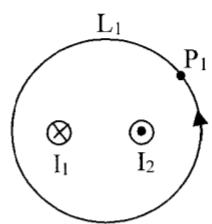
(a)

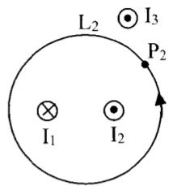
(b)

<!-- ANSWER -->
D
<!-- QUESTION END -->

<!-- QUESTION: qtype=single_choice tags=磁矩,磁力矩,电流线圈,稳恒磁场 difficulty=3 chapter=第六章 稳恒磁场 qid=Q0740 -->
半径分别为 $\mathbf{R}_1$ 和 $\mathbf{R}_2$ 的两个半圆弧与直径的两小段构成的通电线圈 $abcda$ (如图所示)，放在磁感应强度为 $\vec{B}$ 的均匀磁场中， $\vec{B}$ 平行线圈所在平面．则线圈的磁矩大小和线圈受到的磁力矩的大小分别为：

(A) $\frac{1}{2}\pi IB(R_2^2 - R_1^2)$ , $\frac{1}{2}\pi I(R_2^2 - R_1^2)$
(B) $\frac{1}{2}\pi I(R_2^2 - R_1^2)$ , $\frac{1}{2}\pi IB(R_2^2 - R_1^2)$
(C) $\pi I(R_2^2 - R_1^2)$ , $\pi IB(R_2^2 - R_1^2)$
(D) $\frac{1}{2}\pi I(R_2^2 - R_1^2), \pi IB(R_2^2 - R_1^2)$

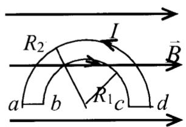
<!-- ANSWER -->
B
<!-- QUESTION END -->

## 二、填空题（共30分，每小题3分）

<!-- QUESTION: qtype=fill_blank tags=磁通量,无限长直导线,矩形线圈,稳恒磁场 difficulty=3 chapter=第六章 稳恒磁场 qid=Q0741 -->
如图所示，一无限长直电流 $I_{0}$ ，一侧有一与其共面的矩形线圈，则通过此线圈的磁通量为 \_\_\_\_.

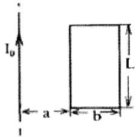
<!-- QUESTION END -->

<!-- QUESTION: qtype=fill_blank tags=理想气体,平均平动动能,平均动能,内能,气体动理论 difficulty=3 chapter=第三章 气体动理论 qid=Q0742 -->
有 1 mol 刚性双原子分子理想气体（已知玻尔兹曼常量 K 和普适常量 R），处于温度为 T 的平衡态下，则该气体分子的平均平动动能为 \_\_\_\_，平均动能为\_\_\_\_，该气体的内能为\_\_\_\_。
<!-- QUESTION END -->

<!-- QUESTION: qtype=fill_blank tags=麦克斯韦方程组,电磁场,电磁感应与麦克斯韦方程组 difficulty=4 chapter=第七章 电磁感应与麦克斯韦方程组 qid=Q0743 -->
反映电磁场基本性质和规律的积分形式的麦克斯韦方程组为

$$
\oint_ {S} \vec {D} \cdot \mathrm{d} \vec {S} = \int_ {V} \rho \mathrm{d} V \quad ① \quad \oint_ {L} \vec {E} \cdot \mathrm{d} \vec {l} = - \int_ {S} \frac {\partial \vec {B}}{\partial t} \cdot \mathrm{d} \vec {S} \tag {②}
$$

$$
\oint_ {S} \vec {B} \cdot \mathrm{d} \vec {S} = 0 \quad ③ \quad \oint_ {L} \vec {H} \cdot \mathrm{d} \vec {l} = \int_ {S} \left(\vec {J} _ {c} + \frac {\partial \vec {D}}{\partial t}\right) \cdot \mathrm{d} \vec {S} \tag {4}
$$

试判断下列结论是包含于或等效于哪一个麦克斯韦方程式的。将你确定的方程式用代号填在相应结论后的空白处。

(1)变化的磁场一定伴随着电场；

(2) 磁感线是无头无尾的；

(3) 电荷总伴随有电场。

<!-- QUESTION END -->

<!-- QUESTION: qtype=fill_blank tags=磁感应强度,毕奥-萨伐尔定律,叠加原理,稳恒磁场 difficulty=4 chapter=第六章 稳恒磁场 qid=Q0744 -->
一载有电流 I 的长导线弯成如图所示形状，则圆心 O 点处磁感应强度 $\bar{B}$ 的大小为 \_\_\_\_；方向为 \_\_\_\_。

<!-- QUESTION END -->

<!-- QUESTION: qtype=fill_blank tags=力矩,角加速度,刚体转动,刚体力学 difficulty=4 chapter=第二章 刚体力学 qid=Q0745 -->
一长为 L、质量可以忽略的直杆，两端分别固定有质量为 2m 和 m 的小球，杆可绕通过其中心 O 且与杆垂直的水平光滑固定轴在铅直平面内转动。开始杆与水平方向成某一角度 $\theta$ ，处于静止状态，如图所示．释放后，杆绕O轴转动.则当杆转到水平位置时，该系统所受到的合外力矩的大小 $\mathbf{M} =$ ，此时该系统角加速度的大小 $\beta =$

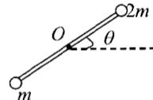
<!-- QUESTION END -->

<!-- QUESTION: qtype=fill_blank tags=电荷面密度,导体静电平衡,静电学 difficulty=4 chapter=第五章 静电学 qid=Q0746 -->
如图所示，两块很大的导体平板平行放置，面积都是 S，有一定厚度，带电荷分别为 $Q_{1}$ 和 $Q_{2}$ 。如不计边缘效应，则 A、B、C、D 四个表面

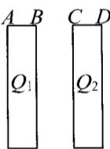

上的电荷面密度分别为 \_\_\_\_、\_\_\_\_、\_\_\_\_、\_\_\_\_。

<!-- QUESTION END -->

<!-- QUESTION: qtype=fill_blank tags=库仑定律,介电常量,电介质,静电学 difficulty=3 chapter=第五章 静电学 qid=Q0747 -->
两个点电荷在真空中相距为 $r_{1}$ 时的相互作用力等于它们在某一"无限大"各向同性均匀电介质中相距为 $r_{2}$ 时的相互作用力，则该电介质的相对介电常量 $\varepsilon_{r}=$ \_\_\_\_.

<!-- QUESTION END -->

<!-- QUESTION: qtype=fill_blank tags=万有引力势能,动能定理,机械能守恒,质点运动学与牛顿定律 difficulty=3 chapter=第一章 质点运动学与牛顿定律 qid=Q0748 -->
一人造地球卫星绕地球作椭圆运动，近地点为 A，远地点为 B.

A、B 两点距地心分别为 $r_{1}$ 、 $r_{2}$ 。设卫星质量为 m，地球质量为 M，万有引力常量为 G。则卫星在 A、B 两点处的万有引力势能之差 $E_{PB}-E_{PA}=$ \_\_\_\_；卫星在 A、B 两点的动能之差 $E_{kB}-E_{kA}=$ \_\_\_\_.

<!-- QUESTION END -->

<!-- QUESTION: qtype=fill_blank tags=功,恒力做功,圆周运动,质点运动学与牛顿定律 difficulty=3 chapter=第一章 质点运动学与牛顿定律 qid=Q0749 -->
图中，沿着半径为 R 的圆周运动的质点，所受的几个力中有一个是恒力 $\vec{F}_{0}$ ，方向始终沿 x 轴正向，即 $\vec{F}=F_{0}\vec{i}$ ，x 轴与圆相切，A 为切点。当质点从 A 点沿逆时针方向走过 3/4 圆周到达 B 点时，力 $\vec{F}_{0}$ 所作的功为 W= \_\_\_\_.

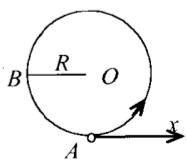
<!-- QUESTION END -->

<!-- QUESTION: qtype=fill_blank tags=卡诺循环,热机效率,热力学,热力学定律 difficulty=3 chapter=第四章 热力学定律 qid=Q0750 -->
理想气体做卡诺循环，高温热源温度为 400K，低温热源温度为 300K，每次循环中，气体从高温热源吸收热量 2500J。则每一次循环中气体对外作的功为 \_\_\_\_；每一次循环中向低温热源放出的热量为 \_\_\_\_。

<!-- QUESTION END -->

## 三、计算题（共40分，每小题10分）

<!-- QUESTION: qtype=short_answer tags=感应电动势,动生电动势,电磁感应,电磁感应与麦克斯韦方程组 difficulty=4 chapter=第七章 电磁感应与麦克斯韦方程组 qid=Q0751 -->
电流为 I （电流方向向上）的长直载流导线近旁有一与之共面的导体 ab，长为 l。
设导体的 a 端与长直导线相距为 d，ab 延长线与长直导线的夹角为 $\theta$ ，如图所示。
导体 ab 以匀速度 $\vec{v}$ 沿电流方向平移。求 ab 上的感应电动势。

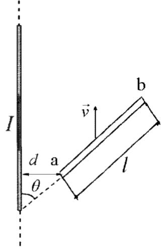
<!-- QUESTION END -->

<!-- QUESTION: qtype=short_answer tags=电场强度,高斯定理,均匀带电平板,静电学 difficulty=4 chapter=第五章 静电学 qid=Q0752 -->
图示为一厚度为 $d$ 的"无限大"均匀带电平板，电荷体密度为 $\rho$ 。试求板内外的场强分布，并画出场强随坐标 $x$ 变化的图线，即 $E - x$ 图线（设原点在带电平板的中央平面上， $Ox$ 轴垂直于平板）。

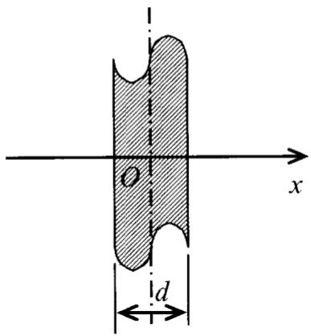
<!-- QUESTION END -->

<!-- QUESTION: qtype=short_answer tags=理想气体,循环过程,功,热量,热力学定律 difficulty=4 chapter=第四章 热力学定律 qid=Q0753 -->
一定量的某种理想气体进行如图所示的循环过程。已知气体在状态 A 的温度为 $T_{A}=300K$ ，求：

(1) 气体在状态 B、C 的温度;
(2) 各过程中气体对外所做的功;
（3）经过整个循环过程，气体从外界吸收的总热量（各过程吸热的代数和）。

<!-- QUESTION END -->

<!-- QUESTION: qtype=short_answer tags=转动惯量,角加速度,张力,刚体力学 difficulty=5 chapter=第二章 刚体力学 qid=Q0754 -->
质量为 $M_{1}=24\ kg$ 的圆轮，可绕水平光滑固定轴转动，一轻绳缠绕于轮上，另一端通过质量为 $M_{2}=5\ kg$ 的圆盘形定滑轮悬有 m=10kg 的物体．当物体由静止开始下降了 h=0.5m 时，求：

(1) 物体的速度;
(2) 水平段以及竖直段绳中的张力.

(设绳与定滑轮间无相对滑动，圆轮、定滑轮绕通过轮心且垂直于横截面的水平光滑轴的转动惯量分别为 $J_{1}=\frac{1}{2}M_{1}R^{2}$ ， $J_{2}=\frac{1}{2}M_{2}r^{2}$ )

<!-- QUESTION END -->
