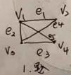
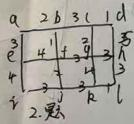
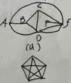
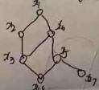
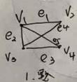
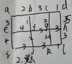
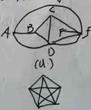
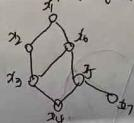

<!-- QUESTION: qtype=short_answer tags=命题逻辑,推理,命题符号化 difficulty=3 chapter=第一章 数理逻辑 -->

将下列命题符号化，并进行推理

A或B获Nobel奖

若A获奖，则《三体》中科学公式成立

若B实验结果正确，则量子计算机研制没有成功

若B实验结果不正确，则《三体》中科学预言不成立

量子计算机的研制获得了成功

问：谁获Nobel？

<!-- QUESTION END -->

<!-- QUESTION: qtype=short_answer tags=命题逻辑,真值表 difficulty=2 chapter=第一章 数理逻辑 -->

画出命题公式 $(P \leftrightarrow R) \land (\neg P \rightarrow (P \lor R))$ 的真值表 (4)

<!-- QUESTION END -->

<!-- QUESTION: qtype=short_answer tags=命题逻辑,主析取范式 difficulty=3 chapter=第一章 数理逻辑 -->

求命题公式 $P \lor (\neg P \rightarrow (Q \lor (\neg Q \rightarrow R)))$ 的主析取范式 (4)

<!-- QUESTION END -->

<!-- QUESTION: qtype=short_answer tags=谓词逻辑,前束范式 difficulty=3 chapter=第一章 数理逻辑 -->

求谓词公式 $(\exists x) A(x) \rightarrow (\forall x) B(x)$ 的前束范式。(4)

<!-- QUESTION END -->

<!-- QUESTION: qtype=short_answer tags=群论,同态,阶 difficulty=4 chapter=第三章 代数系统 -->

$\langle G, * \rangle$ 和 $\langle H, \Delta \rangle$ 分别为 $m$ 阶和 $n$ 阶的群。证明：若由 $\langle G, * \rangle$ 到

$\langle H, \Delta \rangle$ 存在单一同态，则 $m \mid n$。（4）

<!-- QUESTION END -->
<!-- QUESTION: qtype=short_answer tags=群论,循环群,阿贝尔群 difficulty=3 chapter=第三章 代数系统 -->

证明：一个循环群必是阿贝尔群。（4）

<!-- QUESTION END -->
<!-- QUESTION: qtype=short_answer tags=群论,有限群,幂等元 difficulty=3 chapter=第三章 代数系统 -->

证明：有限群中必存在幂等元。（4）

<!-- QUESTION END -->
<!-- QUESTION: qtype=short_answer tags=群论,消去律 difficulty=3 chapter=第三章 代数系统 -->

证明：设 $\langle G, * \rangle$ 是一个群，对于 $\forall a, b, x, y \in G$，若 $a * x * b = a * y * b$，则 $x = y$。（4）

<!-- QUESTION END -->
<!-- QUESTION: qtype=short_answer tags=命题逻辑,推理理论 difficulty=3 chapter=第一章 数理逻辑 -->

使用推理理论的直接证明法或间接证明法来证明（题目缺失）。（5）

<!-- QUESTION END -->
<!-- QUESTION: qtype=short_answer tags=群论,同态,核,子群 difficulty=4 chapter=第三章 代数系统 -->

设 $f$ 是由群 $\langle G, * \rangle$ 到群 $\langle H, * \rangle$ 的同态映射，$e'$ 为 $\langle H, * \rangle$ 的幺元，$\ker(f) = \{ x \mid x \in G \land f(x) = e' \}$，证明：$\langle \ker(f), * \rangle$ 是 $\langle G, * \rangle$ 的子群。（4）

<!-- QUESTION END -->
<!-- QUESTION: qtype=short_answer tags=群论,群结构,二元运算 difficulty=4 chapter=第三章 代数系统 -->

设 $\langle G, * \rangle$ 是一个群。定义 $G$ 上的一元运算 $\triangle$ 为：$\forall x, y \in G$，$x \triangle y = x * a * y$，其中 $a$ 是 $G$ 中的某个元素。证明：$\langle G, \triangle \rangle$ 也是一个群。

<!-- QUESTION END -->

<!-- 重复内容已删除，请参考上方已标注的对应题目 -->

<!-- QUESTION: qtype=fill_blank tags=图论,点连通度,完全图 difficulty=2 chapter=第四章 图论 -->

集合与图论

完全图 $K_n$ 的点连通度为 \_\_\_\_；

<!-- QUESTION END -->

<!-- QUESTION: qtype=fill_blank tags=图论,着色数,完全图 difficulty=2 chapter=第四章 图论 -->

7个结点的完全图 $K_7$ 的点着色数为 \_\_\_\_；

<!-- QUESTION END -->

<!-- QUESTION: qtype=fill_blank tags=集合论,关系复合 difficulty=3 chapter=第二章 集合论 -->

设 $R = \{ \langle 1,2 \rangle, \langle 3,4 \rangle, \langle 2,2 \rangle \}$ 以及 $S = \{ \langle 4,2 \rangle, \langle 2,5 \rangle, \langle 3,1 \rangle, \langle 1,3 \rangle \}$，则 $R$ 与 $S$ 的复合关系 $R \circ S$ 为 \_\_\_\_；

<!-- QUESTION END -->

<!-- QUESTION: qtype=short_answer tags=图论,邻接矩阵,关联矩阵 difficulty=4 chapter=第四章 图论 -->

（8分）（1）利用邻接矩阵求下面无向图中 $V_1$ 到 $V_2$ 长为 2 的路的数目。

请利用关联矩阵将顶点 $V_1, V_3$ 合并。（给出必要解题步骤）

<!-- QUESTION END -->
<!-- QUESTION: qtype=short_answer tags=图论,最小生成树,Kruskal算法 difficulty=4 chapter=第四章 图论 -->

（5分）对于下图，利用 Kruskal 算法求一棵最小生成树，并按顺序导出选出的每条边与权值。

<!-- QUESTION END -->

<!-- QUESTION: qtype=short_answer tags=图论,平面图,欧拉公式 difficulty=4 chapter=第四章 图论 -->

（8分）（1）判断 (a), (b) 是否为平面图。

若是平面图，写出有多少个面，面的次数分别是多少。

假设 G 是一个有 $v$ 个结点、$e$ 条边和 $r$ 个面的连通简单平面图，求 $v, e, r$ 满足的关系。

<!-- QUESTION END -->

<!-- QUESTION: qtype=short_answer tags=集合论,偏序关系,哈斯图,最大最小元素 difficulty=3 chapter=第二章 集合论 -->

（8分）集合 $P = \{ x_1, x_2, x_3, x_4, x_5, x_6, x_7 \}$ 上的偏序关系如图所示。

求 $P$ 的最大、最小、极大、极小元素。

写出子集 $\{ x_3, x_5, x_6 \}$ 的上界、下界，子集 $\{ x_4, x_5, x_6 \}$ 的上确界及下确界。

<!-- QUESTION END -->

<!-- QUESTION: qtype=short_answer tags=集合论,函数,满射 difficulty=3 chapter=第二章 集合论 -->

（7分）设 $f$ 为 $\mathbb{Z} \times \mathbb{Z}$ 到 $\mathbb{Z}$ 的函数，

$f(m,n) = |m| - |n|$，其中 $\mathbb{Z}$ 表示整数集。证明 $f$ 为满射。

<!-- QUESTION END -->

<!-- QUESTION: qtype=short_answer tags=集合论,等价关系,划分 difficulty=3 chapter=第二章 集合论 -->

（8分）集合 $T = \{ 1,2,3,4 \}$，$R = \{ \langle 1,1 \rangle, \langle 2,4 \rangle, \langle 4,4 \rangle, \langle 3,2 \rangle, \langle 2,3 \rangle, \langle 3,3 \rangle \}$。

$R$ 是否为 $T$ 上的等价关系？为什么？

给出一个集合 $S$ 及 $S$ 上的等价关系 $R$，$R$ 能产生 $S$ 上的划分 $\{ \{1,2\}, \{3,4\} \}$。

<!-- QUESTION END -->

<!-- SECTION: 以下为试卷另一页内容（图论与集合论题目），与前面部分有重叠但图片不同 -->

## 图论与集合论（续）

<!-- QUESTION: qtype=fill_blank tags=图论,点连通度,完全图 difficulty=2 chapter=第四章 图论 -->

完全图 $K_n$ 的点连通度为 \_\_\_\_；

<!-- QUESTION END -->

<!-- QUESTION: qtype=fill_blank tags=图论,着色数,完全图 difficulty=2 chapter=第四章 图论 -->

7个结点的完全图 $K_7$ 的点着色数为 \_\_\_\_；

<!-- QUESTION END -->

<!-- QUESTION: qtype=fill_blank tags=集合论,关系复合 difficulty=3 chapter=第二章 集合论 -->

设 $R = \{ \langle 1,2 \rangle, \langle 3,4 \rangle, \langle 2,2 \rangle \}$ 以及 $S = \{ \langle 4,2 \rangle, \langle 2,5 \rangle, \langle 3,1 \rangle, \langle 1,3 \rangle \}$，则 $R$ 与 $S$ 的复合关系 $R \circ S$ 为 \_\_\_\_；

<!-- QUESTION END -->

## 二、问答题

<!-- QUESTION: qtype=short_answer tags=图论,邻接矩阵,关联矩阵 difficulty=4 chapter=第四章 图论 -->

（8分）（1）利用邻接矩阵求下面无向图中 $V_1$ 到 $V_2$ 长为 2 的路的数目。
请利用关联矩阵将顶点 $V_1, V_3$ 合并。（给出必要解题步骤）

<!-- QUESTION END -->

<!-- QUESTION: qtype=short_answer tags=图论,最小生成树,Kruskal算法 difficulty=4 chapter=第四章 图论 -->

（5分）对于下图，利用 Kruskal 算法求一棵最小生成树，并按顺序导出选出的每条边与权值。

<!-- QUESTION END -->

<!-- QUESTION: qtype=short_answer tags=图论,平面图,欧拉公式 difficulty=4 chapter=第四章 图论 -->

（8分）（1）判断 (a), (b) 是否为平面图。
若是平面图，写出有多少个面，面的次数分别是多少。
假设 G 是一个有 $v$ 个结点、$e$ 条边和 $r$ 个面的连通简单平面图，求 $v, e, r$ 满足的关系。

<!-- QUESTION END -->

<!-- QUESTION: qtype=short_answer tags=集合论,偏序关系,哈斯图,最大最小元素 difficulty=3 chapter=第二章 集合论 -->

（8分）集合 $P = \{ x_1, x_2, x_3, x_4, x_5, x_6, x_7 \}$ 上的偏序关系如图所示。

求 $P$ 的最大、最小、极大、极小元素。
写出子集 $\{ x_1, x_5, x_6 \}$ 的上界、下界，子集 $\{ x_4, x_5, x_6, x_7 \}$ 的上确界及下确界。

<!-- ANSWER -->
<!-- EXPLANATION -->

<!-- QUESTION END -->

<!-- QUESTION: qtype=short_answer tags=集合论,函数,满射 difficulty=3 chapter=第二章 集合论 -->

（7分）设 $f$ 为 $\mathbb{Z} \times \mathbb{Z}$ 到 $\mathbb{Z}$ 的函数，$f(m,n) = |m| - |n|$，其中 $\mathbb{Z}$ 表示整数集。证明 $f$ 为满射。

<!-- ANSWER -->
<!-- EXPLANATION -->

<!-- QUESTION END -->

<!-- QUESTION: qtype=short_answer tags=集合论,等价关系,划分 difficulty=3 chapter=第二章 集合论 -->

（8分）集合 $T = \{ 1,2,3,4 \}$，$R = \{ \langle 1,1 \rangle, \langle 2,4 \rangle, \langle 4,4 \rangle, \langle 3,2 \rangle, \langle 2,3 \rangle, \langle 3,3 \rangle \}$。
$R$ 是否为 $T$ 上的等价关系？为什么？
给出一个集合 $S$ 及 $S$ 上的等价关系 $R$，$R$ 能产生 $S$ 上的划分 $\{ \{1,2\}, \{3,4\} \}$。

<!-- ANSWER -->
<!-- EXPLANATION -->

<!-- QUESTION END -->