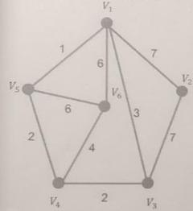
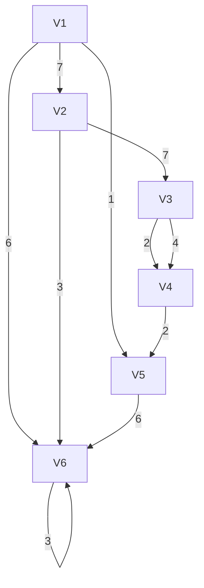

2022～2023学年第1学期期末考试试卷

《离散数学》(A卷 共5页)

(考试时间：2023年3月11日)

<table><tr><td>题号</td><td>(一)</td><td>(二)</td><td>(三)</td><td>(四)</td><td>成绩</td><td>核分人签字</td></tr><tr><td>得分</td><td></td><td></td><td></td><td></td><td></td><td></td></tr></table>

## （一）数理逻辑部分

<!-- QUESTION: qtype=short_answer tags=命题逻辑,逻辑推理,真值判断 difficulty=3 chapter=第一章 数理逻辑 -->

（5分）三位球迷预测下一届足球世界杯的冠军。

A 球迷：巴西和德国都不是冠军。

B 球迷：中国是冠军，并且德国不是冠军。

C 球迷：巴西是冠军，并且中国不是冠军。

预言家笑着说，三位球迷中的两位预测完全正确，而另一位球迷的预测完全错误。

请运用数理逻辑知识，判断该预言家认为哪个国家是世界杯冠军。

<!-- QUESTION END -->

<!-- QUESTION: qtype=short_answer tags=命题逻辑,推理理论,逻辑推理 difficulty=3 chapter=第一章 数理逻辑 -->

(8分)中报接到一个自称王警官的电话。根据通话内容，小张得到以下事实：

王警官是电信诈骗分子。

小张没有被要求提供银行卡信息。

根据上述事实，请使用推理理论，帮助小张判断王警官的真实身份。（要求写出推理过程）

<!-- QUESTION END -->

<!-- QUESTION: qtype=short_answer tags=谓词逻辑,量化推理,直接证明 difficulty=4 chapter=第一章 数理逻辑 -->

（7分）翻译下面的前提和结论为数理逻辑公式，并使用直接证法或间接证法，证明前提能够推出结论。

前提：1）所有大学生都喜欢打篮球。

张三是天津大学的学生。

结论：若张三是天津人，则张三喜欢打篮球。

<!-- QUESTION END -->

（二）集合论部分
<!-- QUESTION: qtype=short_answer tags=集合基数,并集,基数比较 difficulty=3 chapter=第二章 集合论 -->

（5分）设A和B是两个集合，定义 $A+B=\{<x,0>|x\in A\}\cup\{<y,1>|x\in B\}$ 证明： $|A\cup B|\leqslant|A+B|$ ，其中 $|A+B|$ 表示A+B的基数。

<!-- QUESTION END -->

<!-- QUESTION: qtype=short_answer tags=二元关系,闭包运算,等价关系 difficulty=4 chapter=第二章 集合论 -->

(7分) 设 R 是集合 A 上的一个二元关系。证明：

$\mathrm{rts}(R)=\mathrm{tsr}(R)$ ，其中 $\mathrm{rts}(R)$ 表示先求对称闭包、再求传递闭包、最后求自反闭包。

Its(R)是A上的一个等价关系。

<!-- QUESTION END -->

<!-- QUESTION: qtype=short_answer tags=命题公式,真值表,联结词完备集 difficulty=4 chapter=第一章 数理逻辑 -->

（5分）设命题公式A包含三个命题变元p、q、r。在两个真值指派 $p = 0$ 、 $q = 1$ 、 $r = 1$ 和 $p = 1$ 、 $q = 0$ 、 $r = 0$ 下，公式A的真值为1；在其余的真值指派下，A的真值都是0。请写出公式A的具体形式，要求A中仅含联结词\~和→。

<!-- QUESTION END -->

<!-- QUESTION: qtype=short_answer tags=偏序集,哈斯图,幂集,极大元 difficulty=4 chapter=第二章 集合论 -->

（8分）设 $R$ 是集合 $H = \{1,2,3,4\}$ 的幂集上的“子集”关系。且集合 $K = \{[1,2], [1,3], [2,4]\}$ 的幂集的幂集

上确界。画出 R 的哈斯图，并给出集合 K 的极大元、最大元、上界、

<!-- QUESTION END --><!-- QUESTION: qtype=short_answer tags=同构,代数结构,传递性 difficulty=3 chapter=第三章 代数系统 -->

(6 分)证明：若 $\langle A, \Delta\rangle$ 与 $\langle B, * \rangle$ 同构，并且 $\langle B, * \rangle$ 与 $\langle C, \# \rangle$ 同构，则 $\langle A, \Delta\rangle$ 与 $\langle C, \# \rangle$ 同构。

<!-- QUESTION END -->

<!-- QUESTION: qtype=short_answer tags=群论,元素阶,有限群 difficulty=4 chapter=第三章 代数系统 -->

(6分)设 $\langle G,*)$ 是一个有限群。证明：对于任何的G中元素a，b，都有 $a*b$ 和 $b*a$ 的阶相等。

<!-- QUESTION END -->

<!-- QUESTION: qtype=short_answer tags=集合包含,笛卡尔积 difficulty=2 chapter=第二章 集合论 -->

（5分）证明：若 $A \subseteq B$ 和 $C \subseteq D$ ，则 $A \times C \subseteq B \times D$ 。

<!-- QUESTION END -->

<!-- QUESTION: qtype=short_answer tags=二元运算,吸收律,幂等律 difficulty=3 chapter=第三章 代数系统 -->

(6分)设△和\*是集合A上的两个二元运算，且△和\*在A上满足吸收律。

证明： $\Delta$ 和\*在A上满足等幂律。

<!-- QUESTION END -->

## (四) 图论部分

<!-- QUESTION: qtype=short_answer tags=平面图,欧拉公式,连通分支 difficulty=4 chapter=第四章 图论 -->

（6分）设G是一个平面图，其中它的结点数、边数、面数分别为v，e，r，并且它的连通分支数为n。证明： $v-e+r=n+1$ 。

<!-- QUESTION END -->

<!-- QUESTION: qtype=short_answer tags=循环群,子群,因子 difficulty=4 chapter=第三章 代数系统 -->

（7分）设 $\langle G,*)$ 是一个n阶循环群。证明：若m是n的一个因子，则 $\langle G,*)$ 至少有一个m阶子群也是循环群。

<!-- QUESTION END --><!-- QUESTION: qtype=short_answer tags=欧拉图,割边,图论 difficulty=3 chapter=第四章 图论 -->

（5分）证明：欧拉图不含有割边。

<!-- QUESTION END -->

<!-- QUESTION: qtype=short_answer tags=最小生成树,最大带宽,图论应用 difficulty=4 chapter=第四章 图论 -->

（7分）如图所示的带权图，节点表示六座通信基站，节点之间的边表示修建光缆的带宽（单位：Gbps）。试给出一个设计方案，使得各基站之间能相互通信并且总带宽最大，并求出最大带宽。（要求写出具体步骤）

flowchart

<!-- QUESTION END -->

<!-- QUESTION: qtype=short_answer tags=蕴含式,传递闭包,矩阵表示 difficulty=4 chapter=第一章 数理逻辑 -->

（7分）设A、B、C、D、E是5个命题公式，并且已知蕴含式 $\mathrm{A}\Rightarrow \mathrm{B},\mathrm{A}\Rightarrow \mathrm{C},\mathrm{A}\Rightarrow \mathrm{D},$ $\mathrm{B}\Rightarrow \mathrm{A},\mathrm{B}\Rightarrow \mathrm{D},\mathrm{C}\Rightarrow \mathrm{B},\mathrm{D}\Rightarrow \mathrm{E}$ 。由 $\Rightarrow$ 的传递性，可以得到新的蕴含式（例如，由 $\mathrm{A}\Rightarrow \mathrm{D}$ 和 $\mathrm{D}\Rightarrow \mathrm{E}$ 可以得到 $A\Rightarrow E)$ 。请给出所有新的蕴含式。注意，本题要求使用图的矩阵表示方法解答。

<!-- QUESTION END -->