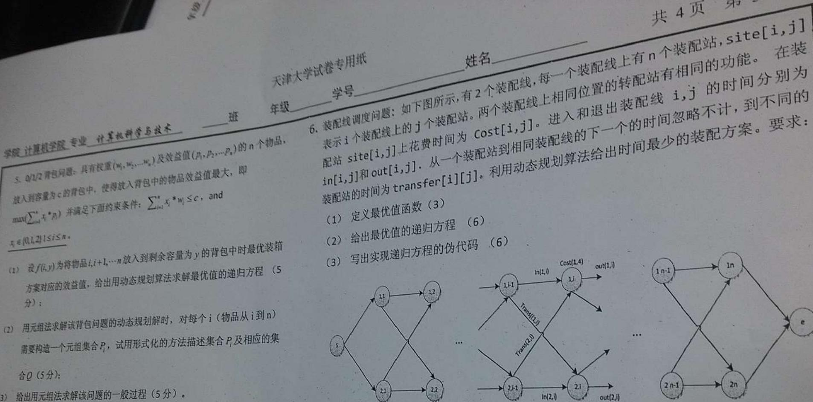
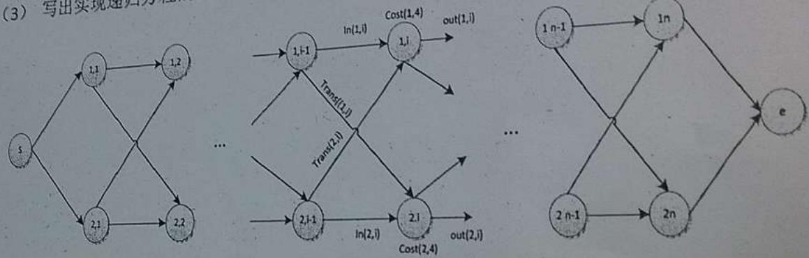
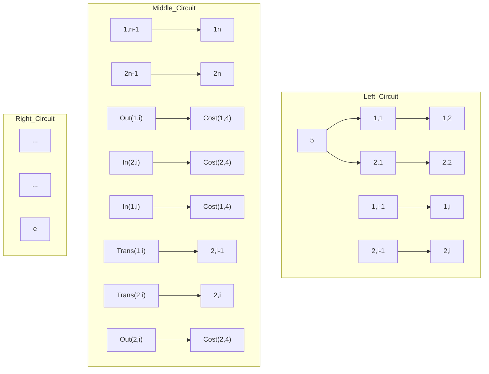

2012\~2013学年第2学期期末考试试卷

《算法设计与分析》(B卷 共页)

(考试时间：2013年6月26日)

<table><tr><td>题号</td><td>一</td><td>二</td><td>三</td><td>四</td><td>五</td><td>六</td><td>七</td><td>成绩</td><td>核分人签字</td></tr><tr><td>得分</td><td></td><td></td><td></td><td></td><td></td><td></td><td></td><td></td><td></td></tr></table>

1. 简述题（每小题6分，共18分）

1）简述算法时间复杂性的定义并结合课程学习给出分析算法时间复杂性的两种方法。

2）简述多项式约化的含义，并简述证明一个问题是NPC问题的步骤。

3) 算法 A 的计算时间 T(n) 满足递归关系式；T(n)=2T(n/2)+n logn. 请使用渐进符号表示 T(n)。

2. (7 分) 假定 V 表示顶点集合, Q 用数组表示, 分析 Dijkstra's 算法的复杂性, 写出分析过程。

$$
d [ s ] \leftarrow 0
$$

$$
\text { for   each } v \in V - \{s \}
$$

$$
\mathrm{do} d [ v ] \leftarrow \infty
$$

$$
S \leftarrow \Phi
$$

$$
Q \leftarrow V
$$

$$
\text { while } Q \neq \Phi
$$

$$
\mathrm{do} \mathrm{u} \leftarrow \text { Extract - Min } (\mathrm{Q})
$$

$$
S \leftarrow S \cup \{u \}
$$

$$
\text { for   each } v \in A d j [ u ]
$$

$$
\text { do   if } d [ v ] > d [ u ] + w (u, v)
$$

$$
\text { then } d [ v ] \leftarrow d [ u ] + w (u, v)
$$

3. 试用分治法对数组 A[n] 实现快速排序, 写出算法的伪代码, 并分析算法的最好、最坏时间复杂性 (15 分).

4. 已知 n 个任务的执行序列。假设任务 i 需要 $t_{i}$ 个时间单位。若任务完成的顺序为  
1, 2, ..., n，则任务 i 完成的时间为 $c_{i}=\sum_{j=1}^{i}t_{j}$ 。任务的平均完成时间（ACT）为 $\frac{1}{n}\sum_{i=1}^{n}c_{i}$ 。  
1）考虑有四个任务的情况，每个任务所需要的时间分别是（4，2，8，1）。若任务的顺序为1，2，3，4，则任务的平均完成时间（ACT）是多少？（3分）  
2）设计具有最小ACT的任务序列的贪婪算法，用伪代码描述。（4分）  
3）分析算法的复杂性。（4分）  
4）分析算法的最优性（若算法能得到最优任务序列，给出证明；若算法不能得到最优任务序列，举出反例）（4分）

text_image

天津大学试卷专用纸
班
年级
学号
姓名
共4页 第3页
学院 计算机学院 专业 计算机科学与技术
5. Q/2/2 背包问题: 具有权重(w₁, w₂, ..., wₙ)及效益值(p₁, p₂, ..., pₙ)的n个物品,
放入到容量为c的背包中, 使得放入背包中的物品效益值最大, 即
max(∑i=1^n x_i * w_i ≤ c, and
x_i ∈{0,1,2} l ≤ i ≤ n。
(1) 设f(i,y)为将物品i,i+1,...n放入到剩余容量为y的背包中时最优装箱
方案对应的效益值, 给出用动态规划算法求解最优值的递归方程 (5分);
(2) 用元组法求解该背包问题的动态规划解时, 对每个i (物品从i到n)
需要构造一个元组集合P₁, 试用形式化的方法描述集合P₁及相应的集
合Q (5分);
(3) 给出用元组法求解该问题的一般过程 (5分)。
6. 装配线调度问题: 如下图所示, 有2个装配线, 每一个装配线上有n个装配站, site[i,j]
表示i个装配线上的j个装配站。两个装配线上相同位置的转配站有相同的功能。在装
配站site[i,j]上花费时间为Cost[i,j]。进入和退出装配线i,j的时间分别为
in[i,j]和out[i,j]。从一个装配站到相同装配线的下一个的时间忽略不计, 到不同的
装配站的时间为transfer[i][j]。利用动态规划算法给出时间最少的装配方案。要求:
(1) 定义最优值函数 (3)
(2) 给出最优值的递归方程 (6)
(3) 写出实现递归方程的伪代码 (6)

flowchart

学院\_\_\_\_专业\_\_\_\_

7. 子集和数问题: 已知 $n+1$ 个正数: $w_{i}, 1 \leq i \leq n$ , 和 $M$ 。要求得到得子集内元素之和等于 $M$ , 用 $n$ 元组的方法表示解向量, 要求:

(1) 给出回溯方法求解该问题的两种限界方法 (6)
(2) 给出利用上述限界条件的回溯法伪代码 (9)。

天津大学试卷专用纸

年级\_\_\_\_学号\_\_\_\_

姓名