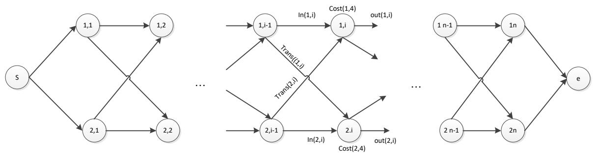
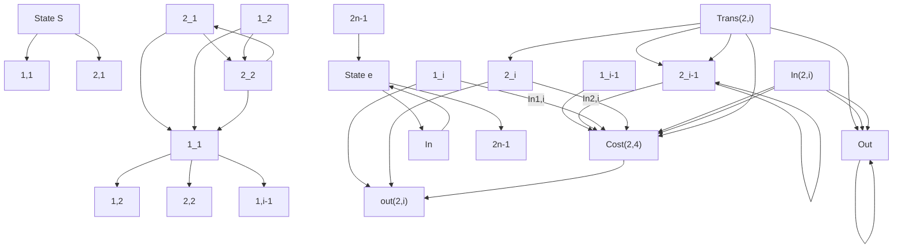

简述题

<!-- QUESTION: qtype=short_answer tags=算法复杂性分析,渐进符号,多项式约化,NP完全,时间复杂度,递归,空间复杂度 difficulty=4 chapter=算法概述与分析 -->
(1)简述算法复杂性分析的方法及用途。

(2)算法 A 的计算时间 f(n)满足递归关系式：f(n)=2f(n-1)+1; n>0,f(0)-1. 算法 B 的计算时间 g (n)=2f(n/2)+logn. 请使用渐进符号分别表示 f(n)和 g(n)

(3)简述多项式约化的含义，并简述证明一个问题是 NPC 问题的步骤（6 分）。
<!-- ANSWER -->
（1）算法复杂性分析的方法有解析法和实验测量法，分析的角度分为时间复杂度和空间复杂度。

用途：根据算法复杂度分析的结果选择适当的算法，或评价算法

例如，选择满足空间要求的算法，选择有一定时间要求的算法等。

（2）

$$
\mathrm{f} (\mathrm{n}) = \mathrm{O} (2 ^ {\wedge} \mathrm{n})
$$

$$
\mathrm{G} (\mathrm{n}) = \mathrm{O} (\mathrm{n})
$$

（3）问题P 可多项式地约化为问题Q ,如果存在一个有多项式界的确定性算法T,使得：

（1）对每个输入字符串 x, T 产生一字符串 T(x).

（2）x 是 P 的合法输入且 P 对 x 有 yes 答案当且仅当 T(x) 是Q 的合法输入且有 yes 答案

证明问题 Q 是 NP-完全问题的步骤：

（1） 选择一已知的 NP-完全问题 P

（2） 证明 P 可多项式的约化为 Q
<!-- EXPLANATION -->
<!-- QUESTION END -->

<!-- QUESTION: qtype=short_answer tags=算法复杂性分析,时间复杂度,循环分析 difficulty=4 chapter=算法概述与分析 -->
（7 分） 分析下面用伪代码描述的算法的复杂性，写出分析过程。

```hcl
for m = 2 to n do{
    for i = 0 to n - m do{
    j = i + m
    w(i, j) = w(i, j - 1) + P(i) + Q(j)
    c(i, j) = mini < l ≤ j { c(i, l - 1) + c(l, j) } + w(i, j)
    }
}
```

W(n,n)，P(n)，Q(n)，c(n,n)为算法中使用的数组并已初始化
<!-- ANSWER -->
$\mathsf { m i n } _ { \mathsf { i < l \leq j } } \{ \mathsf { c } ( \mathsf { i } , \mathsf { l - 1 } ) + \mathsf { c } ( \mathsf { l } , \mathsf { j } ) \}$ 的执行时间为 $\mathrm { O } ( j - i ) = \mathrm { O } ( m )$ ；

内层 for-循环的执行时间为 $\mathrm { O } ( m ( n - m ) )$ ；

总的执行时间 $\mathrm { \dag } ( \mathsf { n } ) { = } \mathrm { O } ( \sum _ { m = 2 } ^ { n } m ( n - m ) ) { = } \mathrm { O } ( n ^ { 3 } )$
<!-- EXPLANATION -->

<!-- QUESTION END -->

<!-- QUESTION: qtype=short_answer tags=分治法,逆序数,归并排序,时间复杂度 difficulty=4 chapter=分治法 -->
给定自然数 1, … , n 的一个排列，例如，(2, 1, 5, 3, 4)，如果j > i 但j 排在i 的前面则称(j, i)为该排列的一个逆序。在上例中 (2, 1)，(5, 3) , (5,4)为该排列的逆序。该排列总共有 3 个逆序。

1) 试用分治法设计一个计算给定排列的逆序总数的算法. (8 分)  
2) 分析算法的时间复杂度。（7 分）
<!-- ANSWER -->
算法的伪代码如下：

1） 将输入排列 $\mathsf { A } [ 1 , \mathsf { n } ]$ 在中间分成两个子排列 $\mathsf { A } [ 1 , \mathsf { n } / 2 ]$ 和$\mathsf { A } [ \mathsf { n } / 2 + 1 , \mathsf { n } ]$ ；

2） 递归对这两个子排列应用该算法，得到逆序数为 n1 和${ \mathsf n } { 2 }$ ；  
3） 对这两个子排列排序；  
4） 使用线性时间算法计算排序后两个子排列间的逆序数，设其为 n3；  
5） n1+n2+n3 即为原始的输入排列的逆序数；

计算排序后两个子排列间的逆序数的算法可在合并（merge）算法的基础上得到。

上述算法的时间复杂度为：

$$
t (n) = \left\{ \begin{array}{l l} d & n \leq 1 \\ 2 t (n / 2) + c n \log n & n > 1 \end{array} \right.
$$

按 Master 定理， $\operatorname { t } \left( \mathrm { n } \right) = \Theta ( \mathsf { n } | \mathsf { o g } ^ { 2 } \mathsf { n } )$
<!-- EXPLANATION -->

<!-- QUESTION END -->

<!-- QUESTION: qtype=short_answer tags=贪心法,连续背包问题,价值密度,最优性证明 difficulty=4 chapter=贪心法 -->
考虑0≤ ≤1而不是 $x i \in \{ \begin{array} { l } { 0 \ , \ 1 } \end{array} \}$ 的连续背包问题。一种可行的贪婪策略是：按价值密度非递减的顺序检查物品，若剩余容量能容下正在考察的物品，将其装入；否则，往背包中装入此物品的一部分。

1) 对于 =3, $\boldsymbol { w } = \left[ 1 0 0 , 1 0 , 1 0 \right]$ , $p { = } \texttt { [ 2 0 , 1 5 , 1 5 }$ ]及 $c { = }$ 1 0 5 ,上述装入方法获得的结果是什么？ (7分)  
2) 证明这种贪婪算法总能获得最优解。（8 分）
<!-- ANSWER -->
（1）首先计算三种物品的价值密度向量[0.2,1.5,1.5]，并重新排序得：

$$
W ^ {\prime} = [ 1 0, 1 0, 1 0 0 ], p ^ {\prime} = [ 1 5, 1 5, 2 0 ];
$$

然后按要求的贪婪策略装入重新排序的物品1，2，此时装入背包中的物品总价值为30，占用容量为20，剩余容量为85；

最后，装入剩余物品的一部分即0.85倍，价值为$0 . 8 5 { * 2 0 } \mathrm { = } 1 7$ ；

所以，总价值为30+17=47，装包方法为(1,1,0.85),回复到原顺序为（0.85,1,1）。

（2） 假设物品已按价值密度非递减的顺序排列， $\mathbf { x } _ { 1 } \ldots \mathbf { x } _ { \mathfrak { n } }$ 是贪心法得到的解， $\forall 1 \cdots \forall n$ 是最优解。下面我们可以证得这两组解得到的价值总值是相等的，从而贪心法得到的解是最优的。

假设 j 是使得 $( \mathsf { x } _ { \mathrm { i } } { = } \mathsf { y } _ { \mathrm { i } } , 1 { \leqslant } \mathsf { i } { < } \mathsf { j }$ ， $\mathsf { x } _ { \mathrm { j } } \neq \mathsf { y } _ { \mathrm { j } } )$ 的最小下标，如果这样的 j不存在，则两组解是同样的，因此贪心法得到的解是最优的。假设存在这样的j，从贪心法的求解过程以及最优解是一个可行解的事实，可以推导出 $\mathsf { x } _ { \mathrm { j } } > \mathsf { y } _ { \mathrm { j } }$ 。通过减小 $\mathsf { Y } _ { \mathrm { j } + 1 }$ 、 $y _ { j + 2 }$ 、…，增加 $\mathsf { Y } _ { \mathrm { j } }$ 的方法，可以增加 $\mathsf { Y } _ { \mathrm { j } }$ 到 $\mathsf { X } _ { \mathrm { j } }$ ，因为是用高价值密度的物品代替低价值密度或等价值密度的物品，所以背包总价值不可能降低。通过这种转换，得到一个新的最优解 $\forall 1 \cdots \forall n$ ，新的最优解与贪心法得到的解相比，如果存在 j1 使得 $( x _ { \mathrm { i } } = y _ { \mathrm { i } } ,$ 1≤i<j1 ， $\mathsf { x } _ { \mathrm { j } 1 } \neq \mathsf { y } _ { \mathrm { j } 1 } )$ ，那么这里的 j1 应该大于前面提到的 j。

重复做这样的转换，可以将最初的最优解转化为贪心解，并且不会降低背包的价值，因此这种贪心算法总能获得最优解。
<!-- EXPLANATION -->

<!-- QUESTION END -->

<!-- QUESTION: qtype=short_answer tags=动态规划,背包问题,最优子结构,递归方程 difficulty=4 chapter=动态规划 -->
$/ 1 / 2$ Knapsack problem：具有权重 $\left( w _ { 1 } , w _ { 2 } , . . . w _ { n } \right)$ 及效益值

$( p _ { 1 } , p _ { 2 } , . . . p _ { n } )$ 的 n 个物品，放入到容量为 c 的背包中，使得放入

背包中的物品效益值最大，即 $\textstyle \operatorname* { m a x } ( \sum _ { i = 1 } ^ { n } x _ { i } ^ { * } p _ { i } )$ 并满足下面约束

条件： $\sum _ { i = 1 } ^ { n } x _ { i } \sp \ast w _ { i } \leq c \ , \sf { a n d } \ x _ { i } \in \{ 0 , 1 , 2 \} \ : 1 \leq i \leq n$ 。

（1） 证明 $0 / 1 / 2$ 背包问题满足最优子结构性质 （7分）。

（2） 定义最优值函数（3）  
（3） 给出用动态规划算法求解最优值的递归方程（5）。
<!-- ANSWER -->
（1）权重 $\left( w _ { 1 } , w _ { 2 } , . . . w _ { n } \right)$ 及效益值 $( p _ { 1 } , p _ { 2 } , . . . p _ { n } )$ 的 n 个物品，放入到容量为 c 的背包中。假设 $( x _ { 1 } , x _ { 2 } , . . . x _ { n } ) ~ ( ~ x _ { i } \in ( 0 , 1 , 2 ) ~ )$ ）是该问题的最优解，

不失一般性，对于子问题 $( w _ { 1 } , w _ { 2 } , \ldots w _ { n - 1 } )$ 及 $( p _ { 1 } , p _ { 2 } , . . . p _ { n - 1 } )$ 的 n-1 个物品，及容量 $c - x _ { n } w _ { n }$ ，则 $\begin{array} { l } { ( x _ { 1 } , x _ { 2 } , . . . x _ { n - 1 } ) } \end{array}  { ( } x _ { i } \in ( 0 , 1 , 2 ) \ )$ ）是该子问题的最优解。因为：

1） $\begin{array} { r } { \sum _ { i = 1 } ^ { n - 1 } x _ { i } ^ { * } w _ { i } \leq c - x _ { n } w _ { n } } \end{array}$ 即 $( x _ { 1 } , x _ { 2 } , . . . x _ { n - 1 } )$ 为子问题的可行解，由于：

$$
\sum_ {i = 1} ^ {n} x _ {i} * w _ {i} = \sum_ {i = 1} ^ {n - 1} x _ {i} * w _ {i} + x _ {n} w _ {n} \leq c
$$

$$
\sum_ {i = 1} ^ {n - 1} x _ {i} * w _ {i} \leq c - x _ {n} w _ {n}
$$

2） $( x _ { 1 } , x _ { 2 } , . . . x _ { n - 1 } )$ 也是该子问题的最优解。否则，假设

$( y _ { 1 } , y _ { 2 } , . . . y _ { n - 1 } )$ 是该子问题的最优解，那么：

${ \sum } _ { i = 1 } ^ { n - 1 } { { y } _ { i } } ^ { * } { p } _ { i } > { \sum } _ { i = 1 } ^ { n - 1 } { { x } _ { i } } ^ { * } { p } _ { i }$ ，因而

${ \sum } _ { i = 1 } ^ { n - 1 } { { { y } _ { i } } ^ { * } } { p _ { i } } + { { x } _ { n } } { p _ { n } } > { \sum } _ { i = 1 } ^ { n - 1 } { { { x } _ { i } } ^ { * } } { p _ { i } } + { { x } _ { n } } { p _ { n } }$ ，同时，

${ \textstyle \sum _ { i = 1 } ^ { n - 1 } y _ { i } ^ { * } w _ { i } + x _ { n } w _ { n } \leq c }$ 即 $( y _ { 1 } , y _ { 2 } , . . . y _ { n - 1 } , x _ { n } )$ 是原问题的可行解，这与

$( x _ { 1 } , x _ { 2 } , . . . x _ { n } )$ 是原问题的最优解相矛盾。

所以， $0 / 1 / 2$ 背包问题满足最优子结构性质，即最优解包含的子问题的解也是最优的

(2)定义 f(i,y)为物品从 i 到 n，背包容量为 y 时最优装箱方案对应的效益值

(3)最优值的递归方程:

$$
f (n, y) = \left\{ \begin{array}{l l} 0 & \text { if } w _ {n} > y \\ p _ {n} & \text { if } w _ {n} \leq y <   2 w _ {n} \\ 2 * p _ {n} & \text { if } y \geq 2 w _ {n} \end{array} \right.
$$

$$
f (i, y) = \left\{ \begin{array}{l} f (i + 1, y) \quad i f w _ {i} > y \\ \max \left\{f (i + 1, y), f (i + 1, y - w _ {i}) + p _ {i} \right\} \quad i f w _ {i} \leq y <   2 w _ {i} \\ \max \left\{f (i + 1, y), f (i + 1, y - w _ {i}) + p _ {i}, f (i + 1, y - 2 w _ {i}) + 2 p _ {i} \right\} \text {if} y \geq 2 w _ {n} \end{array} \right.
$$
<!-- EXPLANATION -->

<!-- QUESTION END -->

<!-- QUESTION: qtype=short_answer tags=动态规划,装配线调度,递归方程,伪代码 difficulty=4 chapter=动态规划 -->
装配线调度问题: 如下图所示，有 2 个装配线，每一个装配线上有 n 个装配站，site[i,j]表示 i 个装配线上的 j 个装配站。两个装配线上相同位置的转配站有相同的功能。 在装配站 site[i,j]上花费时间为 Cost[i,j]。进入和退出装配线 i,j 的时间分别为 in[i,j]和 out[i,j]. 从一个装配站到相同装配线的下一个的时间忽略不计，到不同的装配站的时间为 transfer[i][j]。利用动态规划算法给出时间最少的装配方案。要求：

（1） 定义最优值函数（3）  
（2） 给出最优值的递归方程 （6）  
（3） 写出实现递归方程的伪代码 （6）



<details>
<summary>flowchart</summary>


</details>
<!-- ANSWER -->
（1） 定义 为从初始状态到第 i 条装配线第 j 个装配站f i j (, )的所用的最少时间，则初始状态： $\left\{ \begin{array} { l l } { f ( 1 , 1 ) = i n ( 1 , 1 ) + \cos t ( 1 , 1 ) } \\ { f ( 1 , 1 ) = i n ( 2 , 1 ) + \cos t ( 2 , 1 ) } \end{array} \right.$

最终完成时间 $f = \operatorname* { m i n } \{ f ( 1 , n ) + o u t ( 1 , n ) , f ( 2 , n ) + o u t ( 2 , n ) \}$ 。

下面的结果也同样得满分：

由于从一个装配站到相同装配线的下一个的时间忽略不计，因此只需考虑从初始状态进入装配线的时间及退出装配线的时间，故对所有 in[i,j]中 j 只能为 1，对于所有 out[i,j]，j 只能为n，所以上式也可以记为：

$$
\left\{ \begin{array}{l} f (1, 1) = i n (1) + \cos t (1, 1) \\ f (1, 1) = i n (2) + \cos t (2, 1) \end{array} \right. f = \min \{f (1, n) + o u t (1), f (2, n) + o u t (2) \}
$$

（2）递归关系：

$$
\left\{ \begin{array}{l} f (1, j) = \min \left\{f (1, j - 1) + \cos t (1, j), f (2, j - 1) + t r a n s (2, j) + \cos t (1, j) \right\} \\ f (2, j) = \min \left\{f (2, j - 1) + \cos t (2, j), f (1, j - 1) + t r a n s (1, j) + \cos t (2, j) \right\} \end{array} \right.
$$

（3）伪代码

$$
f (1, 1) = i n (1) + \cos t (1, 1)
$$

$$
f (2, 1) = i n (2) + \cos t (2, 1)
$$

for j=2 to n do

$$
f (1, j) = \min \left\{f (1, j - 1) + \cos t (1, j), f (2, j - 1) + \operatorname{trans} (2, j) + \cos t (1, j) \right\}
$$

$$
f (2, j) = \min \left\{f (2, j - 1) + \cos t (2, j), f (1, j - 1) + \text { trans } (1, j) + \cos t (2, j) \right\}
$$

End for

$$
\text { Return } \min \{f (1, n) + o u t (1), f (2, n) + o u t (2) \}
$$
<!-- EXPLANATION -->

<!-- QUESTION END -->

<!-- QUESTION: qtype=short_answer tags=回溯法,子集和数,限界函数,伪代码 difficulty=4 chapter=回溯法与分支界限法 -->
子集和数问题:已知n+1个正数： $w _ { i } , 1 { \leq } \mathsf { i } { \leq } \mathsf { n } ,$ 和M。要求找$\mathbb { H } \{ \mathsf { w } \}$ 的所有子集使得子集内元素之和等于M，用n元组的方法表示解向量，要求：

（1） 给出回溯方法求解该问题的两种限界方法（6）  
（2） 给出利用上述限界条件的回溯法伪代码（9）。
<!-- ANSWER -->
用定长元组的方法表示解向量，即 ${ ( x _ { 1 } , x _ { 2 } , . . . x _ { n } ) } ~ \left( \begin{array} { c } { { x _ { i } \in \{ 0 , 1 \} } } \end{array} \right)$

（1） 两种限界条件分别为：

a) $\sum _ { i = 1 } ^ { k } W ( i ) X ( i ) + \sum _ { i = k + 1 } ^ { n } W ( i ) < M$

b) 将 wi 按非递减排序 $\sum _ { i = 1 } ^ { k } W ( i ) X ( i ) + W ( k + 1 ) > M$

（2）伪代码表示如下：

1) Let $\mathsf { s } { = } \mathsf { w } ( 1 ) { \times } ( 1 ) { + } \cdots { + } \mathsf { w } ( \mathsf { k } { - } 1 ) { \times } ( \mathsf { k } { - } 1 )$

$$
r = w (k) + \dots + w (n), \text { assume } s + r \geqslant M
$$

2) Expanding left child node

a)If $S + W ( k ) + W ( k + 1 ) > M \ t h e n$

i. stop expanding  
ii. $\mathsf { r } { \ll } \mathsf { r } { - } \mathsf { w } ( \mathsf { k } ) ,$  
iii. Expanding right child node;

b)Else

i. $\mathsf { X } ( \mathsf { k } ) { \gets } 1$  
ii. $\mathsf { s } { \gets } \mathsf { s } { + } \mathsf { w } ( \mathsf { k } )$ ，

iii. $\mathsf { r } \gets \mathsf { r } \mathsf { - w } ( \mathsf { k } )$ ，let $( \mathsf { x } ( 1 ) , . . . , \mathsf { x } ( \mathsf { k } ) )$ be E-Node;

3) Expanding right child node ：

a)If $\mathsf { S } + \mathsf { r } { < } \mathsf { M }$ or $s + w ( k + 1 ) > M$ then stop expanding ;

i. Else $\mathbf { \nabla } \times ( \mathsf { k } ) {  } 0$
<!-- EXPLANATION -->

<!-- QUESTION END -->