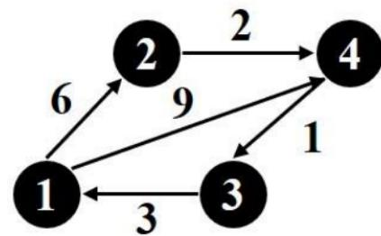
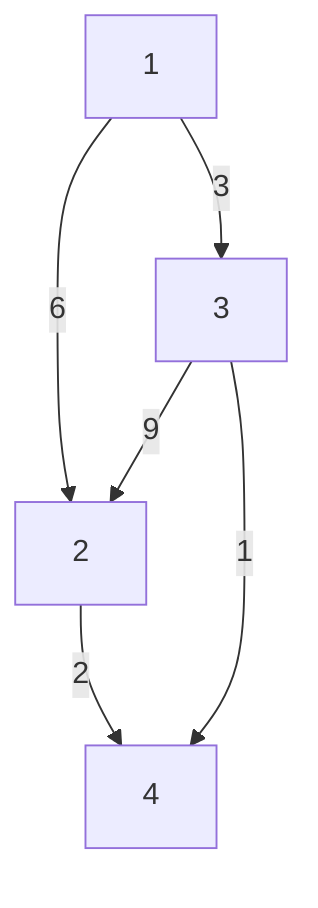
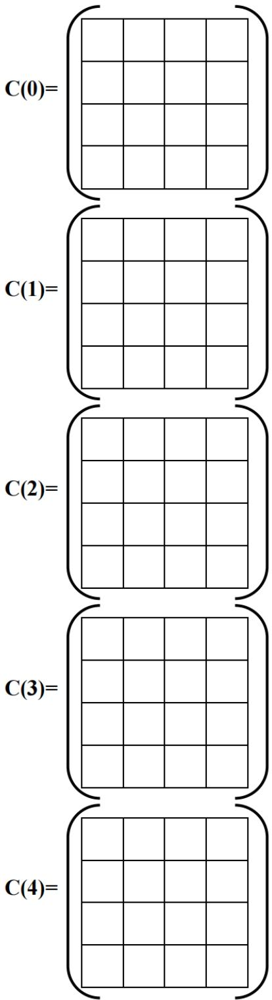

算法设计与分析测试题

一、选择题（选项不唯一，每小题3分，共15分）

<!-- QUESTION: qtype=single_choice tags=时间复杂度,渐进分析 difficulty=2 chapter=算法概述与分析 -->
设 $n$ 是描述问题规模的非负整数，下面程序片段的时间复杂度是（）

$$
\mathrm{x} = 2;
$$

$$
\text { while } (x <   n / 2)
$$

$$
\mathrm{x} = 2 ^ {*} \mathrm{x};
$$

A. $O(\log n)$

B. $O(n)$

C. $O(n\log n)$

D. $O(n^{2})$
<!-- QUESTION END -->

<!-- QUESTION: qtype=single_choice tags=算法特性,算法定义 difficulty=1 chapter=算法概述与分析 -->
计算机算法必须具备的三个特性是（）

A. 可执行性、可移植性、可扩充性  
B. 可执行性、确定性、有穷性  
C. 确定性、有穷性、稳定性  
D. 易读性、稳定性、安全性
<!-- QUESTION END -->

<!-- QUESTION: qtype=single_choice tags=时间复杂度,渐近复杂度 difficulty=2 chapter=算法概述与分析 -->
下列函数中渐近时间复杂度最小的是（）

A. $T(n) = \log_{2}n + 5000n$  
B. $T(n) = n^{2} - 8000n$  
C. $T(n) = n^{3} + 5000n$  
D. $T(n) = 2n \log_{2} n - 1000 n$
<!-- QUESTION END -->

<!-- QUESTION: qtype=multi_choice tags=递归,递归方程,时间复杂度 difficulty=3 chapter=算法概述与分析 -->
解递归的三种方法是（）

A. 递归树

B. 主方法

C. 代入法

D. 解析法
<!-- QUESTION END -->

<!-- QUESTION: qtype=multi_choice tags=解空间,状态空间树,回溯法 difficulty=3 chapter=回溯法与分支界限法 -->
解空间的表示方法是（）

A. 优先级树

B. 子集树

C. 排列树

D. 以上三个都包括
<!-- QUESTION END -->

二、算法分析题（每小题10分，共20分）

<!-- QUESTION: qtype=short_answer tags=时间复杂度,矩阵乘法,频率表 difficulty=3 chapter=算法概述与分析 -->
以下程序段用于计算两个 $n \times n$ 矩阵的乘法。计算该函数的渐进复杂性并绘制该函数的频率表（给出具体过程）。

```lisp
template<class T>
void Mult(T **a, T **b, T **c, int n)
{
    for(int i = 0; i < n; i++)
    for(int j = 0; j < n; j++) {
    Tsum = 0;
    for(int k = 0; k < n; k++)
    sum += a[i][k] * b[k][j];
    c[i][j] = sum;
    }
}
```

<table><tr><td>Statement</td><td>s/e</td><td>Frequency</td><td>Total steps</td></tr><tr><td>void Mult(T **a, T **b, T **c, int n) {</td><td></td><td></td><td></td></tr><tr><td>for(int i = 0; i &lt; n; i++)</td><td></td><td></td><td></td></tr><tr><td>for(int j = 0; j &lt; n; j++) {</td><td></td><td></td><td></td></tr><tr><td>Tsum = 0;</td><td></td><td></td><td></td></tr><tr><td>for(int k = 0; k &lt; n; k++)</td><td></td><td></td><td></td></tr><tr><td>sum += a[i][k] * b[k][j];</td><td></td><td></td><td></td></tr><tr><td>c[i][j] = sum;} }</td><td></td><td></td><td></td></tr></table>
<!-- QUESTION END -->

<!-- QUESTION: qtype=short_answer tags=时间复杂度,排名算法,频率表 difficulty=3 chapter=算法概述与分析 -->
以下程序段用于计算数组中每个元素对应的排名。计算该函数的渐进复杂性并绘制该函数的频率表。（给出具体过程）

```cpp
template<class T>
void Rank(Ta[], int n, int r[])
{
    for(int i = 1; i < n; i++)
    r[i] = 0;
    for(int i = 1; i < n; i++)
    for(int j = 1; j < n; j++)
    if(a[j] <= a[i])    r[i]++;
    else    r[j]++;
    }
}
```

<table><tr><td>Statement</td><td>s/e</td><td>Frequency</td><td>Total steps</td></tr><tr><td>void Rank(Ta[], int n, int r[])</td><td></td><td></td><td></td></tr><tr><td>for(int i = 1; i &lt; n; i++)</td><td></td><td></td><td></td></tr><tr><td>r[i]=0;</td><td></td><td></td><td></td></tr><tr><td>for(int i = 1; i &lt; n; i++)</td><td></td><td></td><td></td></tr><tr><td>for(int j = 1; j &lt; n; j++)</td><td></td><td></td><td></td></tr><tr><td>if(a[j] &lt;= a[i]) r[i]++;
else r[j]++;
}}</td><td></td><td></td><td></td></tr></table>
<!-- QUESTION END -->

三、（15 分）对于 0-1 背包问题，给定一个容积为 c 的背包 n 个已知重量和价值的物品，每个物品的重量分别为 $w_{i}, 1 \leq i \leq n$ ，物品的价值分别为 $v_{i}, 1 \leq i \leq n$ ，物品的重量和价值都是非负的；每个物品只能选择 0 个或 1 个，求能够放入背包的物品的最大价值。

<!-- QUESTION: qtype=short_answer tags=0-1背包,贪心法,1-优化算法,最优子结构,局部搜索 difficulty=4 chapter=贪心法 -->
1）贪心法能否在 0-1 背包问题上求得最优解？如果能，请给出证明，如果不能请举出反例说明。（5 分）

2）设 $n = 8, c = 70, w_i = [16, 20, 4, 15, 25, 10, 5, 8], p = [100, 200, 50, 90, 175, 50, 20, 60]$ ，请用1-优化算法（k-优化算法，k=1）求解此0-1背包问题。（10分）
<!-- ANSWER -->
<!-- EXPLANATION -->
<!-- QUESTION END -->

四、（15 分）针对快速排序问题，请根据要求完成下列问题：

<!-- QUESTION: qtype=short_answer tags=快速排序,伪代码,分治法,递归树,时间复杂度 difficulty=3 chapter=分治法 -->
1）写出快速排序的伪代码。（5分）

2）计算快速排序在最坏情况下的时间复杂度并且绘制递归树。（5分）

3) 如果快速排序每次都能选中中位的元素, 这种情况下的时间复杂度是多少? 试求解并绘制对应的递归树。(5 分)
<!-- ANSWER -->
<!-- EXPLANATION -->
<!-- QUESTION END -->

五、（15 分）现有一张城市地图，图中的顶点为城市，有向边代表两个城市间的连通关系，边上的权即为距离。要求为每一对可达的城市间设计一条公共汽车线路，每条线路的长度在所有可能的方案里是最短的。

<!-- QUESTION: qtype=short_answer tags=最短路径,最优子结构,递归方程,Floyd算法,动态规划 difficulty=4 chapter=动态规划 -->
1）证明：最短路径问题满足最优子结构。（3分）

2）如果用递归方法求解最短路径，请给出递归方程。（2分）

3）考察下图设计公共汽车线路，并填充表格（表格转下页）。（10分）



<details>
<summary>flowchart</summary>



</details>



<details>
<summary>text_image</summary>

C(0)=
C(1)=
C(2)=
C(3)=
C(4)=
</details>
<!-- ANSWER -->
<!-- EXPLANATION -->
<!-- QUESTION END -->

六、（20分）0/1背包问题是一个NP-难度问题，请用回溯法和分支限界法分别求解下述问题。设物品数量 $n = 4$ ，背包容量 $c = 10$ ，物品的价值和重量分别为 $p = [5,10,4,2]$ ， $w = [3,8,5,2]$ 。

<!-- QUESTION: qtype=short_answer tags=回溯法,分支限界法,0-1背包,状态空间树,限界条件,LC检索,算法比较 difficulty=5 chapter=回溯法与分支界限法 -->
1）简述回溯法和分支限界法的区别。（4分）

2）设 $x = (x(1), \ldots, x(k))$ 为状态空间树的节点，bestp是算法当前获得的最优效益值， $cp = x(1)p(1) + \cdots + x(k)p(k)$ 。令bound(x)=cp+其余物品的连续背包问题的优化效益值（根据贪心法得到）。请分别给出用回溯法求解时，展开左子节点和右子节点的限界条件，并画出被限界后的状态空间树，给出优化解和优化值。（8分）

3）请给出 LC 分枝-限界法的限界条件，并画出被限界后的部分状态空间树，给出优化解和优化值。（8 分）
<!-- ANSWER -->
<!-- EXPLANATION -->
<!-- QUESTION END -->
