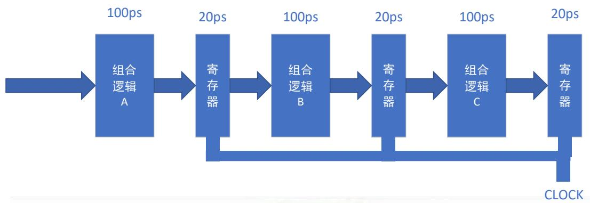

本资料为个人整理，禁止广泛传播

本资料为往年考试真题回忆版，可能与实际真题有出入，也不一定反映了您使用该资料当年试题的题型、难度、知识点覆盖范围。

务必不要直接拿该资料向任课老师询问 wby 每年都会挂一些这样的例子，因为你问了那老师肯定会改题的

关

这

B

建


<details>
<summary>text_image</summary>

关于这门课程的建议：
这门课客观上，很简单，只要把知识点都弄会了。不像高数那样会写，但算不对。
站有录播视频，可以看一下
建议好好学一学
</details>

<!-- QUESTION: qtype=single_choice tags=有符号数,符号扩展,补码 difficulty=2 chapter=信息的表示和处理 -->
1. 用 8 位有符号数表示的十进制数-43，扩展成 16 位有符号数，其编码示为（ ）
A. 0x0087
B. 0xFFD5
C. 0×8079
D. 0×FFF9
<!-- QUESTION END -->

<!-- QUESTION: qtype=single_choice tags=IEEE754,浮点数,单精度 difficulty=3 chapter=信息的表示和处理 -->
2. 十进制数-6 的单精度浮点数 IEEE 754 代码为（ ）
A. 11000000 11000000 00000000 00000000
B. 11000000 10100000 00000000 00000000
C. 01100000 10100000 00000000 00000000
D. 11000000 10110000 00000000 00000000
<!-- QUESTION END -->

<!-- QUESTION: qtype=single_choice tags=高速缓存,组相联,地址映射 difficulty=3 chapter=存储器层次结构 -->
3. 某高速缓存系统：块大小 64字节，8路组相联结构(8-way)，缓存总容量为 32KB。现有一访存请求，内存地址为 0x601018，高速缓存命中，则该数据在高速缓存中的第（ ）组中。
A. 0x18
B. 0x01
C. 0x00
D. 0x10
<!-- QUESTION END -->

<!-- QUESTION: qtype=single_choice tags=GCC,编译,汇编 difficulty=1 chapter=环境与工具 -->
4. 现有 C 语言源代码文件 sum.c，下面哪一条命令可以将 sum.c 编译为汇编代码
A. gcc -c sum.c
B. gcc -o sum.c
C. gcc -S sum.c
D. gcc -E sum.C
<!-- QUESTION END -->

<!-- QUESTION: qtype=single_choice tags=汇编指令,寄存器,加法运算 difficulty=2 chapter=程序的机器级表示 -->
5. 下面的全部指令执行完成后，%bl 寄存器中的编码是( )
```
movb $70, %al
movb $80, %bl
addb %al, %bl
```
A. 0x96
B. 0xFA
C. 0x0096
D. 0x6A
<!-- QUESTION END -->

<!-- QUESTION: qtype=single_choice tags=符号,链接,动态链接 difficulty=3 chapter=链接 -->
6. 哪一个选项不是下面代码中的符号？ （ ）
```c
int data[100];
int main()
{
    static void * handle;
    void (* addvec)(int*, int *, int *, int);
    handle = dlopen("./ libvector. so", RTLD LAZY);
    addvec = dlsym(handle, " addvec");
    addvec(x, y, z, 2);
    return 0;
}
```
A. data
B. main
C. handle
D. addvec
<!-- QUESTION END -->

<!-- QUESTION: qtype=single_choice tags=SRAM,DRAM,存储器 difficulty=1 chapter=存储器层次结构 -->
7. 关于 SRAM 和 DRAM，下列叙述不正确的是（ ）
A. SRAM 和 DRAM 中的数据断电后都会丢失
B. DRAM 的速度比 SRAM 快
C. 同样容量的 SRAM 比 DRAM 成本高
D. DRAM 需要进行刷新
<!-- QUESTION END -->

<!-- QUESTION: qtype=single_choice tags=栈,x86-64,过程调用 difficulty=2 chapter=程序的机器级表示 -->
8. 下列关于 x86-64 系统中栈的描述，哪一项是错误的？( )
A. 栈底位于高地址，栈顶位于低地址
B. 函数执行完毕，栈帧会被销毁
C. 函数中声明的静态局部变量会保存在对应的栈帧中
D. 如果函数的参数超过 6个，则超出的部分会使用栈存储
<!-- QUESTION END -->

<!-- QUESTION: qtype=single_choice tags=存储器层次结构,访问速度 difficulty=1 chapter=存储器层次结构 -->
9. 按照访问速度，下面对存储器的排序正确的是（ ）
A. 寄存器>内存>高速缓存
B. 内存 >磁盘>固态硬盘
C. 高速缓存 >固态硬盘 >内存
D. 寄存器 >内存>磁盘
<!-- QUESTION END -->

<!-- QUESTION: qtype=single_choice tags=条件分支,控制流,汇编 difficulty=3 chapter=程序的机器级表示 -->
10. 下列关于 x86-64 汇编指令控制流分支的描述中，正确的是（ ）。
A. 分为条件跳转和条件数据传输两种方式
B. 在 x86-64 汇编指令中，条件码可以直接访问，也可以使用 setX 一族的指令，获取某些条件码进行位运算后的结果
C. 条件数据传输，是根据条件码判断是否执行跳转进入相应的指令语句块
D. 在各分支内部计算量较大时，或各分支之间的计算存在数据依赖关系时仍然可以使用条件数据传输
<!-- QUESTION END -->

<!-- QUESTION: qtype=single_choice tags=存储器层次结构,高速缓存 difficulty=2 chapter=存储器层次结构 -->
11. 下列关于存储器系统层次结构的说法中，正确的是（ ）
A. 存储器系统层次中越往下，成本越低，速度越快，容量越大
B. 随着技术的发展，主存的访问速度越来越快，会超过高速缓存
C. 增加高速缓存的目的是为了提高主存等效访问速度
D. 使用磁盘的目的仅仅只是为了解决内存的易失性问题
<!-- QUESTION END -->

<!-- QUESTION: qtype=single_choice tags=汇编,C语言,条件判断 difficulty=3 chapter=程序的机器级表示 -->
12. 已知函数原型 void cond(long a, long *p), 编译后得到的汇编代码如下图所示，参数a和 p分别存储在对应的寄存器%rdi和%rsi 中。下列 C代码中，与汇编代码等效的是（ ）。

<table><tr><td colspan="2">cond:</td></tr><tr><td>testq</td><td>% rsi, % rsi</td></tr><tr><td>je</td><td>. L1</td></tr><tr><td>cmpq</td><td>% rdi, (% rsi)</td></tr><tr><td>jge</td><td>. L1</td></tr><tr><td>movq</td><td>% rdi, (% rsi)</td></tr><tr><td>. L1</td><td></td></tr><tr><td>ret</td><td></td></tr></table>

A. void cond(long a, long\*p){ if(p){\*p=a;} }
B. void cond(long a, long\*p){if(p&&\*p<a){\*p=a;}}
C. void cond(long a, long\*p) {if(p&&\*p<=a){\*p=a;}}
D. void cond(long a, long p){if(p&&p<a){p=a;}}
<!-- QUESTION END -->

二、填空题

<!-- QUESTION: qtype=fill_blank tags=数制转换,进制 difficulty=2 chapter=信息的表示和处理 -->
1. 请完成下列数制转换（每空 1 分，共 2 分）

| 十进制 | 二进制(8位) | 十六进制(2位) |
|--------|-------------|---------------|
| 1      | 2           | 0xCE          |
<!-- QUESTION END -->

<!-- QUESTION: qtype=fill_blank tags=补码,字符编码 difficulty=2 chapter=信息的表示和处理 -->
2. 已知 char c=-0x2a;变量 c 的编码为______（16 进制）（2 分）
<!-- QUESTION END -->

<!-- QUESTION: qtype=fill_blank tags=字节序,小端 difficulty=2 chapter=信息的表示和处理 -->
3. 一个 32 位整数 0x12345678 存储在起始地址为 0×1000 的内存中。系统采用小端字节序 (Little-Endian),地址 0x1001 处存储的字节内容为 （16进制）。（2分）
<!-- QUESTION END -->

<!-- QUESTION: qtype=fill_blank tags=补码,有符号数 difficulty=2 chapter=信息的表示和处理 -->
4. 使用 8 位补码表示十进制数-94，则该数字的编码为 ___（2 进制）（2 分）
<!-- QUESTION END -->

<!-- QUESTION: qtype=fill_blank tags=类型转换,补码,截断 difficulty=3 chapter=信息的表示和处理 -->
5. 已知 short s=0xABCD, char c=s; c 在存储器中的编码为______（16 进制）。（2 分）
<!-- QUESTION END -->

<!-- QUESTION: qtype=fill_blank tags=寻址模式,数组 difficulty=3 chapter=程序的机器级表示 -->
6. 假定汇编指令"addl \$1, (% rdi,% rax,4)"实现了对数组中某元素的"+1"操作，则寄存器%rdi 和%rax 中分别存放的应为______和_______。（2 分）
<!-- QUESTION END -->

<!-- QUESTION: qtype=fill_blank tags=磁盘容量,TB,TiB difficulty=1 chapter=存储器层次结构 -->
7. 磁盘厂商一般使用 1TB表示的磁盘实际容量是 _字节，与之不同的是操作系统使用的1TiB表示容量是 _字节。（2分）
<!-- QUESTION END -->

<!-- QUESTION: qtype=fill_blank tags=DRAM,SRAM,存储器 difficulty=1 chapter=存储器层次结构 -->
8. 计算机的存储器中，内存通常使用 实现，高速缓存通常使用 _实现。（2分）
<!-- QUESTION END -->

<!-- QUESTION: qtype=fill_blank tags=汇编,C语言,循环 difficulty=4 chapter=程序的机器级表示 -->
9. 请根据汇编指令，补全其所对应的 C 语言语句，并简述其功能（6 分）

| 汇编代码片段 | 补充对应C代码中缺失的语句 |
|--------------|---------------------------|
| // x at % rdi movl $0,%eax .L2: movq %rdi, % rdx andl $1, %edx addq %rdx, %rax shrq %rdi jne .L2 rep; ret; | long pcount_goto (unsigned long x){ long 1; loop: result+= 2; x >>= 1; if(x) goto loop; return result; |

函数功能：
<!-- QUESTION END -->

<!-- QUESTION: qtype=fill_blank tags=寻址模式,数据传送,寄存器 difficulty=3 chapter=程序的机器级表示 -->
10. x86-64 CPU（该条件已经说明了大小端）寄存器%rax和%rcx 的值和内存中地址0x100~0x120 处的数据下表，请计算以下指令中寄存器的值。(6 分)

| 寄存器 | 值    |
|--------|-------|
| %rax   | 0x100 |
| %rcx   | 0x4   |

| 偏移量内存地址 | 0 | 1 | 2 | 3 | 4 | 5 | 6 | 7 |
|----------------|---|---|---|---|---|---|---|---|
| 0x100          | 06| 03| 00| 00| 0C| 08| 00| 00|
| 0x108          | FF| FF| FF| FF| CC| CC| CC| CC|
| 0x110          | 00| 00| 00| 00| 04| 00| 00| 00|
| 0x118          | 55| 55| 00| 00| 21| 20| 00| 00|

| 指令                     | 值(16进制)  |
|--------------------------|-------------|
| movq %rax, %rdx          | %rdx = ____ |
| movq (%rax), %rdx        | %rdx = ____ |
| movw 12(%rax), %dx       | %dx = ____  |
| movq (%rax, %rcx, 4), %rdx | %rdx = ____ |
| movl 16(%rax, %rcx), %edx | %edx = ____ |
| lea 8(%rax, %rcx, 2), %rdx | %rdx = ____ |
<!-- QUESTION END -->

<!-- QUESTION: qtype=short_answer tags=强符号,弱符号,链接 difficulty=3 chapter=链接 -->
三、阅读以下C代码，回答问题。

```c
short x = 0x1234;
int y = 0x5;
void p1(){
    x++;
}
static void p2(){
    x=x+2;
}
//m1.c

short x;
void main(){
    p2();
    printf("x1: %d\n", x);
    p1();
    printf("x2: %d\n", x);
}
//m2.c
```

（1） m1.c 和 m2.c 中的强符号有哪些？
（2） m1.c 和 m2.c 中的弱符号有哪些？
<!-- QUESTION END -->

<!-- QUESTION: qtype=short_answer tags=结构体,对齐,偏移量,内存布局 difficulty=3 chapter=信息的表示和处理 -->
四、在 x86-64 的 Linux 系统中声明如下的结构体 sRec，请回答下列问题。

```c
struct{
    short a;
    int b[2];
    int *next;
    char c;
} sRec;
```

（1） 在结构体 sRec 中，每个字段的偏移量各是多少？
（2） 整个结构体所占的存储空间的大小是多少？
（3） 请重新安排结构体中，各字段的位置，使得浪费的存储空间最小，并计算新结构体的各个字段偏移量以及整个结构体大小。
<!-- QUESTION END -->

<!-- QUESTION: qtype=short_answer tags=流水线,吞吐量,时钟周期 difficulty=4 chapter=处理器体系结构 -->
五、在某具有三级流水线的处理器中，每级流水线的组合逻辑和寄存器的延迟时间如下图所示 $( 1 \mathsf { s } = 1 0 ^ { 1 2 } \mathsf { p s } )$ ，请回答：



<details>
<summary>flowchart</summary>


</details>

（1） 在流水线满负载的条件下，求该处理器的指令吞吐量。（GIPS）
（2） 如果组合逻辑 B 的延迟时间变成 120ps，其他情况不变，求此时的指令吞吐量。（GIPS）
<!-- QUESTION END -->

<!-- QUESTION: qtype=short_answer tags=高速缓存,矩阵转置,未命中,空间局部性 difficulty=4 chapter=存储器层次结构 -->
六、根据以下代码回答。

```c
int transpose(int a[N][N], int b[N][N]) {
    int i, j;
    for (i = 0; i < N; i++) {
        for (j = 0; j < N; j++) {
            b[j][i] = a[i][j];
        }
    }
    return 0;
}
```

设当前的高速缓存系统的缓存块大小为 16字节，可以容纳 4个 int 型整数，N是一个非常大的数值，1/N 接近于 0。缓存的总容量较小，不足以同时缓存矩阵中的多行数据。求：

（1） 平均每次内循环的未命中次数？
（2） 总的未命中次数？
（3） 如何能够减少上述代码的总未命中次数，请给出代码的修改思路。
<!-- QUESTION END -->

<!-- QUESTION: qtype=short_answer tags=空间局部性,时间局部性,数组遍历 difficulty=3 chapter=存储器层次结构 -->
七、阅读以下代码，回答问题。

```c
int sum_array_3d(int a[M][N][N]){
    int i, j, k, sum = 0;
    for(i = 0; i < N; i++) {
        for(j = 0; j < N; j++) {
            for(k = 0; k < M; k++)
                sum += a[k][i][j];
        }
    }
    return sum;
}
```

（1） 说明程序对数据访问的空间局部性
（2） 说明程序对指令访问的时间局部性
（3） 上面的程序是否有更好的局部性实现方式，请具体说明。
<!-- QUESTION END -->

<!-- QUESTION: qtype=short_answer tags=过程调用,栈帧,参数传递,控制流 difficulty=3 chapter=程序的机器级表示 -->
八、请简述 x86-64 系统中的过程调用规范。详细说明过程调用机制中的控制流转移，数据传输和过程中数据存储管理的具体实现方式。
<!-- QUESTION END -->

<!-- QUESTION: qtype=short_answer tags=Linux命令,cp,mkdir difficulty=1 chapter=环境与工具 -->
九、/home/user 目录下存在一个文件 main.c，需要将 main.c 文件复制到/home/user/mylab 目录下（该目录当前不存在），应该执行哪些命令才能完成上述工作（当前工作目录为/home/user）
<!-- QUESTION END -->

<!-- QUESTION: qtype=short_answer tags=高速缓存,地址映射,组相联,命中 difficulty=4 chapter=存储器层次结构 -->
十、假设有一个具有如下属性的系统：

内存是字节寻址的

每次访问内存都是 1字节的

地址位宽为12

高速缓存是组相联的，有 4 个组，每个组 2 个块，块大小为 4 字节

高速缓存的内容如下，所有地址，标记，值都以 16进制表示。

| 组索引 | 标记 | 有效位 | 字节 0 | 字节 1 | 字节 2 | 字节 3 |
|--------|------|--------|--------|--------|--------|--------|
| 0      | 00   | 1      | 40     | 41     | 42     | 43     |
| 0      | 83   | 1      | FE     | 97     | CC     | D0     |
| 1      | 00   | 1      | 44     | 45     | 46     | 47     |
| 1      | 83   | 0      | -      | -      | -      | -      |
| 2      | 00   | 1      | 48     | 49     | 4A     | 4B     |
| 2      | 40   | 0      | -      | -      | -      | -      |
| 3      | FF   | 1      | 9A     | C0     | 03     | FF     |
| 3      | 00   | 0      | -      | -      | -      | -      |

（1）下图给出了物理地址的格式（每个小框表示一位），请在图中标出用来确定下列信息所对应的位：CO高速缓存块内偏移，CI高速缓存组索引，CT 高速缓存标记。

| 11 | 10 | 9 | 8 | 7 | 6 | 5 | 4 | 3 | 2 | 1 | 0 |
|----|----|---|---|---|---|---|---|---|---|---|---|
|    |    |   |   |   |   |   |   |   |   |   |   |

（2）对于下列内存访问，当他们按照顺序依次执行时，请指出高速缓存是否命中，如果可以推断出访问的信息，请给出值。

| 操作 | 地址 | 命中(Y/N) | 读出的值(或未知) |
|------|------|-----------|------------------|
| 读   | 0x831 |           |                  |
| 写   | 0x833 |           |                  |


<details>
<summary>natural_image</summary>

Anime-style character with green hair and blue tie, wearing a black outfit (no text or symbols visible)
</details>
<!-- QUESTION END -->
