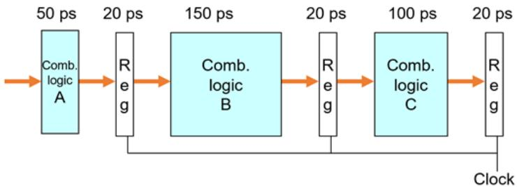
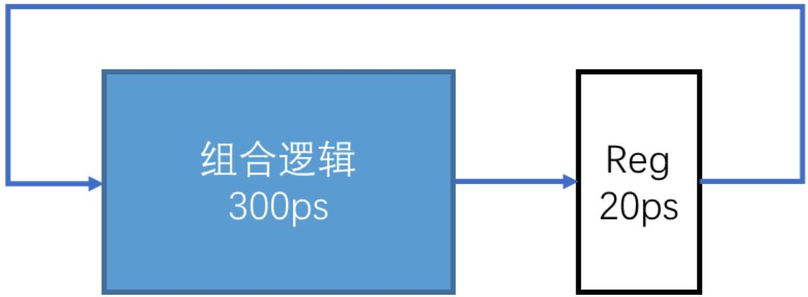
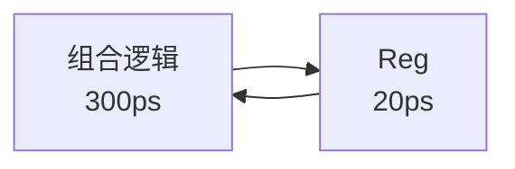
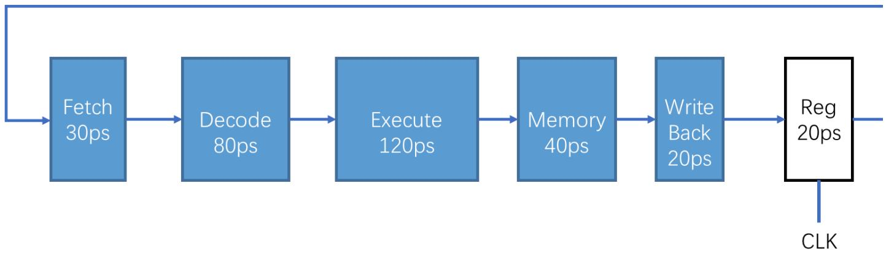
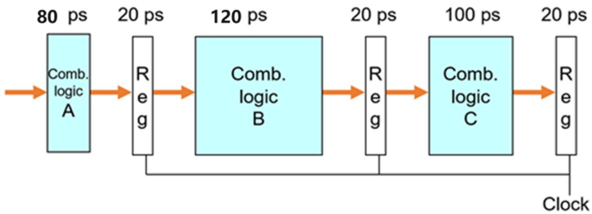
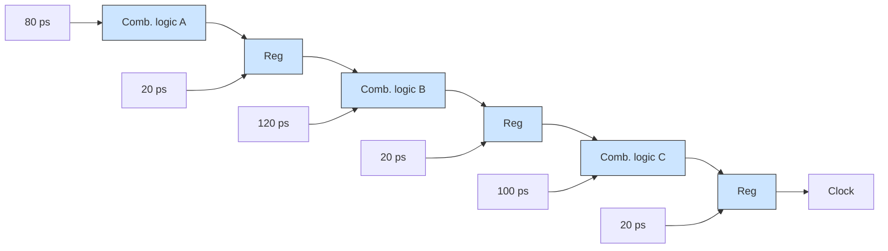

处理器体系结构章节测验

考试时间：2025.05.09 13:45 至 2025.05.18 23:59
总分：100 时长：120分钟

批阅进度 成绩已发布，分数100 分
老师评语 试卷已批阅，继续努力

我的试卷

一、单选题（100分）

<!-- QUESTION: qtype=single_choice tags=处理器体系结构,五级流水线 difficulty=2 chapter=处理器体系结构 -->
下面哪一个阶段不存在于典型的五级流水线处理器中（）

A. 取指  
B. 访存  
C. 译码  
D. 刷新

<!-- ANSWER -->
D
<!-- EXPLANATION -->
典型的五级流水线包含取指（Fetch）、译码（Decode）、执行（Execute）、访存（Memory）、写回（Write Back）五个阶段，刷新（Refresh）不属于其中。
<!-- QUESTION END -->

<!-- QUESTION: qtype=single_choice tags=处理器体系结构,CISC,RISC difficulty=2 chapter=处理器体系结构 -->
关于CISC和RISC，下列说法错误的是（）

A. 在RISC指令集处理器中，通用寄存器数量通常比CISC处理器更多  
B. RISC指令集处理器支持的指令较少，因此有一些功能在RISC指令集处理器上无法实现  
C. CISC指令集的设计思想是，使用一些专用指令对常见操作进行加速  
D. x86-32属于CISC指令集

<!-- ANSWER -->
B
<!-- EXPLANATION -->
RISC指令集虽然指令数量较少，但可以通过组合简单指令实现复杂功能，并非某些功能无法实现。
<!-- QUESTION END -->

<!-- QUESTION: qtype=single_choice tags=处理器体系结构,流水线,时钟周期 difficulty=3 chapter=处理器体系结构 -->
下面的三阶段流水线处理器中，处理器的最小时钟周期是多少（）

flowchart

A. 150ps  
B. 70ps  
C. 120ps  
D. 170ps

<!-- ANSWER -->
D
<!-- EXPLANATION -->
流水线处理器的最小时钟周期由最慢的阶段加上流水线寄存器延迟决定，此处最慢阶段延迟为150ps，加上寄存器20ps后为170ps。
<!-- QUESTION END -->

<!-- QUESTION: qtype=single_choice tags=处理器体系结构,高性能处理器 difficulty=2 chapter=处理器体系结构 -->
下面哪一个技术不属于现代高性能处理器新特性（）

A. 分支预测  
B. 超标量  
C. 指令顺序执行  
D. 乱序执行

<!-- ANSWER -->
C
<!-- EXPLANATION -->
指令顺序执行是早期处理器的特性，现代高性能处理器采用乱序执行、分支预测、超标量等技术来提高性能。
<!-- QUESTION END -->

<!-- QUESTION: qtype=single_choice tags=处理器体系结构,流水线,吞吐量 difficulty=4 chapter=处理器体系结构 -->
假设下图中的组合逻辑部分可以被平均划分为k个阶段，k可以为任意取值。划分后每个阶段的延迟为300ps/k。流水线寄存器为20ps。在此种情况下，k阶段流水线处理器的吞吐量上限是（）

flowchart

A. 3.333×k GIPS  
B. 3.333×k GIPS  
C. 0  
D. +∞

<!-- ANSWER -->
A
<!-- EXPLANATION -->
吞吐量 = 1 / (300/k + 20) × 10^3 GIPS = 1000/(300/k + 20) = 1000k/(300+20k) ≈ 3.333k GIPS（当k较大时）。
<!-- QUESTION END -->

<!-- QUESTION: qtype=single_choice tags=处理器体系结构,流水线,寄存器 difficulty=4 chapter=处理器体系结构 -->
假设一个处理器的组合逻辑部分可以被划分为5个工作阶段，每个阶段的延迟和流水线寄存器的延迟如下图所示。我们需要将这个处理器使用流水线技术进行优化，可以在各阶段之间插入流水线寄存器Reg，各阶段内部不可再分。如果只能插入两个流水线寄存器，应该在何处设置保证该流水线处理器有最大的吞吐量？（）

flowchart

A. Fetch与Decode之间；Execute与Memory之间  
B. Fetch与Decode之间；Decode与Execute之间  
C. Decode与Execute之间；Memory与Write Back之间  
D. Decode与Execute之间；Execute与Memory之间

<!-- ANSWER -->
D
<!-- EXPLANATION -->
应使最长的两个阶段（Execute 120ps和Decode 80ps）被分开，以降低最大阶段延迟。在Decode与Execute之间以及Execute与Memory之间插入寄存器，可使最长阶段为120ps，最小化时钟周期。
<!-- QUESTION END -->

<!-- QUESTION: qtype=single_choice tags=处理器体系结构,流水线 difficulty=2 chapter=处理器体系结构 -->
关于流水线处理器，下面说法正确的是（）

A. 从某种程度上说，指令的流水线执行也是一种指令并行技术  
B. 使用不同的周期的时钟分别控制各个流水线寄存器，可以使流水线具有更好的性能  
C. 在顺序执行的CPU中可以正确运行的程序，需要经过针对性的修改才能在流水线处理器中正确运行  
D. 流水线会增加单条指令的执行时间，因此无法提升处理器性能
<!-- ANSWER -->
A
<!-- EXPLANATION -->
流水线执行通过重叠多条指令的不同阶段来实现指令级并行，因此也是一种指令并行技术。流水线并不会改变单条指令的执行时间（通常相同），但通过并行提高了吞吐量。
<!-- QUESTION END -->

<!-- QUESTION: qtype=single_choice tags=处理器体系结构,x86-64,CISC,RISC difficulty=2 chapter=处理器体系结构 -->
关于x86-64指令集，下面说法错误的是（）

A. x86-64是典型的RISC指令集处理器  
B. 支持了更多的通用寄存器  
C. 既具有CISC指令集的特征，也具有一部分RISC指令集的特征  
D. 函数的参数优先通过寄存器传输

<!-- ANSWER -->
A
<!-- EXPLANATION -->
x86-64属于CISC指令集，不是RISC。它虽然吸收了一些RISC的特点（如更多通用寄存器、参数优先使用寄存器传递），但本质上仍是CISC架构。
<!-- QUESTION END -->

<!-- QUESTION: qtype=single_choice tags=处理器体系结构,CPU,指令阶段 difficulty=2 chapter=处理器体系结构 -->
在顺序执行的CPU指令阶段中，可能访问内存的指令阶段是（）

A. 取指令和访存  
B. 取指令和更新PC  
C. 访存和写回  
D. 译码和执行

<!-- ANSWER -->
A
<!-- EXPLANATION -->
取指令阶段需要从内存中读取指令，访存阶段需要从内存中读取或写入数据，这两个阶段会访问内存。更新PC、译码、执行、写回阶段一般不直接访问内存。
<!-- QUESTION END -->

<!-- QUESTION: qtype=single_choice tags=处理器体系结构,流水线,吞吐量 difficulty=3 chapter=处理器体系结构 -->
假设一个处理器的组合逻辑可以被划分为3个工作阶段，每个阶段的延迟为80ps, 120ps, 100ps，如图所示。各阶段内部不可再分，每个流水线寄存器的延迟为20ps。单条指令执行时间和吞吐量分别是（）

flowchart

A. 300ps；8.33GIPS  
B. 360ps；8.33GIPS  
C. 360ps；7.14GIPS  
D. 420ps；7.14GIPS

<!-- ANSWER -->
D
<!-- EXPLANATION -->
单条指令执行时间 = 80 + 120 + 100 + 3×20 = 420ps。吞吐量 = 1 / (max(80,120,100) + 20) = 1/140 ≈ 7.14 GIPS。
<!-- QUESTION END -->

©2003-现在 Zhihuishu. 沪ICP备10007183号-5