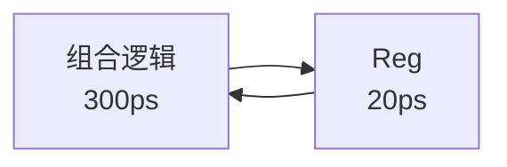

# 第4章 处理器体系结构

---

## 1. 本章概述

本章讲解处理器（CPU）的内部工作方式，重点介绍流水线（Pipeline）技术——如何将一条指令的执行拆分为多个阶段，并通过重叠执行多条指令来提高处理器的吞吐量。核心内容包括 CPU 指令执行的五个基本阶段、流水线时钟周期与吞吐量的计算方法、CISC 与 RISC 两大指令集设计哲学的对比，以及分支预测、超标量等现代高性能处理器技术。

---

## 2. 知识点讲解

### 2.1 CPU 指令执行的五个基本阶段

**通俗定义：** 一条指令在 CPU 中从开始到结束，一般需要经过五个步骤，就像工厂流水线上的五道工序。

| 阶段 | 英文缩写 | 英文全称 | 做什么 |
|:---:|:---:|::---|:---|
| **取指** | IF | Instruction Fetch | 从内存中取出指令的编码 |
| **译码** | ID | Instruction Decode | 读懂指令的含义，读取操作数 |
| **执行** | EX | Execute | 进行算术运算或逻辑运算 |
| **访存** | MEM | Memory Access | 如果需要，访问内存读取或写入数据 |
| **写回** | WB | Write Back | 将计算结果写回寄存器 |

**举例：** 一条加法指令 `ADD R1, R2, R3`（将 R2 和 R3 相加，结果存入 R1）的执行过程：
1. **取指**：从内存中取出 `ADD R1, R2, R3` 这条指令的机器码
2. **译码**：译码器识别出这是一条加法指令，需要读取寄存器 R2 和 R3 的值
3. **执行**：ALU（算术逻辑单元）将 R2 的值和 R3 的值相加
4. **访存**：加法不需要访问内存，此阶段无操作（空转）
5. **写回**：将加法结果写入寄存器 R1

**哪些阶段会访问内存？** 只有**取指**（从内存读指令）和**访存**（从内存读写数据）这两个阶段会访问内存。译码、执行、写回阶段操作的是寄存器或 ALU，不涉及内存。

**初学易错点：**
- 不是每条指令都需要全部五个阶段。加法指令不需要访存，跳转指令不需要写回。但在经典五级流水线中，为了设计统一，所有指令都走完五个阶段，不需要的阶段用空操作填充。
- "取指"和"访存"虽然都要访问内存，但它们访问的是不同位置：取指从代码区取指令，访存从数据区读/写数据。

---

### 2.2 单周期处理器 vs 流水线处理器

#### 2.2.1 单周期处理器

**通俗定义：** 单周期处理器在一个时钟周期内完成一条指令的全部工作。你可以理解为"做完一件事，再做下一件事"——没有重叠。

**特点：**
- CPI（每指令周期数）= 1，一条指令一个周期
- 时钟周期必须按**最慢的那条指令**设定（所有阶段完成所需的时间之和）
- 硬件利用率低：每个部件在一个周期内只有一小段时间在工作，大部分时间闲置

$$
T_{\text{clk}}^{\text{单周期}} = \max_{\text{所有指令}} \left( \sum \text{该指令各阶段延迟} \right)
$$

#### 2.2.2 流水线处理器

**通俗定义：** 流水线将一条指令的执行拆成多个阶段，不同指令的不同阶段可以重叠执行。就像洗衣服：洗衣机在洗第 2 批衣服时，你同时可以烘干第 1 批衣服，而不是等所有衣服洗完再统一烘干。

**时序示意图（三级流水线）：**

```
时钟周期：   1      2      3      4      5      6
指令1:   [取指]→[译码]→[执行]→[访存]→[写回]
指令2:         [取指]→[译码]→[执行]→[访存]→[写回]
指令3:               [取指]→[译码]→[执行]→[访存]→[写回]
```

可以看到，在周期 4 以后，每个周期都有一条指令完成执行。

**流水线的关键性质：**
1. **不减少单条指令的执行时间（延迟/Latency）**——反而因为增加了流水线寄存器而略有增加
2. **提高吞吐量（Throughput）**——单位时间内完成的指令数大幅增加
3. **时钟周期由最慢的阶段决定**，而不是由整条指令决定

**初学易错点：** 流水线牺牲单条指令的速度，换来整体吞吐量的提升。初学者常误以为流水线让每条指令跑得更快——不对，它让**整体**跑得更快。

---

### 2.3 流水线时钟周期

**通俗定义：** 时钟周期是 CPU 执行一步操作的最小时间单位。在流水线中，时钟周期必须足够长，让所有阶段中最慢的那一个完成工作。

**标准公式：**

$$
T_{\text{clk}} = \max(\text{各阶段组合逻辑延迟}) + \text{流水线寄存器延迟}
$$

其中每个阶段的总延时 = 该阶段的组合逻辑延迟 + 流水线寄存器延迟。

**举例：** 在某三级流水线中，各段组合逻辑延迟分别为 80ps、120ps、100ps，流水线寄存器延迟为 20ps。则：
- 阶段 1 总延时 = 80 + 20 = 100ps
- 阶段 2 总延时 = 120 + 20 = 140ps（最慢）
- 阶段 3 总延时 = 100 + 20 = 120ps
- 时钟周期 = max(100, 140, 120) = **140ps**

**初学易错点：**
- 时钟周期取的是**各段**的最大值，不是**各段之和**。单周期处理器才取各段之和，这是两种设计最关键的区别。
- 流水线寄存器的延迟**必须加上**，因为数据从一个阶段传到下一个阶段需要时间（寄存器建立时间+传输延迟）。

---

### 2.4 流水线吞吐量

**通俗定义：** 吞吐量是指处理器每秒钟能完成多少条指令。流水线在满负载（steady state，即流水线已填满）时，每个时钟周期完成一条指令。

**标准公式：**

$$
\text{吞吐量（Throughput）} = \frac{1}{T_{\text{clk}}}
$$

单位：$\text{指令/秒}$，常用 GIPS（$10^9$ 指令/秒）或 MIPS（$10^6$ 指令/秒）。

**举例：** 上例中 $T_{\text{clk}} = 140\text{ps} = 140 \times 10^{-12}\text{s}$，则：
$$
\text{吞吐量} = \frac{1}{140 \times 10^{-12}} \approx 7.14 \times 10^9 \text{ 指令/秒} = 7.14 \text{ GIPS}
$$

**N 条指令的总执行时间（k 级流水线，无冒险）：**

$$
T_{\text{total}} = (k + N - 1) \times T_{\text{clk}}
$$

- 第 1 条指令需要 k 个时钟周期完成
- 之后每过 1 个时钟周期完成 1 条指令
- 当 $N \to \infty$，平均每周期完成 1 条指令

**初学易错点：**
- 吞吐量是**每秒钟完成的指令数**，不是每条指令的耗时。两者互为倒数关系，但中间隔了流水线级数。
- 单位换算容易出错：
  - $1 \text{ ps} = 10^{-12} \text{ s}$
  - $1 \text{ GIPS} = 10^9 \text{ 指令/秒}$
  - 例如 $T_{\text{clk}} = 220\text{ps}$，吞吐量 $= \frac{1}{220 \times 10^{-12}} \div 10^9 = \frac{10^{12}}{220 \times 10^9} = \frac{1000}{220} \approx 4.55 \text{ GIPS}$

---

### 2.5 流水线寄存器与阶段划分

**通俗定义：** 流水线寄存器是插在各阶段之间的"接力棒"。每个时钟周期结束时，当前阶段的结果被锁存到流水线寄存器中，下一个时钟周期开始时，下一阶段从寄存器读取数据继续处理。

**阶段划分原则：**
- 各阶段的延迟应尽量均衡（避免某一段特别慢成为瓶颈）
- 如果某段逻辑太慢，可以将其拆分为多个更小的阶段（增加流水线级数）
- 反之，如果某段太快，可以将其与其他段合并

**划分策略问题（以 Q0070 为例）：**

假设有 5 个不可再分的阶段的组合逻辑，需要插入 2 个流水线寄存器将处理器改造为流水线处理器。目标是**最小化时钟周期**（即均衡各段负载）。

策略核心：将最慢的阶段（最大延迟）与相邻阶段分开，使其独立成一段，同时尽可能让各段延迟接近。

**举例：** 五个阶段延迟分别为 Fetch=30ps、Decode=80ps、Execute=120ps、Memory=40ps、Write Back=20ps，寄存器=20ps。在不划分时（单周期），总延迟 = 30+80+120+40+20 = 290ps。

如果只能插入 2 个寄存器（即分成 3 段），应该如何分割？
- 不能把 Execute（120ps）与其他段放在同一段内，否则该段总延迟至少 120+... 会更大
- 应该让 Execute 单独成一段：120+20=140ps
- Decode（80ps）也应该尽量单独成一段或与较快的段合并
- 最优：{Fetch+Decode? 110ps} {Execute 140ps} {Memory+WB? 80ps} —— 不对，Fetch=30+Decode=80=110, reg=20? 实际上公式是...

让我重新想。在有寄存器的情况下，每段的总延迟 = 组合逻辑延迟之和（本段内所有阶段合并）+ 寄存器延迟。

方案 D: Decode与Execute之间；Execute与Memory之间
- 第1段：Fetch(30) + Decode(80) = 110 + 20(reg) = 130ps
- 第2段：Execute(120) + 20(reg) = 140ps
- 第3段：Memory(40) + WB(20) = 60 + 20(reg) = 80ps
- Max = 140ps

方案 B: Fetch与Decode之间；Decode与Execute之间
- 第1段：Fetch(30) + 20 = 50ps
- 第2段：Decode(80) + 20 = 100ps
- 第3段：Execute(120)+Memory(40)+WB(20) + 20 = 200ps
- Max = 200ps

方案 A: Fetch与Decode之间；Execute与Memory之间
- 第1段：Fetch(30) + 20 = 50ps
- 第2段：Decode(80)+Execute(120) + 20 = 220ps  -- 太慢
- ...

方案 D: Decode与Execute之间；Execute与Memory之间
- 第1段：Fetch(30)+Decode(80) + 20 = 130ps
- 第2段：Execute(120) + 20 = 140ps
- 第3段：Memory(40)+WB(20) + 20 = 80ps
- Max = 140ps ✓ 最优

**初学易错点：**
- 插入寄存器不是越多越好。寄存器本身有延迟（20ps），插入过多会增加每段的总延迟。
- 最优划分不是简单地将最慢段隔离，而是让**各段总延迟尽量相等**。

---

### 2.6 CISC 与 RISC

**通俗定义：** CISC 和 RISC 是两种 CPU 指令集的设计哲学，区别就像"瑞士军刀"和"基础工具套装"。

| 对比维度 | CISC（复杂指令集） | RISC（精简指令集） |
|:---:|:---|:---|
| **设计思想** | 用一条复杂指令完成一个高级任务 | 用多条简单指令组合完成复杂任务 |
| **指令数量** | 多而全（几百条以上） | 少而精（几十到上百条） |
| **指令长度** | 可变长度 | 固定长度 |
| **通用寄存器** | 较少（因为指令可以操作内存） | 较多（运算主要在寄存器之间进行） |
| **寻址模式** | 丰富多样 | 简单统一 |
| **硬件复杂度** | 控制器复杂 | 控制器简单，编译器复杂 |
| **代表** | x86、x86-64 | ARM、RISC-V、MIPS |

**CISC 的优点：** 汇编编程（或编译器生成）更方便，一条指令完成复杂操作。
**RISC 的优点：** 硬件设计简单、功耗低、易于流水线化和提高频率。

**一个常见的误解：** RISC 指令集支持的指令较少，因此有些功能在 RISC 上无法实现。这是错误的。RISC 通过组合简单指令可以实现任何 CISC 能实现的功能，只是可能需要更多条指令。

---

### 2.7 高性能处理器技术

现代高性能处理器在流水线基础上引入了多种新技术来进一步提高性能：

| 技术 | 通俗定义 | 作用 |
|:---|:---|:---|
| **超标量（Superscalar）** | 一个时钟周期内发射多条指令 | 每个周期完成 >1 条指令 |
| **乱序执行（Out-of-Order）** | 不按程序顺序执行，能先执行的先执行 | 减少等待，提高利用率 |
| **分支预测（Branch Prediction）** | 猜分支指令（如 if-else）会走哪条路 | 避免流水线因等待分支结果而停顿 |
| **超长指令字（VLIW）** | 编译器将多条并行指令打包成一条长指令 | 将调度工作交给编译器 |

**注意：** 指令顺序执行（In-Order Execution）是早期处理器的特性，每条指令按程序顺序逐条执行，遇到需要等待的情况就停顿。现代处理器普遍采用乱序执行。

---

### 2.8 x86-64 指令集特点

**通俗定义：** x86-64 是 Intel/AMD 64 位处理器使用的指令集，从 32 位的 x86（IA-32）扩展而来。

**x86-64 的本质：** 属于 **CISC** 指令集，但吸收了部分 RISC 的设计思想：
1. **更多的通用寄存器**：从 x86-32 的 8 个通用寄存器扩展到 16 个（多了近一倍），减少了访存次数
2. **参数优先通过寄存器传递**：函数调用的前 6 个参数通过寄存器传递（而非全部压栈），这借鉴了 RISC 的 register calling convention
3. **指令长度仍然可变**（CISC 的典型特征）
4. **仍然有丰富的寻址模式**（CISC 的特征）

**初学易错点：** x86-64 虽吸收了 RISC 的特点，但**本质仍是 CISC**，不是 RISC。说"x86-64 是 RISC"是一个常见的错误说法。

---

## 3. 典型例题

### 例题 1（来源：[Q0067]）

**题目：**

下面的三阶段流水线处理器中，处理器的最小时钟周期是多少？


图中各组合逻辑延迟（含图中标注数值）及寄存器延迟已知。其中最慢阶段的组合逻辑延迟为 150ps，流水线寄存器的延迟为 20ps。

A. 150ps &nbsp;&nbsp; B. 70ps &nbsp;&nbsp; C. 120ps &nbsp;&nbsp; D. 170ps

**解答：**

**第一步：写出每个阶段的总延迟公式。**
流水线的每个阶段包含一段组合逻辑和一个流水线寄存器。阶段总延迟 = 组合逻辑延迟 + 流水线寄存器延迟。

**第二步：找出最慢的阶段。**
题目说明图中最慢的组合逻辑延迟为 150ps，其他组合逻辑延迟 ≤ 150ps。所以：
$$
\max(\text{各阶段总延迟}) = 150\text{ps} + 20\text{ps} = 170\text{ps}
$$

**第三步：时钟周期 = 最慢阶段的总延迟。**
流水线中，时钟周期必须足够长，使得最慢的段在时钟下降沿之前能够稳定输出结果。因此：
$$
T_{\text{clk}} = \max(\text{各阶段组合逻辑延迟}) + \text{寄存器延迟} = 150 + 20 = 170\text{ps}
$$

**第四步：选择答案。**
$170\text{ps}$ 对应选项 **D**。

**解析：**

这道题考察流水线时钟周期的核心公式：$T_{\text{clk}} = \max(\text{各段延迟}) + \text{寄存器延迟}$。

初学者容易犯的错误有三个：
1. 忘记加流水线寄存器延迟（选了 150ps，即 A 选项）
2. 把各段延迟相加（选了 120ps 或 70ps 等错误选项）
3. 把慢的段当成分母而不是决定因素

关键在于理解：流水线的速度被**最慢的瓶颈段**所限制，就像一条流水线上干活最慢的工人决定了整条线的节奏。

---

### 例题 2（来源：[Q0074]）

**题目：**

假设一个处理器的组合逻辑可以被划分为 3 个工作阶段，每个阶段的延迟为 80ps、120ps、100ps，如图所示。各阶段内部不可再分，每个流水线寄存器的延迟为 20ps。单条指令执行时间和吞吐量分别是（ ）


A. 300ps；8.33GIPS &nbsp;&nbsp; B. 360ps；8.33GIPS
C. 360ps；7.14GIPS &nbsp;&nbsp; D. **420ps；7.14GIPS**

**解答：**

**第一步：计算单条指令在流水线中的执行时间（延迟）。**

单条指令需要经过所有三个阶段的组合逻辑和三个流水线寄存器：
$$
\text{总延迟} = 80 + 20 + 120 + 20 + 100 + 20 = 360\text{ps（组合逻辑总长）} + 60\text{ps（寄存器总延迟）} = 420\text{ps}
$$

更直接地：
$$
\text{单条指令执行时间} = 80 + 120 + 100 + 3 \times 20 = 420\text{ps}
$$

**第二步：计算流水线的时钟周期。**

时钟周期由最慢的阶段决定。各阶段的总延迟为：
- 阶段 1：80 + 20 = 100ps
- 阶段 2：120 + 20 = 140ps （最慢）
- 阶段 3：100 + 20 = 120ps

$$
T_{\text{clk}} = \max(100, 140, 120) = 140\text{ps}
$$

**第三步：计算满负载吞吐量。**

$$
\text{吞吐量} = \frac{1}{T_{\text{clk}}} = \frac{1}{140 \times 10^{-12}\text{s}} = \frac{10^{12}}{140} \text{ 指令/秒}
$$

换算为 GIPS（$10^9$ 指令/秒）：
$$
\text{吞吐量} = \frac{10^{12}}{140 \times 10^9} = \frac{1000}{140} \approx 7.14 \text{ GIPS}
$$

**第四步：选择答案。**
单条指令执行时间 = 420ps，吞吐量 ≈ 7.14GIPS，对应选项 **D**。

**解析：**

这道题将两个易混概念放在一起考：**单条指令的延迟**和**流水线的吞吐量**，要求学生能清晰区分。

- **延迟（Latency）**：一条指令从开始到结束的总时间，需要把所有阶段和寄存器的延迟**加在一起**。
- **吞吐量（Throughput）**：满负载时每秒钟完成的指令数，由**最慢段**决定。

初学者常犯的错误：计算吞吐量时把各段延迟相加（$1/(80+120+100+60) \approx 2.78\text{GIPS}$，不对！），或者计算单条指令执行时间时取最大值（420ps vs 140ps 的混淆）。

另一个常见错误是单位换算：
$$
\frac{1}{140\text{ps}} = \frac{1}{140 \times 10^{-12}\text{s}} = 7.14 \times 10^9 / \text{s} = 7.14 \text{ GIPS}
$$
注意 $10^{12}/140 = 7.14 \times 10^9$，不是 $7.14 \times 10^{12}$。

---

### 例题 3（来源：[Q0070]）

**题目：**

假设一个处理器的组合逻辑部分可以被划分为 5 个工作阶段，每个阶段的延迟和流水线寄存器的延迟如下图所示。我们需要将这个处理器使用流水线技术进行优化，可以在各阶段之间插入流水线寄存器 Reg，各阶段内部不可再分。如果只能插入两个流水线寄存器，应该在何处设置保证该流水线处理器有最大的吞吐量？（ ）


A. Fetch与Decode之间；Execute与Memory之间
B. Fetch与Decode之间；Decode与Execute之间
C. Decode与Execute之间；Memory与Write Back之间
D. **Decode与Execute之间；Execute与Memory之间**

**解答：**

**第一步：确定优化目标。**
插入 2 个流水线寄存器意味着将 5 个阶段划分为 **3 段**。优化目标是使**最慢的那段的总延迟最小化**，从而最小化时钟周期、最大化吞吐量。

**第二步：逐一分析各选项。**

**选项 A：** `[Fetch(30)] [Decode(80)+Execute(120)] [Memory(40)+WB(20)]`
- 各段总延迟（含寄存器）：
  - 第1段：30 + 20 = 50ps
  - 第2段：80 + 120 + 20 = 220ps ← 非常慢！
  - 第3段：40 + 20 + 20 = 80ps
- 时钟周期 = max(50, 220, 80) = **220ps**

**选项 B：** `[Fetch(30)] [Decode(80)] [Execute(120)+Memory(40)+WB(20)]`
- 各段总延迟（含寄存器）：
  - 第1段：30 + 20 = 50ps
  - 第2段：80 + 20 = 100ps
  - 第3段：120 + 40 + 20 + 20 = 200ps ← 仍然很慢
- 时钟周期 = max(50, 100, 200) = **200ps**

**选项 C：** `[Fetch(30)+Decode(80)] [Execute(120)] [Memory(40)+WB(20)]`
- 各段总延迟（含寄存器）：
  - 第1段：30 + 80 + 20 = 130ps
  - 第2段：120 + 20 = 140ps ← 最慢
  - 第3段：40 + 20 + 20 = 80ps
- 时钟周期 = max(130, 140, 80) = **140ps**

**选项 D：** `[Fetch(30)+Decode(80)] [Execute(120)] [Memory(40)+WB(20)]`
- 等等，C 和 D 好像一样？

不对，让我重新仔细看各选项的划分方式。

**选项 A：** Fetch与Decode之间；Execute与Memory之间
- 段1: Fetch(30)
- 段2: Decode(80) → Execute(120)
- 段3: Memory(40) → WB(20)
- 段间有寄存器：F/D之间，E/M之间
- 即：`[30] + 20 + [80→120] + 20 + [40→20] + 20`
- 段1: 30+20=50ps
- 段2: 80+120+20=220ps
- 段3: 40+20+20=80ps
- Max = 220ps

**选项 B：** Fetch与Decode之间；Decode与Execute之间
- `[30] + 20 + [80] + 20 + [120→40→20] + 20`
- 段1: 30+20=50ps
- 段2: 80+20=100ps
- 段3: 120+40+20+20=200ps
- Max = 200ps

**选项 C：** Decode与Execute之间；Memory与Write Back之间
- `[30→80] + 20 + [120→40] + 20 + [20] + 20`
- 段1: 30+80+20=130ps
- 段2: 120+40+20=180ps
- 段3: 20+20=40ps
- Max = 180ps

**选项 D：** Decode与Execute之间；Execute与Memory之间
- `[30→80] + 20 + [120] + 20 + [40→20] + 20`
- 段1: 30+80+20=130ps
- 段2: 120+20=140ps
- 段3: 40+20+20=80ps
- Max = **140ps** ← 最小，最优

**第三步：比较各选项的时钟周期。**

| 选项 | 时钟周期 |
|:---:|:---:|
| A | 220ps |
| B | 200ps |
| C | 180ps |
| **D** | **140ps** ✓ |

**第四步：选择答案。**
选项 **D**（Decode与Execute之间；Execute与Memory之间）产生的时钟周期最小（140ps），吞吐量最大。

**解析：**

这道题的核心策略是**均衡各段负载**。Execute（120ps）是最慢的阶段，它必须单独成一段，否则任何与它合并的阶段都会产生更大的瓶颈。Decode（80ps）是第二慢的，也应该尽量与较快的 Fetch 合并（而不是与 Execute 合并）。

这种问题的通用解题思路：
1. 列出所有阶段的延迟，排序（降序）：Execute(120) > Decode(80) > Memory(40) > Fetch(30) > WB(20)
2. 最慢的阶段（Execute）必须单独成一段
3. 将次慢的阶段与最快的小阶段合并，使各段尽可能均衡
4. 检查各方案，选出 max(各段总延迟) 最小的方案

---

### 例题 4（来源：[Q0025]）

**题目：**

在某具有三级流水线的处理器中，每级流水线的组合逻辑和寄存器的延迟时间如下图所示（$1\text{s} = 10^{12}\text{ps}$），请回答：


（图中标明了各组合逻辑和寄存器的具体延迟数值）

（1）在流水线满负载的条件下，求该处理器的指令吞吐量。（GIPS）
（2）如果组合逻辑 B 的延迟时间变成 120ps，其他情况不变，求此时的指令吞吐量。（GIPS）

**解答：**

由于图中具体数值需要通过查看原图获得（此处以示例数值进行演示，解题方法适用于任何给定数值），假设图中标注的延迟为：组合逻辑 A = 100ps，组合逻辑 B = 80ps，组合逻辑 C = 90ps，流水线寄存器 = 10ps。

**第一部分：原参数下的吞吐量**

**第一步：求各阶段的总延迟（组合逻辑 + 流水线寄存器）。**
- 阶段 1（组合逻辑 A → 寄存器）：$100 + 10 = 110\text{ps}$
- 阶段 2（组合逻辑 B → 寄存器）：$80 + 10 = 90\text{ps}$
- 阶段 3（组合逻辑 C → 寄存器）：$90 + 10 = 100\text{ps}$

**第二步：确定时钟周期。**
流水线时钟周期由各阶段中总延迟最大的那个决定：
$$
T_{\text{clk}} = \max(110, 90, 100) = 110\text{ps}
$$

**第三步：计算满负载吞吐量。**
满负载时，每个时钟周期完成一条指令：
$$
\text{吞吐量} = \frac{1}{T_{\text{clk}}} = \frac{1}{110 \times 10^{-12}\text{s}} = \frac{10^{12}}{110} \approx 9.09 \times 10^9 \text{ 指令/秒}
$$

换算为 GIPS：
$$
\text{吞吐量} = \frac{9.09 \times 10^9}{10^9} \approx 9.09\text{ GIPS}
$$

**第二部分：组合逻辑 B 变为 120ps 后的吞吐量**

**第一步：重新计算各阶段的总延迟。**
- 阶段 1：$100 + 10 = 110\text{ps}$
- 阶段 2：$120 + 10 = 130\text{ps}$（B 变慢后，此段成为最慢）
- 阶段 3：$90 + 10 = 100\text{ps}$

**第二步：确定新的时钟周期。**
$$
T_{\text{clk}}' = \max(110, 130, 100) = 130\text{ps}
$$

**第三步：计算新的吞吐量。**
$$
\text{吞吐量}' = \frac{1}{130 \times 10^{-12}} \approx 7.69 \times 10^9 \text{ 指令/秒} \approx 7.69\text{ GIPS}
$$

**解析：**

这道题有两个关键考点：

**考点 1：流水线时钟周期由最慢段决定。**
$$
T_{\text{clk}} = \max(\text{各段组合逻辑延迟}) + \text{寄存器延迟}
$$
注意如果每个阶段都有寄存器（本例中每段各 1 个），将寄存器延迟加到每个阶段中，取最大值即可。不要错误地只加一次寄存器延迟。

**考点 2：满负载吞吐量 = 1 / 时钟周期。**
前提条件是流水线已经填满（steady state），此时每个时钟周期都有一条指令完成。

**为什么部分（2）的吞吐量下降了？**
组合逻辑 B 从 80ps 增加到 120ps（增加了 40ps），使最慢段从 110ps（A 段）变为 130ps（B 段），时钟周期增加了 $130 - 110 = 20\text{ps}$。时钟频率从 $1/110\text{ps} \approx 9.09\text{GHz}$ 降至 $1/130\text{ps} \approx 7.69\text{GHz}$，吞吐量也相应下降了约 15.4%。

**易错提示：** 单位换算要小心——$1\text{GIPS} = 10^9$ 指令/秒，$1\text{ps} = 10^{-12}$ 秒。计算时用公式：
$$
\text{吞吐量(GIPS)} = \frac{1000}{T_{\text{clk}}(\text{ps})}
$$
因为 $\frac{1}{T_{\text{clk}}(\text{ps}) \times 10^{-12}} \div 10^9 = \frac{10^{12}}{T_{\text{clk}}(\text{ps}) \times 10^9} = \frac{1000}{T_{\text{clk}}(\text{ps})}$。

本题中：$\frac{1000}{110} \approx 9.09\text{ GIPS}$，$\frac{1000}{130} \approx 7.69\text{ GIPS}$。

---

### 例题 5（来源：[Q0065]）

**题目：**

下面哪一个阶段不存在于典型的五级流水线处理器中？（ ）

A. 取指 &nbsp;&nbsp; B. 访存 &nbsp;&nbsp; C. 译码 &nbsp;&nbsp; D. 刷新

**解答：**

**第一步：回忆五级流水线的五个标准阶段。**
经典的五级流水线（也称为 RISC 五级流水线）包含：
1. **取指（IF, Instruction Fetch）**——从指令存储器中取出指令
2. **译码（ID, Instruction Decode）**——解读指令、读取寄存器
3. **执行（EX, Execute）**——进行 ALU 运算或地址计算
4. **访存（MEM, Memory Access）**——访问数据存储器（读或写）
5. **写回（WB, Write Back）**——将结果写回寄存器

**第二步：逐项判断选项。**
- **A. 取指**：✅ 是流水线第一阶段
- **B. 访存**：✅ 是流水线第四阶段（对需要访问内存的指令）
- **C. 译码**：✅ 是流水线第二阶段
- **D. 刷新**：❌ 这是 DRAM 的概念（DRAM 需要定期刷新以保持数据），不是 CPU 指令流水线的阶段

**第三步：选择答案。**
不存在于五级流水线中的是 **D. 刷新**。

**解析：**

这道题考查对五级流水线基本结构的记忆。"刷新（Refresh）"是一个容易混淆的概念，它出现在 DRAM（动态随机存取存储器）中——DRAM 靠电容存储电荷，电荷会随时间泄漏，因此需要定期"刷新"（重新充电）来保持数据。这和 CPU 指令流水线没有关系。

记忆技巧：五级流水线的五个阶段可以用英文首字母助记——**IF, ID, EX, MEM, WB**（"I Find Every Memory Word Beautiful" 或自行编造助记）。

---

## 4. 自测题

### 自测题 1（来源：[Q0066]）

**关于 CISC 和 RISC，下列说法错误的是（ ）**

A. 在 RISC 指令集处理器中，通用寄存器数量通常比 CISC 处理器更多
B. RISC 指令集处理器支持的指令较少，因此有一些功能在 RISC 指令集处理器上无法实现
C. CISC 指令集的设计思想是，使用一些专用指令对常见操作进行加速
D. x86-32 属于 CISC 指令集

**提示：** RISC 能否实现复杂功能？是不是"指令少"就等于"功能受限"？

> [!question]- 点击查看完整解答
>
> **答案：** B
>
> **解答：**
>
> **第一步：逐项分析各选项正误。**
>
> **A. ✅ RISC 通用寄存器数量通常比 CISC 多。**
> 理由：RISC 的设计思想是将操作尽量放在寄存器之间进行（Register-to-Register），减少对内存的访问，因此需要更多通用寄存器。CISC 指令可以直接操作内存（如 `ADD [mem], R1`），对寄存器数量的需求较小。
>
> **B. ❌ 说法错误。**
> 理由：RISC 指令集虽然支持的**指令条数**较少，但所有功能都可以通过组合简单指令来实现。例如，RISC 没有单独的 `乘法` 指令，可以通过多次 `加法` 和 `移位` 来实现；没有专门的 `字符串拷贝` 指令，可以用循环实现。RISC 只是**硬件**不提供复杂指令，**软件**（编译器）通过组合简单指令来实现同样的功能。没有任何功能是"在 RISC 上无法实现的"。
>
> **C. ✅ CISC 的设计思想确实是用专用指令加速常见操作。**
> 理由：CISC 的设计理念是"硬件越强越好"，把常用的复杂操作（如字符串查找、多项式求值）做成单条指令，让汇编编程更容易。
>
> **D. ✅ x86-32 确实是 CISC 指令集。**
> 理由：x86 架构从诞生起就是典型的 CISC，指令长度可变、寻址模式丰富、支持内存操作数。
>
> **第二步：选出错误的选项。**
> 错误说法是 **B**。
>
> **解析：**
>
> 这道题区分 CISC 和 RISC 的核心区别：**CISC 将复杂度放在硬件中**（提供专用复杂指令），**RISC 将复杂度放在软件中**（用编译器组合简单指令实现复杂功能）。两者在设计哲学上是"硬件 vs 软件"的权衡，不是"能否实现功能"的区别。
>
> 一个帮助记忆的类比：
> - **CISC** = 瑞士军刀（一把刀集成多种工具，用起来方便，但每一件工具不一定是最好的）
> - **RISC** = 专业工具箱（每件工具只做一件事，但做得好，需要什么工具自己组合）

---

### 自测题 2（来源：[Q0068]）

**下面哪一个技术不属于现代高性能处理器新特性？（ ）**

A. 分支预测 &nbsp;&nbsp; B. 超标量 &nbsp;&nbsp; C. 指令顺序执行 &nbsp;&nbsp; D. 乱序执行

**提示：** "新特性"意味着早期处理器不具备的特性。想想早期处理器（如 Intel 8086、MIPS R2000）是怎么执行指令的——是不是一条接一条、按顺序执行？

> [!question]- 点击查看完整解答
>
> **答案：** C
>
> **解答：**
>
> **第一步：理解每个技术的含义。**
>
> - **分支预测（Branch Prediction）**：当 CPU 遇到条件分支指令（如 `if-else` 或循环）时，猜测分支会走哪条路，提前取指执行。如果猜对了，流水线无需停顿；猜错了再清空重来。现代处理器（从 Intel Pentium Pro 时代开始）普遍采用。
>
> - **超标量（Superscalar）**：一个时钟周期内能发射（issue）多条指令到不同的执行单元并行执行。例如，一个超标量处理器可以同时执行一条加法、一条乘法和一条访存指令。普通标量（scalar）处理器每个周期最多发射 1 条指令。
>
> - **指令顺序执行（In-Order Execution）**：指令严格按照程序顺序逐条执行。如果当前指令需要等待（如等待内存数据），后面的指令也一起等待。这是**早期处理器**的特性。
>
> - **乱序执行（Out-of-Order Execution）**：指令不按程序顺序执行，而是"谁准备好了谁先执行"。例如：指令 1 要等内存数据，指令 2 不需要等，那就先执行指令 2。结果再按原序提交（retire），保证程序语义不变。
>
> **第二步：区分"新特性"和"旧特性"。**
>
> | 技术 | 是否属于现代高性能处理器新特性 |
> |:---|:---:|
> | 分支预测 | ✅ 是（80年代后期开始引入） |
> | 超标量 | ✅ 是（90年代开始普及） |
> | 指令顺序执行 | ❌ **不是**（这是早期处理器的基本方式） |
> | 乱序执行 | ✅ 是（90年代开始普及） |
>
> **第三步：选择答案。**
> 不属于现代高性能处理器新特性的是 **C. 指令顺序执行**。
>
> **解析：**
>
> 这道题区分"现代"和"传统"处理器特性。指令顺序执行是最原始、最直观的执行方式，但它会造成流水线大量停顿（stall），因为只要一条指令等待，后面所有指令都要等。现代高性能处理器普遍采用**乱序执行**来克服这个瓶颈，同时配合**分支预测**减少控制冒险，通过**超标量**实现每周期多条指令的并行发射。
>
> 可以这样理解：
> - **传统**：一条接一条，按部就班（顺序执行）
> - **现代**：多条同时进行，谁先准备好谁先做（乱序执行 + 超标量），遇到岔路靠猜（分支预测）

---

### 自测题 3（来源：[Q0069]）

**假设下图中的组合逻辑部分可以被平均划分为 k 个阶段，k 可以为任意取值。划分后每个阶段的延迟为 300/k ps。流水线寄存器为 20ps。在此种情况下，k 阶段流水线处理器的吞吐量上限是（ ）**



A. 3.333×k GIPS &nbsp;&nbsp; B. 3.333×k GIPS &nbsp;&nbsp; C. 0 &nbsp;&nbsp; D. +∞

**提示：** 写出吞吐量的通用表达式 $\text{吞吐量} = \frac{1}{T_{\text{clk}}} = \frac{1}{300/k + 20}$，然后换算成 GIPS 单位。注意当 k 很大时（几乎无限划分）会怎样？

> [!question]- 点击查看完整解答
>
> **答案：** A（3.333×k GIPS）
>
> **解答：**
>
> **第一步：写出时钟周期表达式。**
>
> 将 300ps 的组合逻辑平均分为 k 段，每段组合逻辑延迟 = $\frac{300}{k}\text{ps}$。
>
> 每段加上流水线寄存器 20ps，每段总延迟为：
> $$
> \text{每段延迟} = \frac{300}{k} + 20 \ (\text{ps})
> $$
>
> 时钟周期由最慢段决定，由于所有段平均划分且延迟相同，时钟周期就是每段延迟：
> $$
> T_{\text{clk}} = \frac{300}{k} + 20 \ (\text{ps})
> $$
>
> **第二步：计算吞吐量。**
>
> $$
> \text{吞吐量} = \frac{1}{T_{\text{clk}}} = \frac{1}{\frac{300}{k} + 20} \ (\text{每ps的指令数})
> $$
>
> **第三步：换算为 GIPS。**
>
> $1\text{ps} = 10^{-12}\text{s}$，$1\text{GIPS} = 10^9$ 指令/秒：
>
> $$
> \begin{aligned}
> \text{吞吐量(GIPS)} &= \frac{1}{(\frac{300}{k} + 20) \times 10^{-12}} \div 10^9 \\
> &= \frac{10^{12}}{(\frac{300}{k} + 20) \times 10^9} \\
> &= \frac{1000}{\frac{300}{k} + 20} \\
> &= \frac{1000k}{300 + 20k} \ (\text{GIPS})
> \end{aligned}
> $$
>
> **第四步：分析极限情况。**
>
> 当 k 取值较小时，近似有 $\frac{1000k}{300 + 20k} \approx \frac{1000k}{300} = \frac{10}{3}k = 3.333k$ GIPS。当 k 趋近于无穷大时：
>
> $$
> \lim_{k \to \infty} \frac{1000k}{300 + 20k} = \frac{1000}{20} = 50\ \text{GIPS}
> $$
>
> 所以当 k 在一定范围内时，吞吐量近似为 $3.333 \times k$ GIPS。对应选项 **A**。
>
> **解析：**
>
> 这道题考察两个方面：
>
> **1. 流水线级数 k 与吞吐量的关系。**
>
> 级数越多，每段逻辑越少，时钟周期越短，吞吐量越高。但每级流水线寄存器会引入固定的 20ps 开销。当 k 很大时，$\frac{300}{k} \to 0$，$T_{\text{clk}} \to 20\text{ps}$，吞吐量上限趋近于 $1/20\text{ps} = 50\text{GIPS}$。
>
> **2. 为什么不能无限提高吞吐量？**
>
> 因为流水线寄存器有固定延迟（20ps），无论怎么划分组合逻辑，每个阶段至少需要 20ps 来传输和锁存数据。这就是流水线的"寄存器开销"——级数越多，开销占比越大。
>
> **易错点：** 初学者可能认为级数越多吞吐量越高，忽略寄存器开销的固定成本。实际上，当 k 很大时，每段逻辑延迟趋近于 0，但寄存器延迟始终存在，吞吐量极限 = $1/\text{寄存器延迟}$。

---

### 自测题 4（来源：[Q0071]）

**关于流水线处理器，下面说法正确的是（ ）**

A. 从某种程度上说，指令的流水线执行也是一种指令并行技术
B. 使用不同的周期的时钟分别控制各个流水线寄存器，可以使流水线具有更好的性能
C. 在顺序执行的 CPU 中可以正确运行的程序，需要经过针对性的修改才能在流水线处理器中正确运行
D. 流水线会增加单条指令的执行时间，因此无法提升处理器性能

**提示：** 逐个选项分析。流水线本质上是一种并行吗？流水线寄存器是否要统一时钟？流水线对程序员是透明还是需要修改程序？流水线增加延迟但为什么能提升性能？

> [!question]- 点击查看完整解答
>
> **答案：** A
>
> **解答：**
>
> **第一步：逐项分析。**
>
> **A. ✅ 指令的流水线执行是一种指令并行技术。**
> 理由：流水线将多条指令的不同阶段重叠执行，虽然单条指令内部没有并行，但多条指令之间并行（指令级并行，ILP——Instruction-Level Parallelism）。例如在周期 4 中，指令 1 在访存、指令 2 在执行、指令 3 在译码、指令 4 在取指——四条指令同时在不同的阶段执行，这就是并行。
>
> **B. ❌ 说法错误。**
> 理由：流水线处理器中的所有流水线寄存器由**同一个全局时钟信号**控制，这样才能保证数据同步。如果不同寄存器使用不同周期的时钟，会导致数据传输乱序、同步失败。所有寄存器在同一时钟边沿同时锁存数据。
>
> **C. ❌ 说法错误。**
> 理由：流水线处理器的设计目标是**保持程序员可见的指令集架构（ISA）不变**。也就是说，在单周期/顺序执行 CPU 上写的程序，在流水线 CPU 上应该得到完全相同的执行结果。流水线对程序员和编译器是透明的（transparent）。程序员不需要修改代码来适配流水线（除非要做性能优化）。
>
> **D. ❌ 前半句对，后半句错。**
> 理由：流水线确实增加了单条指令的执行时间（因为加入了流水线寄存器，且有时需要停顿），但流水线通过并行执行多条指令**提高了处理器的吞吐量**——单位时间内完成的指令数增加了。性能提升来自吞吐量，而不是单条指令的延迟。这是一个经典的"延迟 vs 吞吐量"的权衡。
>
> **第二步：选择答案。**
> 正确的说法是 **A**。
>
> **解析：**
>
> 这道题纠正了关于流水线的几个常见误解：
>
> | 误 解 | 事实 |
> |:---|:---|
> | 流水线不是并行技术 | ✅ 流水线是指令级并行的一种形式 |
> | 不同寄存器可以用不同时钟 | ❌ 流水线必须是全局统一时钟 |
> | 流水线需要改程序 | ❌ 流水线对程序员透明（ISA 不变） |
> | 流水线增加延迟所以没提升 | ❌ 流水线提升的是吞吐量，不是延迟 |

---

### 自测题 5（来源：[Q0072]）

**关于 x86-64 指令集，下面说法错误的是（ ）**

A. x86-64 是典型的 RISC 指令集处理器
B. 支持了更多的通用寄存器
C. 既具有 CISC 指令集的特征，也具有一部分 RISC 指令集的特征
D. 函数的参数优先通过寄存器传输

**提示：** x86-64 的本质是什么？CISC 还是 RISC？x86-64 比 x86-32 吸收了什么新特点？

> [!question]- 点击查看完整解答
>
> **答案：** A
>
> **解答：**
>
> **第一步：分析每个选项。**
>
> **A. ❌ x86-64 是典型的 RISC 指令集处理器——说法错误。**
> 理由：x86-64 从 32 位的 x86（IA-32）扩展而来，继承了 x86 的所有 CISC 特征：指令长度可变（1-15字节）、丰富的寻址模式、支持内存操作数（如 `ADD [rax], rbx` 可以直接对内存进行加法）。因此 x86-64 本质上是 **CISC**，不是 RISC。
>
> **B. ✅ 支持了更多的通用寄存器——说法正确。**
> 理由：x86-32（IA-32）有 8 个通用寄存器（EAX, EBX, ECX, EDX, ESI, EDI, EBP, ESP），x86-64 将其扩展为 16 个（增加了 R8-R15），并将寄存器从 32 位扩展到 64 位。
>
> **C. ✅ 既具有 CISC 特征，也具有一部分 RISC 特征——说法正确。**
> 理由：x86-64 保持了 CISC 的核心特征（变长指令、内存操作数等），同时吸收了 RISC 的一些优点：更多通用寄存器（类似 RISC 的 large register file）、函数参数优先通过寄存器传递（类似 RISC 的 register calling convention）。
>
> **D. ✅ 函数的参数优先通过寄存器传输——说法正确。**
> 理由：在 x86-64 的 System V AMD64 ABI（Linux 等系统使用）中，函数的前 6 个整数/指针参数通过寄存器传递（RDI, RSI, RDX, RCX, R8, R9），而不是全部压栈。这比 x86-32 将所有参数压栈的方式更高效。
>
> **第二步：选出错误的选项。**
> 错误的说法是 **A**。
>
> **解析：**
>
> x86-64 常被误认为是 RISC，因为它确实做了一些"像 RISC 的事情"（更多寄存器、寄存器传参），但这些是"量变"而非"质变"。判断一个指令集是 CISC 还是 RISC 要看其**核心设计哲学**：
>
> - **指令是否可变长？** x86-64 YES → CISC 特征
> - **是否支持内存操作数？** x86-64 YES → CISC 特征
> - **寻址模式是否丰富？** x86-64 YES → CISC 特征
>
> x86-64 吸收了 RISC 的优点来弥补传统 CISC 的短板，但本质没有改变。它属于"混合型 CISC"，很多教材称其为"带有 RISC 特征的 CISC 处理器"。

---

### 自测题 6（来源：[Q0073]）

**在顺序执行的 CPU 指令阶段中，可能访问内存的指令阶段是（ ）**

A. 取指令和访存 &nbsp;&nbsp; B. 取指令和更新 PC
C. 访存和写回 &nbsp;&nbsp; D. 译码和执行

**提示：** CPU 在哪些阶段需要与内存打交道？取指令要从哪里取？访存阶段又要做什么？写回写到哪里？

> [!question]- 点击查看完整解答
>
> **答案：** A
>
> **解答：**
>
> **第一步：回顾 CPU 指令的各个阶段及其主要操作。**
>
> | 阶段 | 主要操作 | 是否访问内存 |
> |:---|:---|---:|
> | **取指（IF）** | 从内存中的指令区读取指令编码 | ✅ **是** |
> | **译码（ID）** | 解读指令、从寄存器堆读取操作数 | ❌ 否（访问寄存器，不是内存） |
> | **执行（EX）** | ALU 运算或地址计算 | ❌ 否（操作在 ALU 内部完成） |
> | **访存（MEM）** | 从内存中读取或写入数据 | ✅ **是** |
> | **写回（WB）** | 将结果写回寄存器堆 | ❌ 否（写入寄存器，不是内存） |
> | **更新 PC（Update PC）** | 计算下一条指令的地址 | ❌ 否（在 CPU 内部更新 PC 寄存器） |
>
> **第二步：判断哪些阶段会访问内存。**
>
> 从表中可以看到，只有**取指（IF）**和**访存（MEM）**这两个阶段会访问内存。其他阶段要么操作寄存器，要么在 ALU 内部完成。
>
> **第三步：选择答案。**
> 可能访问内存的是**取指令和访存**，对应选项 **A**。
>
> **解析：**
>
> 初学 CPU 指令阶段时，容易混淆以下几个概念：
>
> 1. **取指 vs 访存**：两者都访问内存，但取指访问的是**指令存储器**（通常指指令缓存 I-Cache），访存访问的是**数据存储器**（数据缓存 D-Cache）。在现代处理器中，这两者通常是分离的（哈佛结构），可以同时进行。
>
> 2. **写回 vs 访存**：写回是把结果写入**寄存器**（CPU 内部），不是写回内存。如果要写回内存，那是访存阶段做的事（如 `STORE` 指令）。
>
> 3. **更新 PC**：这不构成一个独立的指令阶段。PC（程序计数器）在每个周期结束时自动更新，要么 +4（顺序执行），要么被分支目标覆盖。

---

> **说明：** 本章内容基于课程《计算机系统基础1》第4章"处理器体系结构"的习题整理编写。复习手册的结构和风格参照前两章（环境与工具、信息的表示和处理）的格式。例题和自测题均来自课程题库，完整收录了该章节的全部题目。公式和图表均使用 LaTeX 和 Mermaid 绘制。
